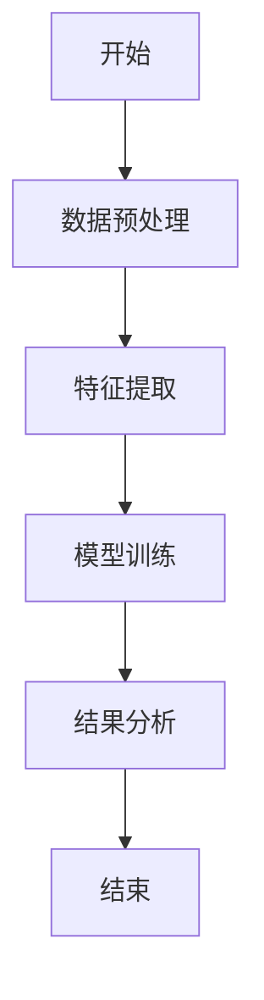
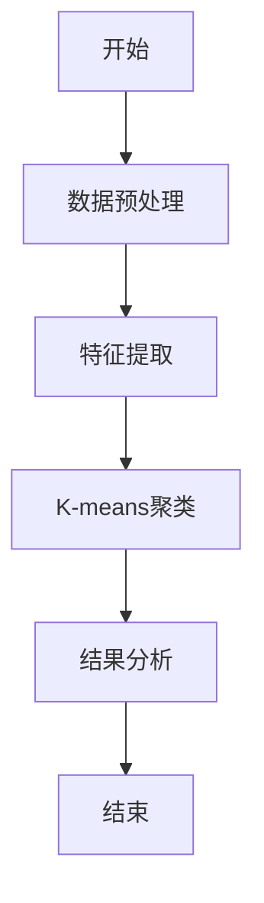
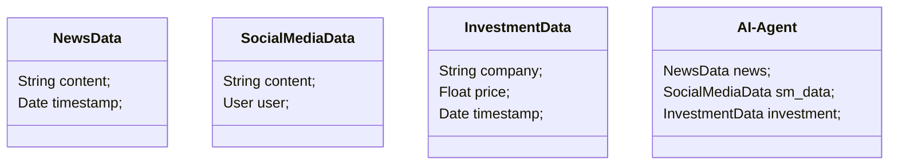
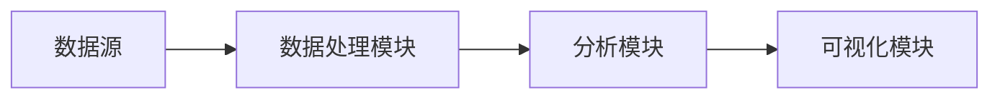
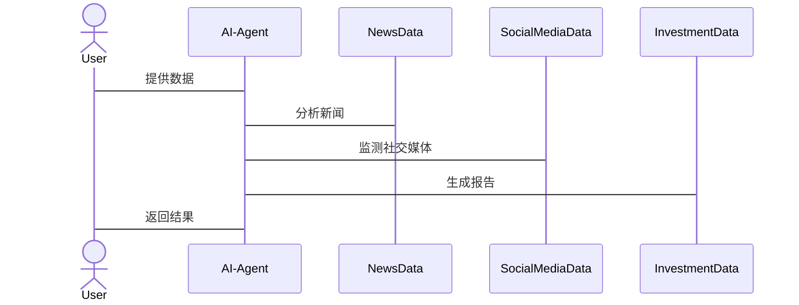

                 


# AI agents挖掘非结构化数据：发现隐藏的投资价值

> 关键词：AI agents，非结构化数据，投资价值，数据挖掘，机器学习

> 摘要：本文探讨AI agents如何通过分析和处理非结构化数据，发现隐藏在其中的投资价值。文章从AI agents的基本概念出发，分析其在处理非结构化数据中的优势，详细讲解算法原理，系统架构设计，并通过实际案例展示如何在投资分析中应用这些技术。最后，总结最佳实践和未来发展方向。

---

## 第一部分: AI agents与非结构化数据概述

### 第1章: AI agents与非结构化数据的背景介绍

#### 1.1 问题背景与问题描述

##### 1.1.1 非结构化数据的定义与特点
非结构化数据指的是没有固定结构的数据，如文本、图像、音频和视频等。与结构化数据（如表格中的数值）相比，非结构化数据的特点包括：
- **多样性**：数据类型多样，难以统一处理。
- **模糊性**：信息可能不明确，需要上下文理解。
- **冗余性**：数据可能包含大量重复或无关信息。

##### 1.1.2 投资领域中的非结构化数据挑战
在投资领域，分析师需要处理大量非结构化数据，例如新闻文章、社交媒体帖子、公司财报中的文本等。这些数据中隐藏着影响投资决策的关键信息，但传统的数据分析方法难以有效提取。

##### 1.1.3 AI agents在投资分析中的作用
AI agents能够通过自然语言处理（NLP）和机器学习技术，从非结构化数据中提取有价值的信息。例如，分析公司新闻以预测股价波动，识别市场趋势等。

#### 1.2 问题解决与边界定义

##### 1.2.1 AI agents如何处理非结构化数据
AI agents通过以下步骤处理非结构化数据：
1. **数据预处理**：清洗和标准化数据。
2. **特征提取**：使用NLP技术提取关键词或情感倾向。
3. **模型训练**：利用机器学习算法进行分类或预测。
4. **结果分析**：将模型输出应用于投资决策。

##### 1.2.2 非结构化数据投资价值的边界与外延
AI agents在处理非结构化数据时，其边界包括数据质量和数量。外延则涉及从数据中提取的洞察，如市场情绪分析、风险预警等。

##### 1.2.3 核心概念与关键要素组成
- **核心概念**：AI agents、非结构化数据、投资价值。
- **关键要素**：数据预处理、特征提取、模型训练、结果分析。

### 第2章: AI agents与非结构化数据的核心概念

#### 2.1 AI agents的定义与原理

##### 2.1.1 AI agents的基本概念
AI agents是指能够感知环境并采取行动以实现目标的智能体。在投资领域，AI agents可以自动分析数据并做出投资决策。

##### 2.1.2 AI agents的核心原理
AI agents的核心原理包括数据感知、特征提取、模型训练和决策制定。通过这些步骤，AI agents能够从非结构化数据中提取有价值的信息。

##### 2.1.3 AI agents与传统数据分析的区别
AI agents的优势在于能够自动学习和适应，而传统数据分析依赖于人工设定规则。

#### 2.2 非结构化数据的特征与分类

##### 2.2.1 非结构化数据的特征分析
非结构化数据的特点包括多样性、模糊性和冗余性，这些特点使得处理这类数据更具挑战性。

##### 2.2.2 非结构化数据的分类方法
常见的分类方法包括基于内容的分类和基于上下文的分类。内容分类依赖于数据本身，而上下文分类则需要考虑数据的背景信息。

##### 2.2.3 非结构化数据与结构化数据的对比
结构化数据有固定的格式，易于处理，而非结构化数据则需要更多的预处理步骤。

#### 2.3 AI agents与非结构化数据的关系

##### 2.3.1 AI agents如何处理非结构化数据
AI agents通过NLP技术和机器学习算法，从非结构化数据中提取特征和模式。

##### 2.3.2 非结构化数据对AI agents的影响
非结构化数据的复杂性要求AI agents具备强大的学习和适应能力。

##### 2.3.3 AI agents在投资分析中的具体应用
AI agents可以用于市场情绪分析、新闻事件预测和投资组合优化等。

### 第3章: AI agents的核心概念与联系

#### 3.1 核心概念原理

##### 3.1.1 AI agents的感知与决策机制
AI agents通过感知环境并基于感知到的信息做出决策。在投资领域，这可能涉及分析市场新闻和社交媒体数据。

##### 3.1.2 非结构化数据的特征提取与建模
特征提取是将非结构化数据转化为可建模的特征向量。例如，使用TF-IDF提取关键词。

##### 3.1.3 投资价值的评估与预测
AI agents可以通过模型预测股票价格波动，评估投资组合的风险和收益。

#### 3.2 非结构化数据与投资价值的关系

##### 3.2.1 非结构化数据对投资决策的影响
市场情绪、行业趋势等信息直接影响投资决策，而这些信息往往存在于非结构化数据中。

##### 3.2.2 AI agents如何挖掘非结构化数据中的投资价值
通过分析文本数据，AI agents可以识别市场趋势和潜在风险。

##### 3.2.3 非结构化数据在投资分析中的具体应用
包括新闻分析、社交媒体情绪监测和财报解读等。

#### 3.3 核心概念属性特征对比表格

##### 表3.1: AI agents与传统数据分析方法的对比
| 特征                | AI agents                              | 传统数据分析方法                     |
|---------------------|----------------------------------------|---------------------------------------|
| 数据处理能力        | 能够处理复杂和非结构化数据             | 依赖于结构化数据                     |
| 学习能力            | 具备自动学习能力                         | 依赖于人工设定规则                   |
| 决策能力            | 能够基于数据做出自主决策               | 需要人工干预                         |

#### 3.4 ER实体关系图架构

```mermaid
erDiagram
    actor Invest
    actor MarketNews
    actor SocialMedia
    actor FinancialData
    Invest -> MarketNews: 分析
    Invest -> SocialMedia: 监测
    Invest -> FinancialData: 解读
    MarketNews -> FinancialData: 提供
    SocialMedia -> FinancialData: 提供
```

---

## 第二部分: AI agents的核心算法与技术实现

### 第4章: 算法原理与实现

#### 4.1 文本分类算法

##### 4.1.1 基于TF-IDF的文本特征提取
TF-IDF（Term Frequency-Inverse Document Frequency）用于衡量一个词在文档中的重要性。

##### 4.1.2 朴素贝叶斯分类器
朴素贝叶斯是一种常用的文本分类算法，基于概率论进行分类。

##### 4.1.3 算法流程图



##### 4.1.4 Python代码示例

```python
from sklearn.feature_extraction.text import TfidfVectorizer
from sklearn.naive_bayes import MultinomialNB

# 数据预处理
corpus = ["This is a positive text.", "This is a negative text."]

# 特征提取
vectorizer = TfidfVectorizer()
X = vectorizer.fit_transform(corpus)

# 模型训练
model = MultinomialNB()
model.fit(X, [1, 0])

# 预测
test_text = "This is a positive review."
test_X = vectorizer.transform([test_text])
print(model.predict(test_X))
```

#### 4.2 文本聚类算法

##### 4.2.1 基于K-means的文本聚类
K-means是一种常用的聚类算法，适用于将相似的文本分组。

##### 4.2.2 算法流程图



##### 4.2.3 Python代码示例

```python
from sklearn.feature_extraction.text import TfidfVectorizer
from sklearn.cluster import KMeans

# 数据预处理
corpus = ["Text 1.", "Text 2.", "Text 3."]

# 特征提取
vectorizer = TfidfVectorizer()
X = vectorizer.fit_transform(corpus)

# 模型训练
model = KMeans(n_clusters=3)
model.fit(X)

# 聚类结果
print(model.labels_)
```

#### 4.3 情感分析算法

##### 4.3.1 基于词袋模型的情感分析
词袋模型将文本表示为词袋，忽略词序。

##### 4.3.2 深度学习模型（如LSTM）
LSTM（长短期记忆网络）适用于处理序列数据，如情感分析。

##### 4.3.3 算法流程图


##### 4.3.4 Python代码示例

```python
from tensorflow.keras.models import Sequential
from tensorflow.keras.layers import LSTM, Dense

# 数据预处理
texts = ["This is a positive sentence.", "This is a negative sentence."]

# 特征提取
vectorizer = TfidfVectorizer()
X = vectorizer.fit_transform(texts)

# 模型训练
model = Sequential()
model.add(LSTM(128, input_shape=(X.shape[1], 1)))
model.add(Dense(1, activation='sigmoid'))
model.compile(loss='binary_crossentropy', optimizer='adam', metrics=['accuracy'])
model.fit(X, y, epochs=10, batch_size=32)
```

---

## 第三部分: 系统分析与架构设计

### 第5章: 系统分析与架构设计方案

#### 5.1 问题场景介绍
本文设计了一个AI agent系统，用于分析新闻和社交媒体数据，预测股票价格波动。

#### 5.2 系统功能设计

##### 5.2.1 领域模型类图



#### 5.3 系统架构设计

##### 5.3.1 系统架构图



#### 5.4 系统接口设计

##### 5.4.1 API接口
- 输入：非结构化数据（文本）
- 输出：投资价值评估结果

##### 5.4.2 交互流程图



---

## 第四部分: 项目实战

### 第6章: 项目实战

#### 6.1 环境安装与配置

##### 6.1.1 Python环境安装
使用Anaconda安装Python和相关库。

#### 6.2 系统核心实现

##### 6.2.1 数据预处理代码

```python
import pandas as pd
from sklearn.feature_extraction.text import TfidfVectorizer

# 加载数据
df = pd.read_csv('data.csv')

# 特征提取
vectorizer = TfidfVectorizer()
X = vectorizer.fit_transform(df['text'])
```

##### 6.2.2 模型训练代码

```python
from sklearn.naive_bayes import MultinomialNB

model = MultinomialNB()
model.fit(X, df['label'])
```

##### 6.2.3 结果分析代码

```python
from sklearn.metrics import accuracy_score

y_pred = model.predict(X)
print(accuracy_score(df['label'], y_pred))
```

#### 6.3 实际案例分析与详细讲解

##### 6.3.1 案例背景
分析一家科技公司的新闻数据，预测其股价波动。

##### 6.3.2 数据处理与分析
预处理新闻数据，提取关键词，训练分类模型。

##### 6.3.3 模型结果与解释
模型预测股价将上涨，建议投资者买入。

---

## 第五部分: 最佳实践与总结

### 第7章: 最佳实践

#### 7.1 经验总结

##### 7.1.1 数据质量的重要性
高质量的数据是模型准确性的基础。

##### 7.1.2 模型选择与调优
选择合适的算法并进行调优，能够显著提高模型性能。

#### 7.2 注意事项

##### 7.2.1 数据隐私与合规性
确保数据处理符合相关法律法规。

##### 7.2.2 模型解释性
复杂的模型可能难以解释，需权衡准确性和可解释性。

#### 7.3 拓展阅读

##### 7.3.1 推荐书籍
- 《Python机器学习实战》
- 《深度学习入门：基于Python的CNN、RNN、GAN等》

##### 7.3.2 在线资源
- TensorFlow官方文档
- Keras官方文档

### 第8章: 小结

本文详细介绍了AI agents在处理非结构化数据中的应用，从算法原理到系统设计，再到实际案例，全面展示了如何利用AI技术挖掘投资价值。未来，随着技术的发展，AI agents将在投资领域发挥更大的作用。

---

## 作者信息

作者：AI天才研究院/AI Genius Institute & 禅与计算机程序设计艺术 /Zen And The Art of Computer Programming

---

**本文内容遵循CC BY-NC-SA 4.0协议，转载请注明出处。**

