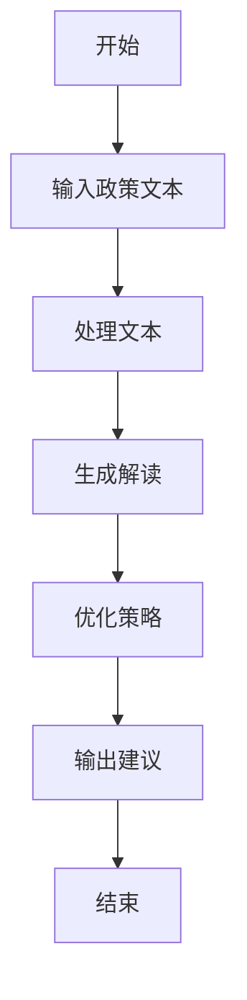
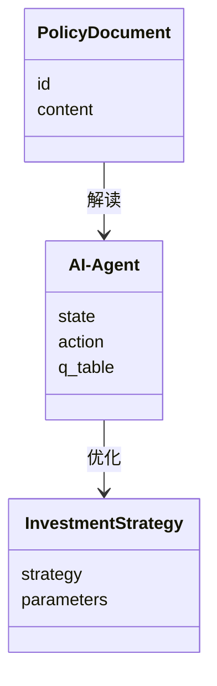

                 


# AI agents辅助价值投资者解读政府政策影响

## 关键词：
- AI代理, 价值投资, 政府政策, 政策解读, 投资决策, 强化学习, 自然语言处理

## 摘要：
本文探讨AI代理如何辅助价值投资者解读政府政策的影响。通过分析AI代理在政策解读中的应用，结合强化学习和自然语言处理技术，揭示其在提升投资决策效率和准确性中的潜力。文章结构清晰，内容涵盖背景、核心概念、算法原理、系统架构、项目实战及最佳实践，为读者提供深入的技术见解。

## 第1章：AI代理与价值投资的背景

### 1.1 问题背景
价值投资依赖对政府政策的深入解读，传统方法存在效率低、主观性强的问题。AI代理通过自动化处理和分析，提升解读的准确性和效率，解决传统方法的不足。

### 1.2 问题描述
价值投资者需解读复杂政策，传统方法耗时且易受主观因素影响。AI代理的应用可提高解读效率和准确性，帮助投资者做出更明智决策。

### 1.3 问题解决
AI代理通过自然语言处理和强化学习，自动分析政策文本，识别关键点，生成投资建议，辅助价值投资者优化决策。

### 1.4 边界与外延
政策解读范围包括经济、金融等领域，AI代理的应用边界限于数据处理和分析，相关领域如量化投资可进一步扩展。

### 1.5 核心概念结构
- AI代理：处理政策文本，提供投资建议。
- 价值投资：依赖政策解读，优化投资决策。

## 第2章：AI代理与价值投资的核心概念与联系

### 2.1 AI代理的定义与特点
AI代理是智能系统，能感知环境、处理信息、采取行动，具备学习和适应能力。

### 2.2 价值投资的基本原理
基于内在价值，寻找市场价格低估的投资标的，强调长期稳定收益。

### 2.3 核心概念对比
| 特性 | AI代理 | 价值投资 |
|------|---------|----------|
| 输入 | 政策文本 | 市场数据 |
| 输出 | 投资建议 | 决策支持 |
| 方法 | 自然语言处理 | 财务分析 |

### 2.4 ER实体关系图
```mermaid
erd
  id: ID
  policy_document: 政策文件
  investment_strategy: 投资策略
  ai_agent: AI代理
  market_data: 市场数据
  policy_impact: 政策影响
  investment_decision: 投资决策
  ai_agent --> policy_document: 解读
  ai_agent --> investment_strategy: 优化
  investment_strategy --> investment_decision: 影响
```

## 第3章：AI代理的算法原理

### 3.1 强化学习原理
AI代理通过强化学习，从经验中学习最优策略，使用Q-learning算法，目标是最大化累积奖励。

### 3.2 算法流程图


### 3.3 代码实现
```python
import numpy as np

class AI_Policy-Agent:
    def __init__(self, state_space, action_space):
        self.q_table = np.zeros([state_space, action_space])
        
    def take_action(self, state):
        # epsilon-greedy策略
        epsilon = 0.1
        if np.random.random() < epsilon:
            action = np.random.randint(action_space)
        else:
            action = np.argmax(self.q_table[state])
        return action

    def learn(self, state, action, reward):
        self.q_table[state, action] += 0.1 * (reward + np.max(self.q_table[state]) - self.q_table[state, action])
```

### 3.4 数学模型
AI代理使用Q-learning模型：
$$ Q(s, a) = Q(s, a) + \alpha [r + \max Q(s', a') - Q(s, a)] $$
其中，\( \alpha \) 是学习率，\( r \) 是奖励。

## 第4章：系统分析与架构设计

### 4.1 领域模型


### 4.2 系统架构


## 第5章：项目实战

### 5.1 环境安装
安装Python和相关库：
```bash
pip install numpy matplotlib
```

### 5.2 核心代码
```python
def preprocess_policy(policy_text):
    # 文本预处理
    pass

def generate_insight(policy_insight):
    # 生成投资建议
    pass
```

### 5.3 案例分析
分析某政策对行业的影响，AI代理解读文本，生成投资建议，投资者据此调整策略。

## 第6章：最佳实践

### 6.1 小结
AI代理通过自然语言处理和强化学习，有效辅助价值投资者解读政策，提升决策效率和准确性。

### 6.2 注意事项
数据质量影响结果，模型需持续优化，避免过度依赖AI。

### 6.3 拓展阅读
深入学习强化学习和自然语言处理，探索更多应用场景。

## 作者：
AI天才研究院/AI Genius Institute  
禅与计算机程序设计艺术/Zen And The Art of Computer Programming

