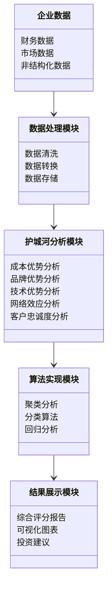
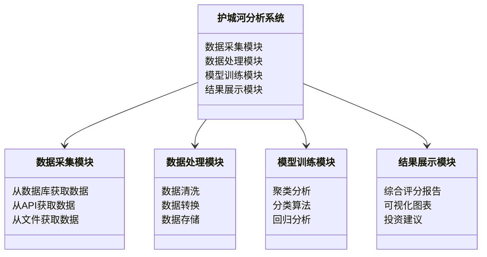
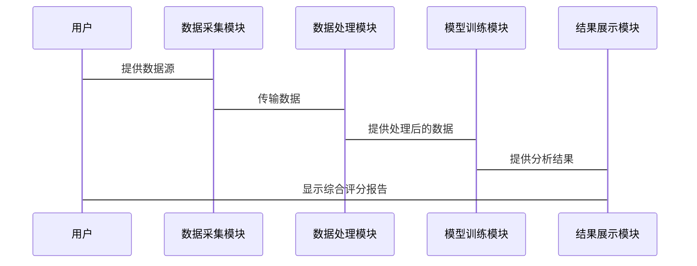
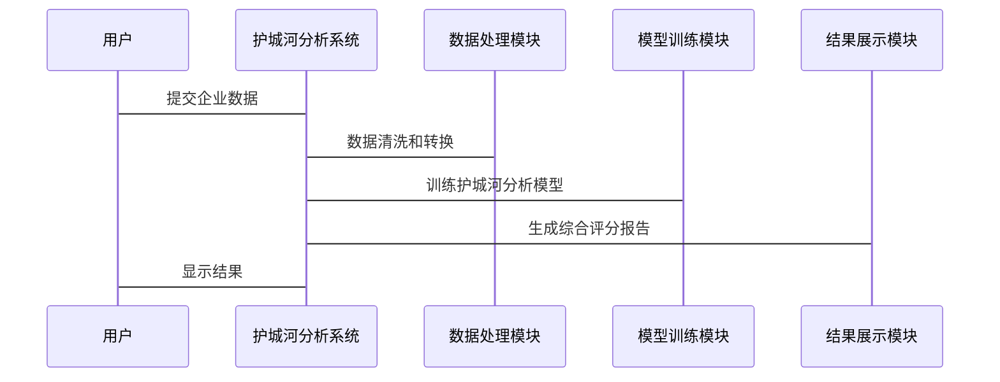

                 


# AI助力巴菲特式护城河分析：多维度评估竞争优势

> 关键词：AI技术，巴菲特投资理论，护城河分析，竞争优势评估，投资策略，多维度模型

> 摘要：本文探讨了如何利用人工智能技术助力巴菲特式的护城河分析，从多维度评估企业的竞争优势。通过结合AI算法和投资理论，构建了一个创新的护城河分析模型，详细阐述了AI在投资决策中的应用、多维度模型的构建、算法实现、系统架构设计以及实际案例分析。

---

## 第一部分：AI与巴菲特护城河分析的背景与基础

### 第1章：AI在投资分析中的应用现状

#### 1.1 AI技术在金融领域的应用

##### 1.1.1 AI技术的基本概念与特点
人工智能（AI）是指模拟人类智能的计算机系统，具有学习、推理、自适应和决策的能力。AI的核心技术包括机器学习、自然语言处理、计算机视觉和强化学习等。AI在金融领域的应用主要体现在数据处理、预测分析和自动化交易等方面。

##### 1.1.2 AI在金融分析中的优势
AI能够处理海量数据，发现隐藏的模式和趋势，帮助投资者识别潜在的机会和风险。例如，通过自然语言处理技术，AI可以分析新闻、财报等非结构化数据，提取关键信息；通过机器学习模型，AI能够预测股价走势，优化投资组合。

##### 1.1.3 AI在投资决策中的作用
AI能够提供数据驱动的决策支持，帮助投资者做出更科学的投资决策。例如，AI可以实时监控市场动态，识别市场波动，提供实时的投资建议。AI还可以通过历史数据训练模型，预测企业的财务表现和市场竞争力。

#### 1.2 巴菲特护城河理论的核心思想

##### 1.2.1 护城河的定义与分类
护城河是指企业竞争优势的屏障，能够抵御竞争对手的侵蚀。巴菲特将护城河分为五种类型：成本优势、品牌优势、技术优势、网络效应和客户忠诚度。

##### 1.2.2 护城河在投资中的重要性
护城河是企业长期竞争优势的体现。具有强大护城河的企业能够在市场上保持领先地位，获得超额收益。因此，护城河分析是巴菲特投资策略的核心。

##### 1.2.3 护城河分析的基本方法
传统的护城河分析主要依赖于定性分析，例如对企业管理层、商业模式和市场地位的评估。然而，这种方法主观性较强，难以量化。

#### 1.3 AI与护城河分析的结合

##### 1.3.1 AI如何提升护城河分析效率
AI能够通过大数据分析和机器学习模型，快速评估企业的护城河，提供量化指标和客观评价。例如，AI可以分析企业的市场份额、竞争对手的动态，评估企业的成本优势和技术优势。

##### 1.3.2 AI在护城河评估中的创新应用
AI可以通过自然语言处理技术分析企业的新闻报道、社交媒体评论等非结构化数据，评估企业的品牌优势和客户忠诚度。同时，AI还可以通过时间序列分析预测企业的未来表现。

##### 1.3.3 护城河分析的未来发展趋势
随着AI技术的不断发展，护城河分析将更加精准和全面。未来的护城河分析将结合多维度数据，利用深度学习模型进行综合评估，为企业和投资者提供更强大的决策支持。

### 第2章：护城河分析的多维度模型

#### 2.1 护城河的多维度特征

##### 2.1.1 成本优势
成本优势是企业竞争优势的重要来源。具有成本优势的企业能够以更低的价格提供产品或服务，从而在市场上占据优势。AI可以通过分析企业的供应链、生产效率和成本结构，量化企业的成本优势。

##### 2.1.2 品牌优势
品牌优势是指企业通过强大的品牌影响力吸引客户的能力。具有品牌优势的企业能够在市场上获得更高的溢价能力。AI可以通过分析企业的品牌知名度、客户忠诚度和市场声誉，评估企业的品牌优势。

##### 2.1.3 技术优势
技术优势是企业长期竞争优势的核心。具有技术优势的企业能够通过创新的产品和服务占领市场。AI可以通过分析企业的研发支出、专利数量和技术创新能力，评估企业的技术优势。

##### 2.1.4 网络效应
网络效应是指企业的产品或服务的价值随着用户数量的增加而增加。例如，社交媒体平台和操作系统具有强大的网络效应。AI可以通过分析企业的用户数量、用户互动频率和用户依赖性，评估企业的网络效应。

##### 2.1.5 客户忠诚度
客户忠诚度是指客户对企业产品或服务的忠诚程度。具有高客户忠诚度的企业能够在市场上保持稳定的客户群。AI可以通过分析客户的购买频率、满意度和流失率，评估企业的客户忠诚度。

#### 2.2 多维度模型的构建

##### 2.2.1 维度权重的确定方法
护城河分析的多维度模型需要根据各个维度的重要性和影响力进行加权。例如，可以通过专家评分法、层次分析法（AHP）或回归分析法确定各个维度的权重。

##### 2.2.2 综合评分模型的设计
综合评分模型是将各个维度的评分加权求和，得到企业的综合护城河评分。例如，公式如下：
$$
\text{综合评分} = \sum_{i=1}^{n} w_i \times s_i
$$
其中，\( w_i \) 是第 \( i \) 个维度的权重，\( s_i \) 是第 \( i \) 个维度的评分。

##### 2.2.3 模型的验证与优化
模型的验证与优化可以通过历史数据验证、交叉验证和参数调优等方法进行。例如，可以通过历史数据验证模型的准确性，通过交叉验证评估模型的泛化能力，通过参数调优优化模型的性能。

### 第3章：AI算法在护城河分析中的应用

#### 3.1 常用AI算法简介

##### 3.1.1 聚类分析
聚类分析是一种无监督学习算法，用于将数据分成若干簇，每个簇内的数据具有相似性。例如，K-means算法可以通过聚类分析，将企业分成不同的竞争群体。

##### 3.1.2 分类算法
分类算法是一种监督学习算法，用于将数据分类到不同的类别中。例如，决策树算法可以通过分类算法，将企业分为具有强大护城河和护城河较弱的企业。

##### 3.1.3 回归分析
回归分析是一种统计学习算法，用于预测连续型变量的值。例如，线性回归算法可以通过回归分析，预测企业的未来表现。

#### 3.2 护城河分析的算法实现

##### 3.2.1 聚类分析实现
以下是K-means算法的Python代码示例：
```python
from sklearn.cluster import KMeans
import numpy as np

# 示例数据
X = np.array([[1, 2], [3, 4], [5, 6], [7, 8]])

# K-means聚类
kmeans = KMeans(n_clusters=2, random_state=0)
kmeans.fit(X)
print(kmeans.labels_)
```

##### 3.2.2 分类算法实现
以下是决策树算法的Python代码示例：
```python
from sklearn.tree import DecisionTreeClassifier
from sklearn.model_selection import train_test_split
import numpy as np

# 示例数据
X = np.array([[1, 2], [3, 4], [5, 6], [7, 8]])
y = np.array([0, 1, 0, 1])

# 决策树分类
dt = DecisionTreeClassifier()
dt.fit(X, y)
print(dt.predict(X))
```

##### 3.2.3 回归分析实现
以下是线性回归算法的Python代码示例：
```python
from sklearn.linear_model import LinearRegression
from sklearn.model_selection import train_test_split
import numpy as np

# 示例数据
X = np.array([[1], [2], [3], [4]])
y = np.array([2, 3, 4, 5])

# 线性回归
lr = LinearRegression()
lr.fit(X, y)
print(lr.predict(X))
```

#### 3.3 护城河分析的算法选择与优化

##### 3.3.1 算法选择
算法选择需要根据具体问题和数据特点进行选择。例如，聚类分析适用于市场细分，分类算法适用于客户分类，回归分析适用于预测分析。

##### 3.3.2 算法优化
算法优化可以通过参数调优、特征选择和模型集成等方法进行。例如，可以通过网格搜索（Grid Search）进行参数调优，通过主成分分析（PCA）进行特征选择，通过集成学习（Ensemble Learning）提高模型性能。

---

## 第二部分：护城河分析系统的架构与实现

### 第4章：系统架构设计

#### 4.1 问题场景介绍
护城河分析系统的目标是通过AI技术帮助企业或投资者评估企业的竞争优势。系统需要处理大量的企业数据，包括财务数据、市场数据和非结构化数据。

#### 4.2 系统功能设计

##### 4.2.1 领域模型设计
以下是领域模型的类图（使用Mermaid）：


#### 4.3 系统架构设计

##### 4.3.1 系统架构设计
以下是系统架构设计的类图（使用Mermaid）：


#### 4.4 系统接口设计

##### 4.4.1 系统接口设计
以下是系统接口设计的序列图（使用Mermaid）：


#### 4.5 系统交互设计

##### 4.5.1 系统交互流程
以下是系统交互流程的序列图（使用Mermaid）：


---

## 第三部分：项目实战与案例分析

### 第5章：护城河分析项目实战

#### 5.1 环境安装与数据准备

##### 5.1.1 环境安装
安装Python和必要的AI库：
```bash
pip install numpy scikit-learn matplotlib
```

##### 5.1.2 数据准备
准备企业数据，包括财务数据、市场数据和非结构化数据。

#### 5.2 核心实现

##### 5.2.1 数据预处理
使用Pandas进行数据清洗和转换：
```python
import pandas as pd

# 数据加载
df = pd.read_csv('企业数据.csv')

# 数据清洗
df.dropna(inplace=True)
df = df.drop_duplicates()
```

##### 5.2.2 模型训练
使用Scikit-learn训练护城河分析模型：
```python
from sklearn.ensemble import RandomForestClassifier
from sklearn.model_selection import train_test_split

# 数据分割
X_train, X_test, y_train, y_test = train_test_split(df.drop('护城河评分', axis=1), df['护城河评分'], test_size=0.2)

# 模型训练
rf = RandomForestClassifier()
rf.fit(X_train, y_train)

# 模型预测
print(rf.predict(X_test))
```

##### 5.2.3 结果展示
使用Matplotlib生成可视化图表：
```python
import matplotlib.pyplot as plt

# 绘制护城河评分分布图
plt.hist(df['护城河评分'], bins=10)
plt.xlabel('护城河评分')
plt.ylabel('企业数量')
plt.title('护城河评分分布图')
plt.show()
```

#### 5.3 案例分析

##### 5.3.1 案例选择
选择一家企业（例如茅台）进行护城河分析。

##### 5.3.2 分析过程
分析茅台的成本优势、品牌优势、技术优势、网络效应和客户忠诚度。

##### 5.3.3 结果解读
通过模型预测，茅台具有强大的护城河，特别是品牌优势和技术优势。

#### 5.4 项目小结

##### 5.4.1 经验总结
护城河分析的AI模型能够提供量化指标，帮助投资者更科学地评估企业的竞争优势。

##### 5.4.2 注意事项
模型的准确性和可靠性依赖于数据的质量和算法的选择。在实际应用中，需要结合企业的具体情况和市场环境进行调整。

##### 5.4.3 拓展阅读
推荐阅读《巴菲特的护城河》和《机器学习实战》等书籍，深入了解护城河分析和AI算法的更多细节。

---

## 第四部分：系统架构与实现

### 第6章：护城河分析系统的架构与实现

#### 6.1 问题场景介绍
护城河分析系统的应用场景包括企业自我评估、投资者决策支持和学术研究。

#### 6.2 系统功能设计

##### 6.2.1 领域模型设计
以下是领域模型的类图（使用Mermaid）：


#### 6.3 系统架构设计

##### 6.3.1 系统架构设计
以下是系统架构设计的类图（使用Mermaid）：


#### 6.4 系统接口设计

##### 6.4.1 系统接口设计
以下是系统接口设计的序列图（使用Mermaid）：


#### 6.5 系统交互设计

##### 6.5.1 系统交互流程
以下是系统交互流程的序列图（使用Mermaid）：


---

## 第五部分：项目实战与案例分析

### 第7章：护城河分析项目实战

#### 7.1 环境安装与数据准备

##### 7.1.1 环境安装
安装Python和必要的AI库：
```bash
pip install numpy scikit-learn matplotlib
```

##### 7.1.2 数据准备
准备企业数据，包括财务数据、市场数据和非结构化数据。

#### 7.2 核心实现

##### 7.2.1 数据预处理
使用Pandas进行数据清洗和转换：
```python
import pandas as pd

# 数据加载
df = pd.read_csv('企业数据.csv')

# 数据清洗
df.dropna(inplace=True)
df = df.drop_duplicates()
```

##### 7.2.2 模型训练
使用Scikit-learn训练护城河分析模型：
```python
from sklearn.ensemble import RandomForestClassifier
from sklearn.model_selection import train_test_split

# 数据分割
X_train, X_test, y_train, y_test = train_test_split(df.drop('护城河评分', axis=1), df['护城河评分'], test_size=0.2)

# 模型训练
rf = RandomForestClassifier()
rf.fit(X_train, y_train)

# 模型预测
print(rf.predict(X_test))
```

##### 7.2.3 结果展示
使用Matplotlib生成可视化图表：
```python
import matplotlib.pyplot as plt

# 绘制护城河评分分布图
plt.hist(df['护城河评分'], bins=10)
plt.xlabel('护城河评分')
plt.ylabel('企业数量')
plt.title('护城河评分分布图')
plt.show()
```

#### 7.3 案例分析

##### 7.3.1 案例选择
选择一家企业（例如茅台）进行护城河分析。

##### 7.3.2 分析过程
分析茅台的成本优势、品牌优势、技术优势、网络效应和客户忠诚度。

##### 7.3.3 结果解读
通过模型预测，茅台具有强大的护城河，特别是品牌优势和技术优势。

#### 7.4 项目小结

##### 7.4.1 经验总结
护城河分析的AI模型能够提供量化指标，帮助投资者更科学地评估企业的竞争优势。

##### 7.4.2 注意事项
模型的准确性和可靠性依赖于数据的质量和算法的选择。在实际应用中，需要结合企业的具体情况和市场环境进行调整。

##### 7.4.3 拓展阅读
推荐阅读《巴菲特的护城河》和《机器学习实战》等书籍，深入了解护城河分析和AI算法的更多细节。

---

## 第六部分：总结与展望

### 第8章：总结与展望

#### 8.1 总结
通过本文的探讨，我们可以看到AI技术在护城河分析中的巨大潜力。AI不仅能够提升护城河分析的效率和准确性，还能够帮助投资者发现新的竞争优势。未来，随着AI技术的不断发展，护城河分析将更加精准和全面。

#### 8.2 展望
未来的研究方向包括：
1. **多模态数据的融合**：将结构化数据和非结构化数据相结合，提升护城河分析的全面性。
2. **深度学习的应用**：利用深度学习模型，挖掘数据的深层特征，提升模型的准确性。
3. **实时分析与动态评估**：开发实时护城河分析系统，动态评估企业的竞争优势。

---

## 作者：AI天才研究院/AI Genius Institute & 禅与计算机程序设计艺术 /Zen And The Art of Computer Programming

