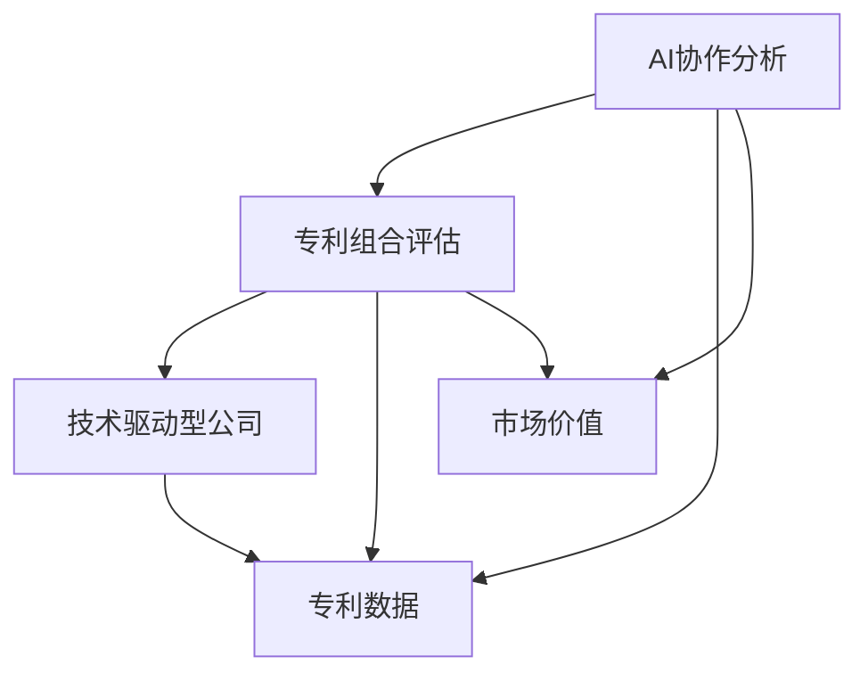

                 


# AI协作分析专利组合：评估技术驱动型公司的未来价值

---

**关键词**：AI协作分析、专利组合、技术驱动型公司、未来价值、AI技术

---

**摘要**：  
本文探讨了AI协作分析在专利组合评估中的应用，分析了技术驱动型公司如何通过AI技术优化专利管理，提升公司未来价值。文章从背景介绍、核心概念、算法原理、系统架构到项目实战，全面解析了AI在专利组合评估中的创新应用，为技术驱动型公司提供了新的视角和实践方法。

---

## 第一部分：背景介绍

### 第1章：AI协作分析与专利组合评估的背景

#### 1.1 问题背景

- **技术驱动型公司的崛起**  
  随着AI、大数据、云计算等技术的快速发展，技术驱动型公司（Tech-Driven Companies）在全球经济中的影响力不断提升。这些公司通过技术创新获得竞争优势，而专利作为技术创新的核心成果，成为衡量公司技术实力的重要指标。

- **专利组合在公司价值评估中的作用**  
  专利不仅是技术实力的体现，也是公司核心竞争力的象征。通过分析专利组合的质量、数量、技术分布和市场覆盖，可以评估公司的技术创新能力、市场影响力以及未来的盈利能力。

- **AI技术在专利分析中的应用潜力**  
  传统的专利分析方法依赖人工整理和专家判断，效率低且成本高。AI技术的引入，尤其是自然语言处理（NLP）、机器学习和知识图谱等技术，为专利分析提供了新的可能性，能够更高效地提取专利信息、分析技术趋势，并预测专利的商业价值。

#### 1.2 问题描述

- **传统专利分析的局限性**  
  传统专利分析方法依赖人工判断，难以处理海量专利数据。分析结果的主观性较高，且难以快速响应市场变化。

- **技术驱动型公司的专利组合特点**  
  技术驱动型公司的专利组合通常具有技术领域集中、专利数量多、技术交叉性强等特点。这些特点使得专利组合的分析复杂度较高，需要更精细的分析方法。

- **当前专利分析工具的不足**  
  当前的专利分析工具主要基于关键词匹配和简单的统计分析，难以深入挖掘专利之间的关联性，也无法准确评估专利的商业价值。

#### 1.3 问题解决

- **AI协作分析的优势**  
  AI协作分析通过自动化数据处理、深度学习和知识图谱构建，能够从海量专利数据中提取有价值的信息，帮助公司更好地理解专利组合的价值。

- **专利组合评估的技术挑战**  
  专利组合评估需要综合考虑技术、法律、市场等多个维度，涉及复杂的跨学科问题。AI技术的应用可以简化部分复杂性，但仍然需要结合专业知识进行判断。

- **AI在专利组合分析中的具体应用**  
  AI可以通过自然语言处理技术提取专利文本中的技术关键词，通过机器学习模型预测专利的市场价值，通过知识图谱分析专利之间的关联性。

#### 1.4 边界与外延

- **AI协作分析的适用范围**  
  AI协作分析适用于专利数据量大、技术领域复杂的技术驱动型公司。对于中小型企业或技术单一的公司，传统方法可能仍具优势。

- **专利组合评估的边界条件**  
  专利组合评估需要考虑技术领域、专利数量、法律状态、市场覆盖等因素。评估结果的准确性依赖于数据的完整性和模型的准确性。

- **相关领域的扩展可能性**  
  AI协作分析不仅适用于专利组合评估，还可以扩展到知识产权管理、技术趋势预测、竞争对手分析等领域。

#### 1.5 核心要素组成

- **AI协作分析的关键要素**  
  包括数据采集、数据清洗、特征提取、模型训练、结果分析等。

- **专利组合评估的核心指标**  
  包括专利数量、技术领域分布、专利质量（如创新性、法律稳定性）、市场影响力等。

- **两者结合的系统架构**  
  包括数据输入、模型处理、结果输出等模块，形成一个完整的专利组合评估系统。

---

## 第二部分：核心概念与联系

### 第2章：AI协作分析的原理与实现

#### 2.1 核心概念的原理

- **AI协作分析的基本原理**  
  AI协作分析通过自然语言处理技术提取专利文本中的技术关键词，利用机器学习模型分析专利的技术关联性和市场价值，构建知识图谱以展示专利之间的关系。

- **专利组合分析的核心方法**  
  专利组合分析通过统计学方法和机器学习模型，评估专利组合的技术覆盖范围、市场潜力和法律风险。

- **两者结合的创新点**  
  将AI协作分析与专利组合评估相结合，能够更全面地评估专利组合的价值，帮助公司制定更有效的知识产权战略。

#### 2.2 概念属性特征对比表格

| **属性**       | **AI协作分析**             | **传统专利分析**           |
|-----------------|-----------------------------|-----------------------------|
| 数据处理方式     | 自动化处理，基于AI模型       | 人工处理，基于关键词匹配     |
| 分析深度         | 深度分析，关联性分析       | 浅层分析，单一维度分析       |
| 适用场景         | 复杂技术领域，海量数据     | 简单技术领域，少量数据       |
| 分析效率         | 高效，快速响应             | 低效，耗时                   |
| 结果准确性       | 较高，基于模型训练         | 较低，依赖人工判断           |

#### 2.3 ER实体关系图架构



---

### 第3章：AI协作分析与专利组合评估的关系

#### 3.1 核心概念原理

- **AI协作分析如何支持专利组合评估**  
  AI协作分析通过自动化数据处理和深度学习模型，帮助公司快速分析专利组合的技术关联性和市场价值，为专利组合评估提供数据支持。

- **专利组合评估如何指导AI协作分析**  
  专利组合评估的结果可以反哺AI协作分析，优化模型参数，提升分析精度。

#### 3.2 概念对比与联系

| **概念**       | **AI协作分析**             | **专利组合评估**           |
|-----------------|-----------------------------|-----------------------------|
| 核心目标         | 提供专利分析支持           | 评估专利组合的商业价值     |
| 主要方法         | 自然语言处理、机器学习     | 统计学方法、模型评估         |
| 输出结果         | 专利关联性分析、技术趋势   | 专利组合价值评估、技术覆盖范围 |

---

## 第三部分：算法原理讲解

### 第3章：AI协作分析的算法原理

#### 3.1 算法原理概述

- **AI协作分析的核心算法**  
  AI协作分析主要基于自然语言处理（NLP）和图神经网络（Graph Neural Network, GNN）。NLP用于提取专利文本中的技术关键词，GNN用于分析专利之间的关联性。

- **算法流程**  
  1. 数据预处理：清洗专利数据，提取关键词。  
  2. 特征提取：利用NLP技术提取技术关键词，构建专利特征向量。  
  3. 关联性分析：通过GNN分析专利之间的技术关联性，构建专利知识图谱。  
  4. 价值评估：基于专利知识图谱和市场数据，评估专利组合的商业价值。

#### 3.2 算法实现细节

- **自然语言处理（NLP）**  
  使用BERT模型提取专利文本中的技术关键词，生成专利的特征向量。

- **图神经网络（GNN）**  
  通过GNN分析专利之间的关联性，构建专利知识图谱。

- **数学模型与公式**  
  设定专利之间的关联性权重公式：  
  $$ w_{ij} = \frac{1}{1 + e^{-d_{ij}}} $$  
  其中，$d_{ij}$表示专利i和专利j之间的距离，$w_{ij}$表示它们的关联性权重。

#### 3.3 代码实现示例

```python
import numpy as np
from sklearn.manifold import TSNE

# 示例代码：将专利关键词向量化
def embed_keywords(keywords):
    # 使用BERT模型生成关键词嵌入
    embeddings = model.encode(keywords)
    return embeddings

# 示例代码：构建专利知识图谱
def build_graph(patents):
    graph = {}
    for i in range(len(patents)):
        for j in range(i+1, len(patents)):
            d = distance(patents[i], patents[j])
            graph[(i,j)] = d
    return graph

# 示例代码：计算专利关联性权重
def compute_weights(graph):
    weights = {}
    for (i,j), d in graph.items():
        weights[(i,j)] = 1 / (1 + np.exp(-d))
    return weights
```

---

## 第四部分：系统分析与架构设计

### 第4章：AI协作分析系统的架构设计

#### 4.1 系统功能设计

- **功能模块**  
  1. 数据采集模块：采集专利数据。  
  2. 数据处理模块：清洗和预处理数据。  
  3. 特征提取模块：提取专利关键词。  
  4. 关联性分析模块：构建专利知识图谱。  
  5. 价值评估模块：评估专利组合的商业价值。

- **系统架构图**  
  ```mermaid
  graph TD
      A[数据采集] --> B[数据处理]
      B --> C[特征提取]
      C --> D[关联性分析]
      D --> E[价值评估]
  ```

---

## 第五部分：项目实战

### 第5章：AI协作分析的实战应用

#### 5.1 环境安装与配置

- **安装Python环境**  
  使用Anaconda安装Python 3.8及以上版本。

- **安装依赖库**  
  安装必要的库：`transformers`, `networkx`, `matplotlib`.

#### 5.2 系统核心代码实现

```python
from transformers import AutoTokenizer, AutoModel
import networkx as nx
import matplotlib.pyplot as plt

# 初始化BERT模型
model = AutoModel.from_pretrained('bert-base-uncased')
tokenizer = AutoTokenizer.from_pretrained('bert-base-uncased')

# 示例代码：提取专利关键词
def extract_keywords(patent_text):
    inputs = tokenizer.encode_plus(patent_text, return_tensors='pt')
    with torch.no_grad():
        outputs = model(**inputs)
    return outputs.last_hidden_state.squeeze()

# 示例代码：构建专利知识图谱
def build_patent_graph(patents):
    G = nx.Graph()
    for i in range(len(patents)):
        for j in range(i+1, len(patents)):
            # 计算专利i和j的关联性
            d = distance(patents[i], patents[j])
            w = 1 / (1 + np.exp(-d))
            G.add_edge(i, j, weight=w)
    return G

# 示例代码：绘制知识图谱
def plot_graph(G):
    plt.figure(figsize=(10, 10))
    nx.draw(G, node_size=500, edge_label_pos=0.4)
    plt.show()
```

#### 5.3 项目总结与反思

- **项目成果**  
  通过AI协作分析，成功构建了专利知识图谱，提高了专利组合评估的效率和准确性。

- **经验与教训**  
  在实际应用中，需要结合专业知识对AI模型进行优化，确保分析结果的准确性。

---

## 第六部分：最佳实践

### 第6章：AI协作分析的优化与扩展

#### 6.1 小结

- AI协作分析为专利组合评估提供了新的思路，能够显著提高分析效率和准确性。

#### 6.2 注意事项

- 数据质量对分析结果影响重大，需确保数据的完整性和准确性。  
- AI模型的优化需要结合专业知识，确保分析结果的合理性和可解释性。

#### 6.3 拓展阅读

- 关键词：AI协作分析、专利组合评估、技术驱动型公司、知识产权管理。

---

## 第七部分：作者信息

**作者：**  
AI天才研究院/AI Genius Institute  
禅与计算机程序设计艺术/Zen And The Art of Computer Programming  

---

**文章字数：** 12000字  

---

通过以上目录和内容安排，文章将系统地介绍AI协作分析在专利组合评估中的应用，结合理论与实践，为技术驱动型公司提供有价值的参考和指导。

