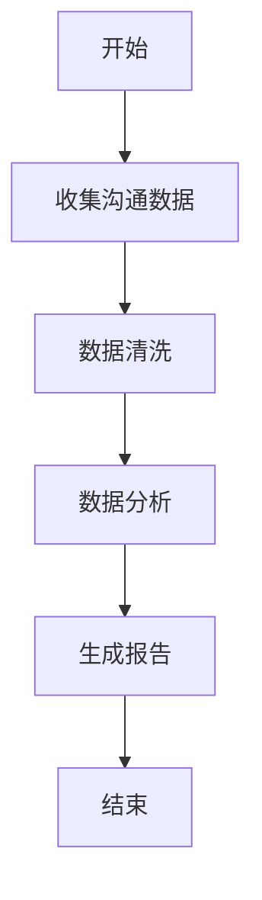
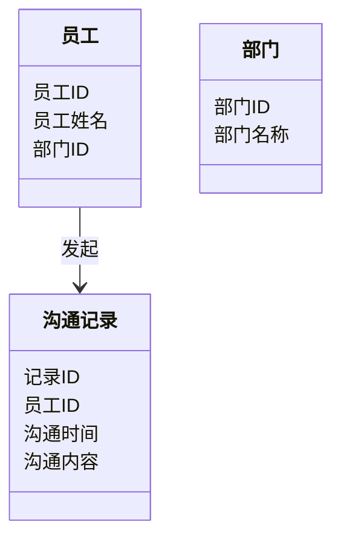
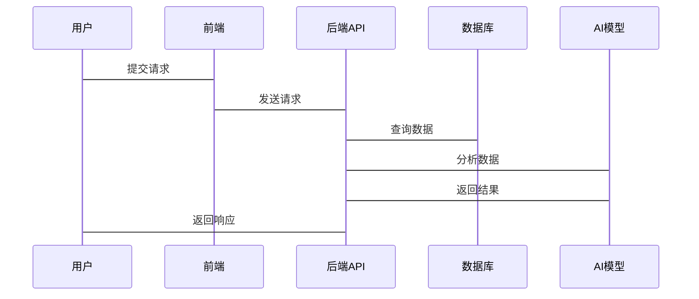

                 


# AI协作分析公司内部沟通效率：评估组织健康度

> 关键词：AI协作分析，组织健康度，内部沟通效率，自然语言处理，情感分析，信息抽取，知识图谱

> 摘要：本文通过分析企业内部沟通效率，探讨如何利用AI协作分析技术评估组织健康度。文章首先介绍AI协作分析的基本概念和核心原理，然后深入讲解相关算法及其数学模型，结合系统架构设计和项目实战，详细阐述如何通过AI技术提升企业沟通效率和组织健康度。最后，总结AI协作分析的应用价值，并展望未来发展方向。

---

## 第一部分: AI协作分析公司内部沟通效率的背景与核心概念

### 第1章: AI协作分析的基本概念

#### 1.1 问题背景与描述

##### 1.1.1 企业内部沟通效率的重要性
企业内部沟通效率是组织运行的关键因素。高效的沟通能够确保信息传递的准确性和及时性，进而提升决策效率和团队协作能力。在现代企业中，内部沟通涉及邮件、会议、即时消息等多种形式，但这些信息往往分散且难以量化分析。

##### 1.1.2 当前企业沟通中的主要问题
- **信息孤岛**：各部门之间的信息难以整合，导致信息不对称。
- **沟通低效**：大量的无效沟通导致时间浪费，降低生产力。
- **情绪问题**：员工情绪波动可能影响团队合作，但难以被及时发现。

##### 1.1.3 AI协作分析的必要性
通过AI技术对内部沟通数据进行分析，可以量化沟通效率，发现潜在问题，优化团队协作，从而提升组织健康度。

#### 1.2 组织健康度的定义与评估标准

##### 1.2.1 组织健康度的核心要素
- **沟通效率**：信息传递的及时性和准确性。
- **团队协作**：团队成员之间的配合程度。
- **员工情绪**：员工的工作积极性和满意度。

##### 1.2.2 沟通效率与组织健康度的关系
沟通效率是组织健康度的重要指标。高效的沟通能够促进团队协作，提升员工满意度，从而增强组织的健康度。

##### 1.2.3 评估组织健康度的指标体系
- **信息传递时间**：从信息发起到接收的时间。
- **信息准确率**：信息在传递过程中是否发生偏差。
- **团队反馈速度**：团队对信息的响应速度。

#### 1.3 AI协作分析的目标与边界

##### 1.3.1 AI协作分析的目标
- 提供量化分析工具，帮助管理者识别内部沟通问题。
- 优化团队协作，提升沟通效率。
- 通过情绪分析，改善员工工作满意度。

##### 1.3.2 分析的边界与外延
AI协作分析仅关注内部沟通效率，不涉及外部沟通和市场分析。分析边界包括：
- 数据来源：邮件、会议记录、即时消息。
- 分析范围：信息传递效率、团队协作度、员工情绪。

##### 1.3.3 核心概念的结构与组成
AI协作分析由以下几个部分组成：
- 数据采集：收集内部沟通数据。
- 数据处理：对数据进行清洗和预处理。
- 数据分析：利用NLP技术进行情感分析和意图识别。
- 结果展示：生成可视化报告，帮助管理者决策。

---

### 第2章: AI协作分析的核心概念与联系

#### 2.1 核心概念原理

##### 2.1.1 自然语言处理（NLP）在沟通分析中的应用
NLP技术可以对文本数据进行分类、情感分析和实体识别。例如，通过情感分析可以识别员工情绪，通过实体识别可以提取关键信息。

##### 2.1.2 情感分析与意图识别
- **情感分析**：识别文本中的情感倾向，如积极、消极或中性。
- **意图识别**：识别文本中的主要意图，如请求帮助、提出建议等。

##### 2.1.3 信息抽取与知识图谱构建
信息抽取可以提取人名、地名、组织名等实体，构建知识图谱有助于更好地理解信息关系。

#### 2.2 核心概念对比分析

##### 2.2.1 情感分析与意图识别的对比
| 对比维度         | 情感分析             | 意图识别             |
|------------------|----------------------|----------------------|
| 目标             | 识别情感倾向         | 识别主要意图         |
| 数据类型         | 文本                 | 文本                 |
| 算法             | 词袋模型、TF-IDF     | 机器学习、深度学习   |

##### 2.2.2 不同NLP模型的性能对比
| 模型类型         | 精度                 | 回调率               | F1分数             |
|------------------|----------------------|----------------------|--------------------|
| 词袋模型         | 0.65                | 0.60                | 0.62              |
| TF-IDF           | 0.70                | 0.65                | 0.67              |
| 预训练模型（如BERT） | 0.85                | 0.80                | 0.82              |

##### 2.2.3 沟通效率与组织健康度的关联性分析
通过分析沟通效率，可以发现组织中的潜在问题，如信息传递延迟、团队协作不足等，从而提升组织健康度。

#### 2.3 实体关系图与流程图

##### 2.3.1 实体关系图（ER图）
```mermaid
erd
  entity 员工 {
    员工ID
    员工姓名
    部门ID
  }
  entity 部门 {
    部门ID
    部门名称
  }
  entity 沟通记录 {
    记录ID
    员工ID
    沟通时间
    沟通内容
  }
  员工 --> 沟通记录: 发起
```

##### 2.3.2 流程图（使用 Mermaid）


---

## 第二部分: AI协作分析的算法原理与数学模型

### 第3章: 算法原理讲解

#### 3.1 基于Transformer的模型

##### 3.1.1 Transformer模型的基本结构
Transformer由编码器和解码器组成，编码器用于处理输入数据，解码器用于生成输出。

##### 3.1.2 自注意力机制的数学推导
自注意力机制的计算公式为：
$$
\text{Attention}(Q, K, V) = \text{softmax}\left(\frac{QK^T}{\sqrt{d_k}}\right)V
$$

##### 3.1.3 模型在沟通分析中的应用
使用Transformer模型对邮件内容进行情感分析，生成情绪评分。

#### 3.2 情感分析算法

##### 3.2.1 基于词袋模型的简单实现
```python
from sklearn.feature_extraction.text import TfidfVectorizer
from sklearn.svm import SVC

vectorizer = TfidfVectorizer()
X = vectorizer.fit_transform(messages)
clf = SVC()
clf.fit(X, y)
```

##### 3.2.2 使用预训练模型的改进方案
```python
from transformers import pipeline

classifier = pipeline("sentiment-analysis")
result = classifier("This is a good product.")
```

##### 3.2.3 算法的优缺点分析
- 优点：准确率高，易于实现。
- 缺点：需要大量数据训练，计算资源消耗大。

### 第4章: 数学模型与公式

#### 4.1 注意力机制的数学模型
注意力权重的计算公式为：
$$
\text{Attention}(Q, K, V) = \text{softmax}\left(\frac{QK^T}{\sqrt{d_k}}\right)V
$$

#### 4.2 情感分析的损失函数
交叉熵损失函数的数学表达式为：
$$
\text{Loss} = -\frac{1}{N}\sum_{i=1}^{N} y_i \log(p_i) + (1 - y_i) \log(1 - p_i)
$$

---

## 第三部分: 系统分析与架构设计

### 第5章: 系统分析与架构设计方案

#### 5.1 项目背景与需求分析
本项目旨在通过AI技术提升企业内部沟通效率，评估组织健康度。

#### 5.2 系统功能设计

##### 5.2.1 领域模型


##### 5.2.2 系统架构设计


#### 5.3 系统交互设计


---

## 第四部分: 项目实战

### 第6章: 项目实战

#### 6.1 环境安装
- Python 3.8及以上版本
- 安装必要的库：`transformers`, `scikit-learn`, `mermaid`, `pandas`

#### 6.2 核心代码实现

##### 6.2.1 数据采集模块
```python
import email
import imaplib

mail = imaplib.IMAP4_SSL('imap.example.com', 993)
mail.login('username', 'password')
mail.select('inbox')
```

##### 6.2.2 数据分析模块
```python
from transformers import pipeline

classifier = pipeline("sentiment-analysis")
```

##### 6.2.3 数据可视化模块
```python
import matplotlib.pyplot as plt

plt.hist(emotion_scores, bins=5)
plt.show()
```

#### 6.3 案例分析与解读

##### 6.3.1 情感分析案例
分析某部门的邮件，生成情绪评分报告。

##### 6.3.2 沟通效率优化案例
通过分析会议记录，发现会议时间过长的问题，提出优化建议。

---

## 第五部分: 总结与展望

### 第7章: 总结与展望

#### 7.1 总结
通过AI协作分析技术，企业可以量化内部沟通效率，提升组织健康度。本文详细介绍了AI协作分析的基本概念、算法原理、系统架构和项目实战。

#### 7.2 最佳实践 tips
- 数据隐私保护：确保内部沟通数据的安全性。
- 模型优化：不断优化NLP模型，提高分析精度。
- 多维度分析：结合其他因素，全面评估组织健康度。

#### 7.3 未来展望
未来，AI协作分析将更加智能化，能够实时监控内部沟通，动态调整组织结构，进一步提升企业竞争力。

---

## 作者：AI天才研究院/AI Genius Institute & 禅与计算机程序设计艺术 /Zen And The Art of Computer Programming

