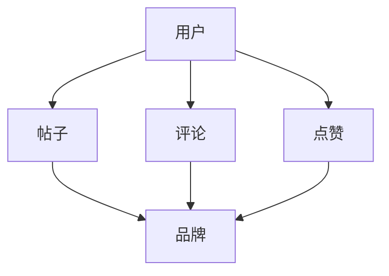
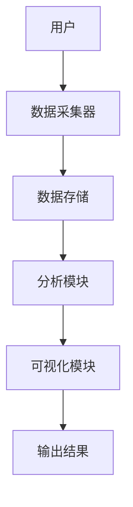
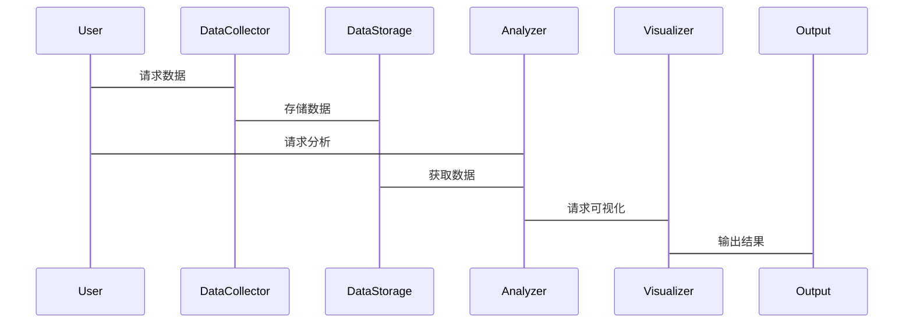

                 


# AI协作分析公司社交网络影响力：评估品牌价值

> 关键词：AI协作分析、社交网络影响力、品牌价值评估、情感分析、网络图谱、数据驱动决策

> 摘要：随着社交媒体的普及，社交网络影响力已成为评估企业品牌价值的重要指标。本文通过AI协作分析的方法，详细探讨如何利用社交数据构建影响力评估模型，分析品牌价值的核心要素，并提供实际案例和系统设计，帮助企业在数字化时代提升品牌影响力。

---

# 第一部分：AI协作分析与社交网络影响力

## 第1章：背景介绍

### 1.1 社交网络影响力评估的背景

#### 1.1.1 从传统营销到数字化营销的演进

在传统营销模式中，企业通过广告投放、线下活动等方式提升品牌知名度。然而，随着互联网和社交媒体的普及，用户的互动行为数据变得前所未有的重要。社交网络影响力评估成为企业衡量品牌价值的重要手段。

#### 1.1.2 社交媒体对企业品牌价值的影响

社交媒体平台（如微博、Twitter、Instagram）已成为用户与品牌互动的主要渠道。通过分析用户的评论、点赞、转发等行为，企业可以更精准地了解用户需求和品牌口碑。

#### 1.1.3 AI技术在社交网络分析中的应用

AI技术（如自然语言处理、图神经网络）为社交网络数据分析提供了强大的工具。通过AI协作分析，企业可以实时获取社交数据并转化为品牌价值评估的指标。

### 1.2 问题背景与描述

#### 1.2.1 企业社交网络影响力评估的挑战

社交网络数据具有高维性、动态性和复杂性。传统评估方法难以捕捉用户行为的实时变化和情感倾向。

#### 1.2.2 数据量大、维度复杂的问题

社交网络数据包括文本、图片、视频等多种形式，数据量大且维度复杂。如何高效处理这些数据是企业面临的难题。

#### 1.2.3 传统评估方法的局限性

传统评估方法多基于问卷调查或统计分析，无法充分利用社交数据的实时性和互动性。

### 1.3 问题解决思路

#### 1.3.1 引入AI技术的核心思路

通过AI技术（如情感分析、主题挖掘）对社交数据进行深度分析，提取品牌影响力的关键指标。

#### 1.3.2 数据驱动的分析方法

利用大数据处理技术，从社交数据中提取用户行为特征，构建品牌影响力评估模型。

#### 1.3.3 多维度社交网络影响力评估模型

结合品牌知名度、用户活跃度、情感倾向等多个维度，构建多维度的影响力评估模型。

### 1.4 边界与外延

#### 1.4.1 评估范围的界定

社交网络影响力评估的范围包括用户行为数据、品牌提及量、情感倾向等。

#### 1.4.2 相关概念的外延

社交网络影响力不仅包括用户互动行为，还包括用户对品牌的认知和态度。

#### 1.4.3 与其他评估方法的对比

与传统评估方法相比，AI协作分析具有实时性、精准性和数据驱动的特点。

### 1.5 核心概念与联系

#### 1.5.1 社交网络影响力的核心要素

- **品牌知名度**：用户对品牌的提及量和曝光度。
- **用户活跃度**：用户的互动行为（点赞、评论、转发）。
- **情感倾向**：用户对品牌的正面、负面或中性情感。

#### 1.5.2 企业品牌价值的构成

- **市场影响力**：品牌在市场中的地位。
- **用户忠诚度**：用户对品牌的认可和忠诚。
- **社会认同度**：品牌在社会中的认可度。

#### 1.5.3 AI协作分析的关键环节

- **数据采集**：获取社交数据。
- **数据处理**：清洗和预处理。
- **模型训练**：构建影响力评估模型。

---

## 第2章：核心概念与联系

### 2.1 社交网络影响力评估的核心要素

#### 2.1.1 品牌知名度

品牌知名度是社交网络影响力评估的重要指标。通过分析品牌在社交媒体上的提及量，可以衡量品牌的曝光度。

#### 2.1.2 用户活跃度

用户活跃度反映了用户与品牌之间的互动强度。通过分析用户的评论、点赞、转发等行为，可以评估用户的参与度。

#### 2.1.3 情感倾向

情感倾向分析是社交网络影响力评估的关键环节。通过分析用户的评论内容，可以判断用户对品牌的正面、负面或中性情感。

### 2.2 AI协作分析的关键原理

#### 2.2.1 数据采集与预处理

通过爬虫技术采集社交媒体上的文本数据，并对数据进行清洗和标注。

#### 2.2.2 网络分析与图谱构建

利用图论方法构建社交网络图谱，分析用户之间的关系和品牌在网络中的传播路径。

#### 2.2.3 情感分析与语义理解

通过自然语言处理技术，对用户评论进行情感分析和语义理解，提取品牌的情感倾向。

### 2.3 核心概念对比分析

#### 2.3.1 传统评估方法与AI方法的对比

- **传统方法**：基于问卷调查和统计分析，数据获取成本高，且缺乏实时性。
- **AI方法**：基于社交数据，实时性强，且可以提取更多的用户行为特征。

#### 2.3.2 不同社交平台的影响力差异

不同社交平台的用户群体和平台规则存在差异，因此品牌在不同平台上的影响力也不同。

#### 2.3.3 用户行为与品牌价值的关系

用户行为（如点赞、评论）直接反映了用户对品牌的兴趣和情感，是品牌价值的重要体现。

### 2.4 ER实体关系图



---

## 第3章：算法原理与实现

### 3.1 算法原理

#### 3.1.1 基于图的网络分析

通过构建社交网络图谱，分析品牌在社交网络中的传播路径和影响力。

#### 3.1.2 情感分析模型

使用自然语言处理技术，对用户评论进行情感分类，提取情感倾向。

#### 3.1.3 品牌影响力指数计算

综合品牌知名度、用户活跃度和情感倾向，计算品牌影响力指数。

### 3.2 算法实现

#### 3.2.1 数据预处理

```python
import pandas as pd

# 假设我们有一个评论数据集
df = pd.read_csv('comments.csv')
df.head()
```

#### 3.2.2 情感分析模型训练

```python
from sklearn.model_selection import train_test_split
from sklearn.linear_model import LogisticRegression
from sklearn.metrics import accuracy_score

# 分割数据集
X = df['text']
y = df['label']

X_train, X_test, y_train, y_test = train_test_split(X, y, test_size=0.2)

# 训练情感分析模型
model = LogisticRegression()
model.fit(X_train, y_train)

# 预测结果
y_pred = model.predict(X_test)

# 计算准确率
accuracy = accuracy_score(y_test, y_pred)
print(f'准确率：{accuracy}')
```

#### 3.2.3 品牌影响力指数计算

$$ \text{品牌影响力指数} = \alpha \times \text{品牌知名度} + \beta \times \text{用户活跃度} + \gamma \times \text{情感倾向} $$

其中，$\alpha$、$\beta$、$\gamma$为权重系数，根据具体业务需求调整。

---

## 第4章：系统分析与架构设计

### 4.1 问题场景介绍

企业希望通过AI技术分析社交数据，评估品牌影响力，优化品牌价值。

### 4.2 系统功能设计

#### 4.2.1 数据采集模块

- 从社交媒体平台获取用户评论、点赞等数据。
- 数据清洗和标注。

#### 4.2.2 分析模块

- 基于图的网络分析。
- 情感分析和主题挖掘。

#### 4.2.3 可视化模块

- 可视化品牌影响力指数。
- 可视化用户行为图谱。

### 4.3 系统架构设计



### 4.4 系统交互设计



---

## 第5章：项目实战

### 5.1 环境安装

```bash
pip install pandas networkx sklearn
```

### 5.2 核心代码实现

#### 5.2.1 数据预处理

```python
import pandas as pd
import networkx as nx

df = pd.read_csv('comments.csv')
```

#### 5.2.2 构建社交网络图谱

```python
G = nx.Graph()
for node in nodes:
    G.add_node(node)
for edge in edges:
    G.add_edge(edge[0], edge[1])
```

#### 5.2.3 计算品牌影响力指数

```python
# 假设 brand_feature 为品牌特征向量
from sklearn.decomposition import PCA

pca = PCA(n_components=1)
pca.fit_transform(brand_feature)
# 计算影响力指数
influence_score = sum(pca.components_[0] * brand_feature)
```

### 5.3 实际案例分析

以某品牌为例，分析其在社交媒体上的影响力指数，评估品牌价值，并提出优化建议。

### 5.4 项目小结

通过AI协作分析，企业可以实时获取社交数据，评估品牌影响力，优化品牌价值。

---

## 第6章：最佳实践与注意事项

### 6.1 小结

AI协作分析为品牌价值评估提供了新的思路和方法。通过社交数据的分析，企业可以更精准地了解用户需求和品牌口碑。

### 6.2 注意事项

- 数据隐私和合规性问题。
- 模型的泛化能力和可解释性。
- 数据的实时性和动态性。

### 6.3 拓展阅读

推荐相关书籍和论文，帮助读者深入学习AI协作分析和品牌价值评估。

---

作者：AI天才研究院 & 禅与计算机程序设计艺术

