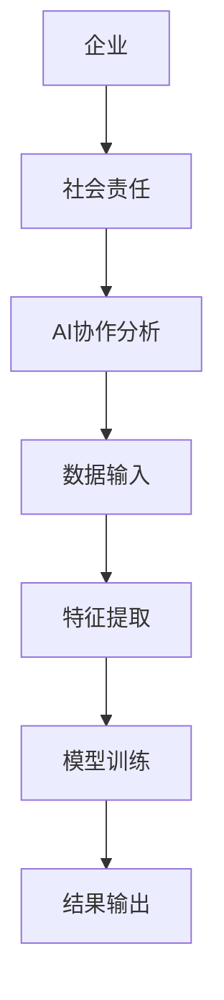
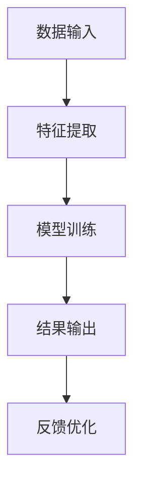
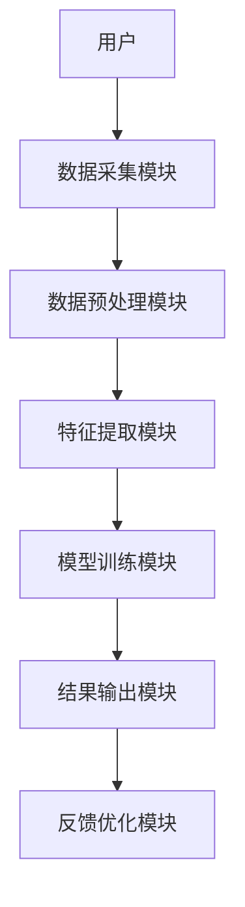
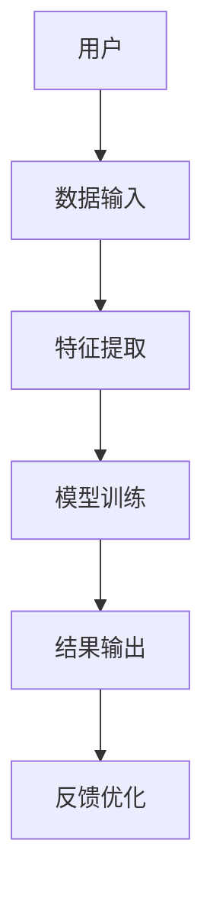

                 


# AI协作分析公司社会责任实践：全面评估企业价值

## 关键词：AI协作分析、企业社会责任、企业价值评估、人工智能、数据驱动

## 摘要：  
随着人工智能技术的快速发展，企业社会责任的实践与评估已成为企业价值的重要组成部分。本文通过AI协作分析的方法，深入探讨企业社会责任实践的评估模型、算法原理和系统实现，结合实际案例分析，为企业提供一套高效、精准、全面的企业价值评估方案。

---

## 第一部分：AI协作分析与企业社会责任背景

### 第1章：AI协作分析与企业社会责任概述

#### 1.1 AI协作分析的定义与核心概念

- **1.1.1 AI协作分析的定义**  
  AI协作分析是一种基于人工智能技术的协作分析方法，通过数据驱动的方式，帮助企业实现对社会责任实践的智能化评估与优化。

- **1.1.2 AI协作分析的核心要素**  
  AI协作分析的核心要素包括数据采集、特征提取、模型训练、结果输出和反馈优化。这些要素共同构成了一个完整的协作分析流程。

- **1.1.3 AI协作分析与企业社会责任的关系**  
  AI协作分析通过数据驱动的方式，帮助企业更高效地识别、评估和优化社会责任实践，从而提升企业的社会价值和企业价值。

#### 1.2 企业社会责任的背景与内涵

- **1.2.1 企业社会责任的定义**  
  企业社会责任（Corporate Social Responsibility, CSR）是指企业在追求经济效益的同时，还需关注环境保护、员工福利、社会公益等方面的责任。

- **1.2.2 企业社会责任的三大支柱**  
  企业社会责任的三大支柱包括经济责任、法律责任和社会责任。经济责任是企业生存和发展的基础，法律责任是企业合规经营的保障，社会责任是企业履行社会义务的关键。

- **1.2.3 企业社会责任与企业价值的关系**  
  企业社会责任的履行不仅能够提升企业的社会形象，还能增强企业的核心竞争力，从而实现企业价值的最大化。

#### 1.3 AI技术在企业社会责任中的应用前景

- **1.3.1 AI技术对企业社会责任的赋能**  
  AI技术可以通过数据分析、模式识别和自然语言处理等方式，帮助企业更精准地识别社会责任实践中的关键问题，并提供智能化的解决方案。

- **1.3.2 AI协作分析在企业社会责任中的优势**  
  AI协作分析具有高效性、精准性和可扩展性等优势，能够帮助企业快速实现社会责任实践的评估与优化。

- **1.3.3 企业社会责任AI协作分析的边界与外延**  
  AI协作分析的应用范围包括企业社会责任的评估、优化和反馈，但其边界在于企业社会责任的终极目标是实现社会价值的最大化，而非单纯追求经济效益。

---

## 第二部分：AI协作分析的核心概念与原理

### 第2章：AI协作分析的核心概念与联系

#### 2.1 核心概念原理

- **2.1.1 AI协作分析的原理**  
  AI协作分析的原理是通过数据驱动的方式，利用机器学习算法对企业社会责任实践进行建模、分析和优化。

- **2.1.2 数据驱动的协作分析方法**  
  数据驱动的协作分析方法包括数据采集、特征提取、模型训练和结果输出等步骤，能够帮助企业实现对社会责任实践的智能化评估。

- **2.1.3 AI协作分析的数学模型**  
  AI协作分析的数学模型包括损失函数、优化函数和评估指标等，这些模型能够帮助企业实现对社会责任实践的精准评估。

#### 2.2 核心概念对比分析

- **2.2.1 AI协作分析与传统协作分析的对比**  
  AI协作分析与传统协作分析的主要区别在于前者基于人工智能技术，能够实现对社会责任实践的智能化评估，而后者依赖于人工分析，效率较低。

- **2.2.2 AI协作分析与企业社会责任的对比**  
  AI协作分析是一种技术手段，而企业社会责任是一种社会义务，两者在目标和实现方式上存在显著差异。

- **2.2.3 AI协作分析与企业价值评估的对比**  
  AI协作分析与企业价值评估在方法和目标上有所不同，前者注重社会责任实践的评估，后者注重企业整体价值的评估。

#### 2.3 ER实体关系图与协作分析架构



---

## 第三部分：AI协作分析的算法原理与数学模型

### 第3章：AI协作分析的算法原理

#### 3.1 算法原理概述

- **3.1.1 数据预处理与特征提取**  
  数据预处理是AI协作分析的第一步，包括数据清洗、数据标准化和数据转换等步骤。特征提取则是从数据中提取出与企业社会责任相关的特征，例如员工满意度、环境保护投入等。

- **3.1.2 模型训练与优化**  
  模型训练是AI协作分析的核心步骤，通常采用机器学习算法，例如线性回归、支持向量机（SVM）和随机森林等。模型优化则是通过调整模型参数和评估指标，实现对社会责任实践的精准评估。

- **3.1.3 结果解释与反馈**  
  结果解释是将模型输出的结果转化为企业易于理解的解释，例如社会责任实践的评分和优化建议。反馈则是将结果反馈到企业社会责任实践的优化过程中，实现持续改进。

#### 3.2 算法流程图



#### 

---

## 第四部分：AI协作分析的系统架构与实现

### 第4章：AI协作分析的系统架构与实现

#### 4.1 系统架构设计



#### 4.2 系统功能设计

- **4.2.1 数据采集模块**  
  数据采集模块负责从企业社会责任实践的各个维度采集数据，例如员工满意度调查、环境保护投入数据等。

- **4.2.2 数据预处理模块**  
  数据预处理模块对采集到的数据进行清洗、标准化和转换，确保数据的可用性和一致性。

- **4.2.3 特征提取模块**  
  特征提取模块从预处理后的数据中提取出与企业社会责任相关的特征，例如员工满意度、环境保护投入等。

- **4.2.4 模型训练模块**  
  模型训练模块利用机器学习算法对提取出的特征进行建模和训练，生成能够评估企业社会责任实践的模型。

- **4.2.5 结果输出模块**  
  结果输出模块将模型的输出结果转化为易于理解的解释，例如社会责任实践的评分和优化建议。

- **4.2.6 反馈优化模块**  
  反馈优化模块将结果反馈到企业社会责任实践的优化过程中，实现持续改进。

#### 4.3 系统接口设计

- **4.3.1 数据接口**  
  数据接口负责与企业社会责任实践数据源的交互，例如员工满意度调查系统、环境保护投入数据系统等。

- **4.3.2 模型接口**  
  模型接口负责与机器学习模型的交互，例如线性回归模型、支持向量机（SVM）模型等。

- **4.3.3 用户接口**  
  用户接口负责与用户的交互，例如数据输入界面、结果展示界面等。

#### 4.4 系统交互设计



---

## 第五部分：AI协作分析的项目实战

### 第5章：AI协作分析的项目实战

#### 5.1 项目背景与目标

- **5.1.1 项目背景**  
  某企业希望通过AI协作分析的方法，评估其社会责任实践的现状，并制定优化方案。

- **5.1.2 项目目标**  
  通过AI协作分析，帮助企业实现对社会责任实践的精准评估，并制定优化方案，提升企业的社会价值和企业价值。

#### 5.2 项目核心实现

- **5.2.1 环境配置**  
  需要安装Python、机器学习库（如scikit-learn、TensorFlow）、数据处理库（如Pandas、NumPy）等。

- **5.2.2 核心代码实现**  
  ```python
  import pandas as pd
  import numpy as np
  from sklearn.model_selection import train_test_split
  from sklearn.linear_model import LinearRegression
  from sklearn.metrics import mean_squared_error

  # 数据加载
  data = pd.read_csv('社会责任数据.csv')
  X = data[['员工满意度', '环境保护投入', '员工福利投入']]
  y = data['社会责任评分']

  # 数据分割
  X_train, X_test, y_train, y_test = train_test_split(X, y, test_size=0.2, random_state=42)

  # 模型训练
  model = LinearRegression()
  model.fit(X_train, y_train)

  # 模型预测
  y_pred = model.predict(X_test)

  # 模型评估
  mse = mean_squared_error(y_test, y_pred)
  print(f'均方误差：{mse}')
  ```

- **5.2.3 案例分析与结果解读**  
  通过实际案例分析，展示AI协作分析在企业社会责任评估中的应用效果，并对结果进行详细解读。

#### 5.3 项目小结

- **5.3.1 项目成果**  
  通过AI协作分析，帮助企业实现了对社会责任实践的精准评估，并制定了优化方案。

- **5.3.2 项目经验**  
  在项目实施过程中，需要注意数据质量、模型选择和结果解释等问题，以确保项目的顺利实施。

---

## 第六部分：AI协作分析的最佳实践与未来展望

### 第6章：AI协作分析的最佳实践

#### 6.1 最佳实践总结

- **6.1.1 数据质量管理**  
  数据质量是AI协作分析的基础，需要确保数据的准确性和完整性。

- **6.1.2 模型选择与优化**  
  模型选择和优化是AI协作分析的关键，需要根据具体场景选择合适的算法，并进行参数调优。

- **6.1.3 结果解释与反馈**  
  结果解释是AI协作分析的重要环节，需要将模型输出的结果转化为易于理解的解释，并将其反馈到企业社会责任实践的优化过程中。

#### 6.2 未来展望

- **6.2.1 技术发展**  
  随着人工智能技术的不断发展，AI协作分析的方法和工具将更加智能化和高效化。

- **6.2.2 应用场景扩展**  
  AI协作分析的应用场景将不断扩展，从企业社会责任评估扩展到企业风险管理、供应链优化等领域。

- **6.2.3 伦理与合规**  
  随着AI协作分析的广泛应用，相关伦理和合规问题将受到更多关注，企业需要在技术应用中注重合规性和伦理性。

---

## 结论

通过本文的探讨，我们可以看到，AI协作分析作为一种高效、精准、全面的企业社会责任评估方法，正在为企业价值的提升发挥着越来越重要的作用。未来，随着人工智能技术的不断发展，AI协作分析的应用场景和方法将更加丰富和多样化，为企业社会责任的实践与评估提供更加有力的支持。

---

## 作者：AI天才研究院/AI Genius Institute & 禅与计算机程序设计艺术 /Zen And The Art of Computer Programming

