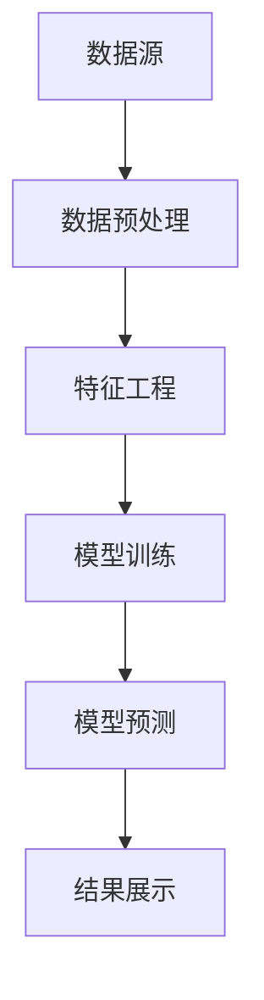

                 


# AI协作预测公司成长性：增强价值投资的前瞻性

> 关键词：AI协作预测、公司成长性、价值投资、前瞻性分析、机器学习、深度学习、数据特征

> 摘要：本文探讨了利用AI协作预测技术来增强价值投资的前瞻性分析能力。通过详细分析公司成长性预测的背景、核心概念、算法原理、系统架构设计及项目实战，本文为投资者提供了一种基于AI的前瞻性投资策略。文章从背景介绍、核心概念对比、算法实现、系统设计、项目案例分析到最佳实践，全面解析了AI协作预测在价值投资中的应用。

---

## 第一部分: AI协作预测的背景与基础

### 第1章: 价值投资与AI协作预测概述

#### 1.1 价值投资的基本概念

价值投资是一种长期投资策略，其核心理念是通过深入分析企业的基本面，寻找被市场低估的投资标的。与短期交易不同，价值投资更关注企业的长期成长性和内在价值。

- **核心理念**：价值投资强调买入低于内在价值的资产，长期持有，等待其价值回归。
- **决策过程**：依赖于对企业财务状况、行业地位、管理层能力等多方面的分析。
- **与传统投资的区别**：价值投资更注重企业的基本面和长期潜力，而非短期市场波动。

#### 1.2 AI协作预测的定义与特点

AI协作预测是指利用人工智能技术，通过分析大量数据，预测公司未来的成长性和市场表现。其特点包括：

- **数据驱动**：依赖于结构化和非结构化数据的输入。
- **实时更新**：能够根据最新数据动态调整预测结果。
- **准确性高**：通过机器学习算法优化预测模型。

#### 1.3 价值投资与AI协作预测的结合

价值投资需要对公司的成长性进行深入分析，而AI协作预测能够通过数据挖掘和模型构建，提供更精准的预测结果。这种结合使得价值投资者能够更前瞻性地识别具有长期增长潜力的企业。

---

### 第2章: 公司成长性预测的背景与挑战

#### 2.1 公司成长性预测的背景

公司成长性预测是投资决策中的重要环节，其准确性直接影响投资收益。传统方法依赖于财务指标和行业分析，但随着数据量的增加和算法的进步，AI协作预测逐渐成为更高效的选择。

- **经济环境的影响**：宏观经济波动、行业趋势变化等因素会影响公司的成长性。
- **内外部因素的双重影响**：企业内部管理、技术创新能力与外部市场需求、政策环境密切相关。

#### 2.2 AI协作预测的优势与挑战

- **优势**：
  - **高效性**：AI能够快速处理大量数据，提供实时预测结果。
  - **准确性**：通过复杂算法优化预测模型，减少人为误差。
  
- **挑战**：
  - **数据质量问题**：数据的完整性和准确性直接影响预测结果。
  - **模型过拟合**：复杂的模型可能导致过拟合，降低泛化能力。
  - **伦理与合规性问题**：AI预测可能涉及敏感数据的使用，需遵守相关法律法规。

#### 2.3 本书的研究框架与方法

- **研究目标**：构建一个基于AI的公司成长性预测模型，用于辅助价值投资决策。
- **数据来源**：包括财务数据、市场数据、文本数据等多种类型。
- **研究方法**：结合机器学习和深度学习技术，构建多模型融合的预测体系。

---

## 第二部分: AI协作预测的核心概念与联系

### 第3章: AI协作预测的核心概念

#### 3.1 数据特征与公司成长性

数据特征是预测模型的基础，不同特征对成长性的影响程度不同。

- **财务数据**：如收入、利润、资产负债率等，直接反映企业的财务健康状况。
- **市场数据**：如市盈率、市净率、行业趋势等，反映市场对企业的估值。
- **文本数据**：如公司公告、新闻报道，可能包含影响公司成长性的隐含信息。

#### 3.2 模型构建与预测方法

- **机器学习模型**：如线性回归、决策树、随机森林等，适用于结构化数据的分析。
- **深度学习模型**：如LSTM、Transformer，适用于时间序列数据和非结构化数据的分析。
- **组合模型**：通过集成多种模型的结果，提高预测的准确性。

#### 3.3 评估指标与预测结果解读

- **评估指标**：如准确率、召回率、F1分数等，用于衡量模型的性能。
- **结果解读**：预测结果需要结合企业的实际情况进行分析，避免误判。

---

### 第4章: 核心概念的联系与对比

#### 4.1 数据特征与模型选择的关系

数据特征直接影响模型的选择和性能。例如，线性回归适合线性关系的数据，而LSTM适合时间序列数据。

#### 4.2 不同模型的优劣势对比

| 模型类型 | 优势 | 劣势 |
|----------|------|------|
| 线性回归 | 简单、计算速度快 | 无法处理非线性关系 |
| 决策树   | 易解释、适用于分类问题 | 易过拟合 |
| LSTM     | 能处理时间序列数据 | 训练时间较长 |

---

## 第三部分: 算法原理与系统设计

### 第5章: 算法原理

#### 5.1 机器学习算法

- **线性回归**：通过最小二乘法拟合直线，预测公司成长性。
  $$ y = \beta_0 + \beta_1x + \epsilon $$
  
- **随机森林**：通过集成多个决策树的结果，提高预测的准确性。

#### 5.2 深度学习算法

- **LSTM网络**：用于处理时间序列数据，捕捉长期依赖关系。
  $$ \text{LSTM}(t, h_{t-1}) = \text{激活}(W_{xz}x_t + W_{hh}h_{t-1}) $$

---

### 第6章: 系统架构设计

#### 6.1 系统功能设计

- **数据采集模块**：收集财务数据、市场数据等。
- **模型训练模块**：构建并训练预测模型。
- **结果展示模块**：将预测结果以可视化方式呈现。

#### 6.2 系统架构图



---

## 第四部分: 项目实战

### 第7章: 项目实战

#### 7.1 环境安装

安装必要的Python库，如Pandas、Scikit-learn、Keras等。

#### 7.2 核心代码实现

```python
import pandas as pd
from sklearn.ensemble import RandomForestRegressor
from sklearn.metrics import mean_squared_error

# 数据加载
data = pd.read_csv('company_data.csv')

# 特征与目标分离
X = data.drop('growth_potential', axis=1)
y = data['growth_potential']

# 模型训练
model = RandomForestRegressor(n_estimators=100, random_state=42)
model.fit(X, y)

# 预测与评估
y_pred = model.predict(X)
print(mean_squared_error(y, y_pred))
```

---

## 第五部分: 最佳实践与小结

### 第8章: 最佳实践

#### 8.1 数据处理的注意事项

- 数据清洗：处理缺失值和异常值。
- 特征选择：选择与目标变量高度相关的特征。

#### 8.2 模型优化的建议

- 调参：通过网格搜索优化模型参数。
- 集成学习：结合多种模型的结果。

### 8.3 小结

通过AI协作预测，投资者能够更前瞻性地评估公司的成长性，从而做出更明智的投资决策。然而，AI预测并非万能，仍需结合人类的判断和经验。

---

## 作者：AI天才研究院 & 禅与计算机程序设计艺术

---

这篇博客文章通过详细分析AI协作预测在公司成长性预测中的应用，为价值投资者提供了前瞻性的投资策略。从背景介绍到算法实现，再到系统设计和项目实战，文章全面解析了AI协作预测的核心概念和实际应用，为读者提供了宝贵的参考。

