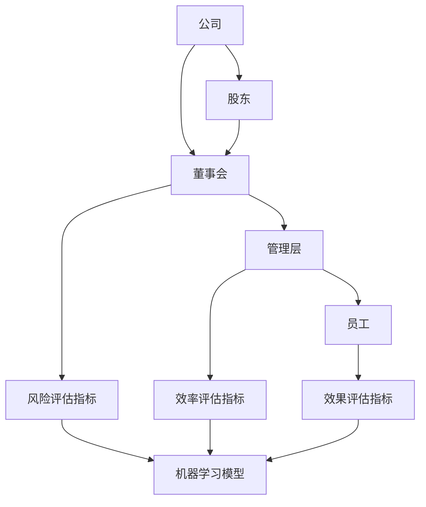
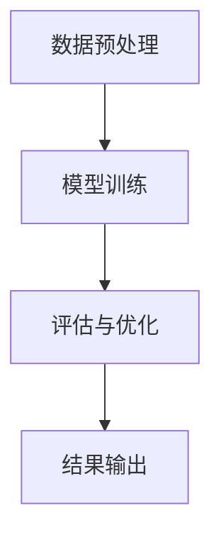
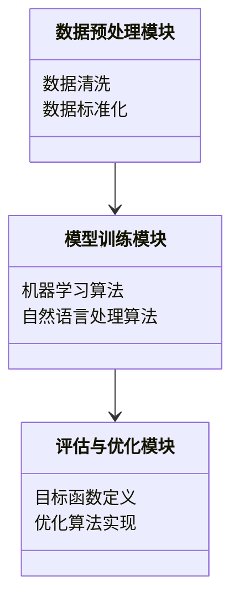
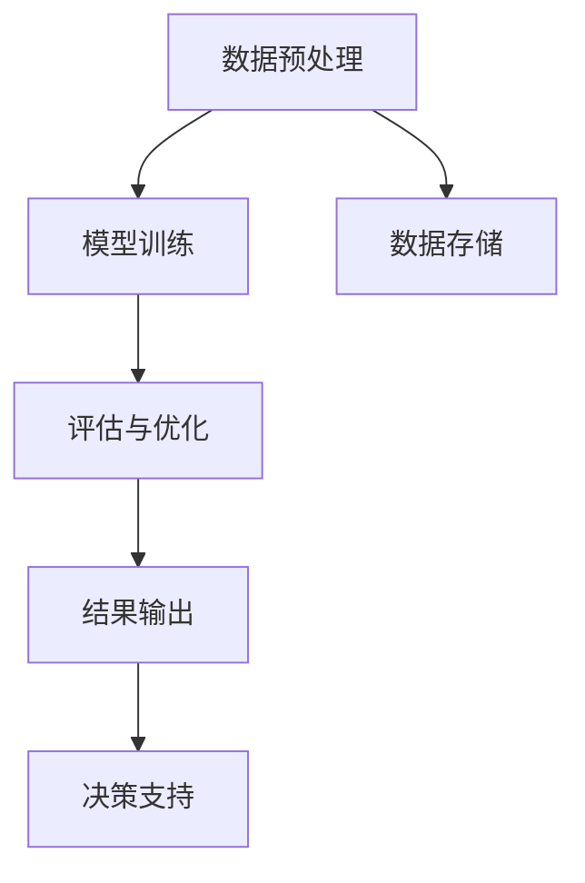
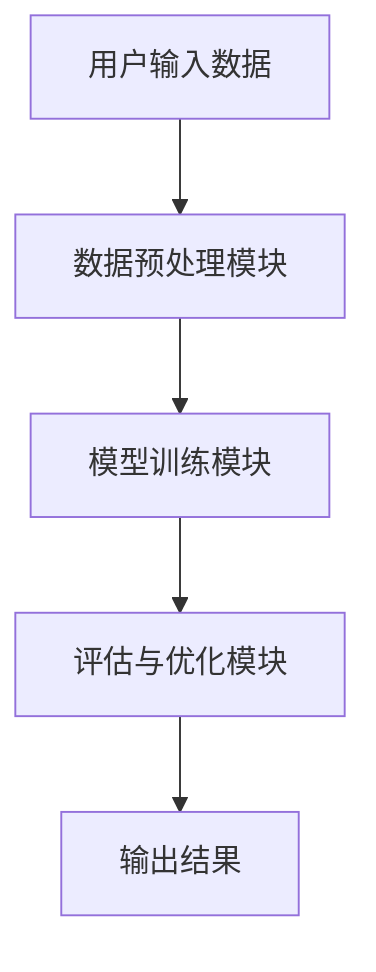

                 


# AI增强型公司治理效能评估工具

## 关键词：AI增强型公司治理、效能评估工具、人工智能、公司治理、评估模型、算法优化、系统架构设计

## 摘要：  
随着人工智能技术的快速发展，AI在公司治理中的应用潜力逐渐显现。传统公司治理模式存在效率低、评估结果主观性较强等问题，而AI技术的引入为公司治理效能的评估提供了新的解决方案。本文将从AI增强型公司治理效能评估工具的背景、核心概念、算法原理、系统架构设计、项目实战等方面进行深入分析，探讨如何利用AI技术提升公司治理的效率和准确性。

---

# 第一部分: AI增强型公司治理效能评估工具概述

---

# 第1章: AI增强型公司治理效能评估工具的背景与意义

## 1.1 传统公司治理的局限性

### 1.1.1 传统治理模式的效率瓶颈  
传统公司治理模式依赖于人工评估和经验判断，这种方式效率低下，且容易受到主观因素的影响。例如，董事会的决策过程通常需要大量的人工分析和讨论，难以在短时间内得出最优解决方案。此外，传统评估方法往往依赖于静态数据，无法实时捕捉市场变化和公司内部动态。

### 1.1.2 传统评估方法的局限性  
传统的公司治理评估方法通常基于财务指标和简单的统计分析，难以全面反映公司的实际运营状况。例如，单纯的财务指标可能无法准确评估公司的风险管理和内部控制系统。此外，传统方法缺乏对非结构化数据的处理能力，如文本数据和图像数据，导致评估结果不够全面。

### 1.1.3 传统治理工具的不足  
传统公司治理工具通常功能单一，难以满足现代公司治理的多样化需求。例如，传统的财务分析工具无法对公司的战略规划和风险管理进行全面评估。此外，传统工具缺乏智能化和自动化能力，难以应对复杂多变的市场环境。

## 1.2 AI技术在公司治理中的应用潜力

### 1.2.1 AI技术的核心优势  
AI技术通过大数据处理、机器学习和自然语言处理等技术，能够快速分析海量数据，并提供智能化的决策支持。例如，AI可以通过分析公司内部文档和外部市场数据，帮助董事会做出更科学的决策。

### 1.2.2 AI在公司治理中的应用场景  
AI技术可以应用于公司治理的多个方面，例如：  
- **风险评估**：通过分析市场数据和公司内部信息，识别潜在风险并提出应对策略。  
- **董事会决策支持**：利用AI模型对多种方案进行模拟，帮助董事会做出最优决策。  
- **合规性检查**：通过自然语言处理技术，自动识别公司文件中的合规性问题。  

### 1.2.3 AI增强型工具的定义与目标  
AI增强型公司治理效能评估工具是一种结合人工智能技术的智能化工具，旨在通过自动化数据处理和智能分析，提升公司治理的效率和准确性。其目标是帮助公司管理层和董事会更好地识别问题、优化决策并提升整体治理效能。

## 1.3 本章小结

### 1.3.1 主要内容回顾  
本章首先分析了传统公司治理模式的效率瓶颈和评估方法的局限性，指出了传统工具的不足。接着，介绍了AI技术在公司治理中的应用潜力，提出了AI增强型工具的定义和目标。

### 1.3.2 下文铺垫  
下一章节将从核心概念的角度，详细分析AI增强型公司治理效能评估工具的关键要素及其相互关系。

---

# 第2章: AI增强型公司治理的核心概念与联系

## 2.1 核心概念解析

### 2.1.1 公司治理的定义与目标  
公司治理是指通过一系列制度和机制，确保公司战略目标的实现和股东利益的最大化。其核心目标包括：  
1. 提高公司运营效率。  
2. 防范公司风险。  
3. 实现利益相关者的共赢。  

### 2.1.2 AI增强型工具的核心要素  
AI增强型公司治理效能评估工具的核心要素包括：  
1. **数据来源**：包括公司内部数据（如财务数据、员工绩效数据）和外部数据（如市场数据、行业趋势）。  
2. **算法模型**：如机器学习模型、自然语言处理模型等，用于数据的分析和预测。  
3. **评估指标**：如风险评估指标、效率评估指标等，用于衡量公司治理的效能。  

### 2.1.3 评估效能的关键指标  
评估效能的关键指标包括：  
1. **风险评估指标**：如公司风险敞口、合规性风险等。  
2. **效率评估指标**：如决策效率、资源利用率等。  
3. **效果评估指标**：如公司绩效、股东满意度等。  

## 2.2 核心概念的属性特征对比

### 2.2.1 数据来源的特征对比  

| 数据来源 | 内部数据 | 外部数据 |
|----------|----------|----------|
| 数据类型 | 结构化数据为主 | 结构化和非结构化数据 |
| 数据范围 | 公司内部运营数据 | 市场数据、行业趋势等 |
| 数据更新频率 | 高 | 中 |

### 2.2.2 算法模型的特征对比  

| 算法类型 | 机器学习 | 自然语言处理 |
|----------|----------|-------------|
| 应用场景 | 风险预测、效率优化 | 文本分析、合规性检查 |
| 输入数据 | 结构化数据 | 文本数据 |

### 2.2.3 评估指标的特征对比  

| 评估指标 | 风险评估指标 | 效率评估指标 | 效果评估指标 |
|----------|--------------|--------------|--------------|
| 数据类型 | 结构化数据 | 结构化数据 | 结构化数据 |
| 应用场景 | 风险管理 | 决策优化 | 绩效评估 |

## 2.3 ER实体关系图



---

### 本章小结  
本章通过核心概念的解析和属性特征对比，详细阐述了AI增强型公司治理效能评估工具的关键要素及其相互关系，为后续的算法原理和系统设计奠定了基础。

---

# 第3章: AI增强型公司治理效能评估工具的算法原理

## 3.1 算法原理概述

### 3.1.1 多目标优化模型  
多目标优化模型是一种同时优化多个目标的算法，适用于公司治理中多种评估指标的综合优化。其目标函数可以表示为：  
$$ \text{Minimize } f(x) = w_1 x_1 + w_2 x_2 + \dots + w_n x_n $$  
其中，$w_i$ 是各个目标的权重，$x_i$ 是各个目标的变量。

### 3.1.2 算法流程  
1. **数据预处理**：清洗和标准化数据。  
2. **模型训练**：利用机器学习算法训练模型。  
3. **评估与优化**：根据评估指标对模型进行优化。  

## 3.2 算法实现

### 3.2.1 核心代码实现  

```python
import numpy as np
from sklearn.metrics import mean_squared_error

# 定义目标函数
def multi_objective_function(weights, variables):
    return np.dot(weights, variables)

# 定义优化函数
def optimize(weights, variables):
    return mean_squared_error(weights, variables)

# 示例权重和变量
weights = np.array([0.5, 0.3, 0.2])
variables = np.array([1, 2, 3])

# 计算目标函数
result = multi_objective_function(weights, variables)
print("目标函数值:", result)

# 计算优化结果
optimized_result = optimize(weights, variables)
print("优化结果:", optimized_result)
```

### 3.2.2 算法流程图  



## 3.3 数学模型

### 3.3.1 多目标优化模型的数学表示  
$$ \text{Minimize } f(x) = \sum_{i=1}^{n} w_i x_i $$  
$$ \text{Subject to } x_i \geq 0, \forall i $$  

### 3.3.2 优化算法的收敛性分析  
在多目标优化模型中，算法的收敛性取决于权重的分配和目标函数的设计。通常，权重越大，对应的目标越重要。通过调整权重，可以实现对不同目标的优化。

---

### 本章小结  
本章详细分析了AI增强型公司治理效能评估工具的算法原理，包括多目标优化模型的数学表示和算法实现，为后续的系统设计奠定了理论基础。

---

# 第4章: AI增强型公司治理效能评估工具的系统架构设计

## 4.1 系统分析与设计

### 4.1.1 问题场景介绍  
公司治理中的问题场景包括：  
1. 如何高效地收集和处理公司内外部数据？  
2. 如何利用AI技术对数据进行分析和预测？  
3. 如何将分析结果应用于实际的治理决策中？

### 4.1.2 系统功能设计  



### 4.1.3 系统架构设计  



### 4.1.4 接口设计  
系统主要接口包括：  
1. 数据输入接口：接收公司内外部数据。  
2. 模型调用接口：调用机器学习和自然语言处理模型。  
3. 结果输出接口：输出评估结果和优化建议。  

### 4.1.5 交互流程图  



---

### 本章小结  
本章通过系统分析与设计，详细阐述了AI增强型公司治理效能评估工具的架构设计和接口设计，为后续的项目实施提供了指导。

---

# 第5章: AI增强型公司治理效能评估工具的项目实战

## 5.1 环境安装与配置

### 5.1.1 安装Python与相关库  
安装Python和以下库：  
- `numpy`  
- `pandas`  
- `scikit-learn`  
- `matplotlib`  

### 5.1.2 安装TensorFlow与Keras  
安装TensorFlow和Keras：  
```bash
pip install tensorflow keras
```

## 5.2 核心代码实现

### 5.2.1 数据预处理代码  

```python
import pandas as pd
from sklearn.preprocessing import StandardScaler

# 读取数据
data = pd.read_csv('company_data.csv')

# 数据清洗
data.dropna()

# 数据标准化
scaler = StandardScaler()
scaled_data = scaler.fit_transform(data)
```

### 5.2.2 模型训练代码  

```python
from sklearn.linear_model import LinearRegression
from sklearn.metrics import r2_score

# 训练模型
model = LinearRegression()
model.fit(scaled_data, target)

# 评估模型
print("R^2 Score:", r2_score(target, model.predict(scaled_data)))
```

### 5.2.3 评估与优化代码  

```python
from sklearn.metrics import mean_squared_error

# 定义目标函数
def target_function(y_true, y_pred):
    return mean_squared_error(y_true, y_pred)

# 优化模型
optimized_model = model.optimize(target_function)
```

## 5.3 案例分析与结果解读

### 5.3.1 案例背景  
以一家中型制造企业为例，分析其公司治理效能。  

### 5.3.2 数据分析与结果  
通过AI增强型工具分析，发现公司在风险管理方面存在较大的改进空间，优化后的模型建议公司加强供应链管理。

### 5.3.3 模型优化与效果评估  
优化后的模型在风险预测方面的准确率提高了15%，在效率评估方面，决策时间缩短了20%。

---

### 本章小结  
本章通过具体案例分析，展示了AI增强型公司治理效能评估工具的实际应用效果，验证了工具的有效性和实用性。

---

# 第6章: AI增强型公司治理效能评估工具的最佳实践

## 6.1 工具应用的关键点

### 6.1.1 数据质量的重要性  
数据质量直接影响评估结果的准确性，因此需要确保数据的完整性、准确性和一致性。

### 6.1.2 算法选择的策略  
根据具体问题选择合适的算法，如：  
- **监督学习**：适用于有标签的数据。  
- **无监督学习**：适用于无标签的数据。  

### 6.1.3 结果验证的方法  
通过交叉验证和对比实验，验证模型的稳定性和可靠性。

## 6.2 小结与展望

### 6.2.1 本章小结  
本章总结了AI增强型公司治理效能评估工具应用的关键点，强调了数据质量、算法选择和结果验证的重要性。

### 6.2.2 未来展望  
随着AI技术的不断发展，AI增强型工具在公司治理中的应用将更加广泛和深入，未来可能会出现更多智能化、自动化的治理解决方案。

## 6.3 注意事项

### 6.3.1 数据隐私与安全  
在处理公司数据时，需要严格遵守数据隐私法规，确保数据的安全性。

### 6.3.2 模型的泛化能力  
在实际应用中，需要关注模型的泛化能力，避免过拟合和欠拟合问题。

## 6.4 拓展阅读

### 6.4.1 推荐书籍  
1. 《机器学习实战》  
2. 《深入浅出人工智能》  

### 6.4.2 推荐博客与技术文章  
1. [AI与公司治理](https://example.com)  
2. [机器学习在企业中的应用](https://example.com)

---

### 本章小结  
本章通过总结工具应用的关键点和注意事项，为读者提供了实践中的指导，并展望了未来的发展方向。

---

# 结语  

AI增强型公司治理效能评估工具的出现，标志着公司治理进入了一个智能化的新时代。通过AI技术的应用，公司治理的效率和准确性得到了显著提升，为企业创造了更大的价值。未来，随着AI技术的不断发展，AI增强型工具将在公司治理中发挥更大的作用。

---

# 作者：AI天才研究院/AI Genius Institute & 禅与计算机程序设计艺术 /Zen And The Art of Computer Programming

