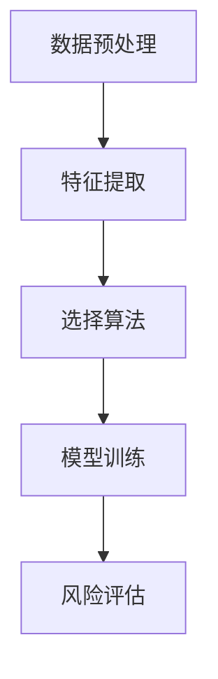
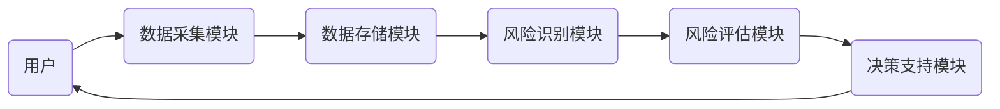
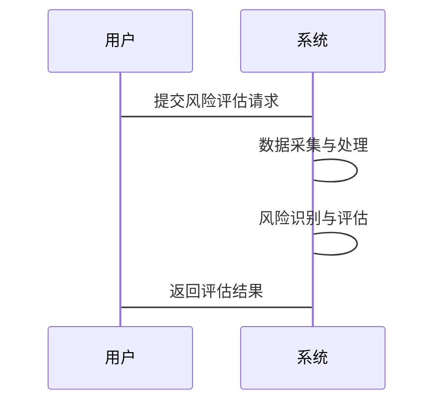

                 


# AI增强型公司治理风险评估工具

> 关键词：AI增强型，公司治理，风险评估，工具，人工智能，风险管理

> 摘要：本文探讨了如何利用人工智能技术构建公司治理风险评估工具，从核心概念、算法原理到系统架构，再到项目实战，全面分析了AI在公司治理中的应用。通过详细的技术分析和实际案例，展示了AI如何提升公司治理的效率和准确性。

---

## 第一部分：AI增强型公司治理风险评估工具的背景与核心概念

### 第1章：公司治理风险评估的背景与问题背景

#### 1.1 公司治理风险评估的背景
- **问题背景**：公司治理中的风险评估是保障企业稳健运营的关键环节。传统方法依赖人工分析，效率低下且容易遗漏风险点。
- **定义与范围**：公司治理风险评估是指识别、分析和应对可能影响公司运营的各类风险。
- **当前挑战**：数据量大、风险因素复杂，传统方法难以及时准确地评估风险。

#### 1.2 AI技术引入的必要性
- **技术优势**：AI能够处理大量数据，识别复杂模式，提高风险评估的准确性和效率。
- **应用场景**：企业信用评估、合规性检查、内部审计等场景。

### 第2章：AI增强型公司治理风险评估工具的核心概念

#### 2.1 核心概念
- **AI增强型风险评估**：结合人工智能技术，提升风险评估的智能化水平。
- **数据分析**：利用机器学习算法对结构化和非结构化数据进行分析。

#### 2.2 核心原理
- **数据驱动**：基于大量数据，识别潜在风险因素。
- **动态调整**：AI模型能够实时更新，适应新的风险环境。

### 第3章：AI增强型公司治理风险评估的现状与趋势

#### 3.1 现状分析
- **技术应用**：部分企业开始采用AI技术进行风险评估，但整体渗透率较低。
- **主要问题**：数据质量、模型准确性、技术门槛高。

#### 3.2 未来趋势
- **智能化升级**：AI技术将进一步深入，推动风险评估工具的智能化。
- **行业扩展**：从金融行业扩展到制造业、零售业等领域。

---

## 第二部分：AI增强型公司治理风险评估工具的核心原理与技术

### 第4章：AI增强型公司治理风险评估的核心原理

#### 4.1 风险评估的基本原理
- **风险识别**：通过数据分析，识别潜在风险。
- **风险量化**：利用概率模型评估风险的影响程度。

#### 4.2 AI技术的核心算法与模型
- **机器学习算法**：如支持向量机（SVM）、随机森林（Random Forest）。
- **深度学习模型**：如神经网络、LSTM用于时间序列分析。

#### 4.3 算法原理图


### 第5章：AI增强型公司治理风险评估的核心算法与模型

#### 5.1 基于机器学习的风险评估模型
- **逻辑回归模型**：用于分类风险等级。
- **支持向量机（SVM）**：用于分类和回归分析。

#### 5.2 算法实现
```python
from sklearn.linear_model import LogisticRegression

# 示例数据
X = [[...], [...]]  # 特征向量
y = [0, 1]  # 风险标签

# 模型训练
model = LogisticRegression()
model.fit(X, y)

# 预测
new_case = [[...]]
print(model.predict(new_case))
```

---

## 第三部分：系统分析与架构设计方案

### 第6章：系统分析与架构设计

#### 6.1 项目介绍
- **目标**：开发一个AI增强型公司治理风险评估工具，帮助企业在数字化转型中有效管理风险。

#### 6.2 系统功能设计
- **数据采集模块**：收集企业内外部数据。
- **风险识别模块**：利用AI技术识别潜在风险。
- **风险评估模块**：评估风险的影响程度。
- **决策支持模块**：提供优化建议。

#### 6.3 系统架构设计


#### 6.4 接口设计
- **API接口**：提供RESTful接口，方便其他系统调用。

#### 6.5 交互流程图


---

## 第四部分：项目实战与应用

### 第7章：项目实战

#### 7.1 环境安装
- **工具安装**：安装Python、TensorFlow、Scikit-learn等库。

#### 7.2 核心代码实现
```python
import pandas as pd
from sklearn.model_selection import train_test_split
from sklearn.metrics import accuracy_score

# 数据加载
data = pd.read_csv('risk_data.csv')

# 数据分割
X = data.drop('risk_label', axis=1)
y = data['risk_label']

# 训练集和测试集划分
X_train, X_test, y_train, y_test = train_test_split(X, y, test_size=0.2)

# 模型训练
from sklearn.svm import SVC
model = SVC()
model.fit(X_train, y_train)

# 模型预测
y_pred = model.predict(X_test)

# 准确率计算
print('准确率:', accuracy_score(y_test, y_pred))
```

#### 7.3 案例分析
- **案例背景**：某公司面临财务风险，利用AI工具进行评估。
- **分析过程**：数据采集、特征提取、模型训练、风险评估。
- **结果解读**：模型识别出主要风险点，并提供优化建议。

---

## 第五部分：总结与展望

### 8.1 最佳实践 tips
- **数据质量**：确保数据准确、完整。
- **模型优化**：定期更新模型，适应新的风险环境。
- **技术应用**：结合企业实际情况，选择合适的技术方案。

### 8.2 小结
AI增强型公司治理风险评估工具通过智能化手段，显著提升了风险评估的效率和准确性，为企业提供了有力的支持。

### 8.3 注意事项
- **数据隐私**：遵守相关法律法规，保护数据隐私。
- **技术门槛**：企业需具备一定的技术能力，才能有效应用AI工具。

### 8.4 拓展阅读
- **推荐书籍**：《人工智能：一种现代方法》
- **推荐博客**：TechCrunch、venturebeat

---

## 作者信息

作者：AI天才研究院/AI Genius Institute & 禅与计算机程序设计艺术 /Zen And The Art of Computer Programming

---

本文通过详细分析AI在公司治理中的应用，结合理论与实践，展示了如何利用AI技术构建高效的公司治理风险评估工具。希望本文能为相关领域的研究和实践提供有价值的参考。

