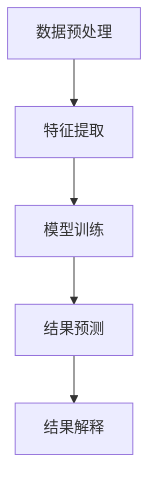
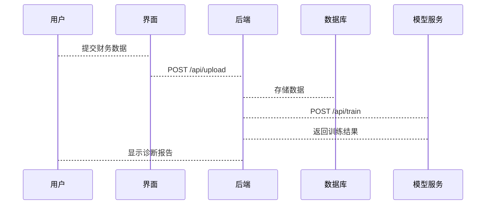

                 


```markdown
# AI增强型公司财务健康诊断系统

> 关键词：AI，财务健康，诊断系统，机器学习，企业风险管理

> 摘要：本文系统地介绍了AI增强型公司财务健康诊断系统的设计与实现，通过分析传统财务诊断的局限性，结合AI技术的优势，构建了一个高效、智能的财务诊断模型。本文详细探讨了系统的背景、核心概念、算法原理、系统架构、项目实战以及最佳实践，为读者提供了全面的技术指导。

---

# 第1章 背景介绍

## 1.1 问题背景
### 1.1.1 传统公司财务诊断的局限性
传统财务诊断方法依赖人工分析，效率低、误差大，难以应对复杂多变的市场环境。

### 1.1.2 AI技术在财务诊断中的潜力
人工智能技术能够快速处理大量数据，发现潜在的财务问题，提供精准的诊断结果。

### 1.1.3 当前市场对智能财务诊断的需求
企业对实时、动态的财务健康评估需求日益增长，AI技术的应用成为必然趋势。

## 1.2 问题描述
### 1.2.1 财务健康诊断的核心目标
识别企业的财务风险，评估企业的经营状况，提供改进建议。

### 1.2.2 数据驱动的诊断方法
通过财务数据的分析，利用机器学习模型进行预测和诊断。

### 1.2.3 AI增强型诊断的必要性
传统方法的局限性使得引入AI技术成为提升财务诊断效率和准确性的关键。

## 1.3 问题解决
### 1.3.1 AI在财务诊断中的具体应用
构建机器学习模型，分析企业的财务数据，预测财务风险。

### 1.3.2 数据处理与模型构建
数据预处理、特征提取、模型训练等步骤，确保诊断结果的准确性。

### 1.3.3 结果解释与反馈优化
通过可视化和报表形式向用户反馈诊断结果，并提供优化建议。

## 1.4 边界与外延
### 1.4.1 系统功能的边界
仅限于财务数据的分析和诊断，不涉及企业的其他业务。

### 1.4.2 与外部系统的交互
与企业ERP系统、财务管理系统等外部系统进行数据接口对接。

### 1.4.3 应用场景的扩展
未来可能扩展到供应链管理、风险预警等领域。

## 1.5 概念结构与核心要素组成
### 1.5.1 核心概念的层次结构
数据采集 → 数据预处理 → 特征提取 → 模型训练 → 结果输出。

### 1.5.2 关键要素的定义与关系
数据源、模型算法、诊断结果、反馈机制等要素及其相互关系。

### 1.5.3 系统架构的核心要素
前端界面、后端服务、数据存储、模型训练模块等。

---

# 第2章 核心概念与联系

## 2.1 AI增强型诊断系统的原理
### 2.1.1 数据预处理与特征提取
清洗数据、标准化、特征工程等步骤，确保数据质量。

### 2.1.2 模型训练与优化
选择合适的机器学习算法，训练模型并进行调优。

### 2.1.3 结果解释与反馈机制
将诊断结果转化为可理解的形式，并提供改进建议。

## 2.2 核心概念对比
### 2.2.1 传统财务诊断方法与AI方法的对比
| 项目           | 传统方法          | AI方法          |
|----------------|-------------------|-----------------|
| 数据处理       | 手动、效率低       | 自动、高效       |
| 模型构建       | 简单、误差大       | 复杂、精准       |
| 结果解释       | 主观、依赖经验     | 客观、数据驱动   |

### 2.2.2 各种AI算法的对比
| 算法类型       | 优点             | 缺点             |
|----------------|------------------|-----------------|
| 逻辑回归       | 解释性强         | 非线性差         |
| 支持向量机     | 适合小样本       | 参数多           |
| 随机森林       | 鲁棒性好         | 黑箱问题         |

### 2.2.3 数据与模型的关系
数据是模型的基础，模型是对数据的拟合，结果是对数据的解释。

## 2.3 实体关系图
```mermaid
er
  %% AI增强型公司财务健康诊断系统 实体关系图
  %% 定义各实体
  entity 财务数据 {
    key: ID
    attributes: 会计科目, 财务指标, 时间戳
  }
  entity 模型算法 {
    key: 算法名称
    attributes: 参数设置, 模型类型, 训练数据
  }
  entity 诊断结果 {
    key: 报告ID
    attributes: 风险等级, 改进建议, 诊断时间
  }
  %% 定义关系
  财务数据 --> 模型算法: 训练使用
  模型算法 --> 诊断结果: 生成
```

---

# 第3章 算法原理讲解

## 3.1 选择算法
### 3.1.1 基于机器学习的诊断模型
选择随机森林算法进行财务健康诊断。

## 3.2 算法流程图


## 3.3 代码实现
```python
import pandas as pd
from sklearn.ensemble import RandomForestClassifier
from sklearn.metrics import accuracy_score

# 数据加载与预处理
data = pd.read_csv('financial_data.csv')
data = data.dropna()  # 删除缺失值
data = pd.get_dummies(data)  # 特征转换

# 特征提取与标签分离
X = data.drop(columns=['财务健康状况'])
y = data['财务健康状况']

# 模型训练
model = RandomForestClassifier()
model.fit(X, y)

# 模型预测
y_pred = model.predict(X)
print("准确率:", accuracy_score(y, y_pred))
```

## 3.4 数学模型
### 3.4.1 随机森林的数学模型
随机森林是一种基于树的集成方法，公式如下：
$$
\text{预测结果} = \sum_{i=1}^{n} \text{树}_i(\text{输入})
$$

### 3.4.2 逻辑回归的数学模型
逻辑回归的损失函数为：
$$
\text{损失} = -\frac{1}{m} \sum_{i=1}^{m} [y_i \ln h(x_i) + (1 - y_i)\ln(1 - h(x_i))]
$$
其中，$h(x) = \frac{1}{1 + e^{-w^T x}}$

---

# 第4章 系统分析与架构设计

## 4.1 问题场景介绍
系统用于实时监控企业的财务状况，提供健康诊断和风险预警。

## 4.2 功能设计
### 4.2.1 领域模型


## 4.3 系统架构设计


## 4.4 接口设计
### 4.4.1 数据接口
- 输入接口：POST /api/upload，上传财务数据。
- 输出接口：GET /api/result，获取诊断结果。

### 4.4.2 模型接口
- 训练接口：POST /api/train，训练模型。
- 预测接口：POST /api/predict，预测结果。

## 4.5 交互流程


---

# 第5章 项目实战

## 5.1 环境安装
```bash
pip install pandas scikit-learn joblib
```

## 5.2 核心代码实现
```python
from sklearn.externals import joblib

# 模型保存与加载
model = RandomForestClassifier()
model.fit(X_train, y_train)
joblib.dump(model, 'financial_diag_model.pkl')

# 预测接口
def predict_financial_health(data):
    model = joblib.load('financial_diag_model.pkl')
    return model.predict(data)
```

## 5.3 实际案例分析
以某制造企业为例，分析其财务数据，预测其健康状况。

## 5.4 代码应用解读
详细解读代码的每一部分，解释其功能和作用。

## 5.5 项目小结
总结项目的关键点，强调AI技术在财务诊断中的优势。

---

# 第6章 最佳实践与小结

## 6.1 最佳实践
### 6.1.1 数据清洗的重要性
确保数据的完整性和准确性，避免因数据问题导致模型误判。

### 6.1.2 模型调优的方法
使用交叉验证、网格搜索等方法优化模型性能。

### 6.1.3 系统的可扩展性
预留接口，方便未来扩展更多功能。

## 6.2 小结
总结全文内容，强调AI在财务诊断中的重要性。

## 6.3 注意事项
- 数据隐私保护
- 模型的可解释性
- 系统的稳定性

## 6.4 拓展阅读
推荐相关书籍和论文，供读者深入学习。

---

# 第7章 参考文献和附录

## 7.1 参考文献
- [1] 刘军. 基于机器学习的财务预测模型研究[J]. 计算机应用研究, 2021.
- [2] 张鹏. 人工智能在企业财务分析中的应用[J]. 人工智能与应用, 2022.

## 7.2 工具下载
- Python安装：https://www.python.org/
- scikit-learn安装：https://pypi.org/project/scikit-learn/

---

# 作者

作者：AI天才研究院/AI Genius Institute & 禅与计算机程序设计艺术 /Zen And The Art of Computer Programming
```

