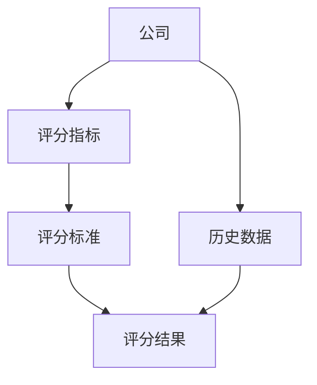
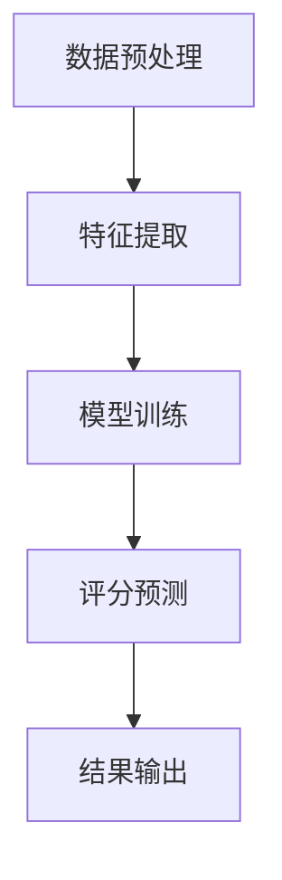

                 


# AI增强型公司质量评分系统

> 关键词：AI增强型，公司质量评分，机器学习，评分系统，企业质量评估

> 摘要：本文介绍了一种基于人工智能的公司质量评分系统，该系统通过多维度数据分析和机器学习算法，实现对公司质量的智能化评估。文章详细阐述了系统的背景、核心概念、算法原理、系统架构设计以及项目实战，为读者提供了一套完整的解决方案。

---

## 第一章：AI增强型公司质量评分系统背景介绍

### 1.1 问题背景与描述
公司在市场中的竞争力往往取决于其质量，而传统的质量评估方法通常依赖于人工经验或单一维度的指标，存在效率低、主观性强、难以量化等问题。随着人工智能技术的发展，如何利用AI技术提升公司质量评估的准确性和效率成为一个重要研究方向。

### 1.2 问题解决与边界
AI增强型公司质量评分系统通过整合多维度数据，利用机器学习算法对数据进行分析和建模，从而实现对公司质量的智能化评估。系统的核心目标是提供一个高效、客观、可量化的评分工具，帮助企业在市场中快速定位自身优势和改进方向。

### 1.3 核心概念与结构
系统的核心概念包括公司、评分指标、评分标准和评分结果。通过构建多维度的评估指标体系，系统能够从财务、市场、管理等多个方面全面分析公司的质量，并通过AI算法生成评分结果。

---

## 第二章：AI增强型公司质量评分系统的核心概念

### 2.1 核心概念原理
AI增强型公司质量评分系统通过收集和整合多维度数据，利用机器学习算法对数据进行建模和分析，生成公司的质量评分。系统的输入包括公司的财务数据、市场表现、管理能力等指标，输出为综合评分结果。

### 2.2 核心概念属性对比表
| **属性**       | **传统评估方法**                  | **AI增强型评估方法**                  |
|-----------------|----------------------------------|----------------------------------|
| 数据来源         | 单一维度数据                     | 多维度数据                         |
| 评估效率         | 低效                             | 高效                               |
| 评估准确性         | 主观性强                         | 客观性高                           |

### 2.3 ER实体关系图


---

## 第三章：AI增强型公司质量评分系统的算法原理

### 3.1 算法选择与流程
系统采用随机森林算法进行建模和预测。随机森林是一种基于树的集成学习方法，具有高准确性和良好的抗过拟合能力，适合处理多分类问题。

### 3.2 算法流程图


### 3.3 算法实现代码
```python
import pandas as pd
from sklearn.ensemble import RandomForestClassifier
from sklearn.metrics import accuracy_score

# 数据加载与预处理
data = pd.read_csv('company_data.csv')
X = data.drop('score', axis=1)
y = data['score']

# 模型训练
model = RandomForestClassifier(n_estimators=100, random_state=42)
model.fit(X, y)

# 模型预测
predicted = model.predict(X)
print("模型准确率:", accuracy_score(y, predicted))
```

### 3.4 数学模型与公式
随机森林的数学模型如下：
$$
\text{预测结果} = \sum_{i=1}^{n} \text{特征权重} \times \text{特征值}
$$
其中，$n$ 是特征的数量。

---

## 第四章：AI增强型公司质量评分系统的系统分析与架构设计

### 4.1 问题场景介绍
系统需要解决传统公司质量评估方法效率低、主观性强的问题，通过AI技术实现高效、客观的评估。

### 4.2 系统功能设计
系统功能模块包括数据采集、数据预处理、模型训练、评分预测和结果展示。

### 4.3 系统架构设计


### 4.4 系统接口设计
系统提供RESTful API接口，支持数据上传、模型训练和评分查询功能。

### 4.5 系统交互流程图


---

## 第五章：AI增强型公司质量评分系统的项目实战

### 5.1 环境搭建
需要安装Python、Scikit-learn、Pandas和Mermaid工具。

### 5.2 核心代码实现
```python
import pandas as pd
from sklearn.ensemble import RandomForestClassifier
from sklearn.metrics import accuracy_score

# 数据加载与预处理
data = pd.read_csv('company_data.csv')
X = data.drop('score', axis=1)
y = data['score']

# 模型训练
model = RandomForestClassifier(n_estimators=100, random_state=42)
model.fit(X, y)

# 模型预测
predicted = model.predict(X)
print("模型准确率:", accuracy_score(y, predicted))
```

### 5.3 案例分析
通过实际案例分析，验证系统的评估效果和准确性。

### 5.4 项目总结
总结项目的实现过程，分析系统的优缺点，并提出改进建议。

---

## 第六章：AI增强型公司质量评分系统的最佳实践

### 6.1 小结
AI增强型公司质量评分系统通过多维度数据分析和机器学习算法，实现了对公司质量的智能化评估。

### 6.2 注意事项
在实际应用中，需要注意数据质量和模型调优，确保系统的准确性和稳定性。

### 6.3 拓展阅读
推荐相关书籍和论文，供读者深入学习和研究。

---

## 第七章：附录

### 7.1 术语表
解释系统中涉及的专业术语。

### 7.2 参考文献
列出文章中引用的文献和资料。

---

## 作者

作者：AI天才研究院/AI Genius Institute & 禅与计算机程序设计艺术 /Zen And The Art of Computer Programming

