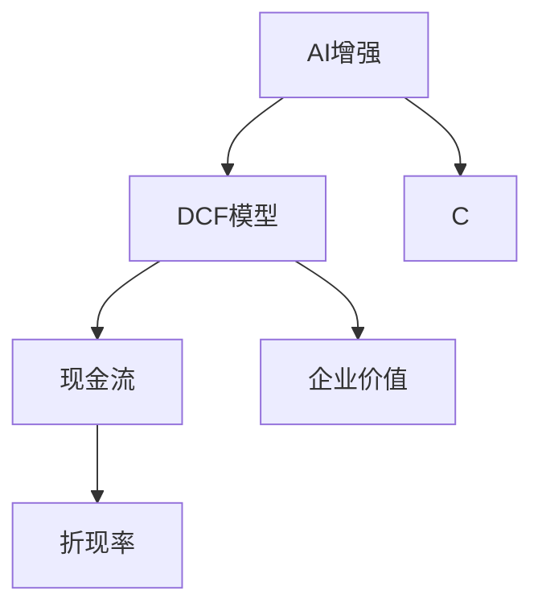
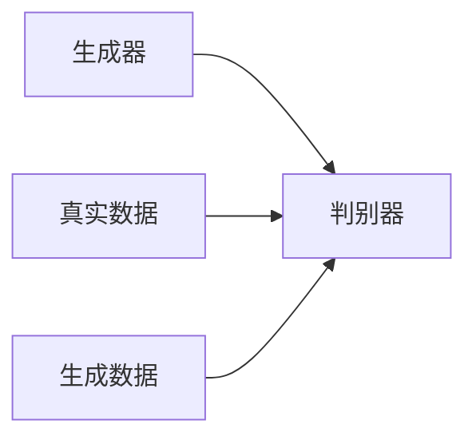
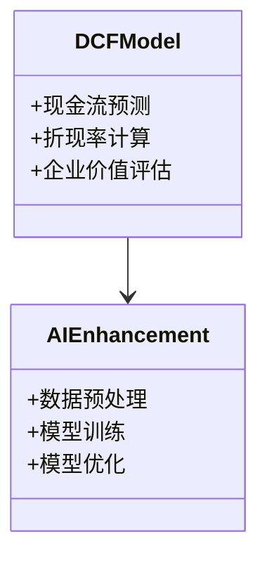

                 


# AI增强型现金流贴现模型

> 关键词：现金流贴现模型，人工智能，深度学习，生成模型，强化学习，企业估值

> 摘要：本文深入探讨了AI增强型现金流贴现模型（DCF）的核心原理、算法实现及其在金融分析中的应用。我们从传统DCF模型的局限性出发，分析了如何通过AI技术（如生成模型和强化学习）提升模型的预测精度和自动化能力。文章内容涵盖：背景介绍、核心概念对比、算法原理、系统架构设计、项目实战以及高级应用与最佳实践。通过本文，读者将能够全面理解AI如何增强现金流贴现模型，并在实际项目中有效应用这些技术。

---

## 第一部分: AI增强型现金流贴现模型的背景与基础

### 第1章: 现金流贴现模型概述

#### 1.1 现金流贴现模型的基本概念

##### 1.1.1 现金流贴现模型的定义
现金流贴现模型（Discounted Cash Flow Model, DCF模型）是一种用于估计公司或资产内在价值的方法，通过将未来现金流折现到现值。

##### 1.1.2 现金流贴现模型的组成部分
- **未来现金流预测**：预测公司未来各期的现金流。
- **折现率**：用于将未来现金流折现到现值的利率。
- **现值计算**：将未来现金流按折现率折算到当前的价值。

##### 1.1.3 现金流贴现模型的应用领域
- **企业估值**：评估企业的内在价值。
- **项目评估**：评估投资项目的价值。
- **投资决策**：帮助投资者做出投资决策。

#### 1.2 AI在金融分析中的应用

##### 1.2.1 AI在金融领域的核心作用
- **数据处理与分析**：利用AI技术处理大量非结构化数据（如新闻、社交媒体数据）。
- **预测模型构建**：使用深度学习模型进行金融时间序列预测。
- **风险评估**：通过AI技术进行信用风险评估和市场风险预测。

##### 1.2.2 AI增强型DCF模型的优势
- **提高预测准确性**：AI能够从海量数据中提取更多特征，提升预测精度。
- **自动化数据处理**：AI技术可以自动处理和清洗数据，减少人工干预。
- **实时更新与优化**：AI模型可以实时更新，快速响应市场变化。

### 第2章: AI增强型DCF模型的核心概念与联系

#### 2.1 AI增强型DCF模型的核心原理

##### 2.1.1 生成模型在现金流预测中的应用
- **生成对抗网络（GAN）**：通过生成对抗网络生成未来现金流数据。
- **变分自编码器（VAE）**：通过变分自编码器进行数据重构和生成。

##### 2.1.2 强化学习在DCF模型优化中的应用
- **状态空间定义**：定义状态空间，例如市场环境、公司基本面等。
- **动作空间设计**：定义动作空间，例如调整折现率、预测现金流等。
- **奖励函数设计**：定义奖励函数，例如预测准确度、模型稳定性等。

#### 2.2 核心概念对比与ER实体关系图

##### 2.2.1 核心概念对比
| 概念 | DCF模型 | AI增强型DCF模型 |
|------|---------|----------------|
| 数据来源 | 历史财务数据 | 历史数据 + 外部数据（如市场情绪、新闻） |
| 预测方法 | 线性回归 | 深度学习模型 |
| 折现率调整 | 固定或简单调整 | 动态调整，基于市场反馈 |

##### 2.2.2 ER实体关系图


---

## 第二部分: AI增强型现金流贴现模型的算法原理

### 第3章: 基于生成模型的现金流预测

#### 3.1 生成模型简介

##### 3.1.1 生成对抗网络（GAN）
- **生成器**：生成符合真实分布的现金流数据。
- **判别器**：区分生成数据和真实数据。

##### 3.1.2 变分自编码器（VAE）
- **编码器**：将输入数据编码为潜在空间的向量。
- **解码器**：将潜在空间的向量解码为生成数据。

#### 3.2 基于GAN的现金流预测实现

##### 3.2.1 GAN模型结构


##### 3.2.2 GAN的训练过程
1. 初始化生成器和判别器参数。
2. 训练判别器：区分真实数据和生成数据。
3. 训练生成器：生成能够欺骗判别器的数据。
4. 重复训练，直到生成器和判别器达到平衡。

#### 3.3 基于VAE的现金流预测实现

##### 3.3.1 VAE模型结构


##### 3.3.2 VAE的训练过程
1. 对输入数据进行编码，得到潜在空间的均值和方差。
2. 从潜在空间中采样，生成新的数据。
3. 对生成数据进行解码，得到最终的现金流预测。

### 第4章: 基于强化学习的DCF模型优化

#### 4.1 强化学习简介

##### 4.1.1 强化学习的基本概念
- **状态（State）**：环境中的当前情况。
- **动作（Action）**：智能体采取的行动。
- **奖励（Reward）**：智能体采取行动后获得的反馈。
- **策略（Policy）**：智能体采取行动的概率分布。

#### 4.2 基于强化学习的DCF模型优化

##### 4.2.1 强化学习在DCF模型中的应用
- **状态空间**：市场环境、公司基本面等。
- **动作空间**：调整折现率、预测现金流等。
- **奖励函数**：预测准确度、模型稳定性等。

##### 4.2.2 基于强化学习的DCF模型优化流程
1. 定义状态空间和动作空间。
2. 设计奖励函数。
3. 初始化策略网络和价值网络。
4. 通过与环境交互，更新策略网络和价值网络。
5. 重复训练，直到策略网络收敛。

---

## 第三部分: AI增强型现金流贴现模型的系统分析与架构设计

### 第5章: 系统分析与架构设计

#### 5.1 系统功能设计

##### 5.1.1 领域模型


#### 5.2 系统架构设计

##### 5.2.1 系统架构图


#### 5.3 系统接口设计

##### 5.3.1 API接口
- **输入**：公司财务数据、市场数据。
- **输出**：企业价值评估结果。

##### 5.3.2 数据库设计
- **表结构**：公司信息表、现金流预测表、评估结果表。

#### 5.4 系统交互设计

##### 5.4.1 交互流程
1. 用户通过API接口提交数据。
2. 系统调用DCF模型进行预测。
3. AI增强模块优化预测结果。
4. 系统返回优化后的评估结果。

---

## 第四部分: AI增强型现金流贴现模型的项目实战

### 第6章: 项目实战

#### 6.1 环境配置

##### 6.1.1 安装Python环境
```bash
python --version
pip install numpy
pip install tensorflow
pip install pandas
pip install matplotlib
```

#### 6.2 核心实现

##### 6.2.1 GAN模型实现
```python
import tensorflow as tf
from tensorflow.keras.layers import Dense, Input
from tensorflow.keras.models import Model

# 定义生成器
generator_input = Input(shape=(100,))
generator_dense = Dense(64, activation='relu')(generator_input)
generator_output = Dense(1, activation='sigmoid')(generator_dense)
generator = Model(inputs=generator_input, outputs=generator_output)

# 定义判别器
discriminator_input = Input(shape=(1,))
discriminator_dense = Dense(64, activation='relu')(discriminator_input)
discriminator_output = Dense(1, activation='sigmoid')(discriminator_dense)
discriminator = Model(inputs=discriminator_input, outputs=discriminator_output)

# 定义GAN模型
gan_output = generator(generator_input)
discriminator gan_output.trainable = False
gan = Model(inputs=generator_input, outputs=discriminator(gan_output))
```

##### 6.2.2 强化学习模型实现
```python
import gym
from gym import spaces
import numpy as np

class DCFEnv(gym.Env):
    def __init__(self):
        super(DCFEnv, self).__init__()
        self.observation_space = spaces.Box(low=-1, high=1, shape=(1,))
        self.action_space = spaces.Box(low=0, high=1, shape=(1,))

    def step(self, action):
        # 定义奖励函数
        reward = np.random.normal()
        observation = np.array([action])
        return observation, reward, False, {}

    def reset(self):
        return np.array([0])
```

#### 6.3 实际案例分析

##### 6.3.1 数据获取与预处理
```python
import pandas as pd

df = pd.read_csv('financial_data.csv')
df.head()
```

##### 6.3.2 模型训练与评估
```python
generator.compile(optimizer='adam', loss='binary_crossentropy')
discriminator.compile(optimizer='adam', loss='binary_crossentropy')
gan.compile(optimizer='adam', loss='binary_crossentropy')

gan.fit(generator_input, discriminator_input, epochs=100, batch_size=32)
```

---

## 第五部分: AI增强型现金流贴现模型的高级应用与最佳实践

### 第7章: 高级应用与最佳实践

#### 7.1 模型优化技巧

##### 7.1.1 超参数调优
- **学习率**：尝试不同的学习率，找到最优值。
- **批量大小**：调整批量大小，优化训练效率。
- **模型深度**：增加或减少模型层数，避免过拟合或欠拟合。

##### 7.1.2 模型部署与维护
- **模型部署**：将模型部署到生产环境中，提供API接口。
- **模型维护**：定期更新模型，适应市场变化。

#### 7.2 小结与注意事项

##### 7.2.1 小结
- AI增强型DCF模型通过结合AI技术和传统金融模型，显著提升了预测精度和自动化能力。
- 在实际应用中，需要注意数据质量和模型稳定性。

##### 7.2.2 注意事项
- 数据隐私与安全：确保数据处理符合相关法律法规。
- 模型解释性：提升模型的可解释性，便于用户理解和使用。

#### 7.3 拓展阅读

##### 7.3.1 推荐书籍
- 《深度学习》—— Ian Goodfellow
- 《金融时间序列分析》—— Christopher J. Corrado

##### 7.3.2 推荐论文
- "Generative Adversarial Nets"（Goodfellow et al.）
- "Deep Reinforcement Learning for Quantitative Finance"（Lipton et al.）

---

## 作者信息

作者：AI天才研究院/AI Genius Institute & 禅与计算机程序设计艺术/Zen And The Art of Computer Programming

