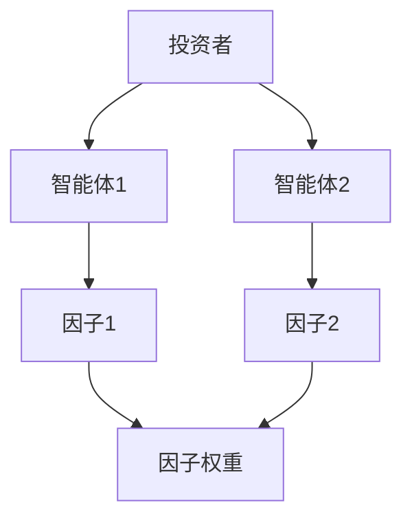

                 


# AI多智能体优化价值投资的动态因子暴露控制

**关键词：** AI, 多智能体, 优化, 价值投资, 动态因子, 暴露控制

**摘要：**  
本文探讨了如何利用AI多智能体技术优化价值投资中的动态因子暴露控制问题。通过分析多智能体优化的核心原理、动态因子建模与分析、AI多智能体优化算法、系统架构设计、项目实战以及最佳实践，本文旨在为投资者提供一种高效、动态、智能化的投资优化方法。

---

# 第1章: 背景介绍

## 1.1 问题背景

### 1.1.1 传统价值投资的局限性  
传统价值投资依赖于人工分析和经验判断，难以应对市场中复杂多变的动态因子。随着市场环境的快速变化，传统的静态因子分析方法逐渐暴露出效率低下、响应速度慢、覆盖面窄等局限性。

### 1.1.2 AI技术在金融领域的应用趋势  
AI技术的快速发展为金融领域的投资决策提供了新的工具和方法。通过机器学习、深度学习等技术，投资者可以更精准地捕捉市场信号，优化投资组合。

### 1.1.3 多智能体优化的必要性  
在复杂的金融市场中，单一的优化模型难以应对多维度的动态因子变化。多智能体系统通过协作与竞争，能够更好地适应市场环境，优化投资策略。

## 1.2 问题描述

### 1.2.1 价值投资中的因子暴露问题  
因子暴露是投资组合中各个因子对整体收益的贡献程度。动态因子暴露控制的目标是根据市场变化，动态调整因子的权重，以实现收益最大化和风险最小化。

### 1.2.2 动态因子优化的挑战  
市场环境的不确定性、因子之间的相互作用以及优化过程的实时性要求，使得动态因子优化成为一个复杂的系统性问题。

### 1.2.3 多智能体协作的解决方案  
通过引入多智能体系统，可以将复杂的优化问题分解为多个子问题，由不同的智能体协作完成，从而提高优化效率和效果。

## 1.3 问题解决

### 1.3.1 多智能体优化的核心思想  
多智能体系统通过协作与竞争，利用分布式计算和局部优化，实现全局最优解。每个智能体负责特定的子问题，通过信息共享和策略调整，最终达到整体优化的目标。

### 1.3.2 动态因子暴露控制的目标  
动态因子暴露控制的目标是在市场变化中，实时调整因子权重，使得投资组合的收益和风险达到最佳平衡。

### 1.3.3 技术实现路径  
通过AI算法（如强化学习、遗传算法）构建多智能体系统，实时监控市场因子变化，动态调整投资组合。

## 1.4 边界与外延

### 1.4.1 问题的边界条件  
- 市场环境的限制：包括市场波动、政策变化、经济周期等因素。
- 投资目标的限制：如风险承受能力、收益目标等。
- 数据的限制：数据来源、数据质量、数据频率等。

### 1.4.2 相关领域的外延  
- 金融科技（FinTech）：AI在金融领域的广泛应用。
- 多智能体系统：分布式计算、协作优化等技术。
- 投资组合优化：现代投资组合理论（MPT）的应用与发展。

### 1.4.3 技术的适用范围  
- 适用于复杂、动态的金融市场环境。
- 适用于多因子投资策略的优化。
- 适用于需要实时调整的投资组合管理。

## 1.5 概念结构与核心要素组成

### 1.5.1 核心概念的层次结构  
$$\text{多智能体优化} \rightarrow \text{动态因子暴露控制} \rightarrow \text{价值投资优化}$$

### 1.5.2 核心要素的定义与关系  
- **多智能体系统**：由多个智能体组成的分布式系统，每个智能体负责特定的任务。
- **动态因子**：影响投资组合收益和风险的动态因素，如市场情绪、宏观经济指标等。
- **暴露控制**：通过调整因子权重，控制其对投资组合的影响程度。

### 1.5.3 概念结构图  


---

# 第2章: 核心概念与联系

## 2.1 多智能体优化的核心原理

### 2.1.1 多智能体系统的定义  
多智能体系统是由多个智能体组成的分布式系统，每个智能体具有一定的自主性、反应性和协作能力。

### 2.1.2 多智能体优化的基本原理  
通过智能体之间的协作与竞争，利用分布式计算和局部优化，实现全局最优解。

### 2.1.3 多智能体协作机制  
- **协作**：智能体之间共享信息，共同完成任务。
- **竞争**：通过竞争机制，提高系统的整体性能。

## 2.2 动态因子暴露控制的原理

### 2.2.1 动态因子的定义  
动态因子是指在市场中不断变化的、影响投资组合收益和风险的因素。

### 2.2.2 暴露控制的目标  
通过调整因子权重，使得投资组合的风险和收益达到最佳平衡。

### 2.2.3 动态调整的实现方法  
- **实时监控**：实时跟踪市场因子变化。
- **动态调整**：根据变化情况，实时调整因子权重。

## 2.3 核心概念的对比分析

### 2.3.1 多智能体优化与传统优化方法的对比  
| 对比维度 | 多智能体优化 | 传统优化方法 |
|----------|--------------|---------------|
| 计算方式 | 分布式计算   | 集中式计算   |
| 系统复杂度 | 高           | 低             |
| 适应性   | 强           | 弱             |

### 2.3.2 动态因子暴露与静态因子暴露的对比  
| 对比维度 | 动态因子暴露 | 静态因子暴露 |
|----------|--------------|---------------|
| 时间维度 | 动态变化     | 静态固定     |
| 适应性   | 高           | 低             |
| 效果     | 优           | 一般           |

### 2.3.3 价值投资与AI优化的对比  
| 对比维度 | 价值投资 | AI优化 |
|----------|----------|--------|
| 依赖性   | 依赖经验 | 依赖数据 |
| 效率     | 较低     | 高       |
| 适应性   | 较弱     | 强       |

## 2.4 ER实体关系图架构



---

# 第3章: 动态因子建模与分析

## 3.1 动态因子的定义与分类

### 3.1.1 动态因子的定义  
动态因子是指在市场中不断变化的、影响投资组合收益和风险的因素。

### 3.1.2 动态因子的分类  
- **市场因子**：如市场整体走势、行业指数等。
- **宏观经济因子**：如GDP、利率、通货膨胀率等。
- **情绪因子**：如市场情绪、投资者信心等。

## 3.2 动态因子建模

### 3.2.1 动态因子建模的基本方法  
- **时间序列分析**：如ARIMA模型。
- **因子分析模型**：如主成分分析（PCA）。
- **机器学习模型**：如LSTM网络。

### 3.2.2 动态因子建模的数学模型  
$$ R_t = \beta_1 F_1,t + \beta_2 F_2,t + \epsilon_t $$  
其中，$R_t$为投资组合收益，$F_{i,t}$为因子，$\beta_i$为因子权重，$\epsilon_t$为误差项。

## 3.3 动态因子间的关系分析

### 3.3.1 因子间的相关性分析  
通过协方差矩阵分析因子之间的相关性，构建因子网络。

### 3.3.2 因子间的相互作用  
因子之间的相互作用会影响投资组合的整体收益和风险。

## 3.4 多智能体优化的实现

### 3.4.1 多智能体系统的构建  
- **智能体设计**：每个智能体负责特定的因子优化。
- **协作机制设计**：通过信息共享和策略调整，实现整体优化。

### 3.4.2 多智能体优化的数学模型  
$$ \text{目标函数} = \sum_{i=1}^n \text{智能体}_i \text{的优化目标} $$  
$$ \text{约束条件} = \{ \text{市场约束}, \text{投资约束} \} $$

---

# 第4章: AI多智能体优化算法

## 4.1 算法原理

### 4.1.1 多智能体优化的基本原理  
通过智能体之间的协作与竞争，利用分布式计算和局部优化，实现全局最优解。

### 4.1.2 强化学习的实现  
通过强化学习算法，智能体能够从环境中获得反馈，不断优化自己的策略。

## 4.2 算法实现

### 4.2.1 强化学习算法代码示例  
```python
import numpy as np
import gym

env = gym.make('StockTrading-v0')
env.reset()

while not done:
    action = agent.act(state)
    next_state, reward, done, info = env.step(action)
    agent.remember(state, action, reward, next_state)
    agent.replay()
```

### 4.2.2 多智能体协作与竞争机制  
通过设置竞争机制，智能体之间可以互相学习，提高整体性能。

## 4.3 算法优化

### 4.3.1 算法优化的数学模型  
$$ \text{优化目标} = \max \sum_{i=1}^n \text{智能体}_i \text{的收益} $$  
$$ \text{约束条件} = \{ \text{市场约束}, \text{投资约束} \} $$

### 4.3.2 算法优化的实现  
通过遗传算法、模拟退火等方法，进一步优化多智能体系统的性能。

---

# 第5章: 系统架构设计

## 5.1 系统功能设计

### 5.1.1 系统功能模块  
- **数据采集模块**：实时采集市场数据。
- **因子分析模块**：分析动态因子。
- **智能体协作模块**：实现多智能体协作。
- **投资组合优化模块**：优化投资组合。

### 5.1.2 系统功能流程  
从数据采集到因子分析，再到智能体协作和投资组合优化，形成一个完整的流程。

## 5.2 系统架构设计

### 5.2.1 系统架构图  


### 5.2.2 系统组件设计  
- **数据采集模块**：负责实时采集市场数据。
- **因子分析模块**：对因子进行分析和建模。
- **智能体协作模块**：实现智能体之间的协作与竞争。
- **投资组合优化模块**：优化投资组合，生成最优策略。

## 5.3 系统接口设计

### 5.3.1 接口定义  
- **数据接口**：与数据源对接，获取市场数据。
- **智能体接口**：智能体之间的通信接口。
- **用户接口**：用户与系统交互的界面。

### 5.3.2 接口实现  
通过API接口实现系统组件之间的通信。

## 5.4 系统交互流程

### 5.4.1 系统交互流程图  


---

# 第6章: 项目实战

## 6.1 环境安装与配置

### 6.1.1 环境搭建  
安装Python、机器学习库（如TensorFlow、PyTorch）等。

### 6.1.2 数据准备  
收集和整理市场数据，准备因子分析所需的数据集。

## 6.2 核心代码实现

### 6.2.1 多智能体协作代码  
```python
class Agent:
    def __init__(self, id):
        self.id = id
        self.state = None
        self.reward = 0

    def act(self, state):
        # 根据状态选择动作
        pass

    def remember(self, state, action, reward, next_state):
        # 记忆单元格
        pass

    def replay(self):
        # 回放记忆
        pass
```

### 6.2.2 动态因子分析代码  
```python
import pandas as pd
import numpy as np

def dynamic_factor_analysis(factor_data):
    # 动态因子分析
    pass
```

## 6.3 案例分析与结果解读

### 6.3.1 案例分析  
通过具体案例，展示多智能体优化在动态因子暴露控制中的应用。

### 6.3.2 结果解读  
分析优化结果，验证算法的有效性。

## 6.4 项目小结

### 6.4.1 项目总结  
总结项目实施过程中的经验和教训。

### 6.4.2 优化建议  
针对系统中存在的不足，提出优化建议。

---

# 第7章: 最佳实践与总结

## 7.1 最佳实践

### 7.1.1 系统设计建议  
在系统设计中，注重模块化设计和可扩展性。

### 7.1.2 算法优化建议  
根据实际需求，选择合适的算法和优化方法。

## 7.2 小结

### 7.2.1 全文总结  
总结全文内容，重申核心观点。

### 7.2.2 展望未来  
展望未来的研究方向和应用前景。

## 7.3 注意事项

### 7.3.1 技术风险  
注意技术实现中的风险，如算法的收敛性问题。

### 7.3.2 市场风险  
注意市场环境变化对系统的影响。

## 7.4 拓展阅读

### 7.4.1 相关书籍  
推荐相关书籍和文献。

### 7.4.2 在线资源  
推荐在线课程和论文。

---

# 作者：AI天才研究院/AI Genius Institute & 禅与计算机程序设计艺术 /Zen And The Art of Computer Programming

