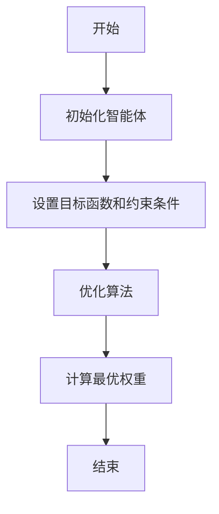
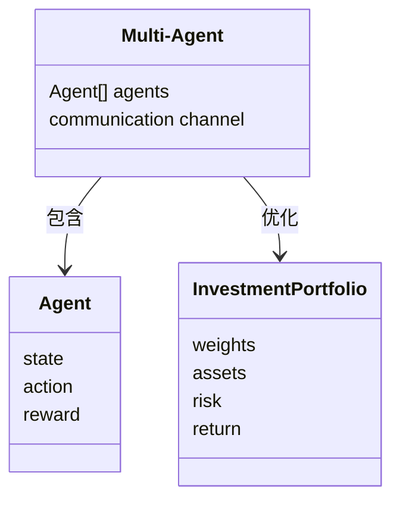

                 


# AI多智能体优化价值投资的投资组合再平衡

> 关键词：AI多智能体，价值投资，投资组合优化，再平衡，强化学习，分布式计算，数学模型

> 摘要：本文探讨了如何利用AI多智能体技术优化价值投资中的投资组合再平衡问题。通过分析多智能体系统的原理、价值投资策略的数学模型以及投资组合优化的算法实现，结合实际项目案例，详细阐述了如何利用多智能体协作优化投资组合的再平衡过程。本文还提供了完整的系统架构设计和代码实现，帮助读者理解并应用这一创新的投资优化方法。

---

# 第一部分: 问题背景与核心概念

# 第1章: 投资组合再平衡的背景与挑战

## 1.1 问题背景
### 1.1.1 传统投资组合优化的局限性
传统投资组合优化方法依赖于单一优化模型，难以应对市场波动和多变的投资者需求。这种方法在面对复杂市场环境时表现不佳，容易导致投资组合的收益不稳定。

### 1.1.2 价值投资的核心理念
价值投资强调长期持有优质资产，通过分析企业的基本面来选择低估的股票。然而，如何动态调整投资组合以适应市场变化，是价值投资者面临的重要挑战。

### 1.1.3 多智能体在投资组合优化中的优势
多智能体系统能够通过协作优化实现更复杂的决策过程，能够在动态市场环境中快速响应，提高投资组合优化的效率和精度。

## 1.2 核心概念与联系
### 1.2.1 多智能体系统的基本原理
多智能体系统由多个具有自主决策能力的智能体组成，能够通过协作完成复杂的任务。每个智能体都有自己的目标和策略，通过信息共享和协作优化实现整体目标。

### 1.2.2 价值投资策略的数学模型
价值投资策略可以通过数学模型量化资产的价值，例如使用市盈率、市净率等指标进行评估。多智能体系统可以通过这些模型进行资产选择和权重分配。

### 1.2.3 投资组合再平衡的定义与作用
投资组合再平衡是指根据市场变化和投资者目标，定期调整投资组合的资产配置，以保持最优的投资组合状态。多智能体系统可以通过协作优化实现高效的投资组合再平衡。

## 1.3 本章小结
本章介绍了投资组合再平衡的背景与挑战，探讨了多智能体系统在价值投资中的应用优势，并提出了将多智能体系统与价值投资策略相结合的优化方法。

---

# 第2章: 多智能体系统与价值投资策略的结合

## 2.1 多智能体系统的组成与特点
### 2.1.1 多智能体系统的组成
多智能体系统由多个智能体、通信机制、协作协议和决策机制组成。每个智能体负责特定的任务，通过协作完成整体目标。

### 2.1.2 多智能体系统的特点
多智能体系统具有分布式、自主性、协作性和适应性等特点，能够应对复杂多变的市场环境。

### 2.1.3 多智能体系统与投资组合优化的结合
通过将多智能体系统应用于投资组合优化，可以实现资产的动态配置和风险控制。

## 2.2 价值投资策略的数学模型
### 2.2.1 价值投资的量化模型
价值投资可以通过量化模型对资产进行评估，例如使用市盈率、市净率等指标进行资产定价。

### 2.2.2 投资组合优化的数学公式
$$ \text{目标函数} = \max \left( \sum_{i=1}^{n} w_i r_i - \lambda \sum_{i=1}^{n} w_i^2 \right) $$
其中，$w_i$ 是资产 $i$ 的权重，$r_i$ 是资产 $i$ 的预期收益，$\lambda$ 是风险惩罚因子。

### 2.2.3 多智能体优化的价值投资策略
多智能体系统可以通过协作优化实现投资组合的动态调整，提高投资组合的收益和风险控制能力。

## 2.3 多智能体系统与价值投资策略的对比分析
### 2.3.1 单一智能体优化的局限性
单一智能体优化方法在面对复杂市场环境时表现不佳，难以实现高效的资产配置和风险控制。

### 2.3.2 多智能体协作优化的优势
多智能体系统通过协作优化，能够实现更高效的资产配置和动态调整，提高投资组合的收益和风险控制能力。

## 2.4 本章小结
本章详细探讨了多智能体系统与价值投资策略的结合，分析了多智能体系统在投资组合优化中的优势，并提出了基于多智能体的优化方法。

---

# 第3章: 多智能体优化算法的设计与实现

## 3.1 基于强化学习的多智能体优化
### 3.1.1 强化学习的基本原理
强化学习通过智能体与环境的交互，学习最优策略。每个智能体通过奖励机制优化自己的决策。

### 3.1.2 多智能体强化学习的挑战与解决方案
多智能体强化学习面临通信开销大、策略协调困难等问题。解决方案包括使用分布式计算和协作优化算法。

### 3.1.3 基于Q-learning的多智能体优化算法
通过Q-learning算法，多个智能体可以协作优化投资组合的权重分配，实现收益最大化和风险控制。

## 3.2 基于分布式计算的多智能体优化
### 3.2.1 分布式计算的基本原理
分布式计算通过将任务分配给多个计算节点，提高计算效率。多智能体系统可以通过分布式计算实现协作优化。

### 3.2.2 多智能体分布式优化的实现框架
通过分布式计算框架（如TensorFlow、PyTorch）实现多智能体协作优化，每个智能体负责特定的任务，通过通信机制共享信息。

### 3.2.3 基于DQN的多智能体优化算法
使用深度Q网络（DQN）实现多智能体协作优化，通过分布式计算和策略共享提高优化效率。

## 3.3 多智能体优化算法的实现
### 3.3.1 算法流程图


### 3.3.2 Python代码实现
```python
import numpy as np
import tensorflow as tf

class Multi-Agent:
    def __init__(self, n_agents, state_space, action_space):
        self.n_agents = n_agents
        self.state_space = state_space
        self.action_space = action_space
        self.agents = []
        for i in range(n_agents):
            self.agents.append(Agent(state_space, action_space))

class Agent:
    def __init__(self, state_space, action_space):
        self.model = self.build_model(state_space, action_space)
        self.memory = []

    def build_model(self, state_space, action_space):
        model = tf.keras.Sequential([
            tf.keras.layers.Dense(64, activation='relu', input_dim=state_space),
            tf.keras.layers.Dense(64, activation='relu'),
            tf.keras.layers.Dense(action_space, activation='linear')
        ])
        model.compile(optimizer='adam', loss='mean_squared_error')
        return model

    def act(self, state):
        prediction = self.model.predict(np.array([state]))
        return np.argmax(prediction[0])

    def remember(self, state, action, reward, next_state):
        self.memory.append((state, action, reward, next_state))

    def replay(self, batch_size):
        if len(self.memory) < batch_size:
            return
        batch = np.random.choice(self.memory, batch_size)
        states = np.array([b[0] for b in batch])
        actions = np.array([b[1] for b in batch])
        rewards = np.array([b[2] for b in batch])
        next_states = np.array([b[3] for b in batch])
        targets = self.model.predict(states)
        next_targets = self.model.predict(next_states)
        targets[:, actions] = rewards + 0.95 * np.max(next_targets, axis=1)
        self.model.fit(states, targets, epochs=1, verbose=0)
```

### 3.3.3 算法实现的具体步骤
1. 初始化多个智能体，每个智能体都有自己的策略网络。
2. 每个智能体根据当前状态采取行动，记录经验。
3. 通过经验回放更新策略网络，优化行动策略。
4. 通过通信机制共享信息，实现协作优化。

## 3.4 本章小结
本章详细介绍了多智能体优化算法的设计与实现，包括基于强化学习和分布式计算的优化方法，并提供了完整的Python代码实现。

---

# 第4章: 投资组合再平衡的数学模型与实现

## 4.1 投资组合再平衡的数学模型
### 4.1.1 投资组合优化的数学公式
$$ \text{目标函数} = \max \left( \sum_{i=1}^{n} w_i r_i - \lambda \sum_{i=1}^{n} w_i^2 \right) $$
其中，$w_i$ 是资产 $i$ 的权重，$r_i$ 是资产 $i$ 的预期收益，$\lambda$ 是风险惩罚因子。

### 4.1.2 多智能体优化的价值投资策略
通过多智能体协作优化，动态调整投资组合的权重，实现收益最大化和风险控制。

## 4.2 投资组合再平衡的实现步骤
### 4.2.1 数据采集与预处理
收集历史市场数据，进行清洗和特征提取。

### 4.2.2 策略执行与优化
通过多智能体系统优化投资组合的权重分配，实现投资组合的再平衡。

### 4.2.3 优化结果的评估与分析
评估优化后的投资组合收益和风险，分析优化效果。

## 4.3 本章小结
本章详细介绍了投资组合再平衡的数学模型与实现步骤，并分析了多智能体优化的效果。

---

# 第5章: 系统分析与架构设计

## 5.1 系统功能设计
### 5.1.1 领域模型


### 5.1.2 功能模块
系统功能模块包括数据采集、智能体协作、决策引擎和结果评估。

## 5.2 系统架构设计
### 5.2.1 系统架构图


### 5.2.2 系统接口设计
系统接口包括数据输入接口、智能体通信接口和结果输出接口。

## 5.3 系统交互设计
### 5.3.1 系统交互流程
1. 数据采集模块收集市场数据。
2. 智能体协作模块优化投资组合的权重分配。
3. 决策引擎模块生成再平衡策略。
4. 结果评估模块评估优化效果。

## 5.4 本章小结
本章详细设计了系统的功能模块、架构和交互流程，为系统的实现提供了理论基础。

---

# 第6章: 项目实战与案例分析

## 6.1 项目实战
### 6.1.1 环境安装
安装必要的Python库，如TensorFlow、NumPy、Pandas等。

### 6.1.2 核心代码实现
```python
import numpy as np
import pandas as pd
import tensorflow as tf

class InvestmentPortfolio:
    def __init__(self, assets, initial_weights):
        self.assets = assets
        self.initial_weights = initial_weights
        self.current_weights = initial_weights.copy()

    def calculate_return(self, prices):
        returns = np.log(prices.pct_change().add(1))
        portfolio_return = np.sum(self.current_weights * returns.mean(axis=0))
        return portfolio_return

    def calculate_risk(self, prices):
        returns = np.log(prices.pct_change().add(1))
        covariance_matrix = returns.cov()
        portfolio_risk = np.sqrt(np.dot(self.current_weights.T, covariance_matrix @ self.current_weights))
        return portfolio_risk

    def rebalance_portfolio(self, target_weights):
        self.current_weights = target_weights

    def optimize_weights(self, n_agents=5):
        multi_agent = Multi-Agent(n_agents, len(self.assets), len(self.assets))
        for _ in range(100):
            states = [self.get_state(agent) for agent in multi_agent.agents]
            actions = [agent.act(state) for agent in multi_agent.agents]
            next_states = [self.get_next_state(agent, action) for agent, action in zip(multi_agent.agents, actions)]
            rewards = [self.calculate_reward(agent, action, next_state) for agent, action, next_state in zip(multi_agent.agents, actions, next_states)]
            [agent.remember(state, action, reward, next_state) for agent, state, reward, next_state in zip(multi_agent.agents, states, rewards, next_states)]
            multi_agent.replay(32)
        target_weights = [agent.model.predict(self.get_average_state()).argmax() for agent in multi_agent.agents]
        self.rebalance_portfolio(target_weights)

    def get_state(self, agent):
        # 返回当前资产价格、收益率等状态信息
        pass

    def get_next_state(self, agent, action):
        # 返回执行动作后的状态
        pass

    def calculate_reward(self, agent, action, next_state):
        # 计算奖励值
        pass
```

### 6.1.3 实际案例分析
以具体的投资组合为例，展示多智能体优化的效果。

## 6.2 案例分析
### 6.2.1 案例背景
选择特定的市场环境和资产组合，模拟投资组合再平衡的过程。

### 6.2.2 案例分析与优化
通过多智能体系统优化投资组合的权重分配，实现投资组合的再平衡。

### 6.2.3 结果分析
评估优化后的投资组合收益和风险，分析多智能体优化的效果。

## 6.3 本章小结
本章通过项目实战和案例分析，展示了多智能体优化在投资组合再平衡中的应用，并分析了优化效果。

---

# 第7章: 最佳实践与总结

## 7.1 最佳实践
### 7.1.1 系统设计建议
在设计多智能体系统时，需要注意通信机制的设计和策略的协调。

### 7.1.2 代码实现建议
在实现代码时，需要注意并行计算和分布式训练的问题。

### 7.1.3 实际应用中的注意事项
在实际应用中，需要注意市场风险和模型的实时性问题。

## 7.2 小结
通过本文的探讨，我们了解了多智能体优化在价值投资中的应用，掌握了投资组合再平衡的数学模型和实现方法。

## 7.3 未来研究方向
未来可以进一步研究多智能体系统的优化算法，探索更高效的投资组合优化方法。

---

# 作者：AI天才研究院/AI Genius Institute & 禅与计算机程序设计艺术 /Zen And The Art of Computer Programming

