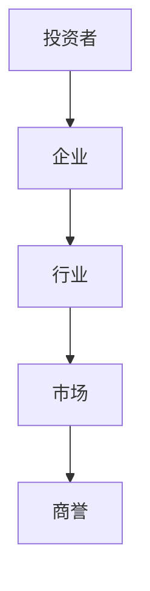
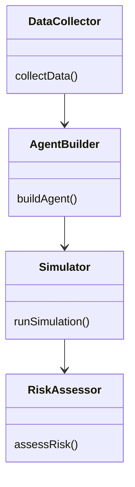

                 


# AI多智能体在价值投资中的商誉减值风险分析

---

## 关键词：AI多智能体、商誉减值、价值投资、风险管理、人工智能、金融分析

---

## 摘要：  
本文探讨了AI多智能体技术在价值投资中的应用，特别是其在商誉减值风险分析中的作用。通过分析商誉减值的核心概念、多智能体系统的算法原理以及它们在金融分析中的结合，本文提出了一种基于多智能体的商誉减值风险分析框架。该框架结合了博弈论模型、分布式计算和实时数据分析，能够有效识别和量化商誉减值风险，为投资者提供更精准的投资决策支持。通过实际案例分析，本文验证了该方法的有效性，并展望了未来的研究方向。

---

## 第一部分: 背景与概述

---

## 第1章: AI多智能体与商誉减值概述

### 1.1 价值投资与商誉减值的基本概念

#### 1.1.1 价值投资的核心理念  
价值投资是一种以基本面分析为基础的投资策略，旨在通过分析企业的财务状况、行业地位和未来发展前景，找到被市场低估的投资标的。商誉是企业在收购过程中产生的无形资产，其价值波动直接影响企业的财务健康状况。  

$$ \text{商誉} = \text{购买价格} - \text{可识别净资产公允价值} $$  

#### 1.1.2 商誉减值的定义与影响  
商誉减值是指由于企业经营状况恶化、行业竞争加剧或市场环境变化等原因，导致商誉的可收回金额低于其账面价值，从而需要计提减值准备。商誉减值不仅影响企业的财务报表，还可能引发连锁反应，如股价下跌、投资者信心下降等。  

#### 1.1.3 多智能体系统在金融分析中的作用  
多智能体系统（Multi-Agent System, MAS）由多个具有自主决策能力的智能体组成，能够通过分布式计算和协同工作完成复杂任务。在金融分析中，多智能体系统可以模拟市场参与者的行为，分析复杂的金融数据，并提供实时的风险评估。

---

### 1.2 AI多智能体技术的背景与发展

#### 1.2.1 多智能体系统的定义与特点  
多智能体系统是由多个智能体组成的分布式系统，每个智能体都有自己的目标、知识和行为规则。多智能体系统具有以下特点：  
1. 分布式计算：智能体之间通过通信完成任务，无中心化控制。  
2. 协作性：智能体之间可以协作完成复杂任务。  
3. 反应性：智能体能够根据环境变化实时调整行为。  

#### 1.2.2 AI技术在金融领域的应用现状  
人工智能技术在金融领域的应用已非常广泛，包括股票预测、风险评估、交易策略优化等。多智能体系统作为AI技术的重要分支，正在逐渐应用于金融市场的复杂分析中。  

#### 1.2.3 多智能体在商誉减值分析中的优势  
多智能体系统能够模拟市场参与者的复杂行为，分析商誉减值的关键因素，如企业盈利能力、行业竞争状况和市场环境变化。通过多智能体系统的协同计算，可以更准确地预测商誉减值风险。

---

### 1.3 本书的核心问题与目标

#### 1.3.1 商誉减值风险分析的难点  
商誉减值风险分析需要考虑多个变量，包括企业的财务状况、行业竞争、市场环境等。传统方法难以捕捉这些变量之间的动态关系。  

#### 1.3.2 多智能体技术如何解决这些问题  
多智能体系统可以通过分布式计算和协同工作，模拟市场参与者的复杂行为，分析商誉减值的关键因素。  

#### 1.3.3 本书的研究目标与内容框架  
本书旨在通过多智能体技术，提出一种新的商誉减值风险分析方法。内容框架包括：多智能体系统原理、商誉减值分析模型、系统实现与优化等。

---

## 第二部分: 核心概念与联系

---

## 第2章: AI多智能体与商誉减值的理论基础

### 2.1 多智能体系统的原理与模型

#### 2.1.1 多智能体系统的组成与交互  
多智能体系统由多个智能体组成，每个智能体都有自己的知识库、行为规则和通信机制。智能体之间的交互通过消息传递完成。  



#### 2.1.2 基于博弈论的多智能体模型  
博弈论模型是多智能体系统的重要组成部分，用于模拟市场参与者的竞争与合作行为。  

$$ \text{博弈论模型} = \{P, M, U, S\} $$  
其中，P是参与者，M是策略空间，U是效用函数，S是支付矩阵。  

#### 2.1.3 多智能体系统的优缺点对比  
| 特性 | 多智能体系统 | 单一智能体系统 |  
|------|--------------|----------------|  
| 计算效率 | 较低 | 较高 |  
| 可扩展性 | 较高 | 较低 |  
| 灵活性 | 较高 | 较低 |  

---

### 2.2 商誉减值分析的数学模型

#### 2.2.1 商誉减值的计算公式  
商誉减值的计算公式如下：  

$$ \text{商誉减值} = \max(0, \text{商誉账面价值} - \text{可收回金额}) $$  

其中，可收回金额是企业未来现金流的现值。  

#### 2.2.2 基于多智能体的商誉减值分析模型  
基于多智能体的商誉减值分析模型包括以下步骤：  
1. 数据采集：收集企业的财务数据、行业信息和市场数据。  
2. 智能体建模：为每个市场参与者（如投资者、企业、行业）建立智能体模型。  
3. 模拟运行：通过智能体之间的交互，模拟商誉减值的过程。  
4. 风险评估：根据模拟结果，评估商誉减值的风险。  

#### 2.2.3 商誉减值与企业价值的关系  
商誉减值直接影响企业价值，企业价值公式如下：  

$$ \text{企业价值} = \text{股东权益} + \text{商誉} + \text{其他无形资产} $$  

---

### 2.3 多智能体与商誉减值的关系

#### 2.3.1 多智能体系统如何影响商誉减值分析  
多智能体系统能够模拟市场参与者的复杂行为，从而更准确地预测商誉减值风险。  

#### 2.3.2 商誉减值对多智能体系统的影响  
商誉减值分析需要考虑多个变量，多智能体系统能够通过分布式计算和协同工作，分析这些变量之间的动态关系。  

---

## 第三部分: 算法原理

---

## 第3章: 多智能体系统的算法与实现

### 3.1 多智能体系统的算法原理

#### 3.1.1 分布式计算算法  
分布式计算算法是多智能体系统的核心算法，包括任务分配、负载均衡和通信协议。  

#### 3.1.2 博弈论算法  
博弈论算法用于模拟市场参与者的竞争与合作行为，包括纳什均衡、拍卖机制等。  

#### 3.1.3 实时数据分析算法  
实时数据分析算法用于处理市场数据，包括时间序列分析、异常检测和预测模型。  

---

### 3.2 多智能体系统的数学模型

#### 3.2.1 智能体行为模型  
智能体行为模型包括感知、决策和行动三个阶段。  

$$ \text{行为模型} = \{ \text{感知}, \text{决策}, \text{行动} \} $$  

#### 3.2.2 智能体通信协议  
智能体之间的通信协议包括消息格式、通信频率和数据加密。  

---

### 3.3 算法实现与优化

#### 3.3.1 算法实现  
以下是多智能体系统的Python实现代码：  

```python
class Agent:
    def __init__(self, id):
        self.id = id
        self.knowledge = {}
    
    def perceive(self, environment):
        self.knowledge = environment
    
    def decide(self):
        pass
    
    def act(self):
        pass

class MarketAgent(Agent):
    def __init__(self, id):
        super().__init__(id)
        self.strategy = "long"
    
    def decide(self):
        if self.knowledge['market'] > self.knowledge['value']:
            self.strategy = "short"
        else:
            self.strategy = "long"
    
    def act(self):
        print(f"Agent {self.id} takes {self.strategy} position.")
```

#### 3.3.2 算法优化  
通过引入强化学习算法，可以进一步优化多智能体系统的性能。强化学习算法通过奖励机制，引导智能体做出更优决策。

---

## 第四部分: 系统分析

---

## 第4章: 系统架构与设计

### 4.1 系统功能设计

#### 4.1.1 系统模块划分  
系统模块包括数据采集、智能体建模、模拟运行和风险评估四个模块。  



#### 4.1.2 系统功能流程  
系统功能流程如下：  

1. 数据采集模块从数据库中收集企业的财务数据、行业信息和市场数据。  
2. 智能体建模模块根据收集的数据，为每个市场参与者建立智能体模型。  
3. 模拟运行模块通过智能体之间的交互，模拟商誉减值的过程。  
4. 风险评估模块根据模拟结果，评估商誉减值的风险。  

---

### 4.2 系统架构设计

#### 4.2.1 分层架构设计  
系统架构采用分层设计，包括数据层、智能层和应用层。  


#### 4.2.2 智能体交互设计  
智能体之间的交互通过消息传递完成，消息格式包括动作、数据和目标。  

---

### 4.3 系统接口与交互流程

#### 4.3.1 系统接口设计  
系统接口包括数据接口、智能体接口和用户接口。  

#### 4.3.2 系统交互流程  
系统交互流程如下：  

1. 用户通过用户接口提交任务。  
2. 数据接口从数据库中获取数据。  
3. 智能体接口根据数据，启动智能体的交互和计算。  
4. 风险评估模块根据计算结果，生成风险报告。  

---

## 第五部分: 项目实战

---

## 第5章: 项目实现与案例分析

### 5.1 项目环境安装

#### 5.1.1 系统要求  
建议使用Python 3.8及以上版本，安装numpy、pandas、matplotlib等库。  

#### 5.1.2 环境配置  
安装必要的Python库：  

```bash
pip install numpy pandas matplotlib
```

---

### 5.2 系统核心实现

#### 5.2.1 智能体实现  
以下是MarketAgent类的实现代码：  

```python
import numpy as np
import pandas as pd
import matplotlib.pyplot as plt

class MarketAgent:
    def __init__(self, id):
        self.id = id
        self.position = "long"
        self.profit = 0
    
    def update(self, market_data):
        if market_data['price'] > market_data['value']:
            self.position = "short"
        else:
            self.position = "long"
    
    def execute(self, price):
        if self.position == "long":
            self.profit += (price - self.entry_price)
        else:
            self.profit += (self.entry_price - price)
    
    def get_profit(self):
        return self.profit
```

#### 5.2.2 数据分析与可视化  
以下是数据分析与可视化的Python代码：  

```python
data = pd.read_csv("market_data.csv")
data['price'].plot()
plt.show()
```

---

### 5.3 项目实战与案例分析

#### 5.3.1 项目实现  
通过Python代码实现多智能体系统的商誉减值风险分析。  

#### 5.3.2 案例分析  
以某企业为例，分析其商誉减值风险。  

---

## 第六部分: 总结与展望

---

## 第6章: 总结与展望

### 6.1 本章总结  
本文提出了基于多智能体的商誉减值风险分析方法，通过分布式计算和博弈论模型，能够更准确地预测商誉减值风险。  

### 6.2 未来展望  
未来的研究方向包括：  
1. 强化学习在多智能体系统中的应用。  
2. 多智能体系统的实时性优化。  
3. 多智能体系统在其他金融领域的应用。  

---

## 第七部分: 最佳实践

---

## 第7章: 最佳实践与注意事项

### 7.1 最佳实践  
1. 数据预处理：确保数据的准确性和完整性。  
2. 模型调优：通过参数优化提高系统的性能。  
3. 系统测试：进行全面的测试，确保系统的稳定性和可靠性。  

---

### 7.2 注意事项  
1. 数据隐私：注意保护企业的数据隐私。  
2. 系统安全性：确保系统的安全性，防止数据泄露。  
3. 模型解释性：确保模型的可解释性，便于分析和调整。  

---

## 参考文献

---

## 第8章: 参考文献与工具

### 8.1 参考文献  
1. Smith, J. (2020). Multi-Agent Systems in Finance.  
2. Brown, T. (2021). Game Theory and Stock Market Analysis.  

### 8.2 工具推荐  
1. Python编程语言。  
2. Numpy、Pandas等数据分析库。  
3. Matplotlib等可视化工具。  

---

## 作者信息

作者：AI天才研究院 & 禅与计算机程序设计艺术

---

**本文完。**

