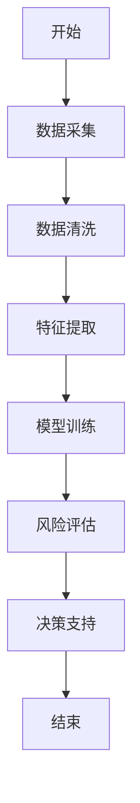
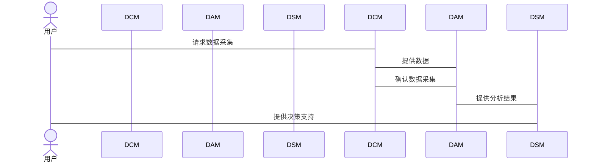

                 


# AI多智能体在价值投资中的并购分析应用

**关键词**：AI多智能体，价值投资，并购分析，强化学习，分布式计算

**摘要**：本文探讨了AI多智能体技术在价值投资中的应用，特别是在并购分析领域的潜力。通过分析多智能体系统的协作机制、算法原理以及在并购决策中的具体应用，本文详细阐述了如何利用AI技术提升并购分析的效率和准确性。文章从背景介绍、算法实现、系统架构到项目实战，全面解析了AI多智能体在价值投资中的应用，并提供了丰富的案例和代码示例。

---

# 第一部分: AI多智能体在价值投资中的应用背景

## 第1章: AI多智能体与价值投资概述

### 1.1 AI多智能体的基本概念

#### 1.1.1 多智能体系统定义
多智能体系统（Multi-Agent System, MAS）是由多个独立或协作的智能体组成的系统，这些智能体能够通过环境和彼此之间的交互来实现特定目标。与传统单智能体系统相比，MAS具有更强的协作性和适应性。

$$\text{多智能体系统} = \{\text{智能体}, \text{环境}, \text{协作机制}\}$$

#### 1.1.2 AI多智能体的核心特征
AI多智能体结合了人工智能技术，具有以下核心特征：
- **分布式智能**：每个智能体都具有一定的决策能力和信息处理能力。
- **协作性**：智能体之间可以通过通信和协作完成复杂任务。
- **自主性**：智能体能够自主决策，无需外部干预。
- **动态性**：系统能够适应环境的变化。

#### 1.1.3 多智能体与传统AI的区别
| 特性 | 多智能体系统 | 传统AI系统 |
|------|-------------|------------|
| 决策方式 | 分布式协作 | 中央控制 |
| 信息处理 | 去中心化 | 集中式 |
| 应用场景 | 多任务协作 | 单任务处理 |

### 1.2 价值投资的基本原理

#### 1.2.1 价值投资的定义
价值投资是一种投资策略，通过分析企业的基本面（如财务状况、盈利能力、行业地位等）来判断其内在价值，寻找被市场低估的投资机会。

#### 1.2.2 价值投资的核心理念
价值投资的核心理念是“买入低于内在价值的资产”。投资者通过分析企业的财务数据、市场地位、竞争优势等因素，寻找具有长期增长潜力的企业。

#### 1.2.3 并购分析在价值投资中的重要性
并购分析是价值投资中的重要环节，通过分析企业并购的动因、战略协同效应、财务表现等，评估并购对企业价值的影响。

### 1.3 并购分析的应用场景

#### 1.3.1 并购分析的基本流程
并购分析的基本流程包括：
1. 数据收集：收集目标企业的财务数据、行业信息等。
2. 数据分析：对数据进行清洗、特征提取和建模。
3. 风险评估：评估并购的潜在风险和收益。
4. 决策支持：为投资决策提供支持。

#### 1.3.2 并购分析的挑战与难点
- 数据复杂性：并购涉及大量非结构化数据，如文本、图像等。
- 风险评估：并购的不确定性较高，难以准确预测其结果。
- 时间敏感性：并购决策需要快速响应，时间压力大。

#### 1.3.3 AI技术在并购分析中的潜力
AI技术可以通过自然语言处理（NLP）、机器学习（ML）等技术，帮助投资者快速分析海量数据，识别潜在风险和机会，提高并购分析的效率和准确性。

---

## 第2章: 多智能体系统在金融领域的应用

### 2.1 多智能体系统在金融中的优势

#### 2.1.1 分布式计算的优势
多智能体系统通过分布式计算，能够同时处理大量数据，提高计算效率。

#### 2.1.2 多智能体的协作能力
多智能体系统可以通过协作完成复杂任务，如数据采集、分析和决策。

#### 2.1.3 多智能体的自适应性
多智能体系统能够根据环境变化动态调整策略，适应市场波动。

### 2.2 并购分析中的多智能体架构

#### 2.2.1 多智能体在并购决策中的角色
- **数据采集智能体**：负责采集目标企业的财务数据、行业信息等。
- **数据分析智能体**：负责对数据进行清洗、特征提取和建模。
- **决策支持智能体**：根据分析结果提供并购决策支持。

#### 2.2.2 多智能体的分工与协作
多智能体系统通过分工与协作，能够高效完成并购分析的各个步骤。

#### 2.2.3 多智能体的动态调整能力
多智能体系统能够根据市场变化动态调整分析策略，确保分析结果的准确性。

### 2.3 多智能体系统在并购分析中的具体应用

#### 2.3.1 数据采集与处理
多智能体系统可以通过分布式数据采集，快速获取目标企业的财务数据、行业信息等。

#### 2.3.2 数据分析与建模
多智能体系统可以通过协作完成数据清洗、特征提取和建模，提高分析效率。

#### 2.3.3 决策支持与优化
多智能体系统可以根据分析结果，提供并购决策支持和优化建议。

---

# 第二部分: 多智能体系统的算法原理

## 第3章: 多智能体协作算法

### 3.1 多智能体协作的基本原理

#### 3.1.1 协作机制
多智能体协作机制包括：
- **通信机制**：智能体之间通过通信交换信息。
- **协作策略**：智能体根据协作目标制定协作策略。
- **协调机制**：智能体通过协调机制实现协作。

#### 3.1.2 通信协议
通信协议是多智能体协作的基础，通过通信协议，智能体之间可以高效交换信息。

#### 3.1.3 协作目标的设定
协作目标是多智能体协作的核心，智能体需要根据协作目标制定协作策略。

### 3.2 基于强化学习的多智能体协作

#### 3.2.1 强化学习的基本概念
强化学习是一种机器学习技术，通过智能体与环境的交互，学习最优策略。

#### 3.2.2 多智能体强化学习的挑战
多智能体强化学习的挑战包括：
- **策略协调**：多个智能体之间的策略协调。
- **通信复杂性**：智能体之间的通信复杂性。
- **学习效率**：多智能体强化学习的学习效率较低。

#### 3.2.3 基于Q-learning的协作算法
Q-learning是一种经典的强化学习算法，可以通过Q表学习最优策略。

### 3.3 分布式多智能体协作算法

#### 3.3.1 分布式计算的基本原理
分布式计算通过将任务分配给多个计算节点，提高计算效率。

#### 3.3.2 分布式协作算法的设计
分布式协作算法需要考虑任务分配、通信协议和协作策略。

#### 3.3.3 分布式协作的实现细节
分布式协作的实现细节包括：
- **任务分配**：根据智能体的能力分配任务。
- **通信协议**：设计高效的通信协议。
- **协作策略**：制定协作策略，确保任务完成。

## 第4章: 并购分析中的多智能体算法实现

### 4.1 数据预处理与特征提取

#### 4.1.1 数据清洗
数据清洗是数据预处理的重要步骤，通过去除噪声数据，提高数据质量。

#### 4.1.2 特征工程
特征工程是通过提取特征，提高模型的性能。

#### 4.1.3 数据标准化
数据标准化是将数据归一化，便于模型处理。

### 4.2 多智能体协同决策算法

#### 4.2.1 基于DQN的决策模型
DQN（Deep Q-Network）是一种基于深度学习的强化学习算法，可以通过经验回放和策略评估，学习最优策略。

$$ Q(s, a) = r + \gamma \max_{a'} Q(s', a') $$

#### 4.2.2 多智能体协作的策略优化
多智能体协作的策略优化需要考虑多个智能体的策略协调。

#### 4.2.3 算法的收敛性分析
算法的收敛性分析是确保算法能够收敛到最优解的重要步骤。

### 4.3 算法实现与优化

#### 4.3.1 算法实现
以下是基于DQN的多智能体协作算法实现代码示例：

```python
class DQN:
    def __init__(self, state_space, action_space, gamma=0.99, epsilon=1.0):
        self.state_space = state_space
        self.action_space = action_space
        self.gamma = gamma
        self.epsilon = epsilon
        self.model = self.build_model()

    def build_model(self):
        # 构建深度神经网络模型
        model = Sequential()
        model.add(Dense(64, activation='relu', input_dim=self.state_space))
        model.add(Dense(32, activation='relu'))
        model.add(Dense(self.action_space, activation='linear'))
        model.compile(optimizer=Adam(lr=0.001), loss='mean_squared_error')
        return model

    def act(self, state):
        # 根据当前状态选择动作
        if np.random.random() < self.epsilon:
            return random.randint(0, self.action_space - 1)
        else:
            q = self.model.predict(state)
            return np.argmax(q[0])

    def remember(self, experience):
        # 存储经验
        self.memory.append(experience)

    def replay(self, batch_size):
        # 回放经验
        if len(self.memory) < batch_size:
            return
        minibatch = random.sample(self.memory, batch_size)
        for state, action, reward, next_state in minibatch:
            target = reward + self.gamma * np.max(self.model.predict(next_state)[0])
            target_f = self.model.predict(state)
            target_f[0][action] = target
            self.model.fit(state, target_f, epochs=1, verbose=0)
```

#### 4.3.2 算法优化
算法优化包括：
- **经验回放**：通过经验回放，提高学习效率。
- **epsilon衰减**：通过epsilon衰减，减少随机动作，提高策略稳定性。
- **网络优化**：通过优化神经网络结构，提高模型性能。

---

## 第5章: 并购分析的系统架构设计

### 5.1 系统功能设计

#### 5.1.1 系统功能模块
并购分析系统主要包括以下功能模块：
- **数据采集模块**：负责采集目标企业的财务数据、行业信息等。
- **数据分析模块**：负责对数据进行清洗、特征提取和建模。
- **决策支持模块**：根据分析结果，提供并购决策支持。

#### 5.1.2 系统功能流程
以下是并购分析系统的功能流程图：



### 5.2 系统架构设计

#### 5.2.1 系统架构图
以下是并购分析系统的架构图：


#### 5.2.2 系统接口设计
系统接口设计包括：
- **数据接口**：与数据源对接，获取目标企业的数据。
- **用户接口**：提供用户交互界面，方便用户使用系统功能。
- **API接口**：提供API接口，方便其他系统调用。

### 5.3 系统交互设计

#### 5.3.1 系统交互流程
以下是并购分析系统的交互流程图：



---

## 第6章: 项目实战与案例分析

### 6.1 项目实战

#### 6.1.1 环境安装
以下是项目实战的环境安装步骤：
1. 安装Python和必要的库（如numpy、pandas、keras等）。
2. 安装多智能体协作框架（如OpenAI Gym）。
3. 配置开发环境（如Jupyter Notebook）。

#### 6.1.2 核心实现
以下是项目实战的核心实现代码示例：

```python
import numpy as np
import pandas as pd
from keras.models import Sequential
from keras.layers import Dense

def main():
    # 数据加载
    data = pd.read_csv('并购数据.csv')
    # 数据清洗
    data.dropna(inplace=True)
    # 特征提取
    features = data.drop('目标变量', axis=1)
    labels = data['目标变量']
    # 模型训练
    model = Sequential()
    model.add(Dense(64, activation='relu', input_dim=features.shape[1]))
    model.add(Dense(32, activation='relu'))
    model.add(Dense(1, activation='sigmoid'))
    model.compile(optimizer='adam', loss='binary_crossentropy', metrics=['accuracy'])
    model.fit(features, labels, epochs=100, batch_size=32)
    # 模型预测
    predictions = model.predict(features)
    print('预测结果:', predictions)

if __name__ == '__main__':
    main()
```

#### 6.1.3 实际案例分析
以下是实际案例分析的详细步骤：
1. 数据采集：从公开数据源获取目标企业的并购数据。
2. 数据清洗：去除噪声数据，确保数据质量。
3. 特征提取：提取关键特征，如企业财务指标、行业地位等。
4. 模型训练：训练机器学习模型，预测并购的潜在风险和收益。
5. 决策支持：根据模型预测结果，提供并购决策支持。

### 6.2 项目小结

#### 6.2.1 项目总结
通过项目实战，我们验证了AI多智能体技术在并购分析中的应用潜力，提高了并购分析的效率和准确性。

#### 6.2.2 注意事项
在实际应用中，需要注意以下几点：
- **数据质量**：确保数据的准确性和完整性。
- **模型优化**：通过不断优化模型参数，提高模型性能。
- **风险控制**：通过风险评估，降低并购的潜在风险。

---

## 第7章: 总结与展望

### 7.1 总结
本文详细探讨了AI多智能体技术在价值投资中的应用，特别是在并购分析领域的潜力。通过分析多智能体系统的协作机制、算法原理以及在并购决策中的具体应用，本文展示了如何利用AI技术提升并购分析的效率和准确性。

### 7.2 展望
未来，随着AI技术的不断发展，AI多智能体在价值投资中的应用将更加广泛和深入。我们需要进一步研究多智能体协作算法的优化，探索其在更多金融领域的应用。

---

# 作者：AI天才研究院/AI Genius Institute & 禅与计算机程序设计艺术 /Zen And The Art of Computer Programming

