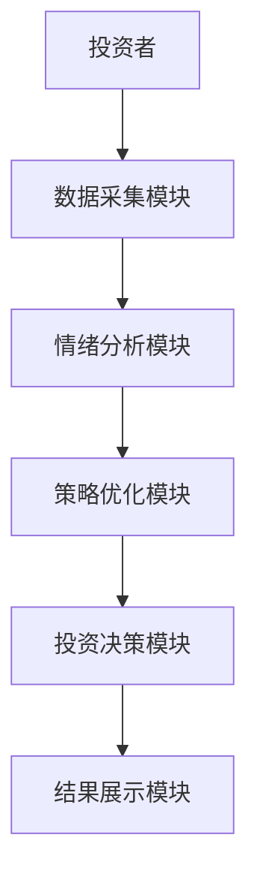

                 


# AI多智能体在价值投资中的社交媒体情绪分析应用

---

## 关键词  
AI多智能体，社交媒体情绪分析，价值投资，金融数据分析，自然语言处理，投资决策，机器学习

---

## 摘要  
本文探讨了AI多智能体在价值投资中的应用，特别是如何利用社交媒体情绪分析来辅助投资决策。文章从背景介绍、核心概念、算法原理、系统架构到项目实战，详细分析了如何通过多智能体协作从社交媒体数据中提取情绪信息，并将其转化为价值投资的决策依据。文中结合技术细节和实际案例，深入剖析了AI多智能体在金融领域的潜力与挑战。

---

## 第一部分: 背景介绍

### 第1章: 问题背景

#### 1.1 社会媒体在金融领域的影响力  
社交媒体已成为金融信息的重要来源。投资者通过社交媒体获取实时信息、市场情绪和行业动态。然而，社交媒体数据的非结构化和复杂性使得直接应用这些数据进行投资决策变得困难。

#### 1.2 价值投资中的情绪因素  
价值投资强调长期持有的理念，但市场情绪波动仍会影响短期资产价格。通过分析社交媒体情绪，投资者可以更精准地把握市场情绪，优化投资策略。

#### 1.3 多智能体技术的应用潜力  
多智能体系统能够协同完成复杂任务。在价值投资中，多个智能体可以分别负责数据采集、情绪分析、策略优化等任务，从而提高整体分析效率和准确性。

---

### 第2章: 问题描述

#### 2.1 情绪分析的挑战  
社交媒体数据具有噪声多、情绪表达多样化的特点。如何准确提取情绪信息并量化其对资产价格的影响是关键问题。

#### 2.2 多智能体协作的优势  
多智能体系统能够分工协作，分别处理不同类型的任务。例如，一个智能体负责数据清洗，另一个负责情绪分类，第三个负责策略优化。

#### 2.3 价值投资中的情绪分析需求  
价值投资者需要了解市场情绪对资产长期价值的影响。通过社交媒体情绪分析，投资者可以识别市场情绪与实际价值的偏离，从而捕捉投资机会。

---

### 第3章: 问题解决

#### 3.1 多智能体协作的解决方案  
通过设计一个多智能体系统，分别处理数据采集、情绪分析、策略优化等任务。每个智能体负责特定模块，协同完成整体目标。

#### 3.2 情绪分析模型的构建  
基于自然语言处理技术，构建一个能够识别社交媒体文本中情绪的模型。模型需要考虑文本的情感极性、强度以及情感类别。

#### 3.3 价值投资中的情绪数据应用  
将情绪数据与基本面分析相结合，构建一个多维度的投资决策模型。通过分析情绪数据，投资者可以更精准地评估资产价值。

---

## 第二部分: 核心概念与联系

### 第4章: 核心概念原理

#### 4.1 多智能体系统  
多智能体系统由多个智能体组成，每个智能体负责特定任务。在价值投资中，多智能体可以分别负责数据采集、情绪分析、策略优化等任务。

#### 4.2 情绪分析  
情绪分析是自然语言处理的核心任务之一。通过分析社交媒体文本，可以提取出市场情绪、情感强度等信息，为投资决策提供依据。

#### 4.3 价值投资  
价值投资强调长期持有的理念，注重分析资产的内在价值。通过结合市场情绪数据，投资者可以更全面地评估资产价值。

---

### 第5章: 概念属性对比与ER实体关系

#### 5.1 概念属性对比表  
| 概念       | 属性               | 描述                                   |
|------------|--------------------|----------------------------------------|
| 多智能体    | 协作性             | 多个智能体协同完成任务                 |
| 情绪分析    | 数据来源           | 社交媒体文本、语音、图像等             |
| 价值投资    | 核心目标           | 寻找被市场低估的资产                   |

#### 5.2 ER实体关系图  
```mermaid
er
    图表标题: 情绪分析与价值投资的实体关系图
    actor: 投资者
    entity: 社交媒体数据
    entity: 情绪分析结果
    entity: 投资策略
    关系: 投资者 → 社交媒体数据
    关系: 社交媒体数据 → 情绪分析结果
    关系: 情绪分析结果 → 投资策略
```

---

## 第三部分: 算法原理

### 第6章: 算法原理讲解

#### 6.1 情绪分析算法  
使用自然语言处理技术对社交媒体文本进行情绪分类。例如，使用深度学习模型（如LSTM或BERT）进行情感分析。

#### 6.2 多智能体协作机制  
通过多智能体协同完成任务。例如，一个智能体负责数据清洗，另一个负责情绪分类，第三个负责策略优化。

#### 6.3 投资策略优化  
基于情绪分析结果，优化投资策略。例如，当市场情绪过于乐观时，减少投资；当市场情绪低迷时，增加投资。

---

### 第7章: 算法实现

#### 7.1 情绪分析模型实现  
使用Python和深度学习框架（如TensorFlow或PyTorch）构建情感分类模型。

#### 7.2 多智能体协作实现  
通过多线程或分布式系统实现多个智能体的协作。

#### 7.3 投资策略优化实现  
结合情绪分析结果和基本面数据，优化投资策略。

---

## 第四部分: 系统分析与架构设计

### 第8章: 问题场景介绍

#### 8.1 项目介绍  
本项目旨在构建一个基于多智能体的社交媒体情绪分析系统，用于辅助价值投资决策。

#### 8.2 系统功能设计  
系统功能包括数据采集、情绪分析、策略优化、结果展示等。

#### 8.3 系统架构设计  


---

### 第9章: 系统接口设计

#### 9.1 数据接口  
定义数据接口，用于采集社交媒体数据。

#### 9.2 情绪分析接口  
定义情绪分析接口，返回情绪分类结果。

#### 9.3 投资策略接口  
定义投资策略接口，返回投资建议。

---

## 第五部分: 项目实战

### 第10章: 项目实现

#### 10.1 环境安装  
安装必要的Python库，如TensorFlow、NLTK、requests等。

#### 10.2 核心实现  
实现数据采集、情绪分析、策略优化等核心功能。

#### 10.3 代码解读  
解读核心代码，解释其功能和实现细节。

---

### 第11章: 实际案例分析

#### 11.1 案例分析  
分析实际案例，展示系统如何通过社交媒体情绪分析优化投资策略。

#### 11.2 结果展示  
展示系统输出的投资建议和实际收益情况。

---

## 第六部分: 最佳实践

### 第12章: 小结

#### 12.1 项目总结  
总结项目成果，分析系统的优缺点。

#### 12.2 经验总结  
总结项目中的经验和教训，为后续优化提供参考。

---

### 第13章: 注意事项

#### 13.1 数据质量  
强调数据质量的重要性，建议使用高质量的社交媒体数据。

#### 13.2 模型优化  
建议持续优化情绪分析模型，提高准确性。

#### 13.3 风险控制  
强调风险控制的重要性，建议结合多种分析方法进行综合判断。

---

### 第14章: 拓展阅读

#### 14.1 相关书籍  
推荐相关书籍，如《Python金融计算》、《深度学习实战》等。

#### 14.2 在线资源  
推荐相关在线资源，如GitHub仓库、技术博客等。

---

## 作者信息

作者：AI天才研究院/AI Genius Institute & 禅与计算机程序设计艺术 /Zen And The Art of Computer Programming

---

