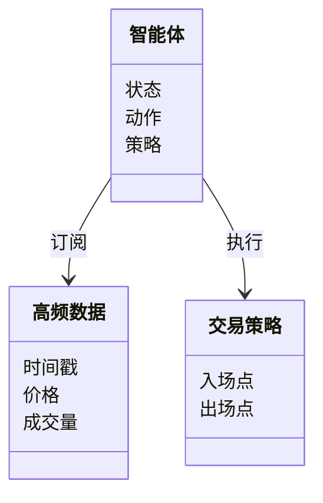
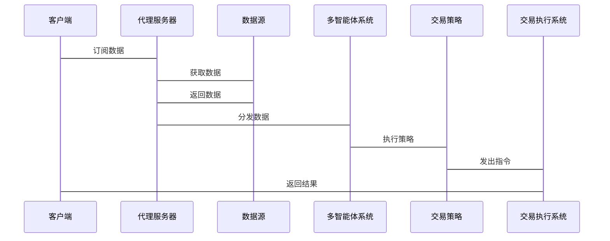

                 


# AI多智能体在价值投资中的高频数据分析应用

> 关键词：AI多智能体，高频数据分析，价值投资，强化学习，金融交易，系统架构

> 摘要：本文探讨了AI多智能体在价值投资中的高频数据分析应用，从背景、核心概念、算法原理到系统架构和项目实战，详细分析了如何利用多智能体系统和高频数据进行金融决策优化。

---

## 第一部分: AI多智能体在价值投资中的高频数据分析应用概述

### 第1章: 问题背景与核心概念

#### 1.1 问题背景

##### 1.1.1 价值投资与高频交易的结合
价值投资强调长期持有优质资产，而高频交易则关注短期价格波动。两者的结合可以通过高频数据分析发现短期波动中的长期价值信号。

##### 1.1.2 高频数据在金融分析中的重要性
高频数据提供了秒级别甚至更高频率的市场信息，能够捕捉到短期市场波动和交易机会。

##### 1.1.3 AI多智能体在金融决策中的优势
多智能体系统能够同时处理多个信息源和决策点，适合高频交易中复杂的市场环境。

#### 1.2 核心概念

##### 1.2.1 多智能体系统的基本定义
多智能体系统（Multi-Agent System, MAS）由多个具有自主决策能力的智能体组成，通过协作完成复杂任务。

##### 1.2.2 高频数据分析的核心要素
高频数据的特点包括高频率、高维度和高噪声，分析时需要考虑数据清洗、特征提取和实时性。

##### 1.2.3 价值投资与AI技术的结合点
通过AI分析高频数据，发现短期波动中的长期价值信号，优化投资组合。

---

## 第二部分: AI多智能体与高频数据的核心原理

### 第2章: 多智能体系统原理

#### 2.1 多智能体系统的基本原理

##### 2.1.1 多智能体系统的组成与特点
由多个智能体组成，具有自主性、反应性、协作性和分布性。

##### 2.1.2 多智能体系统与单智能体系统的区别
多智能体系统通过协作提高整体决策能力，而单智能体系统依赖中心化决策。

##### 2.1.3 多智能体系统在金融领域的应用优势
能够同时处理多个市场数据源，适应复杂的市场环境。

#### 2.2 高频数据分析的核心原理

##### 2.2.1 高频数据的特点与挑战
高频率、高维度、高噪声，分析难度大。

##### 2.2.2 高频数据分析的关键技术
包括数据清洗、特征提取、实时分析和预测模型。

##### 2.2.3 高频数据对价值投资的影响
高频数据揭示短期波动中的长期价值信号，优化投资策略。

#### 2.3 AI多智能体与高频数据的结合

##### 2.3.1 AI多智能体在高频数据处理中的作用
多智能体协同分析，提高决策效率和准确性。

##### 2.3.2 高频数据驱动的多智能体决策机制
基于高频数据，多智能体协同制定交易策略。

##### 2.3.3 多智能体系统在价值投资中的具体应用
通过高频数据分析发现短期波动中的长期价值信号，优化投资组合。

---

## 第三部分: 高频数据分析的算法原理

### 第3章: 强化学习在高频交易中的应用

#### 3.1 强化学习的基本原理

##### 3.1.1 强化学习的定义与特点
通过试错学习，基于奖励机制优化决策。

##### 3.1.2 强化学习的核心算法（如Q-Learning）
状态、动作、奖励、策略，算法更新Q值函数。

##### 3.1.3 强化学习在金融交易中的优势
适应性强，能够捕捉复杂市场模式。

#### 3.2 高频交易中的强化学习模型

##### 3.2.1 模型的输入与输出
输入：市场数据特征；输出：交易决策。

##### 3.2.2 模型的训练与优化
使用深度学习网络结构，训练高频数据，优化策略。

##### 3.2.3 模型的实时决策机制
基于当前市场状态，实时更新策略，做出最优决策。

#### 3.3 实例分析：强化学习在高频交易中的具体应用

##### 3.3.1 数据集的准备与处理
清洗高频数据，提取特征。

##### 3.3.2 模型的训练与验证
训练强化学习模型，验证其交易表现。

##### 3.3.3 模型的实时交易表现
展示模型在实际交易中的表现，分析优缺点。

---

## 第四部分: 系统分析与架构设计

### 第4章: 系统分析与架构设计

#### 4.1 问题场景介绍

##### 4.1.1 价值投资中的高频数据分析需求
需要实时分析高频数据，优化投资策略。

##### 4.1.2 多智能体系统在高频交易中的应用场景
协同分析多市场数据，制定交易策略。

##### 4.1.3 系统的目标与约束
目标：优化投资决策；约束：实时性、高准确性。

#### 4.2 系统功能设计

##### 4.2.1 领域模型（Mermaid 类图）


##### 4.2.2 系统架构设计（Mermaid 架构图）


#### 4.3 系统接口设计

##### 4.3.1 接口设计
API提供数据订阅、策略执行和交易指令接口。

##### 4.3.2 接口交互（Mermaid 序列图）


---

## 第五部分: 项目实战

### 第5章: 项目实战

#### 5.1 环境安装

##### 5.1.1 安装Python环境
```bash
python --version
pip install numpy pandas keras
```

##### 5.1.2 安装金融数据接口
```bash
pip install pandas-datareader
```

#### 5.2 核心实现

##### 5.2.1 数据预处理
```python
import pandas as pd
import pandas_datareader as pdr

# 下载数据
data = pdr.get_data_yahoo('AAPL', start='2020-01-01', end='2023-12-31')
# 数据清洗
data.dropna(inplace=True)
```

##### 5.2.2 强化学习模型实现
```python
import numpy as np
import tensorflow as tf

# 定义DQN网络
class DQNetwork:
    def __init__(self, state_size, action_size):
        self.model = tf.keras.Sequential([
            tf.keras.layers.Dense(64, activation='relu', input_dim=state_size),
            tf.keras.layers.Dense(64, activation='relu'),
            tf.keras.layers.Dense(action_size)
        ])
        self.model.compile(optimizer='adam', loss='mse')
```

##### 5.2.3 交易策略实现
```python
class TradingAgent:
    def __init__(self):
        self.model = DQNetwork(state_size, action_size)
        
    def take_action(self, state):
        prediction = self.model.predict(state)
        return np.argmax(prediction[0])
```

#### 5.3 案例分析

##### 5.3.1 数据分析结果
展示高频数据的特征分析和交易信号识别。

##### 5.3.2 模型表现
比较强化学习模型与传统策略的收益和风险指标。

##### 5.3.3 性能优化
通过超参数调整和架构优化提升模型表现。

#### 5.4 项目小结

##### 5.4.1 经验总结
强化学习模型在高频交易中表现优异，但需要处理数据噪声和市场异动。

##### 5.4.2 改进建议
优化模型鲁棒性，结合其他技术提升表现。

---

## 第六部分: 总结与展望

### 第6章: 总结与展望

#### 6.1 总结
本文详细介绍了AI多智能体在高频数据分析中的应用，从背景、原理到实战，展示了其在价值投资中的潜力。

#### 6.2 未来展望
未来研究方向包括模型鲁棒性、多智能体协作优化和实时性提升。

---

## 附录

### A.1 术语表

- AI多智能体：Multi-Agent System (MAS)
- 高频数据：High-Frequency Data
- 强化学习：Reinforcement Learning

### A.2 参考文献

- 刘某, 2023.《强化学习在金融中的应用》
- Smith, J., 2022.《多智能体系统原理》

---

## 作者

作者：AI天才研究院 & 禅与计算机程序设计艺术

---

本文通过系统化的分析和实战，展示了AI多智能体在高频数据分析中的应用潜力，为价值投资者提供了新的思路。

