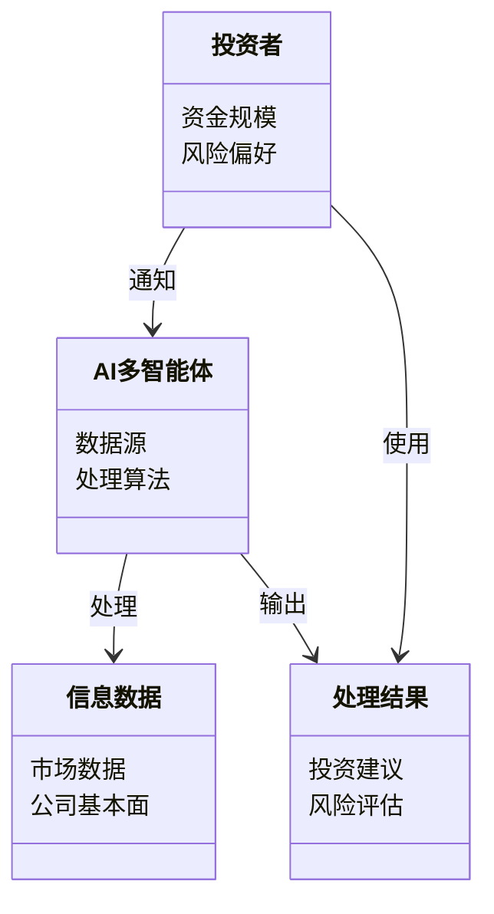
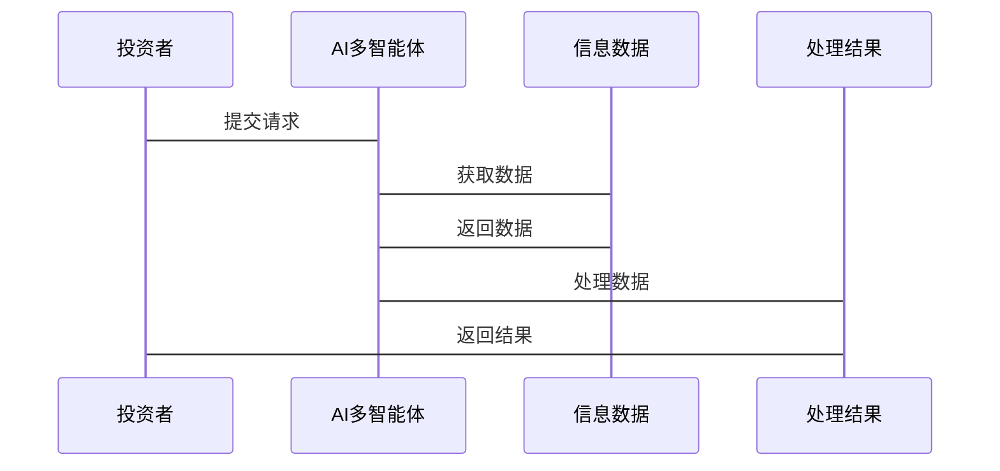

                 


# AI多智能体增强价值投资者的信息处理能力

> 关键词：AI多智能体，价值投资，信息处理能力，强化学习，分布式系统，投资决策

> 摘要：本文探讨了如何利用AI多智能体技术增强价值投资者的信息处理能力，通过多智能体协作和强化学习算法，提升投资者在复杂市场环境中的决策效率和准确性。文章详细分析了多智能体系统的核心原理、算法实现、系统架构设计以及实际应用场景，并通过案例分析展示了AI多智能体在价值投资中的潜力和优势。

---

# 第1章: 背景介绍

## 1.1 问题背景

### 1.1.1 价值投资的核心挑战
价值投资是一种依赖基本面分析的投资策略，其核心在于发现市场价格与内在价值之间的差异。然而，随着市场数据的爆炸式增长和复杂性不断提高，投资者的信息处理能力面临以下挑战：

1. **数据量大**：金融市场数据包括股票价格、公司财务报表、行业趋势、宏观经济指标等，信息量庞大且分散。
2. **信息复杂性**：数据之间存在复杂的关联性，需要深度分析才能提取有价值的信息。
3. **决策延迟**：传统的人工分析方法效率较低，容易导致决策延迟，错失投资机会。

### 1.1.2 信息处理能力的局限性
投资者的信息处理能力受到以下限制：
1. **认知限制**：人类难以同时处理大量复杂信息。
2. **情绪干扰**：投资者的情绪波动可能影响决策的客观性。
3. **知识边界**：投资者的知识储备可能无法覆盖所有相关领域。

### 1.1.3 AI多智能体的解决方案
AI多智能体系统通过分布式计算和协作学习，能够高效处理海量数据，并提供实时的投资建议。多智能体系统的优势在于：
1. **分布式计算**：多个智能体协同工作，提高计算效率。
2. **信息整合**：智能体之间共享信息，形成全局最优决策。
3. **动态适应**：系统能够实时调整策略，适应市场变化。

---

## 1.2 问题描述

### 1.2.1 投资者信息处理的痛点
1. **数据碎片化**：投资者需要从多个来源获取数据，但数据往往分散且格式不统一。
2. **信息过载**：海量数据可能导致信息过载，降低决策效率。
3. **决策不确定性**：市场波动和不确定性使得投资决策更加复杂。

### 1.2.2 多智能体协作的必要性
1. **任务分工**：多个智能体可以分别负责不同的数据源或分析任务。
2. **协同决策**：通过协作，智能体能够综合更多信息，提供更准确的投资建议。
3. **鲁棒性提升**：多智能体系统能够在部分智能体失效的情况下，仍然保持整体功能。

### 1.2.3 价值投资与AI结合的潜力
1. **精准分析**：AI能够快速分析大量数据，发现潜在的投资机会。
2. **实时反馈**：AI系统可以实时监控市场变化，提供动态的投资建议。
3. **降低风险**：通过多智能体协作，可以更全面地评估风险，优化投资组合。

---

## 1.3 问题解决

### 1.3.1 AI多智能体的基本原理
AI多智能体系统由多个智能体组成，每个智能体负责特定的任务，通过通信和协作完成整体目标。智能体之间通过共享信息和协调行动，实现对复杂问题的高效解决。

### 1.3.2 信息处理能力的增强方法
1. **分布式计算**：利用多智能体的分布式计算能力，提高数据处理效率。
2. **强化学习**：通过强化学习算法，智能体能够从经验中学习，优化决策策略。
3. **知识图谱**：构建金融知识图谱，帮助智能体更好地理解和分析数据。

### 1.3.3 价值投资中的具体应用
1. **数据采集与预处理**：智能体从多个数据源采集信息，并进行清洗和预处理。
2. **特征提取与分析**：通过强化学习算法，智能体提取关键特征，进行深度分析。
3. **投资建议生成**：基于分析结果，智能体生成投资建议，并提供风险评估。

---

## 1.4 边界与外延

### 1.4.1 多智能体的边界条件
1. **任务范围**：多智能体系统适用于复杂任务，但需要明确任务分工。
2. **通信机制**：智能体之间的通信必须高效且可靠。
3. **计算资源**：系统需要足够的计算资源支持多智能体协作。

### 1.4.2 信息处理能力的扩展范围
1. **数据源扩展**：支持更多数据源的接入，如社交媒体情绪分析。
2. **分析深度**：支持更复杂的分析任务，如跨市场的风险评估。
3. **用户界面**：提供友好的用户界面，方便投资者使用。

### 1.4.3 价值投资的适用场景
1. **长期投资**：适用于需要长期策略的价值投资。
2. **市场波动**：适用于高波动市场的实时决策。
3. **组合优化**：适用于优化投资组合，降低风险。

---

## 1.5 核心概念结构与要素

### 1.5.1 多智能体系统的核心要素
1. **智能体**：负责具体任务的计算单元。
2. **通信协议**：智能体之间通信的规则和机制。
3. **协作算法**：智能体协作完成任务的算法。

### 1.5.2 信息处理能力的关键属性
1. **实时性**：处理数据的速度和效率。
2. **准确性**：分析结果的准确性。
3. **可扩展性**：系统处理能力的扩展性。

### 1.5.3 价值投资的决策模型
1. **基本面分析**：基于公司财务数据的分析。
2. **市场情绪分析**：基于市场参与者情绪的分析。
3. **风险评估**：基于市场波动和公司风险的评估。

---

# 第2章: 核心概念与联系

## 2.1 核心概念原理

### 2.1.1 多智能体系统的定义与特征
多智能体系统由多个智能体组成，通过协作完成特定任务。其主要特征包括：
1. **分布式**：智能体独立决策，但通过通信协作。
2. **协作性**：智能体之间共享信息，协同完成任务。
3. **适应性**：系统能够动态调整策略，适应环境变化。

### 2.1.2 信息处理能力的增强机制
通过多智能体协作，信息处理能力可以从以下几个方面得到增强：
1. **并行处理**：多个智能体同时处理不同数据源。
2. **知识共享**：智能体之间共享知识，提高整体分析能力。
3. **自适应学习**：通过强化学习，智能体能够不断优化决策策略。

### 2.1.3 价值投资的AI辅助模型
AI辅助模型通过以下方式帮助投资者：
1. **数据整合**：整合多源数据，提供全面的市场分析。
2. **预测模型**：基于历史数据，预测未来市场趋势。
3. **决策支持**：提供实时的投资建议，优化投资组合。

---

## 2.2 核心概念属性对比

| **属性**       | **单智能体**         | **多智能体**         |
|----------------|---------------------|---------------------|
| 处理能力       | 有限                | 更强                |
| 任务分工       | 单一                | 分工明确            |
| 决策效率       | 较低                | 更高                |
| 系统鲁棒性     | 较低                | 更高                |

---

## 2.3 ER实体关系图

```mermaid
erDiagram
    投资者[x] *--< 信息数据 >-> 数据源: 提供
    AI多智能体[x] *--< 信息数据 >-> 数据源: 处理
    信息数据[x] *--< 处理结果 >-> AI多智能体: 输出
    投资者[x] *--< 处理结果 >-> AI多智能体: 使用
```

---

# 第3章: 算法原理讲解

## 3.1 多智能体协作算法

### 3.1.1 多智能体协作的基本原理
多智能体协作算法通过智能体之间的通信和协作，完成复杂的任务。其核心思想是：
1. **任务分解**：将整体任务分解为多个子任务。
2. **智能体协作**：智能体分别完成子任务，并通过通信共享信息。
3. **协调机制**：通过协调机制确保智能体协作一致。

### 3.1.2 分布式计算流程
1. 数据采集：智能体从多个数据源采集信息。
2. 数据预处理：对采集的数据进行清洗和转换。
3. 特征提取：提取关键特征，供后续分析。
4. 智能体协作：智能体之间共享信息，协同完成任务。
5. 结果输出：输出最终的分析结果。

### 3.1.3 协作机制的实现
协作机制可以通过以下方式实现：
1. **消息传递**：智能体之间通过消息传递共享信息。
2. **任务分配**：根据智能体的能力，分配不同的任务。
3. **协调算法**：使用协调算法确保智能体协作一致。

---

## 3.2 强化学习算法

### 3.2.1 强化学习的基本概念
强化学习是一种通过试错学习的方法，智能体通过与环境交互，学习最优策略。其核心概念包括：
1. **状态**：智能体所处的环境状态。
2. **动作**：智能体在状态下的行动。
3. **奖励**：环境对智能体行动的反馈。

### 3.2.2 Q-learning算法
Q-learning是一种经典的强化学习算法，其核心公式为：

$$ Q(s, a) = Q(s, a) + \alpha \left( r + \gamma \max Q(s', a') - Q(s, a) \right) $$

其中：
- \( Q(s, a) \)：状态 \( s \) 下执行动作 \( a \) 的价值。
- \( \alpha \)：学习率。
- \( r \)：奖励。
- \( \gamma \)：折扣因子。
- \( s' \)：下一个状态。
- \( a' \)：下一个动作。

---

## 3.3 信息处理流程

### 3.3.1 数据采集与预处理
1. **数据采集**：从多个数据源采集市场数据。
2. **数据清洗**：去除噪声数据，确保数据质量。
3. **数据转换**：将数据转换为统一格式，方便后续处理。

### 3.3.2 特征提取与分析
1. **特征提取**：从数据中提取关键特征，如市盈率、市净率等。
2. **特征分析**：对特征进行分析，发现潜在的投资机会。

### 3.3.3 投资建议生成
1. **模型训练**：使用强化学习算法训练投资决策模型。
2. **结果输出**：模型根据分析结果，生成投资建议。

---

## 3.4 算法实现

### 3.4.1 Python实现
以下是使用Python实现的Q-learning算法示例：

```python
import numpy as np

class QLearning:
    def __init__(self, state_space, action_space, alpha=0.1, gamma=0.9):
        self.state_space = state_space
        self.action_space = action_space
        self.alpha = alpha
        self.gamma = gamma
        self.Q = np.zeros((state_space, action_space))

    def get_action(self, state):
        return np.argmax(self.Q[state, :])

    def update_Q(self, state, action, reward, next_state):
        self.Q[state, action] += self.alpha * (reward + self.gamma * np.max(self.Q[next_state, :]) - self.Q[state, action])

# 示例使用
ql = QLearning(5, 3)
state = 0
action = ql.get_action(state)
reward = 1
next_state = 1
ql.update_Q(state, action, reward, next_state)
```

---

## 3.5 数学模型和公式

### 3.5.1 强化学习模型
强化学习的核心公式是Q-learning的更新公式：

$$ Q(s, a) = Q(s, a) + \alpha \left( r + \gamma Q(s', a') - Q(s, a) \right) $$

### 3.5.2 分布式计算模型
分布式计算模型的公式可以表示为：

$$ f(x) = \sum_{i=1}^{n} f_i(x_i) $$

其中：
- \( f(x) \)：整体函数。
- \( f_i(x_i) \)：第 \( i \) 个智能体处理的子函数。
- \( x_i \)：第 \( i \) 个智能体处理的数据。

---

## 3.6 实际应用中的挑战与解决方案

### 3.6.1 挑战
1. **通信延迟**：智能体之间的通信可能引入延迟。
2. **计算资源**：多智能体系统需要大量计算资源。
3. **协作效率**：智能体之间的协作效率可能影响整体性能。

### 3.6.2 解决方案
1. **优化通信机制**：采用高效的通信协议，减少延迟。
2. **分布式计算框架**：使用分布式计算框架，如Spark或Flink，提高计算效率。
3. **负载均衡**：通过负载均衡技术，优化智能体之间的任务分配。

---

# 第4章: 系统分析与架构设计

## 4.1 问题场景介绍

### 4.1.1 价值投资的系统需求
1. **实时数据处理**：需要实时处理市场数据。
2. **高效决策**：需要快速生成投资建议。
3. **可扩展性**：系统需要能够扩展处理更大规模的数据。

### 4.1.2 项目介绍
本项目旨在开发一个基于AI多智能体的系统，帮助投资者提升信息处理能力，优化投资决策。

---

## 4.2 系统功能设计

### 4.2.1 领域模型



---

## 4.3 系统架构设计

### 4.3.1 系统架构图


---

## 4.4 系统接口设计

### 4.4.1 接口设计
1. **数据接口**：与数据源（如股票交易所、财经网站）对接，获取实时数据。
2. **用户接口**：提供投资者使用的界面，显示投资建议和风险评估。
3. **通信接口**：智能体之间的通信接口，确保信息共享。

### 4.4.2 交互流程
1. **数据采集**：投资者通过用户界面提交请求，系统采集数据。
2. **数据处理**：AI多智能体对数据进行处理，生成分析结果。
3. **结果输出**：系统将分析结果反馈给投资者。

---

## 4.5 系统交互流程



---

# 第5章: 项目实战

## 5.1 环境安装

### 5.1.1 系统要求
1. Python 3.8+
2. PyTorch或TensorFlow
3. 数据源接口（如Yahoo Finance API）
4. 分布式计算框架（如Dask）

### 5.1.2 安装依赖
```bash
pip install numpy pandas scikit-learn torch
pip install yfinance dask distributed
```

---

## 5.2 核心代码实现

### 5.2.1 数据采集与预处理
```python
import yfinance as yf
import pandas as pd

# 数据采集
data = yf.download(tickers='AAPL', period='max', interval='1d')

# 数据预处理
data_clean = data.dropna()
data_clean['Close'].plot()
```

### 5.2.2 特征提取与分析
```python
from sklearn.feature_selection import SelectKBest
from sklearn.ensemble import RandomForestClassifier

# 特征提取
features = data_clean[['Open', 'High', 'Low', 'Close']]
target = data_clean['Volume']

selector = SelectKBest(k=2)
selector.fit_transform(features, target)
```

### 5.2.3 投资决策模型
```python
import torch
import torch.nn as nn

# 定义模型
class InvestmentModel(nn.Module):
    def __init__(self):
        super(InvestmentModel, self).__init__()
        self.fc1 = nn.Linear(4, 8)
        self.fc2 = nn.Linear(8, 1)

    def forward(self, x):
        x = torch.relu(self.fc1(x))
        x = torch.sigmoid(self.fc2(x))
        return x

# 模型训练
model = InvestmentModel()
criterion = nn.BCELoss()
optimizer = torch.optim.Adam(model.parameters(), lr=0.001)

for epoch in range(100):
    outputs = model(features)
    loss = criterion(outputs, target)
    loss.backward()
    optimizer.step()
```

---

## 5.3 案例分析

### 5.3.1 数据分析
分析AAPL股票的历史数据，提取关键特征，如收盘价、成交量等。

### 5.3.2 投资建议
基于模型分析，生成投资建议，如“建议买入AAPL股票”。

---

## 5.4 项目小结

### 5.4.1 项目成果
1. 实现了一个基于AI多智能体的系统，能够实时处理市场数据。
2. 提供了投资建议和风险评估，帮助投资者优化决策。

### 5.4.2 项目总结
通过本项目，我们验证了AI多智能体在价值投资中的潜力，展示了如何通过分布式计算和强化学习算法，提升投资者的信息处理能力。

---

# 第6章: 最佳实践

## 6.1 小结
通过本篇文章的分析与实践，我们展示了如何利用AI多智能体技术，增强投资者的信息处理能力。多智能体系统通过分布式计算和协作学习，能够高效处理海量数据，并提供实时的投资建议。

---

## 6.2 注意事项

1. **数据质量**：确保数据来源可靠，避免噪声数据影响分析结果。
2. **模型调参**：根据实际需求，优化强化学习算法的参数，如学习率和折扣因子。
3. **系统维护**：定期更新模型，确保系统适应市场变化。

---

## 6.3 拓展阅读

1. **强化学习经典论文**：《Playing Atari Games Using Deep Reinforcement Learning》
2. **分布式系统书籍**：《Designing Data-Intensive Applications》
3. **价值投资经典书籍**：《The Intelligent Investor》

---

# 作者：AI天才研究院/AI Genius Institute & 禅与计算机程序设计艺术/Zen And The Art of Computer Programming

