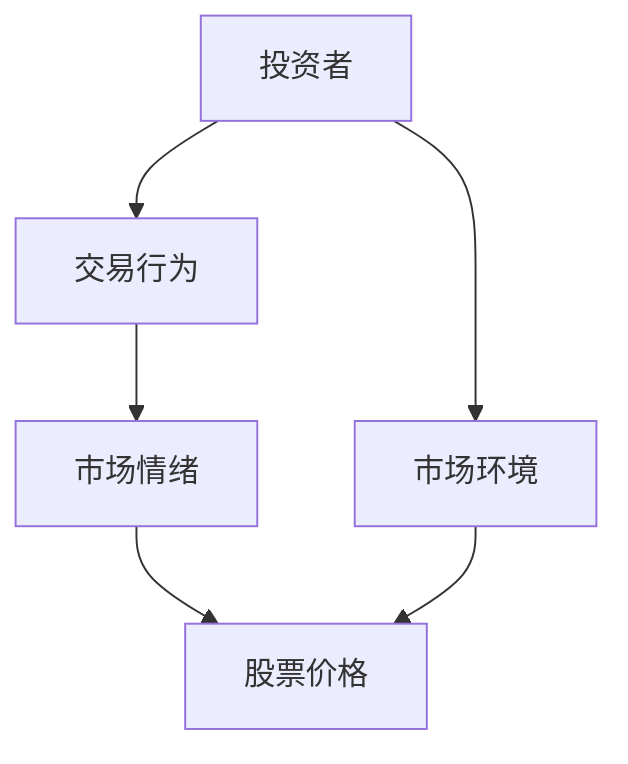
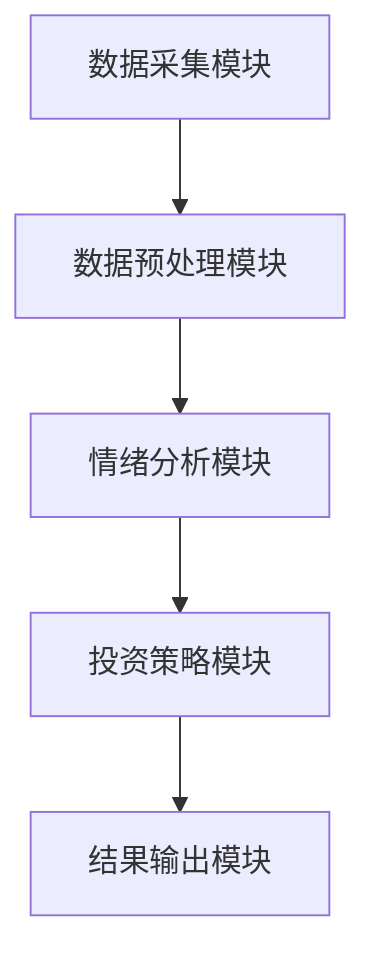
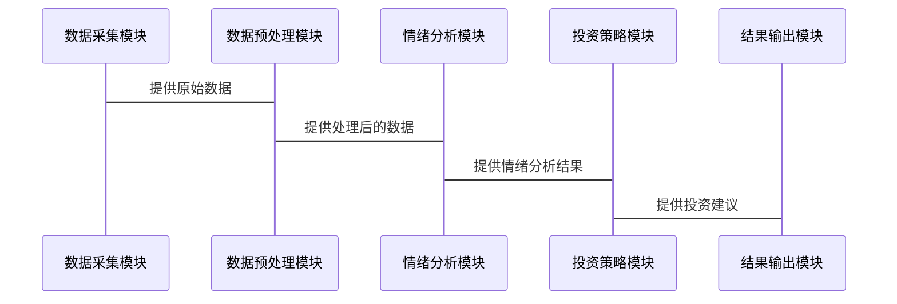

                 


# AI多智能体提升价值投资的市场情绪判断

> 关键词：AI、多智能体、价值投资、市场情绪、投资决策、协同学习、深度学习

> 摘要：本文系统地探讨了如何利用AI多智能体技术提升价值投资中的市场情绪判断能力。通过分析多智能体系统的核心原理、协同学习算法、系统架构设计及实际项目案例，本文为读者提供了一套基于AI技术的市场情绪分析解决方案。文章最后总结了关键点，并展望了未来的研究方向。

---

# 第1章: 价值投资与市场情绪判断的背景介绍

## 1.1 价值投资的核心概念
### 1.1.1 价值投资的基本定义
价值投资是一种以内在价值为导向的投资策略，旨在通过分析企业的基本面（如财务状况、行业地位等）来判断其股票的合理价格区间。其核心思想是购买价格低于内在价值的股票，长期持有的方式实现收益。

### 1.1.2 价值投资的关键要素
- **内在价值**：企业的真实价值，与市场波动无关。
- **安全边际**：买入价格与内在价值之间的差距，提供保护。
- **长期视角**：关注企业的长期盈利能力，而非短期价格波动。

### 1.1.3 价值投资的局限性
- 市场情绪的干扰：投资者情绪波动会影响短期股价，导致价值投资者的判断出现偏差。
- 数据依赖性：传统的价值投资依赖财务报表分析，难以捕捉市场情绪的变化。
- 市场周期的影响：经济周期波动会影响企业的基本面，增加投资决策的复杂性。

## 1.2 市场情绪对投资决策的影响
### 1.2.1 市场情绪的定义
市场情绪是指投资者在特定市场环境下的心理状态，包括乐观、悲观、恐慌等情绪。这些情绪会影响投资者的决策，进而影响市场的整体走势。

### 1.2.2 市场情绪的分类
- **乐观情绪**：投资者普遍看好市场，倾向于买入股票。
- **悲观情绪**：投资者对市场前景持怀疑态度，倾向于卖出股票。
- **恐慌情绪**：市场出现重大利空，投资者大量抛售资产。
- **贪婪情绪**：市场上涨时，投资者追涨，导致泡沫形成。

### 1.2.3 市场情绪对投资决策的影响
- 市场情绪可以通过影响股价波动，改变股票的买卖机会。
- 过度乐观的情绪可能导致市场泡沫，而过度悲观的情绪可能导致市场低估。

## 1.3 AI技术在金融领域的应用现状
### 1.3.1 AI技术的基本定义
人工智能（AI）是指计算机系统能够执行通常需要人类智能的任务，如视觉识别、语音识别、决策判断等。

### 1.3.2 AI在金融领域的应用
- **股票预测**：通过分析历史数据和市场新闻，预测股票价格走势。
- **风险控制**：利用AI技术评估投资组合的风险。
- **情绪分析**：通过自然语言处理（NLP）技术，分析新闻、社交媒体等信息，判断市场情绪。

### 1.3.3 多智能体系统在金融中的优势
- **分布式计算**：多个智能体可以同时处理不同类型的数据，提高计算效率。
- **协同学习**：多个智能体可以通过协同学习，提升整体的预测精度。
- **实时反馈**：智能体可以实时根据市场变化调整策略。

## 1.4 本章小结
本章介绍了价值投资的核心概念、市场情绪的定义及其对投资决策的影响，以及AI技术在金融领域的应用现状。通过分析这些内容，我们可以看到，AI技术在提升市场情绪判断方面具有巨大的潜力，而多智能体系统则是实现这一目标的重要工具。

---

# 第2章: AI多智能体与市场情绪判断的核心概念与联系

## 2.1 多智能体系统的核心概念
### 2.1.1 多智能体系统的定义
多智能体系统（Multi-Agent System, MAS）是指由多个相互作用的智能体组成的系统，这些智能体能够通过协作完成复杂任务。

### 2.1.2 多智能体系统的特点
- **自主性**：智能体能够独立决策。
- **反应性**：智能体能够根据环境变化实时调整行为。
- **协作性**：智能体之间可以通过通信协同完成任务。
- **分布式性**：智能体分布在网络中，避免单点故障。

### 2.1.3 多智能体系统与传统AI的区别
- **单智能体**：传统AI系统通常基于单一智能体进行决策。
- **多智能体**：多智能体系统通过多个智能体的协作，实现更复杂的任务。

## 2.2 市场情绪判断的核心概念
### 2.2.1 市场情绪的多维度分析
市场情绪可以从多个维度进行分析，如投资者情绪、市场波动性、交易量等。

### 2.2.2 市场情绪与股票价格的关系
市场情绪是影响股票价格的重要因素。例如，乐观的情绪可能导致股价上涨，而悲观的情绪可能导致股价下跌。

### 2.2.3 市场情绪的实时监测
通过分析社交媒体、新闻媒体等信息源，可以实时监测市场情绪的变化。

## 2.3 AI多智能体与市场情绪判断的联系
### 2.3.1 多智能体系统在市场情绪分析中的应用
- **数据采集**：多个智能体可以同时从不同的数据源采集市场信息。
- **协同分析**：多个智能体可以通过协同学习，提高市场情绪分析的精度。

### 2.3.2 多智能体系统的协同机制
- **信息共享**：智能体之间可以通过共享信息，提高整体的分析能力。
- **任务分配**：智能体可以根据自身的专长，承担不同的任务。

### 2.3.3 市场情绪判断的多维度分析
- **文本分析**：通过自然语言处理技术，分析新闻和社交媒体中的情绪倾向。
- **数据挖掘**：通过分析历史数据，发现市场情绪的变化规律。

## 2.4 ER实体关系图


## 2.5 本章小结
本章详细介绍了多智能体系统的核心概念，以及市场情绪判断的核心概念。通过分析多智能体系统与市场情绪判断的联系，我们可以看到，多智能体系统在提升市场情绪判断的精度和效率方面具有显著优势。

---

# 第3章: AI多智能体协同学习算法原理

## 3.1 多智能体协同学习的基本原理
### 3.1.1 联邦学习
联邦学习是一种分布式机器学习技术，允许多个智能体在不共享数据的情况下进行模型训练。

### 3.1.2 多智能体强化学习
多智能体强化学习是一种通过多个智能体协同学习，实现复杂任务的算法。

### 3.1.3 联合学习
联合学习是指多个智能体通过共享知识，共同优化模型。

## 3.2 多智能体协同学习的数学模型
### 3.2.1 联邦学习模型
$$ y = \sum_{i=1}^{n} \theta_i x_i $$

### 3.2.2 多智能体强化学习模型
$$ Q(s,a) = r + \gamma \max_a Q(s',a) $$

## 3.3 多智能体协同学习的算法实现
### 3.3.1 算法流程
1. 初始化多个智能体。
2. 每个智能体根据当前状态采取行动。
3. 智能体之间共享信息，优化模型。
4. 重复上述步骤，直到达到终止条件。

### 3.3.2 算法实现代码
```python
import numpy as np
from collections import deque

class Agent:
    def __init__(self, state_size, action_size):
        self.state_size = state_size
        self.action_size = action_size
        self.memory = deque(maxlen=1000)
        self.gamma = 0.95
        self.epsilon = 1.0
        self.epsilon_min = 0.01
        self.epsilon_decay = 0.995
        self.model = self._build_model()

    def _build_model(self):
        # 简单的神经网络模型
        model = Sequential()
        model.add(Dense(24, activation='relu', input_dim=self.state_size))
        model.add(Dense(24, activation='relu'))
        model.add(Dense(self.action_size, activation='linear'))
        model.compile(optimizer='adam', loss='mse')
        return model

    def remember(self, state, action, reward, next_state):
        self.memory.append((state, action, reward, next_state))

    def act(self, state):
        if np.random.rand() < self.epsilon:
            return random.randrange(self.action_size)
        state = np.array([state])
        prediction = self.model.predict(state)
        return np.argmax(prediction[0])

    def replay(self, batch_size):
        minibatch = random.sample(self.memory, batch_size)
        X = []
        y = []
        for state, action, reward, next_state in minibatch:
            target = reward
            target_next = self.model.predict(np.array([next_state]))
            target = reward + self.gamma * np.max(target_next[0])
            X.append(state)
            y.append(target)
        X = np.array(X)
        y = np.array(y)
        self.model.fit(X, y, epochs=1, verbose=0)
        self.epsilon = max(self.epsilon_min, self.epsilon * self.epsilon_decay)
```

---

# 第4章: AI多智能体系统架构设计

## 4.1 系统功能设计
### 4.1.1 数据采集模块
- 从股票市场、社交媒体等数据源采集实时数据。

### 4.1.2 情绪分析模块
- 利用NLP技术，分析数据中的情绪倾向。

### 4.1.3 投资策略模块
- 根据市场情绪和基本面分析，制定投资策略。

## 4.2 系统架构设计


## 4.3 系统接口设计
### 4.3.1 数据接口
- 数据采集模块与数据预处理模块之间的接口。
- 数据预处理模块与情绪分析模块之间的接口。

### 4.3.2 模型接口
- 情绪分析模块与投资策略模块之间的接口。

## 4.4 系统交互设计
### 4.4.1 交互流程
1. 数据采集模块采集实时数据。
2. 数据预处理模块对数据进行清洗和转换。
3. 情绪分析模块分析数据中的情绪倾向。
4. 投资策略模块根据情绪分析结果和基本面分析制定投资策略。
5. 结果输出模块输出最终的投资建议。

### 4.4.2 交互流程图


---

# 第5章: 项目实战与案例分析

## 5.1 环境安装
### 5.1.1 安装Python
- 安装最新版本的Python，推荐使用Anaconda分布。

### 5.1.2 安装依赖库
- 安装TensorFlow、Keras、Numpy、Pandas等库。

## 5.2 核心代码实现
### 5.2.1 数据预处理代码
```python
import pandas as pd
import numpy as np

def data_preprocessing(data):
    # 数据清洗
    data = data.dropna()
    # 标准化
    from sklearn.preprocessing import StandardScaler
    scaler = StandardScaler()
    scaled_data = scaler.fit_transform(data)
    return scaled_data
```

### 5.2.2 情绪分析代码
```python
from textblob import TextBlob

def sentiment_analysis(text):
    blob = TextBlob(text)
    return blob.sentiment.polarity
```

### 5.2.3 投资策略代码
```python
def investment_strategy(sentiment_score, price_data):
    if sentiment_score > 0.5 and price_data[-1] < price_data.mean():
        return "买入"
    elif sentiment_score < -0.5 and price_data[-1] > price_data.mean():
        return "卖出"
    else:
        return "观望"
```

## 5.3 案例分析
### 5.3.1 数据来源
- 使用某段时间内的股票价格数据和社交媒体上的相关评论。

### 5.3.2 数据分析
- 使用上述代码进行数据预处理和情绪分析。

### 5.3.3 投资决策
- 根据情绪分析结果和价格数据，制定投资策略。

---

# 第6章: 总结与展望

## 6.1 本章小结
通过本文的分析，我们可以看到，AI多智能体技术在提升价值投资的市场情绪判断方面具有显著优势。通过多智能体系统的协同学习，可以更精准地分析市场情绪，制定更科学的投资策略。

## 6.2 未来研究方向
### 6.2.1 更复杂的情绪分析模型
- 研究更复杂的情绪分析模型，提高分析精度。

### 6.2.2 多智能体系统的优化
- 优化多智能体系统的协同机制，提高系统的效率。

### 6.2.3 应用场景的拓展
- 将AI多智能体技术应用于更多金融领域，如风险管理、资产配置等。

## 6.3 最佳实践 tips
- 在实际应用中，建议结合多智能体系统的协同学习机制，提高市场情绪分析的精度。
- 注意数据的质量和来源，确保分析结果的可靠性。

## 6.4 作者总结
AI技术的快速发展为金融领域带来了巨大的变革，AI多智能体技术在提升价值投资的市场情绪判断方面具有广阔的应用前景。未来，随着技术的不断进步，AI多智能体技术将在金融领域发挥更重要的作用。

---

# 作者：AI天才研究院/AI Genius Institute & 禅与计算机程序设计艺术 /Zen And The Art of Computer Programming

