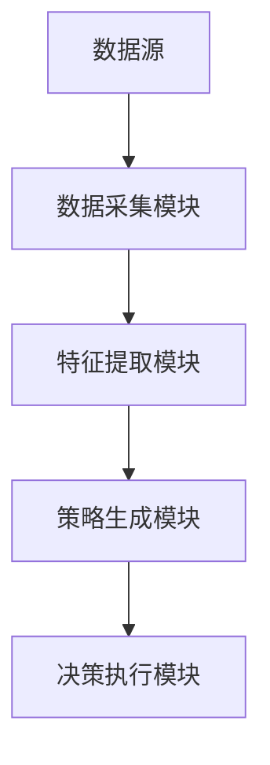
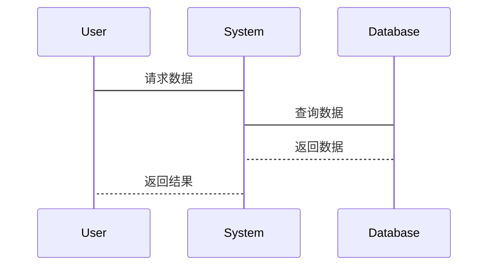

                 


# 《AI多智能体系统优化价值投资决策链》

---

## 关键词：
- AI多智能体系统
- 价值投资
- 决策链优化
- 投资策略
- 多智能体协作

---

## 摘要：
本文详细探讨了AI多智能体系统在优化价值投资决策链中的应用，从理论基础到实际案例，系统性地分析了多智能体系统如何通过协作、学习和优化提升投资决策的效率和准确性。文章从问题背景、核心概念、算法原理、系统架构、项目实战等多维度展开，结合数学模型、流程图和代码示例，深入剖析了多智能体系统在价值投资中的优势与实现路径。通过实际案例和系统设计，展示了如何构建高效的投资决策系统，并提出了未来的发展方向和优化建议。

---

# 第4章: 多智能体系统在投资决策中的应用

## 4.1 数据驱动的特征工程
### 4.1.1 数据来源与预处理
- 数据清洗与标准化
- 时间序列数据的特征提取

### 4.1.2 特征工程的多智能体协作
- 各智能体负责不同的特征提取任务
- 特征的筛选与优化

## 4.2 多智能体系统的模型训练
### 4.2.1 基于强化学习的训练流程
- 状态空间、动作空间与奖励函数的设计

### 4.2.2 多智能体协作中的策略优化
- 联合策略优化与竞争平衡

## 4.3 投资策略生成与回测
### 4.3.1 策略生成机制
- 多智能体协同生成投资策略
- 策略的多样性与风险控制

### 4.3.2 策略回测与性能评估
- 回测指标的设计与实现
- 多智能体策略的对比分析

## 4.4 风险管理与优化
### 4.4.1 风险评估模型
- 基于多智能体的实时风险监控

### 4.4.2 策略优化与调整
- 动态调整投资组合
- 灵敏性分析与鲁棒性测试

---

# 第5章: 实际案例分析与项目实战

## 5.1 案例介绍: 股票投资决策系统
### 5.1.1 项目背景与目标
- 构建一个基于多智能体系统的股票投资决策系统

### 5.1.2 数据来源与处理
- 股票历史数据的获取与清洗
- 市场情绪数据的整合

## 5.2 项目环境与工具安装
### 5.2.1 数据源
- 股票数据库（如Yahoo Finance API）
- 金融新闻数据（如News API）

### 5.2.2 工具与库
- Python环境：Python 3.8+
- 必要的库：numpy、pandas、scikit-learn、tensorflow、keras、matplotlib

## 5.3 系统核心实现
### 5.3.1 数据预处理与特征工程
```python
import pandas as pd
import numpy as np

# 数据加载
df = pd.read_csv('stock_data.csv')

# 数据清洗
df.dropna(inplace=True)

# 特征提取
df['moving_avg'] = df['close'].rolling(20).mean()
```

### 5.3.2 多智能体模型训练
```python
import tensorflow as tf
from tensorflow.keras import layers

# 定义智能体网络
def create_agent_network(state_size, action_size):
    model = tf.keras.Sequential([
        layers.Dense(64, activation='relu', input_shape=(state_size,)),
        layers.Dense(64, activation='relu'),
        layers.Dense(action_size, activation='linear')
    ])
    return model

# 多智能体协作
agents = [create_agent_network(state_size, action_size) for _ in range(num_agents)]
```

### 5.3.3 投资策略生成与回测
```python
import backtrader as bt

# 回测策略
class MultiAgentStrategy(bt.Strategy):
    def __init__(self):
        self.agents = agents
        self.data = self.datas[0]

    def next(self):
        # 获取当前状态
        state = get_current_state()
        
        # 各智能体决策
        actions = [agent.predict(state) for agent in self.agents]
        
        # 执行交易
        for action in actions:
            if action > 0:
                self.buy()
            else:
                self.sell()

# 回测运行
cerebro = bt.Cerebro()
cerebro.addstrategy(MultiAgentStrategy)
cerebro.run()
```

## 5.4 案例分析与结果解读
### 5.4.1 回测结果展示
- 多智能体策略的收益与风险对比
- 与传统策略的对比分析

### 5.4.2 系统优化与改进
- 基于回测结果的参数调整
- 模型优化与策略改进

---

# 第6章: 系统架构与实现方案

## 6.1 系统架构设计
### 6.1.1 模块划分
- 数据采集模块
- 特征提取模块
- 策略生成模块
- 决策执行模块

### 6.1.2 系统架构图


## 6.2 功能设计
### 6.2.1 数据采集模块
- 实时数据采集
- 数据缓存与存储

### 6.2.2 特征提取模块
- 多维度特征提取
- 特征筛选与优化

## 6.3 系统实现细节
### 6.3.1 数据采集接口
```python
import requests

def get_stock_data(symbol):
    url = f'https://api.example.com/stock/{symbol}'
    response = requests.get(url)
    return response.json()
```

### 6.3.2 系统交互流程


---

# 第7章: 优化与展望

## 7.1 系统优化方向
### 7.1.1 技术优化
- 模型优化与加速
- 分布式计算与并行处理

### 7.1.2 功能扩展
- 多目标优化
- 智能体之间的动态协作

## 7.2 未来展望
### 7.2.1 技术进步
- 更复杂的多智能体协作算法
- 更高效的计算框架

### 7.2.2 应用拓展
- 更多金融领域的应用
- 全球市场的多智能体协作

---

# 附录

## 附录A: 参考文献
- 强化学习相关文献
- 多智能体系统相关文献
- 价值投资相关文献

## 附录B: 工具与库安装链接
- Python安装：https://www.python.org/
- 必要库安装：pip install numpy pandas scikit-learn tensorflow keras matplotlib backtrader

## 附录C: 完整代码示例
```python
# 完整的股票投资决策系统代码
import pandas as pd
import numpy as np
import requests
import backtrader as bt
from tensorflow.keras import layers

# 数据采集模块
def get_stock_data(symbol):
    url = f'https://api.example.com/stock/{symbol}'
    response = requests.get(url)
    return pd.DataFrame(response.json())

# 特征提取模块
def extract_features(df):
    df['moving_avg'] = df['close'].rolling(20).mean()
    return df

# 多智能体模型训练
def create_agent_network(state_size, action_size):
    model = tf.keras.Sequential([
        layers.Dense(64, activation='relu', input_shape=(state_size,)),
        layers.Dense(64, activation='relu'),
        layers.Dense(action_size, activation='linear')
    ])
    return model

# 回测策略
class MultiAgentStrategy(bt.Strategy):
    def __init__(self):
        self.agents = [create_agent_network(state_size, action_size) for _ in range(num_agents)]
        self.data = self.datas[0]

    def next(self):
        state = get_current_state()
        actions = [agent.predict(state) for agent in self.agents]
        for action in actions:
            if action > 0:
                self.buy()
            else:
                self.sell()

# 系统运行
cerebro = bt.Cerebro()
cerebro.addstrategy(MultiAgentStrategy)
cerebro.run()
```

---

# 作者：
AI天才研究院/AI Genius Institute  
禅与计算机程序设计艺术/Zen And The Art of Computer Programming

