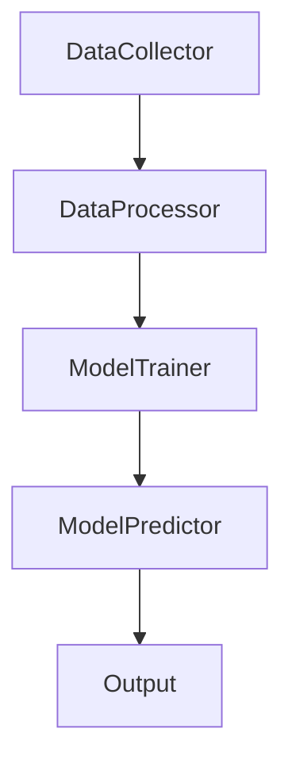
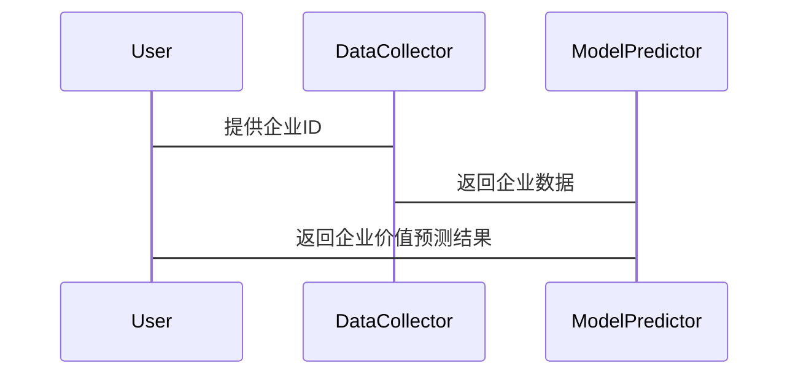

                 


# AI如何优化格雷厄姆的企业价值计算

> 关键词：人工智能，企业价值计算，格雷厄姆投资理论，机器学习，深度学习，金融分析

> 摘要：本文探讨了如何利用人工智能技术优化格雷厄姆的企业价值计算方法。通过分析传统企业价值计算的局限性，结合AI技术的优势，提出了一种基于机器学习和深度学习的企业价值优化计算模型。本文详细介绍了数据驱动的企业价值计算方法、AI优化的核心原理、系统架构设计以及实际案例分析，为投资者和数据科学家提供了新的思路和方法。

---

## 第一部分: 引言

### 第1章: AI与企业价值计算的背景

#### 1.1 人工智能的基本概念
- 1.1.1 人工智能的定义与核心原理
  - AI的定义：人工智能（Artificial Intelligence，AI）是指通过计算机模拟人类智能的技术，包括学习、推理、自适应等能力。
  - 核心原理：基于数据驱动的模式识别、特征提取和决策优化。
- 1.1.2 人工智能在金融领域的应用
  - 量化投资、风险评估、市场预测等。
- 1.1.3 人工智能与企业价值计算的结合
  - 利用AI技术提高企业价值计算的准确性和效率。

#### 1.2 格雷厄姆的企业价值计算模型
- 1.2.1 格雷厄姆投资理论的核心思想
  - 价值投资：寻找市场价格低于内在价值的企业。
  - 格雷厄姆公式：V = (P/E) * E（其中V为内在价值，P为市场价格，E为盈余）。
- 1.2.2 企业价值计算的传统方法
  - 市盈率法、市净率法、股权自由现金流法。
- 1.2.3 传统方法的局限性与优化空间
  - 数据维度有限、主观判断较强、难以处理复杂关系。

#### 1.3 AI优化企业价值计算的潜力
- 1.3.1 AI在数据处理中的优势
  - 处理海量数据、提取非线性特征。
- 1.3.2 AI在模型优化中的作用
  - 提高预测精度、降低误差。
- 1.3.3 AI在投资决策中的应用前景
  - 结合市场动态、实时调整策略。

---

## 第二部分: 格雷厄姆企业价值计算模型的AI优化

### 第2章: 企业价值计算的传统方法与AI优化

#### 2.1 传统企业价值计算方法
- 2.1.1 市盈率法
  - 定义：市盈率 = 股价 / 每股收益。
  - 优缺点：简单易懂，但受市场情绪影响较大。
- 2.1.2 市净率法
  - 定义：市净率 = 股价 / 每股净资产。
  - 优缺点：适用于净资产驱动型行业。
- 2.1.3 股权自由现金流法
  - 定义：股权自由现金流 = 经营活动现金流 - 净投资资本。
  - 优缺点：计算复杂，但更准确反映企业价值。

#### 2.2 AI优化企业价值计算的核心原理
- 2.2.1 数据驱动的特征提取
  - 使用自然语言处理（NLP）提取财务报告中的隐含信息。
- 2.2.2 机器学习模型的构建与训练
  - 神经网络模型：处理非线性关系。
  - 支持向量机（SVM）：分类问题。
  - 集成学习：提高模型鲁棒性。
- 2.2.3 模型的解释性与可解释性
  - 使用SHAP值解释模型预测结果。

#### 2.3 基于AI的企业价值计算模型
- 2.3.1 神经网络模型在企业价值计算中的应用
  - 深度学习模型：LSTM用于时间序列分析。
- 2.3.2 支持向量机在企业价值分类中的应用
  - 分类企业价值等级（高、中、低）。
- 2.3.3 集成学习在企业价值预测中的应用
  - 使用随机森林和梯度提升机（GBDT）进行特征选择和预测。

### 第3章: 数据驱动的企业价值计算

#### 3.1 数据收集与处理
- 3.1.1 数据来源与数据清洗
  - 数据来源：财务报表、新闻报道、社交媒体。
  - 数据清洗：处理缺失值、异常值、重复值。
- 3.1.2 数据特征的选择与提取
  - 传统财务指标：市盈率、市净率、ROE。
  - 非传统指标：文本数据（新闻、财报）的情感分析结果。
- 3.1.3 数据的标准化与归一化
  - 标准化：Z-score标准化。
  - 归一化：Min-Max归一化。

#### 3.2 基于AI的企业价值计算模型
- 3.2.1 深度学习模型的构建
  - 使用LSTM处理时间序列数据。
  - 模型结构：输入层、隐藏层、输出层。
- 3.2.2 模型的训练与优化
  - 使用交叉验证选择最优参数。
  - 模型调优：学习率、批量大小、 epochs。
- 3.2.3 模型的验证与评估
  - 使用ROC-AUC、准确率、召回率评估模型性能。

#### 3.3 案例分析
- 3.3.1 某行业企业的价值计算案例
  - 选择一个行业，如科技行业，分析其企业价值。
- 3.3.2 模型的预测结果与实际价值的对比分析
  - 比较AI模型预测值与传统方法计算值的差异。
- 3.3.3 模型优化的改进方向
  - 增加更多的特征、优化模型结构、引入外部数据源。

---

## 第三部分: 系统架构与项目实战

### 第4章: 系统架构设计

#### 4.1 系统功能模块划分
- 4.1.1 数据采集模块
  - 从数据库、API获取企业财务数据。
- 4.1.2 数据处理模块
  - 数据清洗、特征提取、数据标准化。
- 4.1.3 模型训练模块
  - 神经网络模型训练、参数优化。
- 4.1.4 模型应用模块
  - 接收输入数据，输出企业价值预测结果。

#### 4.2 系统架构图


#### 4.3 系统接口设计
- 数据接口：与财务数据库对接。
- 模型接口：与前端应用对接，提供API服务。

#### 4.4 系统交互流程


### 第5章: 项目实战

#### 5.1 环境安装
- Python 3.8+
- PyTorch、Scikit-learn、NLTK、Pandas。

#### 5.2 核心代码实现
- 5.2.1 数据处理代码
  ```python
  import pandas as pd
  from sklearn.preprocessing import StandardScaler

  # 数据加载
  df = pd.read_csv('enterprise_data.csv')
  # 数据清洗
  df.dropna(inplace=True)
  # 特征选择
  features = df[['revenue', 'profit', 'market_value']]
  # 标准化
  scaler = StandardScaler()
  features_scaled = scaler.fit_transform(features)
  ```

- 5.2.2 模型训练代码
  ```python
  import torch
  import torch.nn as nn

  # 神经网络模型
  class ValueEstimator(nn.Module):
      def __init__(self):
          super().__init__()
          self.fc1 = nn.Linear(3, 10)
          self.fc2 = nn.Linear(10, 1)
      def forward(self, x):
          x = torch.relu(self.fc1(x))
          x = torch.sigmoid(self.fc2(x))
          return x

  # 训练过程
  model = ValueEstimator()
  criterion = nn.MSELoss()
  optimizer = torch.optim.Adam(model.parameters(), lr=0.001)

  for epoch in range(100):
      inputs = torch.FloatTensor(features_scaled)
      labels = torch.FloatTensor(df['true_value'].values)
      outputs = model(inputs)
      loss = criterion(outputs, labels)
      loss.backward()
      optimizer.step()
  ```

- 5.2.3 案例分析与结果解读
  - 使用实际企业数据进行预测。
  - 对比AI模型与传统方法的预测结果。

---

## 第四部分: 总结与展望

### 第6章: 总结与最佳实践

#### 6.1 小结
- AI优化企业价值计算的优势：提高精度、降低人为误差。
- 模型优化的关键点：数据质量、特征选择、模型调优。

#### 6.2 注意事项
- 数据的完整性和准确性。
- 模型的泛化能力。
- 投资决策的多因素考虑。

#### 6.3 拓展阅读
- 《The Intelligent Investor》 - 本杰明·格雷厄姆
- 《Deep Learning》 - Ian Goodfellow等

---

作者：AI天才研究院/AI Genius Institute & 禅与计算机程序设计艺术/Zen And The Art of Computer Programming

