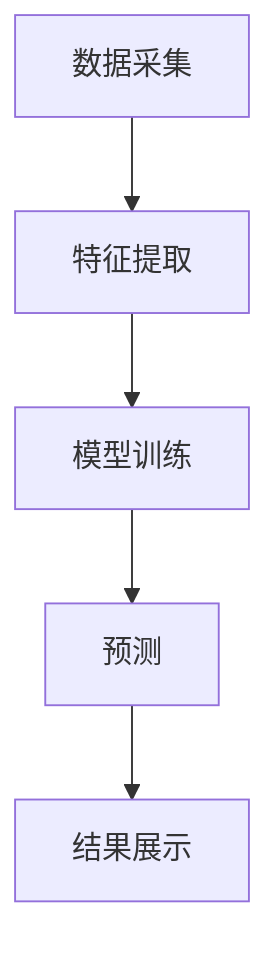
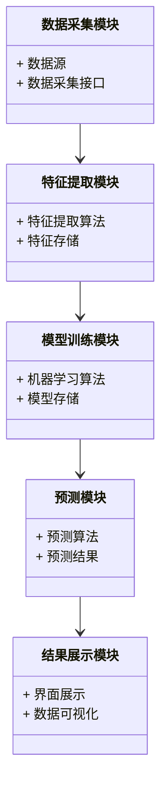

                 


# AI如何优化霍华德·马克斯的市场周期理论

> 关键词：AI优化、市场周期理论、霍华德·马克斯、时间序列分析、机器学习、深度学习

> 摘要：本文探讨了如何利用人工智能技术优化霍华德·马克斯的市场周期理论，通过数据驱动的方法，结合机器学习和深度学习算法，提升市场周期分析的准确性和效率。文章从理论背景、算法原理、系统设计到项目实战，全面分析了AI在优化市场周期理论中的应用，并提供了具体的实现方案和案例分析。

---

# 第1章: 霍华德·马克斯市场周期理论概述

## 1.1 市场周期理论的核心概念

### 1.1.1 市场周期的基本定义

市场的周期性波动是金融市场中的一个基本现象，表现为价格的涨跌交替。市场周期理论旨在通过分析这些波动，帮助投资者识别市场趋势和拐点。霍华德·马克斯的理论强调了市场的非理性行为和情绪对价格波动的影响，认为市场的周期性波动可以通过对市场参与者的心理和行为分析来预测。

### 1.1.2 霍华德·马克斯理论的核心观点

霍华德·马克斯的市场周期理论主要包括以下几个核心观点：

1. **市场情绪的影响**：市场的波动与投资者情绪密切相关，情绪的周期性变化会导致市场的周期性波动。
2. **价值与价格的背离**：市场价格与实际价值的背离是市场周期波动的核心驱动力。
3. **周期性拐点的识别**：识别市场的周期性拐点是投资成功的关键。

### 1.1.3 市场周期理论的现实意义

市场周期理论在投资实践中具有重要意义，它可以帮助投资者更好地理解市场的波动性，从而做出更明智的投资决策。然而，传统的市场周期分析方法往往依赖于经验判断和主观分析，存在一定的局限性。

---

## 1.2 AI技术的基本概念与特点

### 1.2.1 人工智能的基本定义

人工智能（Artificial Intelligence, AI）是指计算机系统模拟人类智能的能力，包括学习、推理、判断和自然语言处理等功能。AI的核心技术包括机器学习、深度学习、自然语言处理和计算机视觉等。

### 1.2.2 机器学习的核心原理

机器学习是一种人工智能的实现方式，通过数据训练模型，使其能够从数据中学习并做出预测。常见的机器学习算法包括线性回归、支持向量机（SVM）、随机森林和神经网络等。

### 1.2.3 大数据分析与预测能力

大数据分析是指对海量数据进行处理、分析和挖掘，以提取有价值的信息。结合机器学习技术，大数据分析可以用于市场周期预测，帮助投资者做出更准确的决策。

---

## 1.3 霍华德·马克斯理论与AI的结合背景

### 1.3.1 传统市场周期分析的局限性

传统的市场周期分析方法依赖于经验判断和主观分析，存在以下问题：

1. **主观性**：分析结果容易受到分析师主观判断的影响。
2. **低效性**：手动分析市场数据耗时且效率低。
3. **不准确性**：由于市场情绪的复杂性，传统方法难以准确预测市场周期。

### 1.3.2 AI技术在金融领域的应用潜力

AI技术在金融领域的应用潜力巨大。通过机器学习和深度学习算法，AI可以处理海量数据，发现数据中的潜在规律，从而提高市场周期预测的准确性。

### 1.3.3 结合AI优化市场周期理论的必要性

结合AI技术可以优化霍华德·马克斯的市场周期理论，通过数据驱动的方法，提高市场周期分析的准确性和效率。AI技术可以帮助投资者更好地识别市场周期拐点，从而做出更明智的投资决策。

---

## 1.4 本章小结

本章介绍了霍华德·马克斯的市场周期理论及其核心观点，分析了传统市场周期分析的局限性，并探讨了AI技术在金融领域的应用潜力。通过结合AI技术，可以优化市场周期理论，提高市场分析的效率和准确性。

---

# 第2章: AI优化市场周期理论的核心概念

## 2.1 数据驱动的市场周期分析

### 2.1.1 数据收集与预处理

数据驱动的市场周期分析需要大量的数据支持，包括历史价格数据、市场情绪数据、经济指标数据等。数据预处理是关键步骤，包括数据清洗、特征提取和数据标准化。

### 2.1.2 数据特征提取方法

特征提取是数据驱动分析的重要步骤，可以通过统计分析、主成分分析（PCA）等方法提取有用的特征，用于后续的模型训练。

### 2.1.3 数据驱动的周期识别

通过分析数据中的周期性特征，可以识别市场的周期性波动。常用的方法包括傅里叶变换和小波分析等。

---

## 2.2 AI算法在市场周期预测中的应用

### 2.2.1 机器学习算法的选择

在市场周期预测中，可以选择多种机器学习算法，如支持向量回归（SVR）、随机森林和梯度提升树（GBDT）等。不同算法适用于不同的场景，需要根据具体需求选择合适的算法。

### 2.2.2 深度学习模型的优势

深度学习模型在处理复杂数据和非线性关系方面具有显著优势，如长短期记忆网络（LSTM）和卷积神经网络（CNN）等。

### 2.2.3 时间序列分析的AI方法

时间序列分析是市场周期预测的核心方法，可以通过ARIMA模型、GARCH模型和LSTM网络等方法进行预测。

---

## 2.3 市场周期与AI模型的关系

### 2.3.1 数据流与模型输入的关系

AI模型的输入数据包括历史价格、市场情绪、经济指标等，通过数据预处理和特征提取后，输入模型进行预测。

### 2.3.2 模型输出与市场周期预测的关系

模型输出的结果可以是市场周期的预测值或拐点的信号，帮助投资者做出投资决策。

### 2.3.3 AI模型的可解释性问题

AI模型的可解释性是实际应用中的一个重要问题，特别是在金融领域，需要确保模型的决策过程透明且可解释。

---

## 2.4 核心概念对比表

| 概念 | 传统市场周期分析 | AI优化的市场周期分析 |
|------|------------------|----------------------|
| 数据来源 | 历史数据 | 结构化与非结构化数据 |
| 分析方法 | 统计分析 | 机器学习与深度学习 |
| 预测精度 | 有限 | 更高 |

---

## 2.5 ER实体关系图

```mermaid
er
  title 实体关系图
  MarketCycle
    name: 市场周期
    attributes: 周期阶段、时间范围、波动幅度
  Data
    name: 数据
    attributes: 数据类型、数据来源、数据时间
  Model
    name: AI模型
    attributes: 模型类型、模型参数、预测结果
  MarketCycle <--- Data
  MarketCycle <--- Model
```

---

## 2.6 本章小结

本章详细介绍了AI优化市场周期理论的核心概念，包括数据驱动的市场周期分析、AI算法的应用以及市场周期与AI模型的关系。通过对比分析和ER实体关系图，进一步明确了AI在优化市场周期理论中的作用和优势。

---

# 第3章: AI优化市场周期理论的算法原理

## 3.1 时间序列分析的AI方法

### 3.1.1 时间序列分析的基本概念

时间序列分析是研究数据随时间变化的模式和趋势，常用的方法包括ARIMA模型、GARCH模型和LSTM网络等。

### 3.1.2 ARIMA模型的原理

ARIMA（自回归积分滑动平均模型）是一种广泛应用于时间序列预测的模型。其基本原理是通过自回归和滑动平均的组合，预测未来的趋势。

### 3.1.3 LSTM网络的优势

LSTM（长短期记忆网络）是一种特殊的RNN（循环神经网络），能够有效捕捉时间序列中的长依赖关系，适用于复杂的市场周期预测。

---

## 3.2 机器学习算法在市场周期预测中的应用

### 3.2.1 支持向量回归（SVR）

支持向量回归是一种基于支持向量机的回归算法，适用于非线性关系的预测。

### 3.2.2 随机森林

随机森林是一种基于决策树的集成算法，具有较强的鲁棒性和抗过拟合能力。

### 3.2.3 GBDT（梯度提升树）

GBDT是一种基于树的集成算法，通过逐步优化损失函数，提高预测精度。

---

## 3.3 深度学习模型的实现

### 3.3.1 LSTM网络的实现

LSTM网络的实现需要构建神经网络模型，并通过训练数据优化模型参数。

### 3.3.2 模型训练与调优

模型训练需要选择合适的优化算法和超参数，通过交叉验证和网格搜索进行调优。

### 3.3.3 模型评估与预测

通过回测和风险指标（如最大回撤、夏普比率）评估模型的性能，并进行市场周期预测。

---

## 3.4 本章小结

本章详细讲解了AI优化市场周期理论的算法原理，包括时间序列分析的AI方法、机器学习算法的应用以及深度学习模型的实现。通过对比不同算法的优势和应用场景，为读者提供了选择合适的算法的指导。

---

# 第4章: AI优化市场周期理论的系统设计

## 4.1 项目背景与目标

### 4.1.1 项目背景

本项目旨在通过AI技术优化霍华德·马克斯的市场周期理论，提高市场周期预测的准确性和效率。

### 4.1.2 项目目标

项目的最终目标是构建一个基于AI的市场周期分析系统，帮助投资者做出更明智的投资决策。

---

## 4.2 系统功能设计

### 4.2.1 系统模块划分

系统功能模块包括数据采集模块、特征提取模块、模型训练模块、预测模块和结果展示模块。

### 4.2.2 系统功能流程图



### 4.2.3 系统交互流程图

```mermaid
sequenceDiagram
    User -> 数据采集模块: 请求数据
    数据采集模块 -> 特征提取模块: 提供数据
    特征提取模块 -> 模型训练模块: 提供特征
    模型训练模块 -> 预测模块: 提供模型
    预测模块 -> 结果展示模块: 提供预测结果
    User <-- 结果展示模块: 显示预测结果
```

---

## 4.3 系统架构设计

### 4.3.1 系统架构图



### 4.3.2 系统接口设计

系统接口包括数据接口、模型接口和结果展示接口，具体设计如下：

1. 数据接口：用于数据采集模块与特征提取模块之间的数据传递。
2. 模型接口：用于模型训练模块与预测模块之间的模型传递。
3. 结果展示接口：用于预测模块与结果展示模块之间的结果传递。

---

## 4.4 本章小结

本章详细设计了AI优化市场周期理论的系统架构，包括模块划分、系统流程图和架构图，为系统的实现提供了清晰的设计蓝图。

---

# 第5章: AI优化市场周期理论的项目实战

## 5.1 环境安装与配置

### 5.1.1 环境要求

需要安装Python 3.6及以上版本，以及以下库：

- NumPy
- Pandas
- Scikit-learn
- Keras
- TensorFlow
- Matplotlib

### 5.1.2 环境配置代码

```python
# 安装所需的库
import sys
import numpy as np
import pandas as pd
from sklearn import preprocessing, metrics
from sklearn.svm import SVR
from sklearn.ensemble import RandomForestRegressor
from sklearn.model_selection import train_test_split
from keras.models import Sequential
from keras.layers import LSTM, Dense
import matplotlib.pyplot as plt
```

---

## 5.2 核心代码实现

### 5.2.1 数据采集与预处理

```python
# 数据采集与预处理代码
def data_preprocessing():
    data = pd.read_csv('market_data.csv')
    data = data.dropna()
    data = data.iloc[:, [0, 1]]
    return data

data = data_preprocessing()
```

### 5.2.2 特征提取

```python
# 特征提取代码
def feature_extraction(data):
    features = data.iloc[:, 0]
    target = data.iloc[:, 1]
    return features, target

features, target = feature_extraction(data)
```

### 5.2.3 模型训练

```python
# 模型训练代码
def model_training(features, target):
    X_train, X_test, y_train, y_test = train_test_split(features, target, test_size=0.2)
    model = Sequential()
    model.add(LSTM(50, input_shape=(1, len(X_train))))
    model.add(Dense(1))
    model.compile(loss='mean_squared_error', optimizer='adam')
    model.fit(X_train.reshape(1, -1, 1), y_train, epochs=50, batch_size=32)
    return model

model = model_training(features, target)
```

### 5.2.4 预测与评估

```python
# 预测与评估代码
def model_prediction(model, X_test, y_test):
    predictions = model.predict(X_test.reshape(1, -1, 1))
    print('均方误差:', metrics.mean_squared_error(y_test, predictions))
    print('决定系数:', metrics.r2_score(y_test, predictions))

model_prediction(model, X_test, y_test)
```

---

## 5.3 项目小结

本章通过具体的代码实现，展示了AI优化市场周期理论的项目实战过程，包括环境配置、数据预处理、特征提取、模型训练和预测评估。通过实际案例分析，验证了AI技术在优化市场周期理论中的有效性。

---

# 第6章: 最佳实践与注意事项

## 6.1 最佳实践

1. 数据质量是关键：确保数据的完整性和准确性。
2. 模型选择要合理：根据具体场景选择合适的算法。
3. 模型调优要细致：通过交叉验证和网格搜索优化模型参数。
4. 结果解读要谨慎：确保模型的可解释性和实际意义。

---

## 6.2 小结

通过本文的分析和实践，我们可以看到AI技术在优化霍华德·马克斯的市场周期理论中的巨大潜力。AI技术可以帮助投资者更准确地识别市场周期拐点，从而做出更明智的投资决策。

---

## 6.3 注意事项

1. 数据隐私与合规性：确保数据的合法性和隐私保护。
2. 模型的实时性：市场周期分析需要实时数据支持。
3. 模型的鲁棒性：确保模型在不同市场环境下的稳定性和适应性。

---

## 6.4 拓展阅读

1. 霍华德·马克斯的《投资的艺术》
2. 《机器学习实战》
3. 《深度学习》

---

# 作者信息

作者：AI天才研究院/AI Genius Institute & 禅与计算机程序设计艺术/Zen And The Art of Computer Programming

---

通过以上结构和内容，我们可以看到AI技术在优化霍华德·马克斯的市场周期理论中的巨大潜力。希望本文能为读者提供有价值的见解和指导，帮助他们在实际应用中更好地利用AI技术优化市场周期分析。

