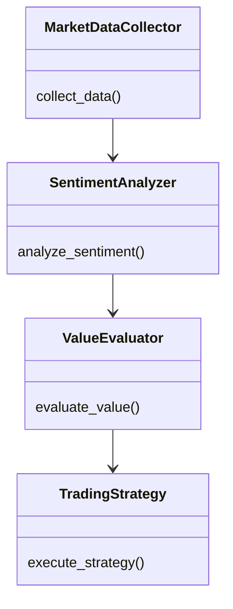

                 


# AI如何实现格雷厄姆的Mr. Market理论

---

## 关键词
AI，格雷厄姆，Mr. Market，投资理论，价值投资，机器学习，市场情绪分析

---

## 摘要
本文探讨了如何利用人工智能技术实现格雷厄姆的Mr. Market理论。通过分析市场情绪、评估股票价值并设计智能化的投资系统，展示了AI在投资决策中的潜力。文章详细介绍了AI算法、系统架构和实际案例，帮助读者理解如何将理论与技术结合。

---

## 第一部分：格雷厄姆的Mr. Market理论与AI的结合

### 第1章：格雷厄姆的Mr. Market理论概述

#### 1.1 Mr. Market理论的核心概念
格雷厄姆的Mr. Market理论强调市场情绪波动与理性投资的重要性。投资者应关注长期价值，而非短期市场波动。以下是理论的核心概念：

- **安全边际**：买入低于内在价值的股票，以降低风险。
- **价值投资**：关注企业的基本面，寻找被市场低估的机会。
- **市场情绪**：市场情绪波动影响股票价格，投资者需保持理性。

#### 1.2 AI在投资中的应用背景
AI技术在投资中的应用日益广泛，尤其是在数据处理和模式识别方面。AI可以帮助投资者分析大量数据，识别市场趋势，优化投资组合。

- **传统投资分析的局限性**：依赖经验判断，难以处理复杂数据。
- **数据驱动投资的优势**：利用AI分析市场数据，提高决策效率。
- **AI如何赋能Mr. Market理论**：通过分析市场情绪和价值评估，辅助投资决策。

---

### 第2章：AI技术基础与投资分析

#### 2.1 人工智能在金融领域的应用
AI技术在金融领域的应用主要体现在以下几个方面：

- **机器学习在股票预测中的应用**：通过历史数据训练模型，预测股价走势。
- **自然语言处理在市场情绪分析中的应用**：分析新闻、社交媒体等文本数据，评估市场情绪。
- **深度学习在风险评估中的作用**：利用深度学习模型识别市场风险。

#### 2.2 数据驱动的投资分析框架
数据驱动的投资分析框架包括以下几个步骤：

- **数据收集与清洗**：收集历史股价、财务数据、新闻等，清洗数据，去除噪声。
- **特征工程与数据预处理**：提取有用特征，如市盈率、市净率等，标准化数据。
- **模型训练与评估**：训练机器学习模型，评估模型性能，优化参数。

---

## 第二部分：AI实现Mr. Market理论的核心算法

### 第3章：市场情绪分析的AI算法

#### 3.1 市场情绪分析的原理
市场情绪分析通过分析文本数据，评估市场的乐观或悲观情绪。以下是其实现原理：

- **基于NLP的情感分析模型**：使用词袋模型或词嵌入模型（如Word2Vec）分析文本情感。
- **时间序列分析方法**：分析情绪指数的时间序列，预测未来走势。
- **市场情绪指数的构建**：将情绪分析结果转化为指数，与股价进行关联分析。

#### 3.2 市场情绪分析的实现
以下是一个基于Python的情感分析实现示例：

```python
import nltk
from nltk.sentiment import SentimentIntensityAnalyzer

sia = SentimentIntensityAnalyzer()
text = "The company's earnings have beaten expectations."
scores = sia.polarity_scores(text)
print(scores)
# 输出：{'neg': 0.0, 'neu': 0.17, 'pos': 0.83, 'compound': 0.70}
```

#### 3.3 市场情绪指数与股价波动的关系
市场情绪指数可以通过以下公式计算：

$$
\text{情绪指数} = \frac{\sum (\text{正向情绪得分} - \text{负向情绪得分})}{\text{总样本数}}
$$

---

### 第4章：价值评估的AI算法

#### 4.1 价值评估的核心指标
价值评估主要关注股票的内在价值，以下是关键指标：

- **市盈率（P/E）分析**：股价除以每股收益，评估股票估值。
- **市净率（P/B）分析**：股价除以每股净资产，评估股票价值。
- **股息率**：股息与股价的比率，评估投资回报。

#### 4.2 基于机器学习的价值评估模型
以下是一个基于回归模型的价值评估示例：

```python
import numpy as np
from sklearn.linear_model import LinearRegression

features = df[['PE', 'PB', 'ROE']]
target = df['Price']

model = LinearRegression()
model.fit(features, target)
predictions = model.predict(features)
```

---

## 第三部分：智能化投资系统的设计与实现

### 第5章：投资系统的设计与实现

#### 5.1 系统功能设计
投资系统包括以下几个功能模块：

- **数据采集模块**：收集市场数据，如股价、新闻等。
- **情绪分析模块**：分析市场情绪，生成情绪指数。
- **价值评估模块**：评估股票价值，生成投资建议。
- **策略执行模块**：根据分析结果，执行买入或卖出指令。

#### 5.2 系统架构设计
以下是系统架构的类图：



---

## 第四部分：项目实战与案例分析

### 第6章：AI驱动的投资系统实战

#### 6.1 项目环境配置
安装必要的Python库：

```bash
pip install numpy pandas nltk scikit-learn
```

#### 6.2 系统核心实现
实现市场情绪分析和价值评估模块：

```python
import nltk
from sklearn.linear_model import LinearRegression

# 情绪分析
sia = SentimentIntensityAnalyzer()
scores = sia.polarity_scores("The company's earnings have beaten expectations.")

# 价值评估
model = LinearRegression()
model.fit(features, target)
predictions = model.predict(features)
```

#### 6.3 案例分析
以某公司股票为例，分析其市场情绪和价值评估结果，制定投资策略。

---

## 第五部分：总结与展望

### 第7章：总结与展望

#### 7.1 最佳实践与注意事项
- 数据质量至关重要，需确保数据的完整性和准确性。
- 模型的可解释性是投资者信任的关键，需注重模型的透明性。
- 风险管理是投资成功的重要部分，需制定合理的风险控制策略。

#### 7.2 未来展望
随着AI技术的不断发展，投资分析将更加智能化和个性化。未来的研究方向包括：

- 更加精准的市场情绪预测模型。
- 结合区块链技术的智能合约，实现自动化的投资决策。
- 多模态数据的融合分析，提升投资决策的准确性。

---

## 作者
作者：AI天才研究院 & 禅与计算机程序设计艺术

---

本文通过详细分析格雷厄姆的Mr. Market理论，并结合人工智能技术，展示了如何实现智能化的投资决策系统。从理论到实践，从算法到系统，本文为投资者提供了全面的指导，帮助他们在复杂多变的市场中做出明智的投资决策。

