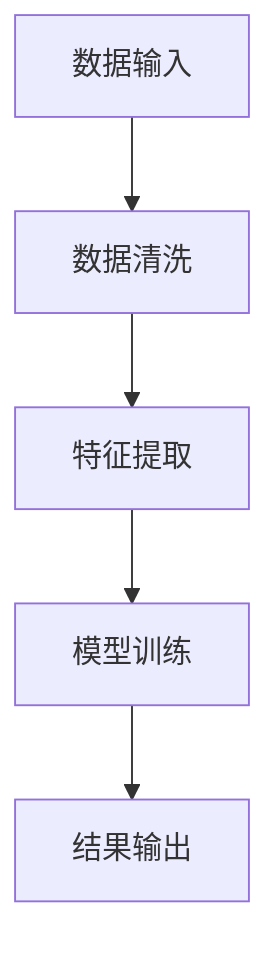
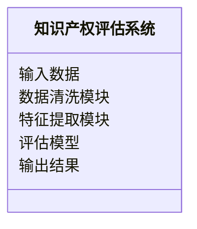
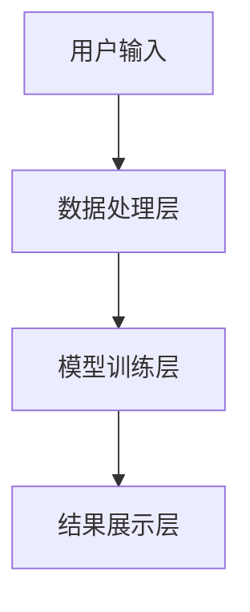
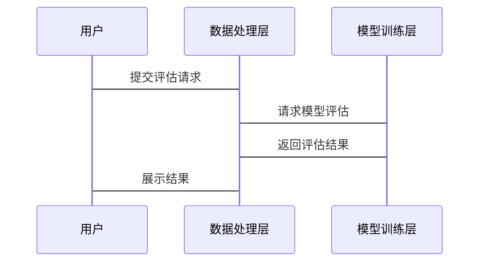

                 


# AI智能体在评估公司知识产权价值中的作用

> 关键词：AI智能体，知识产权评估，机器学习，算法原理，系统架构

> 摘要：随着人工智能技术的快速发展，AI智能体在知识产权评估中的应用越来越广泛。本文详细探讨了AI智能体在知识产权评估中的作用，分析了其核心算法原理，提出了系统的解决方案，并通过实际案例展示了其应用价值。文章内容涵盖知识产权评估的背景与概念、AI智能体的工作原理、算法实现、系统架构设计以及项目实战等，为读者提供了全面的技术视角。

---

# 第1章：知识产权评估的背景与问题描述

## 1.1 知识产权的基本概念

### 1.1.1 知识产权的定义与范围
知识产权（Intellectual Property，IP）是指人们在智力活动中创造的成果所享有的权利，包括专利权、商标权、著作权、商业秘密等。知识产权的价值评估是企业决策中的重要环节，直接影响企业的资产管理和投资决策。

### 1.1.2 知识产权的分类与特点
知识产权可以分为无形资产和有形资产两类。无形资产包括专利、商标、版权等，而有形资产则包括技术秘密、商业秘密等。知识产权的特点包括专有性、地域性和时间性。

### 1.1.3 知识产权评估的重要性
知识产权评估是企业价值评估的重要组成部分，尤其是在高科技企业中。准确评估知识产权的价值，有助于企业优化资产配置、制定合理的定价策略，并为投融资提供依据。

---

## 1.2 AI智能体的基本概念

### 1.2.1 AI智能体的定义与类型
AI智能体（Artificial Intelligence Agent）是指在特定环境中能够感知并自主行动以实现目标的实体。根据智能体的智能水平，可以分为反应式智能体、基于模型的智能体和目标驱动的智能体。

### 1.2.2 AI智能体的核心技术
AI智能体的核心技术包括自然语言处理（NLP）、机器学习、深度学习和知识图谱等。这些技术使得智能体能够理解和分析复杂的数据，从而做出合理的决策。

### 1.2.3 AI智能体的应用场景
在知识产权评估中，AI智能体可以用于数据收集、特征提取、模型训练和结果输出等环节。其应用场景包括专利价值评估、商标相似性检测和版权侵权分析等。

---

## 1.3 AI智能体在知识产权评估中的作用

### 1.3.1 知识产权评估的传统方法与挑战
传统的知识产权评估方法包括市场法、成本法和收益法。然而，这些方法在数据获取、模型复杂性和计算效率方面存在诸多挑战。

### 1.3.2 AI智能体在知识产权评估中的优势
AI智能体能够通过大数据分析和机器学习模型，快速准确地评估知识产权的价值。其优势体现在数据处理能力、计算效率和结果准确性等方面。

### 1.3.3 问题背景与问题解决路径
知识产权评估的核心问题是如何量化其价值。通过引入AI智能体，可以构建高效的评估模型，解决传统方法的不足。

---

# 第2章：知识产权评估模型与AI智能体原理

## 2.1 知识产权评估模型

### 2.1.1 评估模型的构建与核心要素
知识产权评估模型的构建需要考虑评估目标、数据来源、模型算法和评估指标等因素。核心要素包括专利技术领域、法律状态和市场价值等。

### 2.1.2 不同类型知识产权的评估方法
不同类型的知识产权（如专利、商标）具有不同的评估方法。例如，专利评估可以基于技术复杂性和市场竞争力，而商标评估可以基于品牌知名度和市场占有率。

### 2.1.3 评估模型的优劣势对比
传统评估方法和AI智能体方法各有优劣。传统方法适用于简单评估，而AI方法则适用于复杂场景。

---

## 2.2 AI智能体的工作原理

### 2.2.1 数据采集与处理
AI智能体通过爬取专利数据库、商标数据库等来源获取数据，并进行清洗和预处理。

### 2.2.2 模型训练与优化
基于机器学习算法，构建知识产权评估模型，并通过训练数据优化模型性能。

### 2.2.3 结果输出与反馈机制
智能体根据模型输出评估结果，并根据反馈不断优化模型。

---

## 2.3 核心概念对比分析

### 2.3.1 传统评估方法与AI智能体的对比
传统方法依赖人工经验，而AI方法基于数据驱动，能够快速处理大量数据。

### 2.3.2 不同AI智能体算法的优劣势分析
例如，基于规则的智能体适合简单场景，而基于学习的智能体适合复杂场景。

### 2.3.3 知识产权评估中的关键属性特征
关键属性包括创新性、技术复杂性和市场潜力等。

---

# 第3章：AI智能体的算法原理与数学模型

## 3.1 知识产权评估的机器学习模型

### 3.1.1 机器学习算法的选择与应用
常用的算法包括支持向量机（SVM）、随机森林和神经网络等。

### 3.1.2 模型训练流程与优化方法
包括数据预处理、特征选择、模型训练和超参数调优。

### 3.1.3 算法的数学模型与公式
例如，线性回归模型：$$ y = \beta_0 + \beta_1x + \epsilon $$

---

## 3.2 基于AI智能体的评估流程

### 3.2.1 数据预处理与特征提取
数据清洗、特征工程等步骤是模型训练的基础。

### 3.2.2 模型训练与验证
通过交叉验证评估模型性能。

### 3.2.3 结果分析与解释
对评估结果进行解读，并提出改进建议。

---

## 3.3 算法流程图



---

# 第4章：系统分析与架构设计方案

## 4.1 系统功能设计

### 4.1.1 领域模型设计


### 4.1.2 系统架构设计


---

## 4.2 系统接口与交互设计

### 4.2.1 系统接口设计
包括数据接口和模型接口。

### 4.2.2 系统交互流程


---

# 第5章：项目实战

## 5.1 环境配置

### 5.1.1 环境搭建
安装Python、TensorFlow和Scikit-learn等工具。

## 5.2 核心代码实现

### 5.2.1 数据预处理代码
```python
import pandas as pd
data = pd.read_csv('ip_data.csv')
data_cleaned = data.dropna()
```

### 5.2.2 模型训练代码
```python
from sklearn.model import SVC
model = SVC()
model.fit(X_train, y_train)
```

## 5.3 案例分析与解读

### 5.3.1 案例分析
分析某公司专利的价值评估过程。

### 5.3.2 结果解读
解读模型输出结果，并分析其准确性。

---

## 5.4 项目小结

项目实战展示了AI智能体在知识产权评估中的实际应用，验证了模型的有效性。

---

# 第6章：总结与展望

## 6.1 全文总结

本文详细探讨了AI智能体在知识产权评估中的作用，分析了其算法原理和系统架构，并通过案例展示了其应用价值。

## 6.2 应用中的注意事项

在实际应用中，需要注意数据质量和模型解释性问题。

## 6.3 未来展望

未来，AI智能体在知识产权评估中的应用将更加广泛，技术也将更加成熟。

---

# 作者：AI天才研究院 & 禅与计算机程序设计艺术

