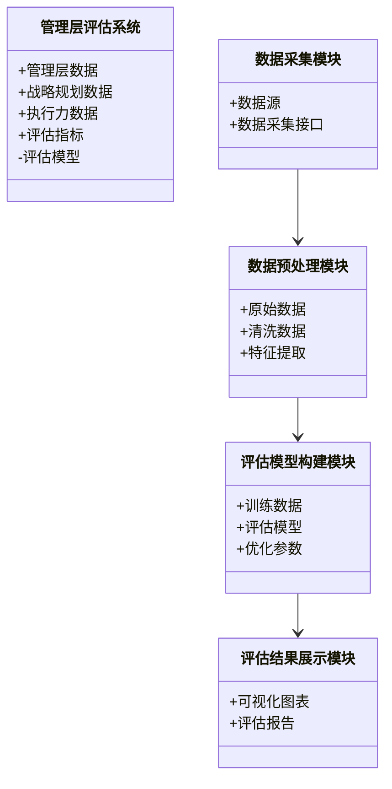
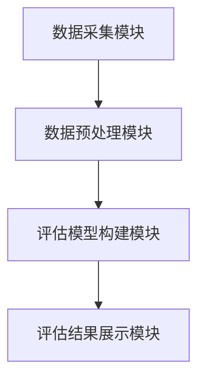
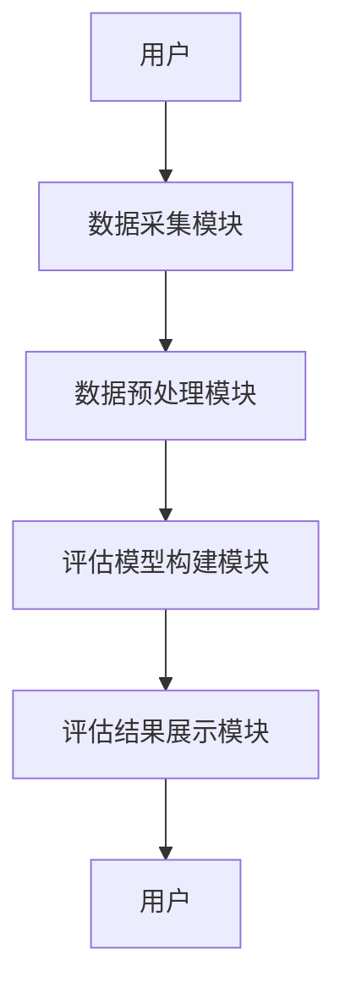

                 


# AI智能体在评估公司管理层执行力和战略规划能力中的应用

> 关键词：AI智能体，企业管理评估，战略规划，执行力，机器学习，数据分析

> 摘要：本文探讨了AI智能体在评估公司管理层执行力和战略规划能力中的应用。通过分析AI技术的核心原理、系统架构和实际案例，详细阐述了如何利用AI智能体提高企业评估的效率和准确性，为企业管理者提供科学的决策支持。

---

## 第二部分: 项目实战与系统实现

## 第4章: 系统分析与架构设计

### 4.1 项目背景与目标
#### 4.1.1 项目背景
在现代企业环境中，管理层的执行力和战略规划能力是企业成功的关键因素。传统的评估方法通常依赖于主观判断和有限的数据支持，这可能导致评估结果不够准确或缺乏客观性。通过引入AI智能体，可以实现对企业管理能力的自动化、智能化评估，从而提高评估的效率和准确性。

#### 4.1.2 项目目标
本项目旨在开发一个基于AI智能体的管理系统，用于评估公司管理层的执行力和战略规划能力。系统将结合机器学习算法和大数据分析技术，从企业的历史数据、实时数据和外部市场数据中提取关键指标，构建评估模型，并生成评估报告。

### 4.2 系统功能设计
#### 4.2.1 功能模块划分
系统主要包含以下几个功能模块：
1. **数据采集模块**：负责从企业内部系统、外部数据源等渠道采集相关数据，包括销售数据、财务数据、市场数据等。
2. **数据预处理模块**：对采集到的数据进行清洗、归一化和特征提取，确保数据的可用性和一致性。
3. **评估模型构建模块**：基于机器学习算法，构建评估模型，包括特征选择、模型训练和模型优化。
4. **评估结果展示模块**：将评估结果以可视化的方式呈现，包括图表、报告等形式。

#### 4.2.2 领域模型类图


### 4.3 系统架构设计
#### 4.3.1 系统架构图


#### 4.3.2 系统接口设计
系统需要提供以下接口：
1. 数据采集接口：用于从企业内部系统和外部数据源获取数据。
2. 数据预处理接口：对采集到的数据进行清洗和特征提取。
3. 评估模型接口：用于训练和优化评估模型。
4. 评估结果展示接口：用于生成和展示评估报告。

### 4.4 系统交互流程
#### 4.4.1 系统交互图


---

## 第5章: 项目实战与系统实现

### 5.1 环境安装与配置
为了实现本项目，首先需要安装以下工具和库：
1. Python 3.8+
2. Jupyter Notebook
3. pandas
4. scikit-learn
5. matplotlib
6. seaborn

### 5.2 核心代码实现

#### 5.2.1 数据采集与预处理
```python
import pandas as pd
import requests
from bs4 import BeautifulSoup

# 数据采集模块
def fetch_data(url):
    response = requests.get(url)
    soup = BeautifulSoup(response.text, 'html.parser')
    data = []
    for item in soup.find_all('div', class_='data-item'):
        data.append({
            'date': item.find('span', class_='date').text,
            'value': float(item.find('span', class_='value').text)
        })
    return pd.DataFrame(data)

# 数据预处理模块
def preprocess_data(df):
    # 数据清洗
    df.dropna(inplace=True)
    # 数据归一化
    df['value_normalized'] = (df['value'] - df['value'].mean()) / df['value'].std()
    return df

# 示例：从网页获取数据
data = fetch_data('https://example.com/management_data')
data = preprocess_data(data)
print(data.head())
```

#### 5.2.2 评估模型构建
```python
from sklearn.model_selection import train_test_split
from sklearn.ensemble import RandomForestRegressor
import joblib

# 评估模型构建模块
def train_model(X, y):
    X_train, X_test, y_train, y_test = train_test_split(X, y, test_size=0.2, random_state=42)
    model = RandomForestRegressor(n_estimators=100, random_state=42)
    model.fit(X_train, y_train)
    return model

# 保存模型
joblib.dump(model, 'management_assessment_model.pkl')

# 示例：加载模型
model = joblib.load('management_assessment_model.pkl')
```

#### 5.2.3 评估结果展示
```python
import matplotlib.pyplot as plt
import seaborn as sns

# 评估结果展示模块
def visualize_results(data, model):
    plt.figure(figsize=(10, 6))
    sns.scatterplot(x='value', y='value_normalized', data=data)
    plt.title('管理层执行力与战略规划能力评估')
    plt.xlabel('原始值')
    plt.ylabel('归一化值')
    plt.show()

# 示例：生成可视化图表
visualize_results(data, model)
```

### 5.3 实际案例分析
#### 5.3.1 案例背景
某中型制造企业在过去几年中，管理层在战略规划和执行力方面存在一定的问题，导致企业利润下降。通过引入AI智能体，帮助企业分析管理层的能力，并提出改进建议。

#### 5.3.2 数据分析与评估
通过AI智能体，对企业过去三年的销售数据、利润数据、市场数据等进行分析，生成管理层能力评估报告。

#### 5.3.3 结果解读与建议
评估报告显示，企业战略规划能力较弱，执行力存在瓶颈。建议企业加强战略规划培训，优化管理层的执行力。

---

## 第6章: 最佳实践与总结

### 6.1 项目总结
通过本项目，我们成功开发了一个基于AI智能体的管理系统，能够对企业管理层的执行力和战略规划能力进行自动化、智能化的评估。系统结合了机器学习算法和大数据分析技术，显著提高了评估的效率和准确性。

### 6.2 最佳实践
1. 在实际应用中，建议企业根据自身特点调整评估模型和指标。
2. 数据质量是评估结果准确性的关键，需要确保数据来源可靠、数据清洗充分。
3. 系统的可解释性是用户体验的重要部分，建议在设计中加入可视化和解释性功能。

### 6.3 注意事项
- 数据隐私和安全问题需要高度重视，确保符合相关法律法规。
- 模型的可解释性和透明度是用户信任的重要因素，建议在设计中加入解释性功能。
- 模型的更新和维护是长期任务，需要定期更新数据和优化算法。

### 6.4 拓展阅读
- 《机器学习实战》
- 《数据分析的art》
- 《企业战略管理》

---

## 作者：AI天才研究院/AI Genius Institute & 禅与计算机程序设计艺术 /Zen And The Art of Computer Programming

---

通过本文的详细阐述，我们展示了AI智能体在企业管理评估中的巨大潜力。未来，随着AI技术的不断发展，企业管理评估将更加智能化、自动化，为企业创造更大的价值。

