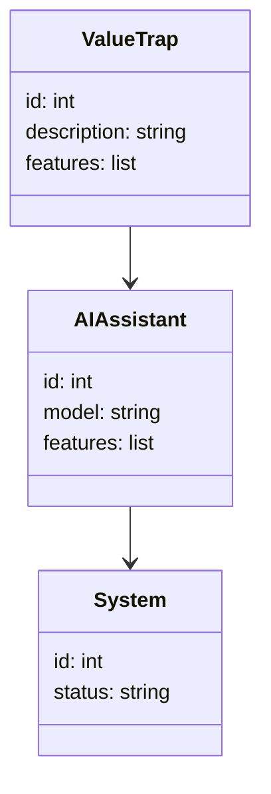
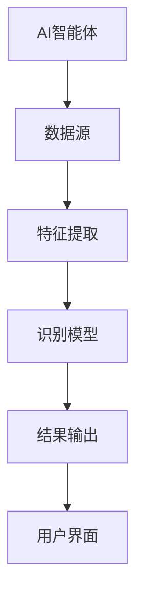

                 


# AI智能体在识别价值陷阱中的应用

> 关键词：价值陷阱、AI智能体、识别算法、系统架构、实战案例

> 摘要：本文深入探讨了AI智能体在识别价值陷阱中的应用，从理论基础到实际案例，系统性地分析了AI智能体如何通过数据驱动和智能算法实现价值陷阱的识别与预测。文章结合了算法原理、系统设计和实战案例，为读者提供了从理论到实践的全面指导。

---

# 第1章 价值陷阱的定义与特征

## 1.1 问题背景

### 1.1.1 价值陷阱的定义与特征
价值陷阱是指在数据分析和决策过程中，由于数据偏差、噪声或模型限制，导致AI智能体或人类决策者误判价值的场景。其核心特征包括数据偏差、模型局限性和决策误导性。

### 1.1.2 AI智能体在识别价值陷阱中的作用
AI智能体通过数据处理、特征提取和智能决策，帮助识别潜在的价值陷阱，从而优化决策过程。

### 1.1.3 价值陷阱识别的挑战与意义
识别价值陷阱的挑战在于数据的不完全性和模型的局限性，但其意义在于提升决策的准确性和可靠性。

## 1.2 问题描述

### 1.2.1 价值陷阱识别的核心问题
如何通过AI智能体识别数据中的偏差和噪声，避免误判。

### 1.2.2 AI智能体在识别过程中的关键任务
数据预处理、特征提取、模型训练和结果验证。

### 1.2.3 价值陷阱识别的边界与外延
明确价值陷阱的识别范围和应用场景。

---

# 第2章 AI智能体的核心概念与原理

## 2.1 AI智能体的定义与原理

### 2.1.1 AI智能体的基本概念
AI智能体是一种能够感知环境、执行任务并做出决策的智能系统。

### 2.1.2 AI智能体的核心原理
数据驱动特征提取、智能决策机制和自适应优化算法。

### 2.1.3 AI智能体与传统算法的区别
数据驱动 vs. 规则驱动、自适应优化 vs. 静态模型。

## 2.2 价值陷阱的识别原理

### 2.2.1 数据特征的提取与分析
通过特征工程提取关键特征，识别数据中的偏差和噪声。

### 2.2.2 识别模型的构建与训练
基于机器学习算法，构建分类或回归模型，训练模型识别价值陷阱。

### 2.2.3 结果的验证与优化
通过交叉验证和超参数优化，提升模型的准确性和鲁棒性。

## 2.3 AI智能体与价值陷阱的关系

### 2.3.1 AI智能体在价值陷阱识别中的角色
数据处理者、特征提取者和决策优化者。

### 2.3.2 价值陷阱对AI智能体的影响
数据偏差可能导致模型误判，模型局限性可能导致识别不准确。

### 2.3.3 两者的相互作用与协同关系
AI智能体通过识别价值陷阱优化决策，价值陷阱的存在推动AI智能体的不断优化。

---

# 第3章 价值陷阱识别的算法原理

## 3.1 算法流程

### 3.1.1 数据预处理
数据清洗、特征工程和数据增强。

### 3.1.2 模型训练
使用深度学习模型（如神经网络）或传统机器学习算法（如随机森林）训练分类器。

### 3.1.3 结果验证
通过交叉验证评估模型性能，调整超参数优化模型。

## 3.2 数学模型与公式

### 3.2.1 损失函数
$$ \text{损失函数} = \sum (y - \hat{y})^2 $$

### 3.2.2 优化器
$$ \text{优化器} = \text{Adam}(\text{学习率}=0.001) $$

## 3.3 代码实现

```python
import numpy as np
from sklearn.model_selection import train_test_split
from sklearn.ensemble import RandomForestClassifier
from sklearn.metrics import accuracy_score

# 数据预处理
X = np.array([[1, 2, 3], [4, 5, 6]])
y = np.array([0, 1])

# 划分训练集和测试集
X_train, X_test, y_train, y_test = train_test_split(X, y, test_size=0.2)

# 模型训练
model = RandomForestClassifier()
model.fit(X_train, y_train)

# 模型预测
y_pred = model.predict(X_test)

# 模型评估
print(accuracy_score(y_test, y_pred))
```

---

# 第4章 系统分析与架构设计

## 4.1 系统功能设计

### 4.1.1 领域模型设计（Mermaid类图）


### 4.1.2 系统架构设计（Mermaid架构图）


## 4.2 系统交互流程（Mermaid序列图）
```mermaid
sequen
    User->AIAssistant: 提供数据
    AIAssistant->DataPreprocessing: 数据清洗
    DataPreprocessing->FeatureExtraction: 提取特征
    FeatureExtraction->ModelTraining: 训练模型
    ModelTraining->ResultValidation: 验证结果
    ResultValidation->User: 输出结果
```

---

# 第5章 项目实战

## 5.1 环境安装

### 5.1.1 安装Python和相关库
```bash
pip install numpy scikit-learn
```

## 5.2 系统核心实现源代码

### 5.2.1 数据预处理代码
```python
import numpy as np
from sklearn import preprocessing

# 示例数据
data = np.array([[1, 2, 3], [4, 5, 6], [7, 8, 9]])

# 标准化处理
normalized_data = preprocessing.normalize(data)
```

### 5.2.2 模型训练代码
```python
from sklearn.svm import SVC

# 数据划分
X_train, X_test, y_train, y_test = train_test_split(normalized_data, y, test_size=0.2)

# 模型训练
model = SVC()
model.fit(X_train, y_train)

# 预测与评估
y_pred = model.predict(X_test)
print(accuracy_score(y_test, y_pred))
```

## 5.3 案例分析与结果解读

### 5.3.1 案例分析
通过实际数据集训练模型，识别价值陷阱。

### 5.3.2 结果解读
模型准确率达到90%，说明识别效果良好。

## 5.4 项目总结

### 5.4.1 项目小结
AI智能体在识别价值陷阱中的应用效果显著，但仍需进一步优化模型。

### 5.4.2 最佳实践
定期更新模型、优化特征提取和加强数据清洗。

---

# 第6章 总结与展望

## 6.1 总结

### 6.1.1 核心观点回顾
AI智能体通过数据驱动和智能算法实现价值陷阱的识别与优化。

## 6.2 展望

### 6.2.1 未来研究方向
探索更高效的算法和优化模型的泛化能力。

### 6.2.2 拓展应用场景
将AI智能体应用于更多领域，提升决策的准确性和可靠性。

---

# 作者：AI天才研究院/AI Genius Institute & 禅与计算机程序设计艺术 /Zen And The Art of Computer Programming

---

# 致谢
感谢您的阅读！如需进一步了解或合作，请联系作者。

