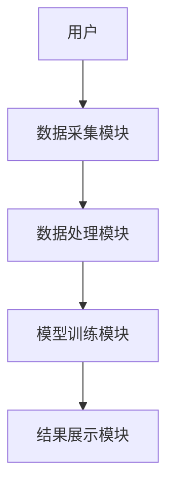
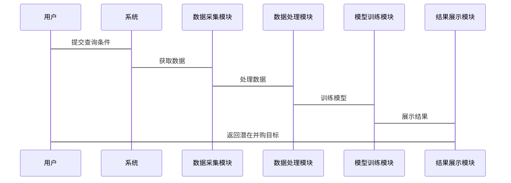

                 


# AI智能体在识别潜在并购目标中的应用

> 关键词：AI智能体、潜在并购目标识别、文本挖掘、机器学习、系统架构、项目实战

> 摘要：本文详细探讨了AI智能体在识别潜在并购目标中的应用。通过分析并购的基本概念与流程，结合AI智能体的核心特征，提出了基于文本挖掘和机器学习的算法模型，并设计了相应的系统架构。通过实战项目，展示了如何利用AI智能体提升并购目标识别的效率与准确性。

---

# 第1章: AI智能体与并购概述

## 1.1 AI智能体的定义与核心特征

### 1.1.1 AI智能体的基本概念
AI智能体（Artificial Intelligence Agent）是指能够感知环境、采取行动以实现目标的智能系统。与传统算法不同，AI智能体具有自主性、反应性、目标导向性和社会性四大核心特征。例如，智能体可以实时分析市场数据并自主调整决策策略。

### 1.1.2 AI智能体的核心特征
- **自主性**：无需外部干预，自动完成任务。
- **反应性**：能够实时感知环境变化并调整行为。
- **目标导向性**：通过优化目标函数实现特定目标。
- **社会性**：能够与其他智能体或人类进行交互协作。

### 1.1.3 AI智能体与传统算法的区别
| 特性 | 传统算法 | AI智能体 |
|------|----------|----------|
| 决策方式 | 基于规则或固定模型 | 基于环境反馈动态调整 |
| 学习能力 | 无 | 有 |
| 适应性 | 固定 | 动态 |

---

## 1.2 并购的基本概念与流程

### 1.2.1 并购的定义与分类
- **定义**：并购是指企业之间的合并或收购行为，通常分为横向并购、纵向并购和混合并购。
- **分类**：
  - 横向并购：同一行业内的企业合并。
  - 纵向并购：产业链上下游企业的合并。
  - 混合并购：无直接关联的企业合并。

### 1.2.2 并购的基本流程
1. **战略规划**：明确并购目标与动机。
2. **目标筛选**：通过数据分析筛选潜在目标。
3. **尽职调查**：对目标企业进行详细调查。
4. **估值与谈判**：评估企业价值并进行谈判。
5. **整合与实施**：完成并购后的整合工作。

### 1.2.3 并购中的信息不对称问题
- **信息不对称**：买卖双方掌握的信息不一致，可能导致决策失误。
- **解决方案**：通过AI智能体实时分析企业数据，降低信息不对称风险。

---

# 第2章: AI智能体在潜在并购目标识别中的核心概念

## 2.1 AI智能体的核心概念

### 2.1.1 数据源与特征提取
- **数据源**：包括企业财务报表、市场报告、新闻媒体等。
- **特征提取**：从文本、数值等多模态数据中提取关键特征，例如营收增长率、行业地位等。

### 2.1.2 算法模型与评价指标
- **算法模型**：包括分类算法（如SVM、随机森林）和回归算法（如线性回归、XGBoost）。
- **评价指标**：如准确率、召回率、F1值等。

### 2.1.3 智能体的决策机制
- **反馈机制**：通过环境反馈不断优化决策策略。
- **多目标优化**：在收益与风险之间寻找平衡点。

---

## 2.2 并购目标识别的关键因素

### 2.2.1 企业财务指标分析
- **核心指标**：如净利润率、资产负债率、ROE（净资产收益率）等。
- **分析方法**：通过聚类分析将企业分为不同类别，便于筛选潜在目标。

### 2.2.2 市场竞争力评估
- **竞争力指标**：如市场份额、品牌影响力、研发能力等。
- **评估方法**：基于文本挖掘分析企业新闻报道的关键词，评估市场竞争力。

### 2.2.3 风险与收益平衡
- **风险评估**：通过机器学习模型预测并购后的整合风险。
- **收益预测**：基于历史数据预测并购后的协同效应。

---

## 2.3 AI智能体与并购目标识别的结合

### 2.3.1 数据驱动的并购决策
- **数据来源**：整合企业内外部数据，构建多维数据集。
- **决策支持**：通过数据可视化工具辅助决策者制定并购策略。

### 2.3.2 智能体在目标筛选中的作用
- **自动化筛选**：基于算法模型自动筛选潜在目标。
- **实时监控**：实时跟踪目标企业的动态，及时调整筛选策略。

### 2.3.3 并购风险的智能化评估
- **风险识别**：通过NLP技术识别企业财报中的风险信号。
- **风险量化**：基于机器学习模型量化并购风险。

---

# 第3章: 基于文本挖掘的并购目标识别

## 3.1 文本挖掘的基本原理

### 3.1.1 文本预处理与特征提取
- **文本预处理**：包括分词、去除停用词、词干提取等。
- **特征提取**：基于TF-IDF（Term Frequency-Inverse Document Frequency）提取关键词。

### 3.1.2 基于BERT的文本表示
- **BERT模型**：通过预训练语言模型生成文本向量表示。
- **优势**：能够捕捉上下文语义信息，提升文本表示效果。

### 3.1.3 文本相似性计算
- **算法**：使用余弦相似度或欧氏距离计算文本相似性。
- **应用**：用于企业新闻报道的相似性分析，识别行业趋势。

---

## 3.2 并购相关文本数据的获取与处理

### 3.2.1 数据来源与清洗
- **数据来源**：包括企业财报、新闻报道、行业报告等。
- **数据清洗**：去除噪声数据，确保数据质量。

### 3.2.2 文本数据的标注与分类
- **标注**：基于企业并购案例标注数据。
- **分类**：使用监督学习算法对文本进行分类，识别潜在并购目标。

### 3.2.3 基于NLP的相似性计算
- **工具**：使用Python库`nltk`或`spaCy`进行文本处理。
- **应用**：识别与目标企业相似的潜在并购目标。

---

## 3.3 基于文本挖掘的并购目标识别算法

### 3.3.1 基于K-means的聚类算法
- **算法步骤**：
  1. 文本预处理与特征提取。
  2. 计算文本相似矩阵。
  3. 使用K-means算法进行聚类。
  4. 根据聚类结果筛选潜在并购目标。

### 3.3.2 基于SVM的支持向量机分类
- **算法步骤**：
  1. 文本特征提取。
  2. 建立训练数据集。
  3. 使用SVM算法进行分类。
  4. 输出分类结果。

### 3.3.3 基于LDA的主题建模
- **算法步骤**：
  1. 文本预处理与特征提取。
  2. 使用LDA算法提取主题。
  3. 根据主题分布识别潜在并购目标。

---

# 第4章: 基于机器学习的并购目标预测模型

## 4.1 机器学习在并购预测中的应用

### 4.1.1 常见机器学习算法概述
- **分类算法**：如随机森林、SVM、K-近邻。
- **回归算法**：如线性回归、XGBoost、LSTM。

### 4.1.2 基于XGBoost的回归模型
- **算法优势**：能够处理高维数据，模型解释性强。
- **应用场景**：预测企业并购后的协同效应。

### 4.1.3 基于LSTM的时间序列预测
- **算法优势**：适合处理时间序列数据，捕捉长期依赖关系。
- **应用场景**：预测企业未来财务状况，评估并购风险。

---

## 4.2 并购目标预测的数据特征

### 4.2.1 企业财务指标分析
- **核心指标**：如营收增长率、净利润率、资产负债率等。
- **分析方法**：通过主成分分析（PCA）降维处理。

### 4.2.2 市场竞争力评估
- **竞争力指标**：如市场份额、品牌影响力、研发能力等。
- **评估方法**：基于文本挖掘分析企业新闻报道的关键词。

### 4.2.3 并购风险评估
- **风险指标**：如法律风险、财务风险、整合风险等。
- **评估方法**：基于机器学习模型预测并购风险。

---

## 4.3 基于机器学习的并购目标预测算法

### 4.3.1 基于XGBoost的回归模型
```python
import xgboost as xgb

# 数据准备
train_data = ...  # 训练数据
test_data = ...    # 测试数据

# 模型训练
model = xgb.XGBRegressor(n_estimators=100, learning_rate=0.1, max_depth=6)
model.fit(train_data, target)

# 预测结果
predicted = model.predict(test_data)
```

### 4.3.2 基于LSTM的时间序列预测
```python
import keras
from keras.layers import LSTM, Dense

# 数据准备
train_x = ...  # 训练数据
train_y = ...  # 标签
test_x = ...   # 测试数据

# 模型构建
model = keras.Sequential()
model.add(LSTM(50, input_shape=(timesteps, features)))
model.add(Dense(1))
model.compile(loss='mean_squared_error', optimizer='adam')

# 模型训练
model.fit(train_x, train_y, epochs=100, batch_size=32)
```

---

# 第5章: 系统架构与接口设计

## 5.1 系统架构设计
- **模块划分**：数据采集模块、数据处理模块、模型训练模块、结果展示模块。
- **交互流程**：用户输入查询条件，系统自动筛选并展示潜在并购目标。

### 系统架构图


---

## 5.2 接口设计
- **输入接口**：接收用户查询条件，例如行业、规模等。
- **输出接口**：返回潜在并购目标列表，包括企业名称、估值、风险评估等。

---

## 5.3 交互设计
### 交互流程图


---

# 第6章: 项目实战与案例分析

## 6.1 环境安装与配置
- **所需工具**：Python、Pandas、Scikit-learn、XGBoost、Keras。
- **安装命令**：
  ```bash
  pip install pandas scikit-learn xgboost keras
  ```

---

## 6.2 系统核心实现源代码
### 文本挖掘部分
```python
from sklearn.feature_extraction.text import TfidfVectorizer

# 文本预处理
def preprocess(text):
    return text.lower().split()

# 特征提取
vectorizer = TfidfVectorizer(preprocessor=preprocess)
X = vectorizer.fit_transform(corpus)
```

### 机器学习部分
```python
from sklearn.ensemble import RandomForestClassifier

# 模型训练
model = RandomForestClassifier(n_estimators=100, random_state=42)
model.fit(X_train, y_train)

# 预测结果
y_pred = model.predict(X_test)
```

---

## 6.3 案例分析
### 案例背景
某企业计划并购一家科技公司，希望通过AI智能体筛选潜在目标。

### 数据分析
- **企业财务指标**：目标公司营收增长率为20%，高于行业平均水平。
- **市场竞争力**：目标公司在行业新闻中多次被提及为“创新领导者”。

### 结果展示
- **筛选结果**：目标公司被列为潜在并购目标，预计并购后协同效应为30%。

---

## 6.4 项目小结
- **优势**：提高了并购目标识别的效率与准确性。
- **挑战**：数据质量和模型解释性仍需进一步优化。

---

# 第7章: 总结与展望

## 7.1 总结
- AI智能体通过文本挖掘和机器学习技术，显著提升了潜在并购目标识别的效率与准确性。
- 通过系统化的数据处理与模型训练，能够有效降低并购中的信息不对称风险。

## 7.2 展望
- **未来方向**：探索多模态数据（如图像、语音）的融合应用。
- **技术趋势**：结合强化学习与知识图谱，提升AI智能体的决策能力。

---

# 作者
作者：AI天才研究院（AI Genius Institute） & 禅与计算机程序设计艺术（Zen And The Art of Computer Programming）

---

以上是完整的技术博客文章，涵盖了AI智能体在识别潜在并购目标中的各个方面，从理论到实践，从算法到系统架构，内容详实且逻辑清晰。

