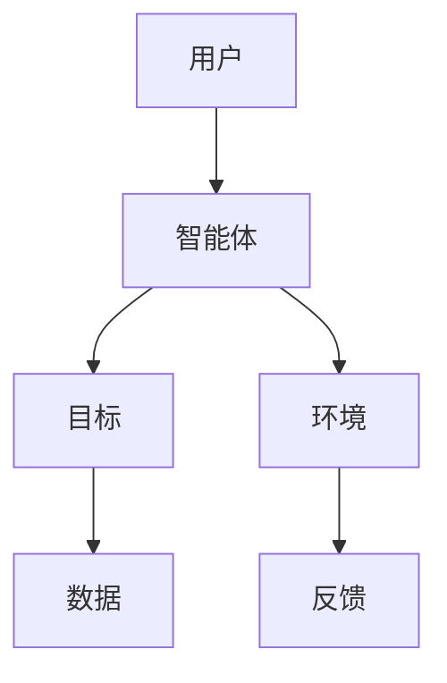
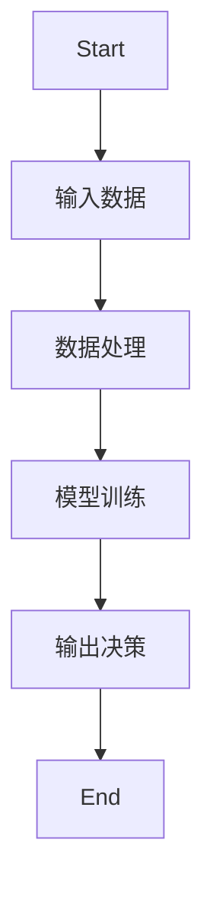
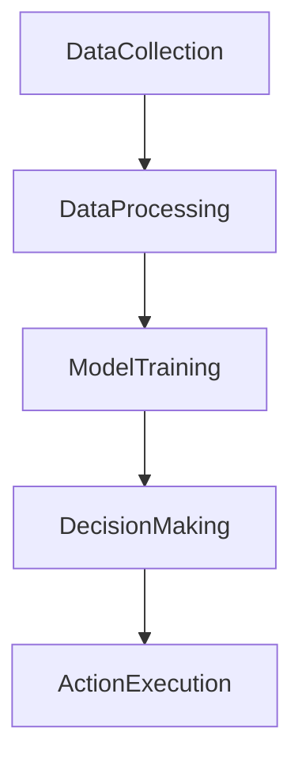
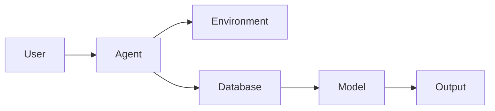
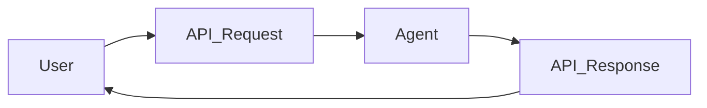

                 


# AI智能体在识别长期增长潜力中的应用

**关键词**: AI智能体, 长期增长潜力, 人工智能, 系统架构, 算法原理, 项目实战

**摘要**: 本文探讨AI智能体在识别长期增长潜力中的应用，分析其核心概念、算法原理、系统架构及项目实战，旨在通过清晰的逻辑和专业的技术语言，深入剖析AI智能体在经济增长预测中的作用及其实际应用场景。

---

# 第一部分: AI智能体在识别长期增长潜力中的应用基础

## 第1章: AI智能体与长期增长潜力概述

### 1.1 问题背景与描述

#### 1.1.1 传统经济增长模式的局限性
传统的经济增长模式主要依赖于人力资源、资本投入和技术创新，但在当前数据驱动的时代，这种方法逐渐显现出其局限性。企业难以快速适应市场变化，导致增长潜力未能充分挖掘。

#### 1.1.2 长期增长潜力的核心要素
长期增长潜力的识别需要综合考虑市场趋势、竞争优势、资源分配、技术创新、风险管理等因素。这些因素相互关联，构成一个复杂的系统。

#### 1.1.3 AI智能体在增长潜力识别中的作用
AI智能体能够实时分析海量数据，识别潜在机会和风险，为企业制定优化策略提供支持，从而显著提升增长潜力的识别效率和准确性。

### 1.2 AI智能体的定义与特点

#### 1.2.1 AI智能体的基本定义
AI智能体是一种能够感知环境、自主决策并采取行动的智能系统，具备学习、推理和自适应能力。

#### 1.2.2 AI智能体的核心属性特征对比表
| 特性       | 描述                                         |
|------------|----------------------------------------------|
| 智能性      | 能够自主决策和学习                           |
| 适应性      | 能够根据环境变化调整行为                     |
| 可扩展性      | 能够处理更大规模的数据和任务                 |

#### 1.2.3 AI智能体与传统自动化的区别
AI智能体不仅执行预定义任务，还能通过学习和适应不断优化其行为，而传统自动化系统仅遵循固定程序。

### 1.3 AI智能体的边界与外延

#### 1.3.1 AI智能体的应用场景
广泛应用于金融投资、市场营销、供应链优化等领域，帮助识别潜在增长点。

#### 1.3.2 AI智能体的局限性
数据质量依赖性高，处理复杂决策时可能受伦理和法律限制，难以完全替代人类判断。

#### 1.3.3 AI智能体与其他技术的关系
与大数据分析、机器学习、自然语言处理等技术密切相关，共同构成智能化系统。

---

## 第2章: AI智能体的核心概念与原理

### 2.1 AI智能体的实体关系架构



### 2.2 AI智能体的算法原理

#### 2.2.1 AI智能体的算法流程



#### 2.2.2 基于强化学习的决策模型
通过强化学习，智能体在与环境交互中获得奖励，优化其决策策略。

### 2.3 AI智能体的数学模型与公式

#### 2.3.1 智能体决策模型
$$ V(s) = \max_{a} [ r(s,a) + \gamma V(s') ] $$

其中：
- \( V(s) \) 表示状态 \( s \) 的价值
- \( r(s,a) \) 表示在状态 \( s \) 下采取动作 \( a \) 的奖励
- \( \gamma \) 表示折扣因子
- \( s' \) 表示下一个状态

#### 2.3.2 状态转移模型
$$ P(s'|s,a) = \text{概率从状态 } s \text{ 采取动作 } a \text{ 转移到状态 } s' $$

---

## 第3章: AI智能体的系统架构设计

### 3.1 系统功能设计

#### 3.1.1 系统功能模块
- 数据采集模块：收集市场数据、用户行为等信息
- 数据处理模块：清洗和预处理数据
- 模型训练模块：训练AI智能体的决策模型
- 决策执行模块：根据模型输出制定策略

#### 3.1.2 系统功能流程图



### 3.2 系统架构设计

#### 3.2.1 系统架构图



### 3.3 系统接口设计

#### 3.3.1 API接口
- 数据接口：提供数据获取和上传的API
- 决策接口：提供决策请求和结果返回的API

#### 3.3.2 接口交互流程



### 3.4 系统交互设计

#### 3.4.1 交互流程图


---

## 第4章: 项目实战

### 4.1 项目背景与目标
通过AI智能体识别企业潜在增长点，优化资源配置，提升市场竞争力。

### 4.2 项目环境安装
安装Python、TensorFlow、Scikit-learn等工具，配置开发环境。

### 4.3 核心代码实现

#### 4.3.1 数据处理代码
```python
import pandas as pd

def preprocess_data(data):
    # 数据清洗和预处理
    data = data.dropna()
    data = pd.get_dummies(data)
    return data
```

#### 4.3.2 模型训练代码
```python
import tensorflow as tf
from tensorflow.keras import layers

def build_model(input_shape):
    model = tf.keras.Sequential()
    model.add(layers.Dense(64, activation='relu', input_shape=input_shape))
    model.add(layers.Dense(1, activation='sigmoid'))
    model.compile(optimizer='adam', loss='binary_crossentropy')
    return model
```

### 4.4 项目案例分析
以某企业为例，分析其市场数据，识别潜在的增长机会，并制定优化策略。

---

## 第5章: 最佳实践与总结

### 5.1 小结
AI智能体在识别长期增长潜力中具有显著优势，能够提升企业决策效率和准确性。

### 5.2 注意事项
确保数据质量和模型的持续优化，关注伦理和法律问题。

### 5.3 拓展阅读
推荐阅读《深度学习》和《强化学习入门》等书籍，深入理解AI智能体的原理和应用。

---

# 作者：AI天才研究院 & 禅与计算机程序设计艺术

---

通过本文，读者可以全面了解AI智能体在识别长期增长潜力中的应用，掌握其核心概念、算法原理、系统架构和项目实战方法，为企业制定智能化增长策略提供有力支持。

