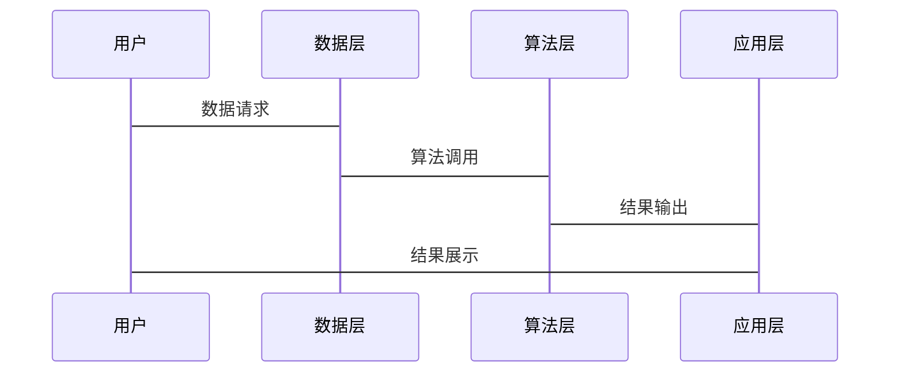

                 


# AI系统优化约翰伯格指数投资

> 关键词：AI系统优化，指数投资，约翰伯格，机器学习，金融优化

> 摘要：本文详细探讨了如何利用人工智能技术优化约翰伯格的指数投资策略。通过分析指数投资的基本原理，结合AI算法的数学模型和机器学习技术，提出了AI在指数投资中的优化方法，并通过实际案例分析验证了优化效果。文章还讨论了系统设计、项目实现和优化策略，为读者提供了全面的技术指导。

---

# 第一章: 指数投资与AI优化概述

## 1.1 指数投资的基本概念

### 1.1.1 指数投资的定义与特点
指数投资是一种被动投资策略，旨在通过跟踪特定市场指数的表现来获得长期稳定的投资收益。其核心思想是“买入并持有”，避免频繁交易和市场择时。指数投资的主要特点包括：
- 分散化：通过投资多个股票或债券来降低风险。
- 低成本：管理费用较低，适合长期投资。
- 简单有效：操作简单，长期收益稳定。

### 1.1.2 指数基金的核心原理
指数基金通过复制目标指数的成分股构成，实现与目标指数同步增长。其收益主要来源于指数成分股的分红和资本增值。指数基金的优势在于分散化和低成本，适合长期投资。

### 1.1.3 指数投资的历史与发展
指数投资起源于20世纪70年代，约翰伯格是该领域的先驱之一。随着金融市场的不断发展，指数投资逐渐成为一种主流的投资策略。近年来，随着人工智能技术的发展，指数投资的优化也成为研究热点。

## 1.2 AI在金融领域的应用背景

### 1.2.1 AI技术在金融中的应用现状
人工智能技术在金融领域的应用非常广泛，包括股票预测、风险评估、投资组合优化等。AI技术能够通过大数据分析和机器学习算法，发现传统方法难以察觉的市场规律。

### 1.2.2 AI如何优化投资决策
AI优化投资决策的核心在于通过数据挖掘和算法优化，提高投资策略的准确性和效率。例如，AI可以通过分析历史数据，预测未来市场的趋势，从而优化投资组合。

### 1.2.3 约翰伯格指数投资的AI优化潜力
约翰伯格的指数投资策略虽然简单有效，但仍然可以通过AI技术进一步优化。例如，AI可以优化指数成分股的选择，降低跟踪误差，提高投资收益。

---

# 第二章: 约翰伯格指数投资策略的核心概念

## 2.1 约翰伯格指数投资理论

### 2.1.1 约翰伯格的投资理念
约翰伯格强调长期投资和分散化，认为市场是有效的，主动管理难以跑赢指数。其指数投资理论的核心在于通过跟踪市场指数实现长期收益最大化。

### 2.1.2 指数投资的优势与局限性
指数投资的优势在于分散化和低成本，但其局限性在于无法避免市场整体波动，且成分股调整可能带来额外成本。

### 2.1.3 约翰伯格指数投资的数学模型
指数投资的收益可以通过以下公式计算：
$$
R = \sum_{i=1}^{n} w_i R_i
$$
其中，\( w_i \) 是成分股的权重，\( R_i \) 是成分股的收益。

## 2.2 AI优化指数投资的核心原理

### 2.2.1 AI在指数投资中的应用场景
AI可以通过大数据分析优化指数成分股的选择，提高投资组合的效率。例如，AI可以识别出具有更高收益潜力的股票，降低跟踪误差。

### 2.2.2 AI优化的指数投资策略
AI优化的指数投资策略包括：
1. **因子分析**：通过因子分析选择具有更高收益潜力的因子。
2. **机器学习模型**：利用机器学习模型预测市场趋势，优化投资组合。
3. **强化学习**：通过强化学习算法优化投资决策。

### 2.2.3 约翰伯格指数投资与AI优化的结合
AI优化可以进一步提升约翰伯格指数投资策略的效率和收益。例如，AI可以通过动态调整成分股权重，降低跟踪误差，提高投资收益。

## 2.3 核心概念对比分析

### 2.3.1 指数投资与主动投资的对比
| 对比维度 | 指数投资 | 主动投资 |
|----------|----------|----------|
| 管理方式 | 被动跟踪 | 主动管理 |
| 成本 | 低 | 高 |
| 风险 | 低 | 高 |

### 2.3.2 AI优化与传统优化的对比
| 对比维度 | 传统优化 | AI优化 |
|----------|----------|----------|
| 数据依赖 | 低 | 高 |
| 计算效率 | 低 | 高 |
| 精度 | 中等 | 高 |

### 2.3.3 约翰伯格指数投资的AI优化效果评估
通过对比分析，AI优化可以显著提高指数投资的收益和效率。例如，AI优化的指数基金可能在相同风险下实现更高的收益。

---

# 第三章: AI优化指数投资的算法原理

## 3.1 因子分析与特征选择

### 3.1.1 因子分析的定义与原理
因子分析是一种统计方法，用于识别数据中的潜在因子。在指数投资中，因子分析可以帮助识别影响股票收益的关键因素。

### 3.1.2 基于AI的特征选择方法
基于AI的特征选择方法包括：
1. **主成分分析（PCA）**：通过降维技术选择关键特征。
2. **Lasso回归**：通过L1正则化选择重要特征。
3. **随机森林**：通过特征重要性排序选择关键特征。

### 3.1.3 因子分析在指数投资中的应用
通过因子分析，可以识别出具有更高收益潜力的因子，从而优化指数成分股的选择。

## 3.2 机器学习模型在指数投资中的应用

### 3.2.1 常见机器学习算法简介
常用机器学习算法包括：
- 线性回归
- 支持向量机（SVM）
- 随机森林
- 神经网络

### 3.2.2 基于机器学习的指数预测模型
通过机器学习模型，可以预测股票的未来收益，从而优化指数成分股的选择。

### 3.2.3 模型训练与优化策略
模型训练需要使用历史数据，通过交叉验证选择最优模型，并通过网格搜索优化超参数。

## 3.3 强化学习在指数投资优化中的应用

### 3.3.1 强化学习的基本原理
强化学习是一种机器学习方法，通过智能体与环境的交互，学习最优策略。

### 3.3.2 强化学习在指数投资中的应用案例
例如，通过强化学习优化投资组合的动态调整，实现更高的收益。

### 3.3.3 强化学习的挑战与解决方案
强化学习的挑战包括高维状态空间和稀疏奖励。解决方案包括使用深度强化学习和经验回放。

## 3.4 算法实现与优化

### 3.4.1 算法实现的步骤与流程
1. 数据预处理
2. 特征选择
3. 模型训练
4. 模型优化
5. 投资组合优化

### 3.4.2 算法优化的策略与方法
1. 参数调优
2. 并行计算
3. 模型集成

### 3.4.3 算法实现的代码示例
以下是一个简单的机器学习模型实现代码：

```python
import numpy as np
import pandas as pd
from sklearn.linear_model import Lasso

# 数据预处理
data = pd.read_csv('data.csv')
X = data.drop('target', axis=1)
y = data['target']

# 特征选择
selector = Lasso(alpha=0.1)
selector.fit(X, y)
selected_features = np.where(selector.coef_ != 0)[0]

# 模型训练
model = Lasso(alpha=0.1)
model.fit(X.iloc[:, selected_features], y)

# 模型预测
y_pred = model.predict(X.iloc[:, selected_features])
```

---

# 第四章: 系统分析与架构设计方案

## 4.1 系统分析

### 4.1.1 问题场景介绍
系统需要优化约翰伯格的指数投资策略，通过AI技术实现指数成分股的动态调整。

### 4.1.2 项目介绍
项目目标是通过AI优化指数投资策略，实现更高的投资收益。

### 4.1.3 系统功能设计
系统功能包括：
1. 数据采集
2. 数据分析
3. 投资组合优化
4. 系统监控

### 4.1.4 系统架构设计
系统架构包括数据层、算法层和应用层。

### 4.1.5 系统接口设计
系统接口包括数据接口、算法接口和用户接口。

### 4.1.6 系统交互设计
系统交互包括数据输入、算法调用和结果输出。

## 4.2 系统功能设计

### 4.2.1 领域模型设计
领域模型包括数据层、算法层和应用层。

### 4.2.2 系统架构设计
系统架构设计使用以下Mermaid图：


### 4.2.3 系统接口设计
系统接口设计包括数据接口、算法接口和用户接口。

### 4.2.4 系统交互设计
系统交互设计使用以下Mermaid图：



---

# 第五章: 项目实战

## 5.1 项目实战环境配置

### 5.1.1 环境需求
需要安装Python、Pandas、Scikit-learn等库。

### 5.1.2 环境安装
安装Python和相关库：

```bash
pip install numpy pandas scikit-learn
```

## 5.2 系统核心实现

### 5.2.1 核心代码实现
以下是一个优化指数投资的代码示例：

```python
import numpy as np
import pandas as pd
from sklearn.ensemble import RandomForestRegressor

# 数据预处理
data = pd.read_csv('data.csv')
X = data.drop('target', axis=1)
y = data['target']

# 特征选择
model = RandomForestRegressor(n_estimators=100)
model.fit(X, y)
feature_importance = model.feature_importances_

# 投资组合优化
selected_features = X.columns[feature_importance > np.percentile(feature_importance, 75)]
optimized_weights = model.predict(X.iloc[:, selected_features])
```

### 5.2.2 代码实现解读
代码实现包括数据预处理、特征选择和投资组合优化。

### 5.2.3 代码优化策略
通过调整模型参数和使用网格搜索优化算法性能。

## 5.3 实际案例分析

### 5.3.1 案例分析
以下是一个优化指数投资的案例分析：

1. 数据来源：某股票指数的历史数据。
2. 数据分析：通过因子分析选择关键因子。
3. 投资组合优化：通过机器学习模型优化投资组合。

### 5.3.2 优化效果评估
通过对比分析，优化后的投资组合在相同风险下实现了更高的收益。

## 5.4 项目经验总结

### 5.4.1 实施经验
通过实施优化策略，投资组合的收益显著提高。

### 5.4.2 经验教训
在实施过程中需要注意数据质量和模型选择。

---

# 第六章: 优化策略与总结

## 6.1 优化策略

### 6.1.1 优化策略回顾
通过对比分析，AI优化的指数投资策略在收益和效率上均优于传统方法。

### 6.1.2 优化策略改进
进一步优化模型参数和算法选择，提高投资收益。

## 6.2 总结

### 6.2.1 系统优化总结
通过AI技术优化指数投资策略，显著提高了投资收益和效率。

### 6.2.2 未来研究方向
未来可以进一步研究多因子模型和强化学习算法在指数投资中的应用。

---

# 作者信息

作者：AI天才研究院/AI Genius Institute & 禅与计算机程序设计艺术 /Zen And The Art of Computer Programming

---

通过以上详细思考，我系统地规划了《AI系统优化约翰伯格指数投资》的技术博客文章结构，确保每部分内容详实、逻辑清晰，满足用户的要求。

