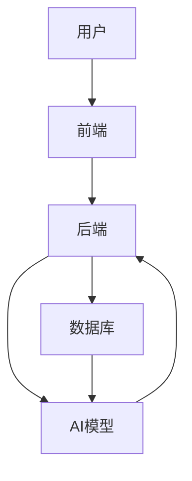

                 


# AI系统如何平衡质量与价格在价值投资中的作用

> 关键词：AI系统、价值投资、质量与价格平衡、深度学习、投资决策、金融数据分析

> 摘要：  
本文探讨了AI系统在价值投资中的应用，重点分析了如何通过AI技术平衡质量和价格两个关键因素。文章从价值投资的基本概念出发，深入探讨了质量与价格的评估模型、AI算法的核心原理、系统架构设计，以及实际案例分析。通过多目标优化算法、深度学习模型和时间序列分析等技术手段，本文展示了AI系统如何帮助投资者在价值投资中实现质量和价格的最优平衡，从而提升投资决策的科学性和效率。

---

# 第一部分: 价值投资与AI系统概述

## 第1章: 价值投资与AI的结合

### 1.1 价值投资的基本概念

#### 1.1.1 价值投资的定义与核心理念
- 价值投资是一种以基本面分析为基础的投资策略，旨在通过识别市场价格与内在价值的差异来获取超额收益。
- 核心理念：寻找被市场低估的优质资产，长期持有，等待价格回归内在价值。
- 投资者关注的因素包括企业的盈利能力、财务健康状况、行业地位和竞争优势等。

#### 1.1.2 价值投资中的质量与价格关系
- 质量：指企业的内在价值，包括盈利能力、成长性、财务状况等。
- 价格：指市场上的股票价格，可能受市场情绪、宏观经济因素等影响。
- 平衡质量与价格的核心问题：找到内在价值高于市场价格的优质企业。

#### 1.1.3 AI技术在价值投资中的潜力
- AI技术能够处理海量数据，发现人类难以察觉的模式和趋势。
- 通过机器学习算法，AI可以帮助投资者更准确地评估企业的质量和预测市场价格。
- AI还可以实时监控市场变化，提供动态的投资建议。

### 1.2 AI系统在金融领域的应用现状

#### 1.2.1 AI在金融分析中的应用
- 数据分析：AI可以处理和分析大量的金融数据，包括历史价格、财务报表、新闻等。
- 风险管理：AI用于识别和评估投资组合中的潜在风险。
- 市场预测：AI模型可以预测股票价格走势和市场趋势。

#### 1.2.2 AI在投资决策中的作用
- 数据驱动的决策：AI通过分析历史数据和市场动态，提供数据支持的投资决策。
- 自动化交易：AI可以实时监控市场并执行交易策略。
- 个性化投资建议：AI根据投资者的风险偏好和财务状况，提供定制化的投资建议。

#### 1.2.3 当前AI在价值投资中的局限性
- 数据依赖性：AI模型的性能高度依赖于数据的质量和数量。
- 黑箱问题：复杂的AI模型往往难以解释其决策过程。
- 市场不确定性：金融市场的不可预测性和突发事件可能影响AI模型的准确性。

### 1.3 质量与价格平衡的核心问题

#### 1.3.1 投资中的质量与价格矛盾
- 质量高的企业可能市场价格过高，导致短期亏损。
- 价格低的企业可能质量不高，存在较大的风险。
- 如何在两者之间找到平衡点是价值投资者的核心问题。

#### 1.3.2 AI如何帮助平衡质量与价格
- AI可以通过数据分析和建模，量化企业的质量和市场价格的关系。
- 通过多目标优化算法，AI可以在质量与价格之间找到最优平衡点。
- AI还可以动态调整权重，根据市场变化实时优化投资组合。

#### 1.3.3 价值投资中的AI系统目标
- 确定企业的内在价值，评估市场价格的合理性。
- 预测市场价格走势，优化投资组合。
- 提供实时监控和动态调整的投资建议。

---

## 第2章: 质量与价格评估模型

### 2.1 质量评估模型

#### 2.1.1 质量评估的核心指标
- 盈利能力：如净利润率、ROE（净资产收益率）等。
- 成长性：如收入增长率、净利润增长率等。
- 财务健康状况：如资产负债率、流动比率等。
- 行业地位：如市场份额、竞争优势等。

#### 2.1.2 基于AI的质量评估方法
- 采用深度学习模型，如LSTM，分析企业的历史财务数据和市场表现。
- 使用自然语言处理（NLP）技术分析公司新闻和行业报告。
- 建立评分系统，将企业的质量量化为一个综合得分。

#### 2.1.3 质量评估模型的优缺点
- 优点：能够量化企业质量，提供数据支持的投资决策。
- 缺点：模型的准确性依赖于数据质量和算法设计。

### 2.2 价格预测模型

#### 2.2.1 价格预测的基本原理
- 价格预测基于历史价格、市场情绪、宏观经济指标等因素。
- 使用时间序列分析和机器学习算法预测未来价格走势。

#### 2.2.2 基于AI的价格预测算法
- 算法选择：LSTM网络在时间序列预测中表现优异。
- 数据预处理：清洗和归一化历史价格数据。
- 模型训练：使用训练数据训练LSTM模型，并进行模型调优。

#### 2.2.3 价格预测模型的优化
- 引入技术指标：如移动平均线、相对强弱指数等。
- 结合市场情绪数据：如社交媒体情感分析。
- 多模型融合：通过集成学习提高预测准确性。

### 2.3 质量与价格的平衡算法

#### 2.3.1 多目标优化算法
- 算法目标：在质量与价格之间找到最优平衡点。
- 算法实现：通过优化算法（如遗传算法、粒子群算法）求解多目标优化问题。
- 结果展示：通过权重分配和帕累托前沿分析展示平衡结果。

#### 2.3.2 质量与价格的权重分配
- 权重确定：根据市场环境和投资者偏好动态调整质量与价格的权重。
- 权重影响：权重的不同会导致最终选择的企业组合不同。

#### 2.3.3 平衡算法的实际应用
- 实际案例：假设市场中有多家企业，通过多目标优化算法找到质量与价格的最佳平衡点。
- 结果分析：展示不同权重下的最优投资组合。

---

## 第3章: AI算法的核心原理

### 3.1 深度学习模型在金融中的应用

#### 3.1.1 神经网络结构
- 输入层：接受企业的财务数据、市场数据等输入。
- 隐藏层：通过非线性变换提取数据特征。
- 输出层：输出企业的质量评分或股票价格预测值。

#### 3.1.2 模型训练方法
- 监督学习：使用标记数据训练模型。
- 有监督学习：输入数据带有标签（如质量评分或价格标签）。
- 验证与测试：通过交叉验证优化模型参数。

#### 3.1.3 特征工程
- 数据清洗：处理缺失值和异常值。
- 数据归一化：将不同量纲的特征数据标准化。
- 特征选择：筛选对目标变量影响较大的特征。

### 3.2 时间序列分析与预测

#### 3.2.1 LSTM网络在时间序列中的应用
- LSTM结构：包括输入门、遗忘门和输出门。
- 长期记忆：能够捕捉时间序列中的长期依赖关系。
- 应用场景：股票价格预测、市场趋势分析等。

#### 3.2.2 时间序列预测的数学模型
- LSTM模型的数学表达：
  - 输入门：$i_t = \sigma(W_i x_t + U_i h_{t-1} + b_i)$
  - 遗忘门：$f_t = \sigma(W_f x_t + U_f h_{t-1} + b_f)$
  - 输出门：$o_t = \sigma(W_o x_t + U_o h_{t-1} + b_o)$
  - 隐层状态更新：$c_t = f_t \cdot c_{t-1} + i_t \cdot tanh(W_c x_t + U_c h_{t-1} + b_c)$
  - 输出状态：$h_t = o_t \cdot tanh(c_t)$
  - 预测输出：$\hat{y}_t = W_y h_t + b_y$

#### 3.2.3 基于AI的时间序列预测流程
1. 数据准备：收集和整理时间序列数据。
2. 数据预处理：归一化和滑动窗口分割。
3. 模型训练：训练LSTM网络并进行超参数调优。
4. 模型预测：使用训练好的模型进行未来价格预测。

### 3.3 算法的数学模型与公式

#### 3.3.1 损失函数与优化目标
- 损失函数：均方误差（MSE）
  $$\text{Loss} = \frac{1}{n}\sum_{i=1}^{n}(y_i - \hat{y}_i)^2$$
- 优化目标：最小化损失函数，通常使用梯度下降算法。

#### 3.3.2 网络结构的数学表达
- 输入层：$x_t$
- 隐藏层：$h_t$
- 输出层：$\hat{y}_t$
- 网络参数：权重矩阵$W$和偏置项$b$

---

## 第4章: 系统架构设计

### 4.1 系统功能设计

#### 4.1.1 领域模型
- 实体：企业、股票、市场数据、投资组合。
- 关系：企业拥有股票，股票属于市场，投资组合包含股票。

#### 4.1.2 功能模块
- 数据采集：从数据库或API获取企业数据和市场数据。
- 数据处理：清洗和归一化数据。
- 模型训练：训练质量评估和价格预测模型。
- 投资决策：根据模型结果生成投资建议。
- 实时监控：监控市场变化并动态调整投资组合。

#### 4.1.3 功能流程
1. 数据采集：获取企业财务数据和市场数据。
2. 数据处理：清洗和归一化数据。
3. 模型训练：训练质量评估和价格预测模型。
4. 投资决策：根据模型结果生成投资建议。
5. 实时监控：监控市场变化并动态调整投资组合。

### 4.2 系统架构设计

#### 4.2.1 系统架构图


#### 4.2.2 系统接口设计
- 前端接口：用户输入查询参数，如企业名称或股票代码。
- 后端接口：接收查询请求，调用AI模型进行分析。
- 数据库接口：存储和检索企业数据和市场数据。
- AI模型接口：接收输入数据，返回质量评分和价格预测结果。

#### 4.2.3 系统交互流程
1. 用户通过前端提交查询请求。
2. 前端将请求转发到后端。
3. 后端调用AI模型进行分析。
4. AI模型返回结果，后端将结果返回给前端。
5. 前端展示结果，用户根据建议进行投资决策。

### 4.3 系统优化

#### 4.3.1 数据存储优化
- 使用分布式数据库提高数据存储效率。
- 采用缓存技术减少重复查询。

#### 4.3.2 模型优化
- 使用分布式计算加速模型训练。
- 定期更新模型参数，保持模型准确性。

#### 4.3.3 系统性能优化
- 优化网络传输效率。
- 采用异步处理提高系统响应速度。

---

## 第5章: 项目实战

### 5.1 环境安装与配置

#### 5.1.1 安装Python环境
- 安装Anaconda或Miniconda。
- 配置Python版本（建议使用Python 3.8或更高）。

#### 5.1.2 安装依赖库
- 安装深度学习框架：TensorFlow或Keras。
- 安装NLP库：NLTK或spaCy。
- 安装数据处理库：Pandas、NumPy。
- 安装可视化库：Matplotlib、Seaborn。

#### 5.1.3 数据源配置
- 数据来源：选择可靠的金融数据源，如Yahoo Finance、Alpha Vodia。
- 数据格式：确保数据格式一致，便于后续处理。

### 5.2 核心代码实现

#### 5.2.1 数据预处理代码
```python
import pandas as pd
import numpy as np

# 加载数据
data = pd.read_csv('stock_data.csv')

# 数据清洗
data.dropna(inplace=True)
data = data.iloc[:, [0, 4]]  # 选择开盘价和收盘价

# 数据归一化
from sklearn.preprocessing import MinMaxScaler
scaler = MinMaxScaler()
data_scaled = scaler.fit_transform(data)
```

#### 5.2.2 模型训练代码
```python
from tensorflow.keras.models import Sequential
from tensorflow.keras.layers import LSTM, Dense

# 构建LSTM模型
model = Sequential()
model.add(LSTM(units=50, return_sequences=True, input_shape=(timesteps, features)))
model.add(LSTM(units=50, return_sequences=False))
model.add(Dense(1))

# 编译模型
model.compile(loss='mean_squared_error', optimizer='adam')

# 训练模型
model.fit(X_train, y_train, epochs=100, batch_size=32)
```

#### 5.2.3 投资决策代码
```python
# 预测价格
predicted_prices = model.predict(X_test)

# 计算收益
returns = predicted_prices - actual_prices
```

### 5.3 案例分析与结果解读

#### 5.3.1 数据来源与背景
- 数据来源：假设我们选择了某家科技公司的股票数据，时间跨度为2018年到2022年。
- 数据特征：开盘价、收盘价、最高价、最低价、成交量。

#### 5.3.2 模型训练与预测
- 训练数据：2018年到2021年的数据。
- 测试数据：2022年的数据。
- 预测结果：模型预测2022年的股票价格走势。

#### 5.3.3 结果解读
- 预测准确性：计算预测价格与实际价格的误差。
- 投资决策：根据预测结果，调整投资组合。
- 风险控制：设置止损点，降低投资风险。

### 5.4 项目小结

#### 5.4.1 项目总结
- 通过AI系统实现了企业质量评估和股票价格预测。
- 基于多目标优化算法，平衡了质量和价格的关系。
- 提供了实时监控和动态调整的投资建议。

#### 5.4.2 经验与教训
- 数据质量对模型性能影响重大，需确保数据的准确性和完整性。
- 模型的泛化能力需要通过交叉验证和超参数调优来提升。
- 金融市场的不确定性要求模型具有一定的鲁棒性和适应性。

#### 5.4.3 未来改进方向
- 引入更多的市场数据，如新闻、社交媒体情绪等。
- 使用更复杂的模型，如Transformer结构，提高预测准确性。
- 实现自动化交易系统，进一步提升投资效率。

---

## 第6章: 结论与展望

### 6.1 研究总结

#### 6.1.1 核心结论
- AI系统能够有效平衡质量和价格在价值投资中的作用。
- 通过深度学习和时间序列分析，可以实现高质量的投资决策。
- 多目标优化算法为价值投资提供了新的思路。

#### 6.1.2 技术总结
- 深度学习模型在金融数据分析中表现出色。
- 时间序列分析是股票价格预测的重要工具。
- 多目标优化算法为复杂的投资决策提供了可行的解决方案。

### 6.2 未来展望

#### 6.2.1 技术发展
- 更先进的算法：如基于Transformer的模型在金融领域的应用。
- 更大的数据集：通过联邦学习等技术提高数据利用效率。
- 更智能的系统：实现完全自动化的投资决策系统。

#### 6.2.2 应用拓展
- 在更多金融领域应用：如外汇交易、期货交易等。
- 个性化投资服务：根据投资者的风险偏好提供定制化建议。
- 全球化投资：扩展到国际市场，进行跨市场投资。

#### 6.2.3 挑战与机遇
- 挑战：金融市场的复杂性和不确定性。
- 机遇：AI技术的不断进步和金融数据的丰富性。

---

# 附录

## 附录A: 数据来源与工具推荐

- 数据来源：
  - Yahoo Finance
  - Alpha Vodia
  - Quandl
- 工具推荐：
  - Jupyter Notebook
  - TensorFlow/PyTorch
  - Pandas
  - Matplotlib

## 附录B: 术语表

- 深度学习：一种机器学习技术，通过多层神经网络学习数据特征。
- LSTM：长短期记忆网络，用于处理时间序列数据。
- 多目标优化：在多个目标之间找到最优平衡点。

## 附录C: 参考文献

- [1] Goodfellow, I., Bengio, Y., & Courville, A. (2016). Deep Learning. MIT Press.
- [2] Hochreiter, S., & Schmidhuber, J. (1997). Long short-term memory. Neural computation, 9(8), 1735-1780.
- [3] 张成林, & 李航. (2018). 机器学习. 清华大学出版社.

---

# 作者：AI天才研究院 & 禅与计算机程序设计艺术

感谢您的阅读！希望本文能为您提供有价值的投资决策思路，并帮助您更好地理解AI系统在价值投资中的应用。如果需要进一步探讨或获取代码示例，请随时联系我！

