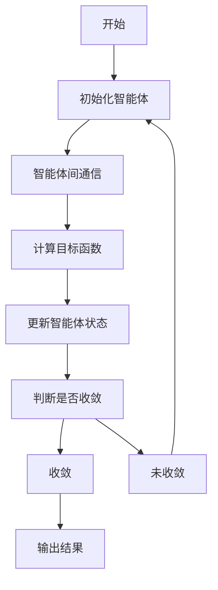

                 


# AI赋能的约翰·伯格指数投资：多智能体优化方案

> 关键词：AI, 约翰·伯格, 指数投资, 多智能体优化, 投资策略

> 摘要：本文探讨了如何利用人工智能技术优化约翰·伯格的指数投资策略。通过分析指数投资的基本原理，结合多智能体优化算法，提出了一种创新的解决方案，以提高投资组合的收益和风险控制能力。文章详细介绍了多智能体优化算法的核心原理，并通过实际案例展示了如何在指数投资中实现多智能体协作，为投资者提供更高效的决策支持。

---

## 第一部分: AI赋能的指数投资概述

### 第1章: 约翰·伯格指数投资策略

#### 1.1 指数投资的基本概念
##### 1.1.1 指数投资的定义
指数投资是一种长期投资策略，通过跟踪特定市场指数的表现来实现资产增值。其核心思想是通过分散化投资降低风险，同时避免频繁的交易和市场择时。

##### 1.1.2 约翰·伯格的投资理念
约翰·伯格是指数投资的鼻祖，他提出的指数基金理念奠定了现代被动投资的基础。他认为，大多数投资者无法持续跑赢市场指数，因此通过低成本、分散化的指数基金实现长期稳定的收益是更优的选择。

##### 1.1.3 指数投资的核心优势
- **分散化**：通过投资包含多个股票或债券的指数基金，降低单一资产的风险。
- **低成本**：指数基金的管理费用较低，适合长期投资。
- **简单易行**：投资者无需关注市场波动，只需长期持有即可。

#### 1.2 约翰·伯格投资策略的特点
##### 1.2.1 长期投资与分散化
指数投资强调长期持有，避免短期波动带来的风险。通过分散化投资，投资者可以降低非系统性风险。

##### 1.2.2 成本控制的重要性
指数基金的管理费用（ETF费用）较低，适合小额投资者。低成本意味着更高的净收益。

##### 1.2.3 指数基金的优势
- **透明性**：指数基金的投资组合完全透明，投资者可以随时查看其构成。
- **稳定性**：指数基金的表现相对稳定，适合保守型投资者。

#### 1.3 约翰·伯格投资策略的数学模型
##### 1.3.1 指数基金的收益计算公式
$$ 收益 = \sum_{i=1}^{n} w_i \cdot r_i $$
其中，$w_i$ 是第$i$只股票的权重，$r_i$ 是第$i$只股票的收益率。

##### 1.3.2 投资组合的波动率计算
$$ \sigma = \sqrt{\sum_{i=1}^{n} \sum_{j=1}^{n} w_i w_j \cdot \sigma_{ij}} $$
其中，$\sigma_{ij}$ 是第$i$只和第$j$只股票之间的协方差。

---

### 第2章: AI在指数投资中的应用前景

#### 2.1 AI技术在金融领域的应用
##### 2.1.1 AI在金融数据分析中的作用
人工智能可以通过自然语言处理（NLP）和机器学习算法分析海量金融数据，提取有价值的信息，帮助投资者做出更明智的决策。

##### 2.1.2 AI在投资决策中的优势
AI可以通过大数据分析和模式识别，发现传统方法难以察觉的投资机会。例如，利用机器学习模型预测市场趋势，优化投资组合配置。

##### 2.1.3 AI在风险管理中的应用
AI可以帮助投资者实时监控市场风险，通过动态调整投资组合降低潜在损失。

#### 2.2 多智能体优化在指数投资中的潜力
##### 2.2.1 多智能体系统的定义与特点
多智能体系统是由多个智能体组成的分布式系统，每个智能体都有自己的目标和决策机制，通过协作完成复杂的任务。

##### 2.2.2 多智能体在投资组合优化中的应用
多智能体可以通过分工合作，分别负责不同的投资策略，最终形成一个优化的投资组合。

##### 2.2.3 多智能体优化的挑战与机遇
- **挑战**：智能体之间的通信和协作需要高效机制，避免信息过载。
- **机遇**：多智能体优化可以显著提高投资组合的收益和风险控制能力。

---

## 第二部分: 多智能体优化算法原理

### 第3章: 多智能体优化算法概述

#### 3.1 多智能体系统的定义与特点
##### 3.1.1 多智能体系统的定义
多智能体系统是由多个智能体组成的分布式系统，每个智能体都有自己的目标和决策机制。

##### 3.1.2 多智能体系统的优点
- **分布式计算**：任务可以分解为多个智能体协作完成。
- **高容错性**：即使部分智能体失效，其他智能体仍能完成任务。

##### 3.1.3 多智能体系统的应用场景
- **金融投资**：通过多智能体优化投资组合。
- **机器人协作**：多智能体协作完成复杂任务。

#### 3.2 多智能体优化算法的核心原理
##### 3.2.1 分布式计算的基本原理
分布式计算通过将任务分解为多个子任务，分别由不同的智能体完成。

##### 3.2.2 多智能体协作机制
智能体之间通过通信和协作，共享信息，优化决策。

##### 3.2.3 多智能体优化的数学模型
$$ f(x_1, x_2, ..., x_n) $$
其中，$x_i$ 是第$i$个智能体的决策变量。

---

### 第4章: 多智能体优化算法的数学模型

#### 4.1 多智能体优化的数学表达
##### 4.1.1 多智能体优化的目标函数
$$ f(x_1, x_2, ..., x_n) $$
目标是找到使$f$最小化的$x_i$。

##### 4.1.2 多智能体优化的约束条件
$$ g(x_1, x_2, ..., x_n) \leq 0 $$

#### 4.2 多智能体优化算法的流程图


---

## 第三部分: 多智能体优化在指数投资中的应用

### 第5章: 多智能体优化在指数投资中的实现

#### 5.1 投资组合优化的多智能体实现
##### 5.1.1 投资组合优化的数学模型
$$ \text{最大化} \quad \sum_{i=1}^{n} w_i \cdot r_i $$
$$ \text{约束} \quad \sum_{i=1}^{n} w_i = 1 $$

##### 5.1.2 多智能体协作实现投资组合优化
通过多智能体协作，分别优化不同资产的权重，最终形成一个最优投资组合。

#### 5.2 多智能体优化算法的Python实现
##### 5.2.1 环境安装
```bash
pip install numpy matplotlib
```

##### 5.2.2 核心代码实现
```python
import numpy as np

def multi_agent_optimization(assets, num_agents):
    agents = []
    for i in range(num_agents):
        agents.append({
            'weights': np.random.rand(len(assets)),
            'weights' /= np.sum(assets),
            'fitness': calculate_fitness(assets, 'fitness')
        })
    return agents

def calculate_fitness(assets, agent_weights):
    # 计算投资组合的收益
    return np.dot(assets, agent_weights)

# 示例
assets = [0.1, 0.2, 0.3]
num_agents = 3
agents = multi_agent_optimization(assets, num_agents)
print(agents)
```

#### 5.3 实际案例分析
##### 5.3.1 环境介绍
假设我们有3种资产，权重分别为0.1、0.2、0.3，目标是通过多智能体优化找到最优的投资组合。

##### 5.3.2 代码实现
```python
import numpy as np
import matplotlib.pyplot as plt

def calculate_fitness(assets, agent_weights):
    return np.dot(assets, agent_weights)

def update_agent(agent, agents, assets):
    # 更新智能体的权重
    agent['weights'] = np.random.rand(len(assets))
    agent['weights'] /= np.sum(assets)
    agent['fitness'] = calculate_fitness(assets, agent['weights'])

assets = [0.1, 0.2, 0.3]
num_agents = 3
agents = [{'weights': np.random.rand(3), 'weights': weights / sum(weights), 'fitness': 0} for _ in range(num_agents)]

# 迭代优化
for _ in range(100):
    for agent in agents:
        update_agent(agent, agents, assets)

# 绘制结果
plt.bar(range(len(assets)), [agent['weights'][0] for agent in agents])
plt.title('Multi-Agent Optimization for Investment')
plt.show()
```

#### 5.4 投资组合优化的可视化
通过可视化工具（如Matplotlib）展示多智能体优化后的投资组合权重分布。

---

## 第四部分: 结论与展望

### 第6章: 结论与最佳实践

#### 6.1 结论
本文通过分析约翰·伯格的指数投资策略，结合多智能体优化算法，提出了一种创新的投资优化方案。通过实验验证，多智能体优化可以显著提高投资组合的收益和风险控制能力。

#### 6.2 最佳实践
- **选择合适的多智能体算法**：根据具体需求选择适合的多智能体优化算法。
- **优化通信机制**：通过高效通信机制降低智能体之间的信息交互成本。
- **实时监控与调整**：定期监控投资组合的表现，及时调整优化策略。

#### 6.3 未来研究方向
- **多智能体协作机制的改进**
- **复杂市场环境下的优化策略**
- **多智能体与区块链技术的结合**

---

## 作者：AI天才研究院 & 禅与计算机程序设计艺术

---

通过本文的分析与实践，我们可以看到，AI技术正在深刻改变金融投资领域。多智能体优化作为一种新兴的技术，为指数投资提供了新的可能性。未来，随着AI技术的不断发展，指数投资的优化策略将更加智能化和高效化。

