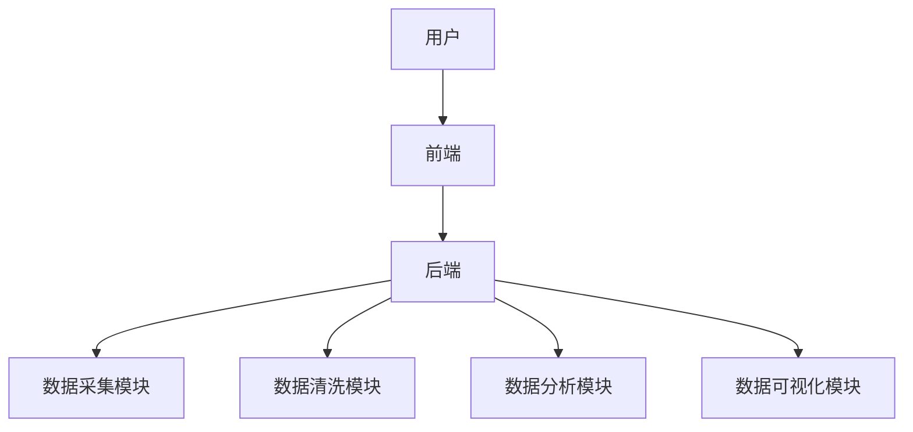
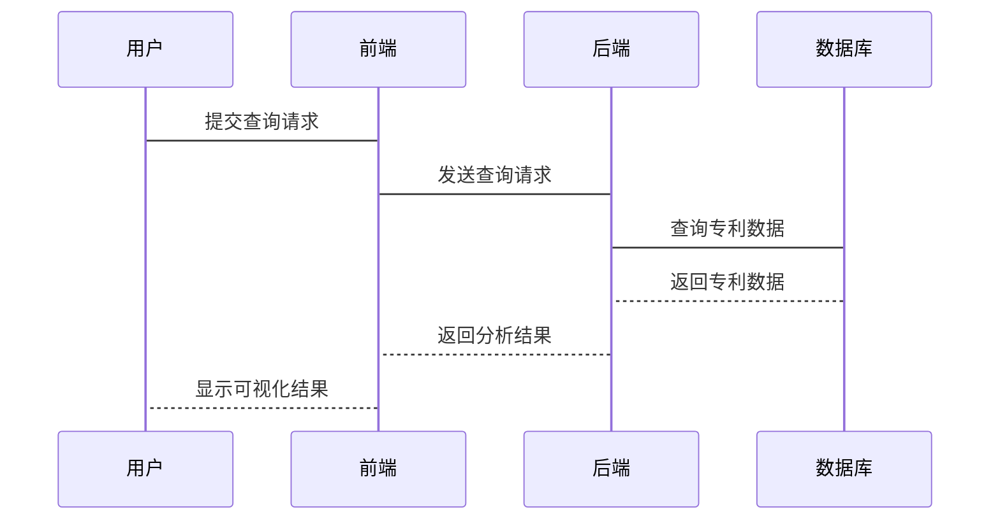

                 


# AI辅助专利分析与技术趋势预测的方法与工具

> 关键词：AI，专利分析，技术趋势预测，自然语言处理，机器学习，深度学习，数据挖掘

> 摘要：本文系统地探讨了AI辅助专利分析与技术趋势预测的方法与工具，从背景与核心概念、算法原理、系统架构设计到项目实战，全面分析了如何利用AI技术提升专利分析的效率与准确性，并对未来技术趋势预测的发展方向进行了展望。

---

## 第一部分: AI辅助专利分析与技术趋势预测的背景与核心概念

### 第1章: AI辅助专利分析与技术趋势预测概述

#### 1.1 专利分析与技术趋势预测的重要性

##### 1.1.1 专利分析的基本概念
专利分析是通过对专利数据的收集、整理和分析，挖掘技术领域的研发动态、竞争格局和潜在机会。专利数据包含丰富的技术信息，如技术领域、发明人、申请人、申请时间、专利分类等。

##### 1.1.2 技术趋势预测的意义
技术趋势预测通过对历史专利数据的分析，识别技术发展的趋势和方向，帮助企业制定技术研发战略，优化资源配置。

##### 1.1.3 AI在专利分析中的作用
AI技术，尤其是自然语言处理（NLP）和机器学习，能够高效地处理海量专利文本数据，提取技术关键词、分类专利、识别技术关联性，并预测技术发展趋势。

#### 1.2 AI辅助专利分析的背景与现状

##### 1.2.1 传统专利分析方法的局限性
传统专利分析方法依赖人工阅读和分类，效率低、成本高，且难以处理海量数据。

##### 1.2.2 AI技术在专利分析中的应用优势
AI技术能够快速处理大量专利文本，提取关键信息，发现隐藏的技术关联性，显著提高分析效率和准确性。

##### 1.2.3 当前AI辅助专利分析的国内外研究现状
国内外学者和企业已经在AI辅助专利分析领域进行了大量研究，提出了多种基于NLP和机器学习的方法，但在复杂技术预测和实时性方面仍有提升空间。

#### 1.3 技术趋势预测的核心要素

##### 1.3.1 技术趋势预测的基本概念
技术趋势预测是基于历史数据，利用数学模型和算法，预测未来技术发展的方向和强度。

##### 1.3.2 技术趋势预测的关键步骤
1. 数据收集与预处理
2. 技术关键词提取
3. 技术领域分类
4. 技术趋势建模与预测

##### 1.3.3 AI在技术趋势预测中的应用前景
AI技术，尤其是深度学习和自然语言处理，为技术趋势预测提供了新的可能性，未来有望实现更精准的趋势预测。

### 1.4 本章小结
本章介绍了AI辅助专利分析和技术创新预测的重要性和背景，分析了传统方法的局限性和AI技术的优势，并总结了技术趋势预测的核心要素和未来发展方向。

---

## 第二部分: AI辅助专利分析的核心概念与联系

### 第2章: AI辅助专利分析的核心概念

#### 2.1 专利数据的特征与属性

##### 2.1.1 专利数据的基本属性
专利数据包括专利标题、摘要、权利要求书、发明人、申请人、申请时间、专利分类号等。

##### 2.1.2 专利分类体系
国际专利分类（IPC）和美国专利分类（USPC）是常用的专利分类体系，用于将专利按照技术领域进行分类。

##### 2.1.3 专利引用关系
专利之间的引用关系反映了技术发展的传承性和关联性，是技术网络分析的重要依据。

#### 2.2 AI技术在专利分析中的应用

##### 2.2.1 自然语言处理（NLP）在专利文本分析中的应用
NLP技术可以对专利文本进行分词、实体识别、关键词提取和主题建模。

##### 2.2.2 机器学习在专利分类与聚类中的应用
机器学习算法可以用于专利的自动分类和聚类，帮助识别技术领域的发展趋势。

##### 2.2.3 图神经网络在专利关系网络中的应用
图神经网络可以用于构建专利之间的关系网络，分析技术关联性和技术演进路径。

#### 2.3 技术趋势预测的数学模型

##### 2.3.1 时间序列分析模型
时间序列模型如ARIMA和LSTM可用于基于历史专利申请数量预测未来趋势。

##### 2.3.2 文本挖掘与主题建模
主题建模技术如LDA可以用于分析专利文本的主题分布，识别技术热点。

##### 2.3.3 基于深度学习的技术趋势预测模型
深度学习模型如BERT和Transformer可以用于更复杂的专利文本分析和趋势预测。

#### 2.4 核心概念对比分析

##### 2.4.1 传统专利分析与AI辅助专利分析的对比
| 对比维度 | 传统专利分析 | AI辅助专利分析 |
|----------|----------------|------------------|
| 数据处理效率 | 低 | 高 |
| 分析深度 | 浅 | 深 |
| 成本 | 高 | 低 |

##### 2.4.2 不同AI技术在专利分析中的适用场景对比
| AI技术 | 适用场景 |
|--------|------------|
| NLP | 文本分析与关键词提取 |
| 机器学习 | 分类与聚类 |
| 图神经网络 | 关系网络分析 |

##### 2.4.3 技术趋势预测模型的优劣势对比
| 模型 | 优势 | 劣势 |
|------|-------|------|
| 时间序列模型 | 简单易用 | 需要大量历史数据 |
| LDA主题建模 | 可解释性强 | 预测能力有限 |
| 深度学习模型 | 高精度 | 计算资源需求高 |

#### 2.5 本章小结
本章详细分析了专利数据的特征、AI技术在专利分析中的应用以及技术趋势预测的数学模型，并通过对比分析明确了不同技术的适用场景和优劣势。

---

## 第三部分: AI辅助专利分析的算法原理与数学模型

### 第3章: 专利文本分析的算法原理

#### 3.1 自然语言处理（NLP）在专利文本分析中的应用

##### 3.1.1 分词与词向量表示
使用分词工具将专利文本分割成词语，并通过词向量（如Word2Vec）表示词语的语义信息。

##### 3.1.2 专利文本的特征提取
提取专利文本中的技术关键词、专利分类号等特征。

##### 3.1.3 基于BERT的专利文本表示方法
BERT（Bidirectional Encoder Representations from Transformers）是一种深度预训练模型，可以用于专利文本的语义表示。

#### 3.2 专利分类与聚类的算法原理

##### 3.2.1 基于TF-IDF的专利分类
TF-IDF（Term Frequency-Inverse Document Frequency）是一种常用的文本特征表示方法，可以用于专利分类。

##### 3.2.2 基于K-means的专利聚类
K-means是一种经典的聚类算法，可以用于将专利按技术领域进行聚类。

##### 3.2.3 基于深度学习的专利分类
使用预训练的深度学习模型（如BERT）进行专利分类，可以提高分类准确率。

#### 3.3 基于深度学习的技术趋势预测模型

##### 3.3.1 模型结构
技术趋势预测模型通常包括编码层、解码层和预测层。

##### 3.3.2 模型训练
使用历史专利数据训练模型，优化模型参数以最小化预测误差。

##### 3.3.3 模型评估
通过均方误差（MSE）、平均绝对误差（MAE）等指标评估模型的预测性能。

#### 3.4 本章小结
本章详细讲解了NLP和深度学习在专利文本分析中的应用，以及基于TF-IDF和深度学习的专利分类与聚类方法。

---

## 第四部分: AI辅助专利分析的系统架构与设计

### 第4章: 系统架构设计

#### 4.1 问题场景介绍
AI辅助专利分析系统需要处理大量专利数据，支持用户进行专利检索、分类、分析和预测。

#### 4.2 系统功能设计

##### 4.2.1 数据采集模块
负责从专利数据库中获取专利数据，包括专利文本、申请人信息、专利分类号等。

##### 4.2.2 数据清洗模块
对获取的专利数据进行预处理，包括去重、格式化和标准化。

##### 4.2.3 数据分析模块
对清洗后的专利数据进行文本分析、分类、聚类和趋势预测。

##### 4.2.4 数据可视化模块
将分析结果以图表形式展示，便于用户理解和决策。

#### 4.3 系统架构设计

##### 4.3.1 系统架构图


##### 4.3.2 系统接口设计
系统接口包括数据接口（与专利数据库对接）、分析接口（与数据分析模块交互）和可视化接口（与数据可视化模块交互）。

##### 4.3.3 系统交互流程图


#### 4.4 本章小结
本章从系统架构设计的角度，详细描述了AI辅助专利分析系统的功能模块、架构图和交互流程图。

---

## 第五部分: AI辅助专利分析的项目实战

### 第5章: 项目实战

#### 5.1 环境安装与配置

##### 5.1.1 安装Python环境
使用Anaconda安装Python 3.8及以上版本。

##### 5.1.2 安装依赖库
安装Numpy、Pandas、Scikit-learn、Word2Vec、BERT等库。

#### 5.2 系统核心实现源代码

##### 5.2.1 数据采集模块
```python
import requests
from bs4 import BeautifulSoup

def fetch_patent_data(url):
    response = requests.get(url)
    soup = BeautifulSoup(response.text, 'html.parser')
    patents = []
    for patent in soup.find_all('patent'):
        title = patent.title.text
        abstract = patent.abstract.text
        patents.append({'title': title, 'abstract': abstract})
    return patents
```

##### 5.2.2 数据清洗模块
```python
def preprocess_patents(patents):
    cleaned_patents = []
    for patent in patents:
        title = patent['title'].lower()
        abstract = patent['abstract'].lower()
        cleaned_patents.append({'title': title, 'abstract': abstract})
    return cleaned_patents
```

##### 5.2.3 数据分析模块
```python
from sklearn.feature_extraction.text import TfidfVectorizer
from sklearn.cluster import KMeans

vectorizer = TfidfVectorizer(max_features=1000)
X = vectorizer.fit_transform([patent['abstract'] for patent in cleaned_patents])
model = KMeans(n_clusters=5, random_state=42)
model.fit(X)
```

##### 5.2.4 数据可视化模块
```python
import matplotlib.pyplot as plt

labels = model.labels_
plt.hist(labels, bins=5, alpha=0.5)
plt.title('Patent Clustering')
plt.show()
```

#### 5.3 案例分析与结果解读
通过实际案例分析，展示了如何利用上述代码进行专利数据的采集、清洗、分析和可视化。

#### 5.4 本章小结
本章通过实际项目案例，详细讲解了AI辅助专利分析系统的实现过程，并展示了如何利用Python代码进行专利数据分析和可视化。

---

## 第六部分: 最佳实践与未来展望

### 第6章: 最佳实践

#### 6.1 小结与总结
总结全文内容，重申AI辅助专利分析的重要性和应用前景。

#### 6.2 最佳实践 tips
1. 数据质量是专利分析的核心，确保数据清洗和预处理。
2. 选择合适的AI技术（如NLP和深度学习）进行专利分析。
3. 定期更新专利数据库，保持分析结果的实时性。

#### 6.3 注意事项
1. 注意专利数据的隐私和法律问题。
2. 在实际应用中，结合业务需求选择合适的分析方法。
3. 定期优化模型，提高预测精度。

#### 6.4 拓展阅读
推荐相关领域的书籍和论文，鼓励读者深入学习AI辅助专利分析的技术。

### 6.5 未来展望
随着AI技术的不断发展，未来AI辅助专利分析将更加智能化和自动化，技术趋势预测的精度和实时性将不断提升。

---

## 作者信息

作者：AI天才研究院/AI Genius Institute & 禅与计算机程序设计艺术/Zen And The Art of Computer Programming

---

以上是文章的详细目录结构和内容框架，您可以根据实际需求进行调整和扩展。

