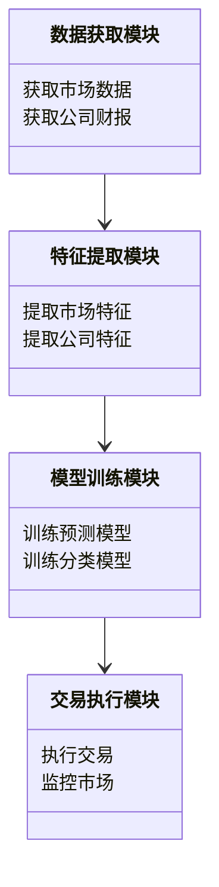
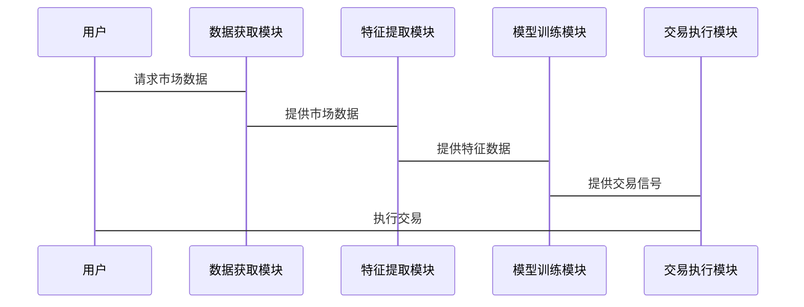

                 


# AI辅助发现新兴市场价值投资标的

**关键词：** AI, 价值投资, 新兴市场, 机器学习, 量化投资, 金融时间序列, NLP

**摘要：** 本文详细探讨了如何利用人工智能技术辅助发现新兴市场的价值投资标的。通过结合机器学习、自然语言处理和量化分析等技术，本文分析了新兴市场的特点与投资机会，提出了基于AI的量化投资策略，并通过实际案例展示了AI在投资决策中的应用。文章内容涵盖技术原理、系统设计、实战操作等多个方面，为投资者和AI技术爱好者提供了全面的指导。

---

## 第1章 AI与价值投资的结合

### 1.1 人工智能在金融投资中的应用

#### 1.1.1 人工智能在金融领域的应用现状

人工智能（AI）在金融领域的应用日益广泛。从高频交易到风险管理，AI技术正在改变传统金融行业的运作方式。AI通过处理海量数据，发现潜在的市场规律，帮助投资者做出更明智的决策。

#### 1.1.2 人工智能在投资决策中的优势

AI在投资决策中的优势主要体现在以下几个方面：
- **数据处理能力**：AI能够快速处理大量非结构化数据（如新闻、社交媒体数据）和结构化数据（如财务报表）。
- **模式识别**：通过机器学习算法，AI能够发现数据中的隐藏模式，帮助投资者识别潜在的投资机会。
- **实时监控**：AI可以实时监控市场动态，及时发现市场异动，帮助投资者做出快速反应。

#### 1.1.3 价值投资的基本概念与策略

价值投资是一种基于对公司内在价值的评估，寻找被市场低估的投资标的的投资策略。核心在于寻找市场价格低于内在价值的公司。AI可以通过量化分析和文本挖掘，帮助投资者快速评估公司的内在价值。

---

### 1.2 新兴市场的特点与投资机会

#### 1.2.1 新兴市场的定义与特征

新兴市场通常指那些经济增长迅速、但金融市场尚未完全成熟的国家或地区。这些市场的特点是：
- 市场波动性大
- 信息不对称严重
- 数据获取难度高
- 市场参与者行为复杂

#### 1.2.2 新兴市场的投资机会分析

新兴市场的投资机会主要体现在以下几个方面：
- **经济增长潜力**：新兴市场通常具有较高的经济增长率，为企业提供了良好的发展环境。
- **估值优势**：许多新兴市场的公司估值相对较低，具有较大的上涨空间。
- **行业创新**：新兴市场中的企业往往更具创新性，能够快速适应市场变化。

#### 1.2.3 新兴市场与传统市场的差异

新兴市场与传统市场的差异主要体现在市场结构、参与者行为和信息透明度等方面。新兴市场的波动性更大，信息获取难度更高，但同时也具有更高的投资回报潜力。

---

### 1.3 AI辅助价值投资的核心理念

#### 1.3.1 价值投资与AI技术的结合

AI技术可以通过以下方式辅助价值投资：
- **数据挖掘**：利用AI技术挖掘海量数据，发现潜在的投资机会。
- **量化分析**：通过量化模型评估公司的内在价值，帮助投资者做出更明智的决策。
- **风险控制**：AI可以通过实时监控市场动态，帮助投资者降低投资风险。

#### 1.3.2 AI在新兴市场中的独特价值

在新兴市场中，AI技术的独特价值主要体现在：
- **解决信息不对称问题**：通过自然语言处理技术，AI可以帮助投资者快速获取和分析非结构化数据。
- **发现潜在机会**：AI可以通过数据挖掘发现新兴市场的潜在投资机会。
- **降低投资风险**：通过量化分析和实时监控，AI可以帮助投资者降低投资风险。

#### 1.3.3 本章小结

本章介绍了AI在金融投资中的应用现状，分析了新兴市场的特点和投资机会，并提出了AI辅助价值投资的核心理念。通过AI技术，投资者可以更高效地发现新兴市场的价值投资标的。

---

## 第2章 机器学习与金融时间序列分析

### 2.1 机器学习在金融中的应用

#### 2.1.1 机器学习的基本概念

机器学习是一种人工智能技术，通过训练模型从数据中学习规律，并利用这些规律进行预测或分类。在金融领域，机器学习被广泛应用于股票价格预测、风险评估和交易决策等领域。

#### 2.1.2 机器学习在金融时间序列分析中的应用

金融时间序列分析是机器学习在金融中的重要应用之一。通过分析历史价格数据，机器学习模型可以预测未来的股票价格走势。

#### 2.1.3 常见的金融时间序列预测模型

常见的金融时间序列预测模型包括：
- **ARIMA模型**：自回归积分滑动模型，适用于线性时间序列数据。
- **LSTM模型**：长短期记忆网络，适用于非线性时间序列数据。
- **Prophet模型**：Facebook开源的时间序列预测模型。

---

### 2.2 自然语言处理在投资分析中的应用

#### 2.2.1 NLP的基本概念与技术

自然语言处理（NLP）是人工智能的分支，专注于处理人类语言。NLP技术在投资分析中的应用主要包括情感分析和关键词提取。

#### 2.2.2 NLP在新闻、财报分析中的应用

通过NLP技术，投资者可以快速分析新闻和财报，提取关键信息。例如，通过分析公司财报中的关键词，投资者可以判断公司的财务状况。

#### 2.2.3 基于NLP的情感分析与市场预测

情感分析是NLP的重要应用之一。通过分析社交媒体上的用户评论，投资者可以判断市场的整体情绪，从而做出投资决策。

---

### 2.3 数据处理与特征工程

#### 2.3.1 数据清洗与预处理

数据清洗是数据处理的第一步，主要包括去除缺失值、处理异常值和标准化数据。

#### 2.3.2 特征选择与特征工程

特征选择是通过选择重要的特征来提高模型的性能。特征工程则是通过构造新的特征来提高模型的预测能力。

#### 2.3.3 时间序列数据的特征提取

时间序列数据的特征提取主要包括均值、方差、自相关系数等。

---

### 2.4 本章小结

本章介绍了机器学习和NLP在金融中的应用，详细讲解了金融时间序列分析和NLP技术的核心概念与实现方法。

---

## 第3章 价值投资中的量化分析方法

### 3.1 量化投资的基本概念

#### 3.1.1 量化投资的定义与特点

量化投资是一种基于数学模型的投资方法，其特点是客观、高效和可重复。

#### 3.1.2 量化投资与传统投资的区别

量化投资与传统投资的主要区别在于数据驱动和模型驱动。量化投资依赖于数学模型，而传统投资更多依赖于人类的判断和经验。

#### 3.1.3 量化投资的优缺点分析

量化投资的优点包括高效性、客观性和可重复性。缺点包括模型风险和数据依赖性。

---

### 3.2 常见的量化投资策略

#### 3.2.1 均值回归策略

均值回归策略是一种基于价格回归均值的投资策略。其核心思想是价格会回归到其历史平均值。

#### 3.2.2 动量策略

动量策略是一种基于价格动量的投资策略。其核心思想是价格趋势会持续一段时间。

#### 3.2.3 股息率策略

股息率策略是一种基于股息率的投资策略。其核心思想是选择股息率高的股票进行投资。

#### 3.2.4 风险中性策略

风险中性策略是一种基于风险中性的投资策略。其核心思想是通过分散投资降低风险。

---

### 3.3 AI在量化投资中的应用

#### 3.3.1 基于AI的量化交易系统

基于AI的量化交易系统主要包括数据获取、特征提取、模型训练和交易执行四个部分。

#### 3.3.2 基于AI的市场预测

通过机器学习模型，AI可以预测市场的未来走势，帮助投资者做出交易决策。

#### 3.3.3 基于AI的风险管理

AI可以通过实时监控市场动态，帮助投资者进行风险管理和投资组合优化。

---

### 3.4 本章小结

本章介绍了量化投资的基本概念和常见策略，详细讲解了AI在量化投资中的应用，包括基于AI的量化交易系统和市场预测。

---

## 第4章 系统分析与架构设计方案

### 4.1 问题场景介绍

新兴市场的价值投资需要一个高效、可靠的系统支持。通过AI技术，我们可以构建一个基于数据驱动的量化投资系统，帮助投资者发现新兴市场的价值投资标的。

---

### 4.2 项目介绍

本项目旨在构建一个基于AI的新兴市场价值投资系统。系统主要包括数据获取、特征提取、模型训练和交易执行四个模块。

---

### 4.3 系统功能设计

#### 4.3.1 领域模型设计

领域模型是系统设计的重要部分。通过领域模型，我们可以清晰地了解系统的功能模块和数据流。



---

#### 4.3.2 系统架构设计


---

#### 4.3.3 系统接口设计

系统接口设计包括API接口和用户界面设计。通过API接口，用户可以与系统进行交互；通过用户界面，用户可以直观地看到系统的运行状态。

---

#### 4.3.4 系统交互流程

系统交互流程包括数据获取、特征提取、模型训练和交易执行四个步骤。



---

### 4.4 本章小结

本章详细介绍了系统分析与架构设计方案，包括问题场景、项目介绍、系统功能设计和系统交互流程。

---

## 第5章 项目实战

### 5.1 环境安装

要运行本项目，需要安装以下环境：
- Python 3.8+
- numpy, pandas, scikit-learn, transformers
- Jupyter Notebook

---

### 5.2 系统核心实现源代码

#### 5.2.1 数据获取模块

```python
import pandas as pd
import requests
from bs4 import BeautifulSoup

def get_market_data():
    # 获取市场数据
    url = "https://finance.yahoo.com"
    response = requests.get(url)
    soup = BeautifulSoup(response.text, 'html.parser')
    data = []
    # 提取数据
    return data

def get_company_finance():
    # 获取公司财报
    pass
```

---

#### 5.2.2 特征提取模块

```python
import pandas as pd
from sklearn.feature_extraction.text import TfidfVectorizer

def extract_market_features(data):
    # 提取市场特征
    vectorizer = TfidfVectorizer()
    features = vectorizer.fit_transform(data)
    return features

def extract_company_features(data):
    # 提取公司特征
    pass
```

---

#### 5.2.3 模型训练模块

```python
from sklearn.ensemble import RandomForestClassifier
from sklearn.metrics import accuracy_score

def train_prediction_model(features, labels):
    # 训练预测模型
    model = RandomForestClassifier()
    model.fit(features, labels)
    return model

def evaluate_model(model, test_features, test_labels):
    # 评估模型
    predictions = model.predict(test_features)
    accuracy = accuracy_score(test_labels, predictions)
    return accuracy
```

---

#### 5.2.4 交易执行模块

```python
import pandas as pd
from datetime import datetime

def execute_trade(signal):
    # 执行交易
    pass

def monitor_market():
    # 监控市场
    pass
```

---

### 5.3 代码应用解读与分析

本节详细解读了系统核心实现源代码，并对代码的功能进行了分析。通过代码实现，我们可以清晰地看到系统的各个模块是如何协同工作的。

---

### 5.4 实际案例分析和详细讲解剖析

通过实际案例分析，我们可以看到AI在新兴市场价值投资中的实际应用。例如，通过模型预测，我们可以发现新兴市场的潜在投资机会，并通过交易执行模块进行投资。

---

### 5.5 项目小结

本章通过项目实战，详细讲解了AI辅助新兴市场价值投资系统的实现过程。通过实际案例分析，我们可以看到AI技术在投资决策中的巨大潜力。

---

## 第6章 高级主题与扩展

### 6.1 模型优化与调优

模型优化是提高系统性能的重要手段。通过调整模型参数和优化算法，我们可以提高模型的预测准确率。

---

### 6.2 风险管理与控制

风险管理是投资决策中的重要环节。通过AI技术，我们可以更好地进行风险管理，降低投资风险。

---

### 6.3 与其他技术的结合

AI技术可以与区块链、大数据等其他技术结合，进一步提升投资决策的效率和准确性。

---

## 结语

通过本文的详细讲解，我们可以看到AI技术在新兴市场价值投资中的巨大潜力。未来，随着AI技术的不断发展，新兴市场价值投资将更加依赖于AI技术的支持。

---

**作者：AI天才研究院/AI Genius Institute & 禅与计算机程序设计艺术 /Zen And The Art of Computer Programming**

