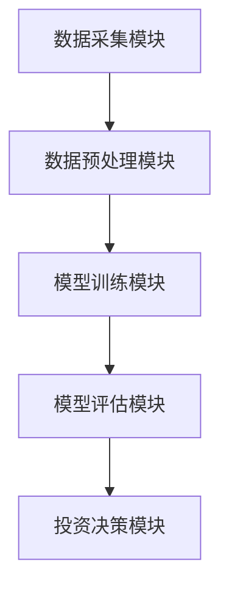
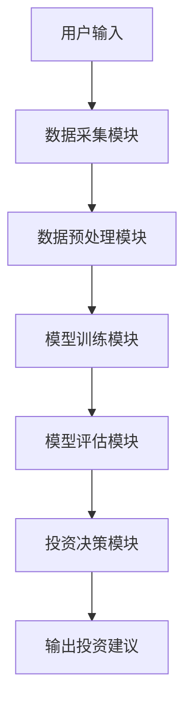

                 


# AI辅助发现隐藏的价值投资机会

## 关键词：人工智能、价值投资、算法、数据分析、机器学习、深度学习、投资策略

## 摘要：
本文将探讨人工智能技术如何辅助发现隐藏的价值投资机会。通过结合价值投资的核心理念与现代AI技术，我们能够更高效地识别市场中的潜在投资机会。文章将从价值投资的基本概念、AI技术在金融领域的应用背景入手，深入分析AI算法在价值投资机会发现中的原理，包括机器学习、深度学习等技术的应用。此外，本文还将详细探讨系统架构设计、项目实战案例以及AI辅助投资的未来发展趋势。

---

# 第1章: 价值投资与人工智能的结合

## 1.1 价值投资的基本概念

### 1.1.1 价值投资的定义与核心理念
价值投资是一种以低于其内在价值的价格购买优质股票的投资策略，其核心理念是通过分析公司的基本面（如财务状况、行业地位、盈利能力等）来判断其长期价值。价值投资者相信市场在短期中可能存在非理性波动，但长期来看，股票价格会回归其内在价值。

### 1.1.2 价值投资的哲学与实践
价值投资的哲学强调长期主义、安全边际和对公司基本面的深入分析。在实践中，价值投资者通常会关注低市盈率、低市净率、高股息率等指标，寻找被市场低估的投资标的。

### 1.1.3 价值投资与现代金融理论的联系
现代金融理论（如CAPM、APT等）为价值投资提供了理论基础，而价值投资则通过实践验证了这些理论的有效性。两者共同关注于资产的内在价值评估和风险收益分析。

---

## 1.2 AI技术在金融领域的应用背景

### 1.2.1 人工智能技术的发展与现状
人工智能技术近年来取得了飞速发展，尤其是在数据处理能力、算法优化和计算能力方面。AI在金融领域的应用日益广泛，包括股票预测、风险评估、交易策略优化等。

### 1.2.2 AI在金融领域的应用现状
当前，AI技术在金融领域的应用主要集中在以下几个方面：
- **股票预测**：通过分析历史价格、市场情绪、新闻等数据，预测股票价格走势。
- **风险评估**：利用机器学习模型评估投资组合的风险。
- **交易策略优化**：基于AI算法生成和优化交易策略。

### 1.2.3 价值投资与AI技术的结合趋势
随着AI技术的不断进步，越来越多的投资者开始尝试将AI技术应用于价值投资。AI可以帮助投资者更高效地分析海量数据、发现市场中的潜在机会，从而提升投资决策的准确性和效率。

---

## 1.3 本书的核心目标与内容框架

### 1.3.1 本书的核心目标
本书旨在探讨AI技术如何辅助发现隐藏的价值投资机会，结合价值投资的核心理念与现代AI技术，为投资者提供一种新的投资思路。

### 1.3.2 本书的内容框架
- **第1章**：价值投资与人工智能的结合
- **第2章**：价值投资机会的AI发现原理
- **第3章**：价值投资机会发现的算法原理
- **第4章**：价值投资机会发现的系统架构设计
- **第5章**：项目实战：基于Python的AI辅助价值投资模型

### 1.3.3 本书的读者对象与适用场景
本书适合对价值投资和人工智能技术感兴趣的读者，包括投资者、金融从业者、数据科学家以及对AI技术在金融领域应用感兴趣的读者。

---

## 1.4 本章小结
本章介绍了价值投资的基本概念、AI技术在金融领域的应用背景，以及本书的核心目标和内容框架。通过本章的学习，读者可以对AI辅助发现价值投资机会的整体思路有一个清晰的认识。

---

# 第2章: 价值投资机会的AI发现原理

## 2.1 价值投资机会的定义与特征

### 2.1.1 价值投资机会的定义
价值投资机会是指那些市场价格低于其内在价值的股票或其他资产。这类机会通常存在于市场对公司基本面分析不足或市场情绪过度波动的情况下。

### 2.1.2 价值投资机会的特征
- **低估值**：市盈率、市净率等估值指标低于行业平均水平。
- **高盈利**：公司盈利能力强，具备持续增长的潜力。
- **高安全边际**：市场价格与内在价值之间存在较大的折扣空间。

---

## 2.2 AI技术在发现价值投资机会中的作用

### 2.2.1 数据分析与挖掘
AI技术可以通过分析海量数据（如财务数据、市场数据、新闻数据等），发现市场中潜在的价值投资机会。

### 2.2.2 模型构建与预测
通过机器学习算法，AI可以构建预测模型，评估股票的内在价值和未来走势，从而帮助投资者发现被低估的投资标的。

### 2.2.3 投资决策支持
AI技术可以为投资者提供实时的数据分析和决策支持，帮助其制定更科学的投资策略。

---

## 2.3 价值投资机会发现的AI算法概述

### 2.3.1 常见的AI算法介绍
- **监督学习**：用于分类和回归问题，如股票价格预测。
- **无监督学习**：用于聚类和异常检测，如发现市场中的异动股票。
- **强化学习**：用于交易策略优化和动态决策。

### 2.3.2 算法选择与优化策略
根据具体的投资目标和数据特征，选择合适的算法并进行优化。例如，对于时间序列数据，可以使用LSTM（长短期记忆网络）进行建模。

### 2.3.3 算法在价值投资中的应用案例
例如，使用监督学习算法对股票进行分类，识别那些符合价值投资特征的股票。

---

## 2.4 本章小结
本章介绍了价值投资机会的定义与特征，分析了AI技术在发现价值投资机会中的作用，并概述了常见的AI算法及其在价值投资中的应用。

---

# 第3章: 价值投资机会发现的算法原理

## 3.1 机器学习算法在价值投资中的应用

### 3.1.1 监督学习算法
- **线性回归**：用于预测股票价格。
- **支持向量机（SVM）**：用于分类问题，如判断股票是否低估。

### 3.1.2 非监督学习算法
- **K-means聚类**：用于将股票分成不同的类别，发现潜在的价值投资机会。
- **主成分分析（PCA）**：用于降维，提取影响股票价值的关键因素。

### 3.1.3 强化学习算法
- **Q-Learning**：用于交易策略优化，如动态调整投资组合。

---

## 3.2 常见的AI算法实现与优化

### 3.2.1 算法实现的步骤与流程
1. 数据收集：获取相关股票的财务数据、市场数据等。
2. 数据预处理：清洗数据、特征提取。
3. 模型训练：选择合适的算法，训练模型。
4. 模型评估：验证模型的准确性和稳定性。
5. 模型优化：调整参数，提高模型性能。

### 3.2.2 算法优化的策略与方法
- **超参数优化**：使用网格搜索或随机搜索优化模型参数。
- **特征选择**：通过特征重要性分析，选择关键特征。

### 3.2.3 算法在价值投资中的具体应用
例如，使用线性回归模型预测股票价格，识别那些价格低于预测值的股票作为潜在的价值投资机会。

---

## 3.3 价值投资机会发现的数学模型

### 3.3.1 基于回归分析的模型
- **简单线性回归**：$y = \beta_0 + \beta_1x + \epsilon$
- **多元线性回归**：$y = \beta_0 + \beta_1x_1 + \beta_2x_2 + \dots + \beta_nx_n + \epsilon$

### 3.3.2 基于神经网络的模型
- **多层感知机（MLP）**：一种常用的深度学习模型，适用于复杂的非线性关系。
- **LSTM网络**：适用于时间序列数据，如股票价格预测。

### 3.3.3 基于时间序列分析的模型
- **ARIMA模型**：用于预测股票价格的未来走势。
- **GARCH模型**：用于评估股票的风险。

---

## 3.4 本章小结
本章详细介绍了机器学习算法在价值投资中的应用，包括监督学习、无监督学习和强化学习算法的具体实现与优化策略。同时，还讨论了基于回归分析、神经网络和时间序列分析的数学模型。

---

# 第4章: 价值投资机会发现的系统架构设计

## 4.1 系统功能模块设计

### 4.1.1 数据采集模块
- **功能**：从多个数据源（如Yahoo Finance、 Bloomberg等）获取股票数据。
- **输入**：股票代码、时间范围。
- **输出**：财务数据、市场数据。

### 4.1.2 数据预处理模块
- **功能**：清洗数据、特征提取、数据标准化。
- **输入**：原始数据。
- **输出**：预处理后的数据集。

### 4.1.3 模型训练模块
- **功能**：选择算法，训练模型。
- **输入**：预处理后的数据。
- **输出**：训练好的模型。

### 4.1.4 模型评估模块
- **功能**：评估模型的准确性和稳定性。
- **输入**：测试数据。
- **输出**：模型评估结果。

### 4.1.5 投资决策模块
- **功能**：基于模型预测结果，生成投资建议。
- **输入**：模型预测结果。
- **输出**：投资策略。

---

## 4.2 系统架构设计

### 4.2.1 系统模块图


### 4.2.2 系统流程图


---

## 4.3 本章小结
本章详细设计了价值投资机会发现系统的功能模块和系统架构，为后续的项目实现提供了理论基础。

---

# 第5章: 项目实战——基于Python的AI辅助价值投资模型

## 5.1 环境搭建

### 5.1.1 安装必要的库
```bash
pip install numpy pandas scikit-learn tensorflow matplotlib
```

---

## 5.2 核心代码实现

### 5.2.1 数据采集与预处理
```python
import pandas as pd
import numpy as np
from sklearn.model_selection import train_test_split
from sklearn.linear_model import LinearRegression

# 数据采集
data = pd.read_csv('stocks.csv')

# 数据预处理
X = data[['PE', 'PB', 'ROE']]  # 特征
y = data['Price']  # 标签

# 数据分割
X_train, X_test, y_train, y_test = train_test_split(X, y, test_size=0.2)
```

### 5.2.2 模型训练与评估
```python
model = LinearRegression()
model.fit(X_train, y_train)

# 模型评估
score = model.score(X_test, y_test)
print(f"模型准确率：{score}")
```

### 5.2.3 投资决策
```python
# 预测价格
y_pred = model.predict(X_test)

# 找出价格低于预测值的股票
undervalued_stocks = X_test[(y_pred > y_test)]
print("潜在价值投资机会：", undervalued_stocks)
```

---

## 5.3 项目总结

### 5.3.1 项目成果
通过本项目，我们成功构建了一个基于Python的AI辅助价值投资模型，能够识别市场中的潜在价值投资机会。

### 5.3.2 项目经验与启示
- 数据质量对模型性能影响重大。
- 模型的选择和优化需要结合具体业务场景。

### 5.3.3 项目小结
本项目展示了AI技术在价值投资中的应用潜力，为投资者提供了新的工具和思路。

---

# 第6章: 总结与展望

## 6.1 本章总结
本文详细探讨了AI技术在发现价值投资机会中的应用，从理论到实践，为投资者提供了一种新的投资思路。

## 6.2 未来展望
随着AI技术的不断进步，价值投资与AI的结合将更加紧密。未来的研究方向包括：
- 更高效的算法优化。
- 更丰富的数据来源。
- 更智能的投资决策支持系统。

---

# 作者：AI天才研究院/AI Genius Institute & 禅与计算机程序设计艺术/Zen And The Art of Computer Programming

---

**本文为AI天才研究院（AI Genius Institute）原创文章，转载请注明出处。**

