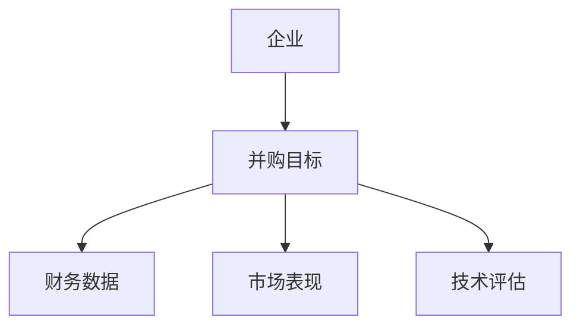
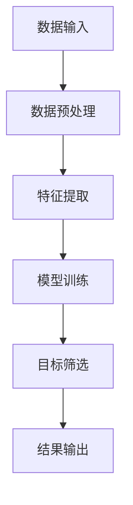
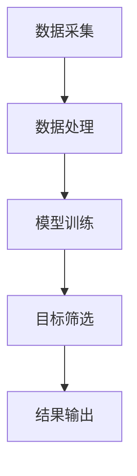
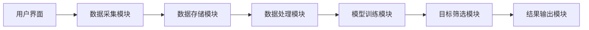
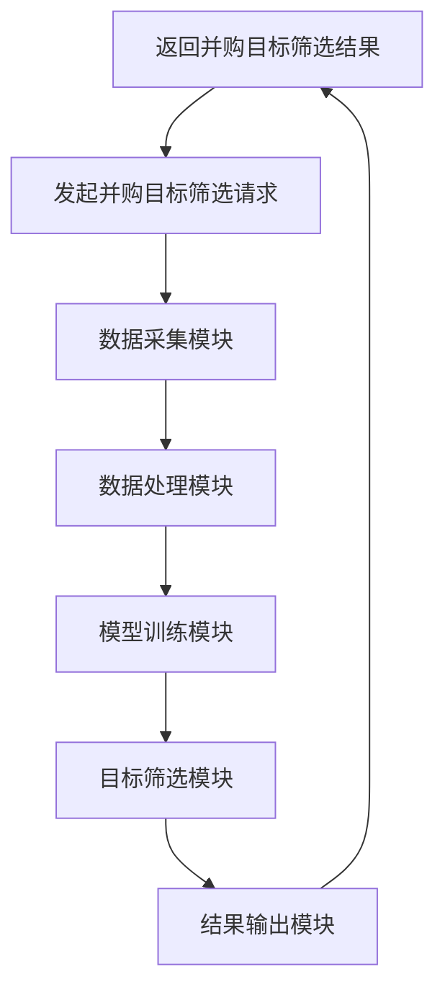

                 


# AI辅助的企业并购目标筛选

## 关键词：企业并购，人工智能，目标筛选，算法原理，系统架构，案例分析

## 摘要：  
随着人工智能技术的飞速发展，企业并购领域的目标筛选正在经历一场革命性的变化。传统的并购目标筛选依赖于经验丰富的并购专家和繁琐的手工分析，而AI技术的引入极大地提高了筛选的效率和准确性。本文将从企业并购的基本概念出发，逐步深入探讨AI在并购目标筛选中的核心算法、系统架构以及实际应用案例。通过详细的技术分析和实际操作示例，本文旨在为读者提供一个全面了解AI辅助企业并购目标筛选的视角。

---

## 第1章: 企业并购与AI技术的结合

### 1.1 企业并购的基本概念
#### 1.1.1 企业并购的定义与类型
企业并购（Mergers and Acquisitions, M&A）是指一家企业与其他企业（目标公司）通过合并或收购的方式，将其整合到自身业务体系中的过程。企业并购的类型主要包括：
- **合并（Merger）**：两家或多家企业合并为一家新企业。
- **收购（Acquisition）**：一家企业购买另一家企业的全部或部分股权。

#### 1.1.2 企业并购的核心目标
企业并购的核心目标通常包括：
- **扩大市场份额**：通过并购快速进入新市场或扩大现有市场的影响力。
- **获取技术和资源**：通过收购拥有核心技术或资源的企业，快速提升自身竞争力。
- **优化资产结构**：通过并购整合资源，优化资产配置，提高运营效率。
- **实现协同效应**：通过并购将两家企业的优势互补，产生协同效应。

#### 1.1.3 传统企业并购的流程与挑战
传统的企业并购流程通常包括以下几个步骤：
1. **目标识别**：通过市场调研和行业分析，初步筛选出潜在的目标企业。
2. **尽职调查**：对目标企业的财务状况、市场表现、技术实力等进行全面评估。
3. **估值与谈判**：根据尽职调查结果，对目标企业进行估值，并与卖方进行谈判。
4. **交易执行**：完成交易的法律程序，包括股权转让、资产过户等。
5. **整合与运营**：将目标企业与自身业务进行整合，优化运营流程。

传统企业并购的挑战主要体现在：
- **信息不对称**：目标企业的财务、技术等信息可能存在不透明性，导致评估结果的不确定性。
- **人工成本高**：传统并购过程需要大量的人力投入，效率较低。
- **主观性较强**：依赖并购专家的经验和判断，可能存在主观偏差。

### 1.2 AI技术在企业并购中的应用背景
#### 1.2.1 AI技术的快速发展与企业应用
近年来，人工智能技术在各个领域的应用取得了显著进展。尤其是在企业并购领域，AI技术的应用正在逐步改变传统的并购模式。AI技术的核心优势在于其强大的数据处理能力和算法优化能力，能够帮助企业更高效地筛选和评估并购目标。

#### 1.2.2 企业并购中的数据驱动趋势
随着大数据技术的发展，企业并购的决策越来越多地依赖于数据驱动的方法。AI技术可以通过对海量数据的分析，帮助企业在并购过程中做出更加科学和准确的决策。

#### 1.2.3 AI技术如何解决传统并购中的痛点
AI技术在企业并购中的应用可以有效解决传统并购中的痛点，例如：
- **提高筛选效率**：通过AI算法快速筛选出符合条件的潜在目标企业。
- **降低信息不对称风险**：通过对目标企业的公开数据进行分析，提高评估的准确性。
- **减少人工成本**：通过自动化的方式完成部分并购流程，降低人力投入。

### 1.3 本章小结
本章主要介绍了企业并购的基本概念和传统并购的流程与挑战，并重点探讨了AI技术在企业并购中的应用背景。通过对比传统并购与AI辅助并购的异同，读者可以更好地理解AI技术在企业并购中的价值和意义。

---

## 第2章: AI辅助企业并购的核心概念与联系

### 2.1 核心概念原理
#### 2.1.1 数据驱动的并购目标筛选
AI辅助企业并购的核心在于数据驱动的筛选过程。通过对目标企业的财务数据、市场表现、技术评估等多维度数据的分析，AI算法能够快速筛选出符合企业战略目标的潜在并购目标。

#### 2.1.2 AI算法在并购中的应用逻辑
AI算法在并购中的应用逻辑主要包括以下几个步骤：
1. **数据收集**：收集目标企业的历史财务数据、市场表现数据、技术评估数据等。
2. **特征提取**：从收集到的数据中提取关键特征，例如收入增长率、利润率、研发投入占比等。
3. **模型训练**：基于提取的特征，训练一个分类或回归模型，用于预测目标企业的并购价值或潜在风险。
4. **目标筛选**：根据模型预测结果，筛选出符合条件的并购目标。

#### 2.1.3 企业价值评估的AI模型构建
企业价值评估是并购中的核心环节之一。AI模型可以通过对目标企业的财务数据、市场表现、技术实力等多维度数据进行分析，构建一个综合评估模型，用于预测目标企业的价值。

### 2.2 核心概念属性特征对比
#### 2.2.1 传统并购与AI辅助并购的对比分析
| **维度**       | **传统并购**                | **AI辅助并购**                |
|-----------------|-----------------------------|-----------------------------|
| **筛选效率**    | 低，依赖人工分析             | 高，自动化筛选                 |
| **准确性**      | 受主观因素影响较大           | 更客观，基于数据驱动           |
| **成本**        | 高，需要大量人力投入         | 较低，自动化流程降低人工成本   |
| **覆盖范围**    | 有限，主要依赖经验丰富的专家   | 更广，可以覆盖更多潜在目标企业 |

#### 2.2.2 数据质量与模型性能的关联性分析
数据质量是AI模型性能的重要影响因素。高质量的数据能够提高模型的准确性和可靠性，而低质量的数据可能导致模型预测结果偏差较大。因此，在AI辅助并购中，数据的清洗和预处理是非常关键的一步。

#### 2.2.3 不同AI模型在并购中的适用场景对比
| **AI模型类型**   | **适用场景**                |
|-------------------|-----------------------------|
| **决策树模型**    | 数据特征较为明确的情况      |
| **随机森林模型**  | 数据特征较多且复杂的情况    |
| **深度学习模型**  | 数据量大且需要非线性特征提取的情况 |

### 2.3 ER实体关系图


### 2.4 本章小结
本章详细介绍了AI辅助企业并购的核心概念，包括数据驱动的并购目标筛选、AI算法的应用逻辑以及企业价值评估的AI模型构建。同时，通过对比传统并购与AI辅助并购的异同，进一步明确了AI技术在企业并购中的价值和优势。

---

## 第3章: AI辅助企业并购的算法原理

### 3.1 算法原理概述
#### 3.1.1 基于机器学习的目标筛选模型
基于机器学习的目标筛选模型主要包括以下几个步骤：
1. **数据预处理**：对收集到的数据进行清洗和特征提取。
2. **模型训练**：基于训练数据，训练一个分类或回归模型。
3. **模型预测**：利用训练好的模型，对目标企业进行预测，筛选出符合条件的并购目标。

#### 3.1.2 深度学习在企业价值评估中的应用
深度学习在企业价值评估中的应用主要体现在对非结构化数据的处理上，例如自然语言处理（NLP）技术可以用于分析目标企业的新闻报道、管理层声明等文本数据。

#### 3.1.3 自然语言处理在并购文本分析中的应用
自然语言处理技术可以用于分析目标企业的新闻报道、财务报告等文本数据，提取有用的信息，例如企业的市场地位、竞争优势等。

### 3.2 算法流程图


### 3.3 算法实现代码示例
```python
import pandas as pd
from sklearn.model_selection import train_test_split
from sklearn.ensemble import RandomForestClassifier

# 数据加载
data = pd.read_csv('merger_data.csv')

# 数据分割
X = data.drop('target', axis=1)
y = data['target']

# 模型训练
X_train, X_test, y_train, y_test = train_test_split(X, y, test_size=0.2)
model = RandomForestClassifier().fit(X_train, y_train)

# 模型预测
predict = model.predict(X_test)

# 模型评估
from sklearn.metrics import accuracy_score
print("模型准确率：", accuracy_score(y_test, predict))
```

### 3.4 本章小结
本章详细介绍了AI辅助企业并购的算法原理，包括基于机器学习的目标筛选模型、深度学习在企业价值评估中的应用以及自然语言处理在并购文本分析中的应用。通过算法流程图和代码示例，读者可以更好地理解AI算法在并购中的具体实现。

---

## 第4章: AI辅助企业并购的系统架构设计

### 4.1 系统功能设计
#### 4.1.1 系统功能模块划分
AI辅助企业并购的系统功能模块主要包括：
1. **数据采集模块**：负责采集目标企业的财务数据、市场表现数据、技术评估数据等。
2. **数据处理模块**：对采集到的数据进行清洗、特征提取和数据预处理。
3. **模型训练模块**：基于处理后的数据，训练AI模型。
4. **目标筛选模块**：利用训练好的模型，筛选出符合条件的并购目标。
5. **结果输出模块**：输出模型预测结果，包括目标企业的并购价值、风险评估等。

#### 4.1.2 系统功能流程图


### 4.2 系统架构设计
#### 4.2.1 系统架构图


#### 4.2.2 系统接口设计
系统接口设计主要包括以下几个方面：
- **数据接口**：与数据源（如数据库、API）对接，获取目标企业的数据。
- **模型接口**：与AI模型对接，完成模型训练和预测。
- **结果接口**：将模型预测结果输出给用户界面或下游系统。

#### 4.2.3 系统交互序列图


### 4.3 本章小结
本章详细介绍了AI辅助企业并购的系统架构设计，包括系统功能模块划分、系统架构图、系统接口设计以及系统交互序列图。通过这些设计，读者可以更好地理解AI辅助企业并购系统的整体结构和运行流程。

---

## 第5章: AI辅助企业并购的项目实战

### 5.1 环境安装与配置
#### 5.1.1 安装Python环境
```bash
# 安装Python
sudo apt-get install python3 python3-dev python3-pip
```

#### 5.1.2 安装必要的Python库
```bash
pip install pandas scikit-learn matplotlib seaborn
```

### 5.2 核心系统实现
#### 5.2.1 数据采集模块实现
```python
import requests
import json

def get_stock_data(symbol):
    url = f"https://api.example.com/stock/{symbol}"
    response = requests.get(url)
    return json.loads(response.text)
```

#### 5.2.2 数据处理模块实现
```python
import pandas as pd

def preprocess_data(data):
    # 数据清洗
    data = data.dropna()
    # 特征提取
    features = data[['revenue', 'profit', 'growth']]
    return features
```

#### 5.2.3 模型训练模块实现
```python
from sklearn.ensemble import RandomForestClassifier

def train_model(X_train, y_train):
    model = RandomForestClassifier().fit(X_train, y_train)
    return model
```

#### 5.2.4 目标筛选模块实现
```python
def select_targets(model, X_test):
    predictions = model.predict(X_test)
    return predictions
```

### 5.3 项目实战案例分析
#### 5.3.1 数据准备
假设我们有一个包含目标企业财务数据的CSV文件`merger_data.csv`，其中包含以下字段：
- `revenue`：收入
- `profit`：利润
- `growth`：增长率
- `target`：是否为潜在并购目标（1表示是，0表示否）

#### 5.3.2 模型训练
```python
data = pd.read_csv('merger_data.csv')
X = data[['revenue', 'profit', 'growth']]
y = data['target']

X_train, X_test, y_train, y_test = train_test_split(X, y, test_size=0.2)
model = RandomForestClassifier().fit(X_train, y_train)
```

#### 5.3.3 模型预测与结果分析
```python
predict = model.predict(X_test)
print("模型准确率：", accuracy_score(y_test, predict))
print("模型报告：")
print(classification_report(y_test, predict))
```

#### 5.3.4 结果可视化
```python
from sklearn.metrics import confusion_matrix, ConfusionMatrixDisplay

disp = ConfusionMatrixDisplay.from_estimator(model, X_test, y_test)
disp.plot(cmap='Blues')
plt.show()
```

### 5.4 本章小结
本章通过一个实际的项目案例，详细介绍了AI辅助企业并购的核心实现过程，包括数据采集、数据处理、模型训练和目标筛选等步骤。通过代码示例和结果分析，读者可以更好地理解AI技术在企业并购中的实际应用。

---

## 第6章: 系统分析与架构设计方案

### 6.1 系统分析
#### 6.1.1 问题场景介绍
在企业并购过程中，企业通常需要面对以下问题：
- **数据量大**：目标企业的数据量庞大，人工筛选效率低下。
- **数据复杂性高**：目标企业的数据包括财务数据、市场数据、技术数据等多种类型，人工分析难度较大。
- **时间要求高**：企业并购往往需要在较短的时间内完成，时间压力较大。

#### 6.1.2 项目介绍
本项目旨在通过AI技术构建一个企业并购目标筛选系统，帮助企业在并购过程中快速筛选出符合条件的潜在目标企业，提高并购效率和准确性。

### 6.2 系统功能设计
#### 6.2.1 系统功能模块划分
系统功能模块主要包括：
1. **数据采集模块**：负责采集目标企业的数据。
2. **数据处理模块**：对采集到的数据进行清洗和特征提取。
3. **模型训练模块**：基于处理后的数据，训练AI模型。
4. **目标筛选模块**：利用训练好的模型，筛选出符合条件的并购目标。
5. **结果输出模块**：输出模型预测结果，包括目标企业的并购价值、风险评估等。

#### 6.2.2 系统功能流程图


### 6.3 系统架构设计
#### 6.3.1 系统架构图


#### 6.3.2 系统接口设计
系统接口设计主要包括以下几个方面：
- **数据接口**：与数据源（如数据库、API）对接，获取目标企业的数据。
- **模型接口**：与AI模型对接，完成模型训练和预测。
- **结果接口**：将模型预测结果输出给用户界面或下游系统。

#### 6.3.3 系统交互序列图


### 6.4 本章小结
本章详细介绍了AI辅助企业并购系统的系统分析与架构设计方案，包括问题场景分析、系统功能设计以及系统架构设计。通过系统架构图和接口设计，读者可以更好地理解AI辅助企业并购系统的整体结构和运行流程。

---

## 第7章: AI辅助企业并购的最佳实践与未来展望

### 7.1 最佳实践
#### 7.1.1 数据质量管理
数据质量是AI模型性能的重要影响因素。在实际应用中，需要对数据进行严格的清洗和预处理，确保数据的准确性和完整性。

#### 7.1.2 模型优化与调参
模型优化与调参是提高AI模型性能的关键步骤。通过交叉验证、网格搜索等方法，可以找到最优的模型参数，提高模型的预测精度。

#### 7.1.3 结果解释与验证
模型结果的解释与验证是确保模型可靠性的重要环节。通过混淆矩阵、ROC曲线等方法，可以对模型的预测结果进行评估和验证。

### 7.2 未来展望
#### 7.2.1 多模态数据融合
未来的AI技术将更加注重多模态数据的融合，例如将文本数据、图像数据与结构化数据相结合，进一步提高模型的预测精度。

#### 7.2.2 自动化并购流程
随着AI技术的不断发展，未来的并购流程将更加自动化。通过自动化的方式完成目标筛选、估值、谈判等环节，进一步提高并购效率。

#### 7.2.3 可解释性AI
可解释性AI（Explainable AI）是未来的一个重要研究方向。通过提高模型的可解释性，可以帮助企业更好地理解和信任AI的决策过程。

### 7.3 本章小结
本章总结了AI辅助企业并购的最佳实践，并展望了未来的发展方向。通过数据质量管理、模型优化与调参、结果解释与验证等方法，可以进一步提高AI辅助企业并购的效率和准确性。同时，未来的AI技术将更加注重多模态数据融合、自动化并购流程以及可解释性AI，为企业并购提供更加智能化和高效的解决方案。

---

## 作者：AI天才研究院/AI Genius Institute & 禅与计算机程序设计艺术/Zen And The Art of Computer Programming

