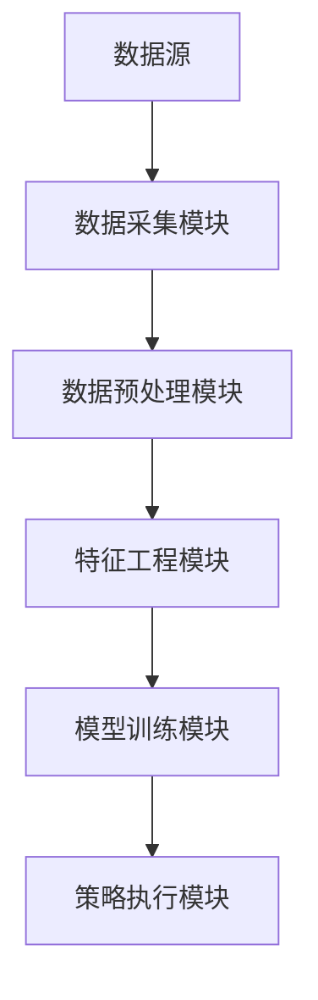

                 

# AI辅助识别价值股轮动机会

## 关键词：
AI技术、价值股轮动、机器学习、股票投资、金融数据分析

## 摘要：
本文详细探讨了人工智能技术在识别价值股轮动机会中的应用。通过分析价值股的定义、轮动机制以及AI算法在金融投资中的作用，本文揭示了如何利用机器学习模型预测股票市场的波动，捕捉价值股的轮动机会。文章从背景介绍、核心概念、算法原理、系统架构到项目实战，全面解析了AI在金融投资中的潜力，并提供了实际案例和代码实现，帮助读者更好地理解和应用这些技术。

---

## 第一部分：AI辅助价值股轮动的背景与概念

### 第1章：价值股轮动的基本概念

#### 1.1 价值股的定义与特征
价值股是指那些市场价格低于其内在价值，具有较高分红能力，且被市场低估的股票。其核心特征包括：
- 低市盈率（P/E比率）：市盈率低于行业平均水平。
- 低市净率（P/B比率）：股价低于每股净资产。
- 高股息率：公司倾向于稳定分红，吸引价值投资者。

#### 1.2 股票轮动机制的原理
股票轮动是指资金从一个板块或行业流向另一个板块或行业的过程。价值股轮动的驱动因素包括：
- 市场情绪：投资者情绪波动导致资金流向变化。
- 行业周期：不同行业在经济周期中的表现不同。
- 宏观经济因素：如利率、通货膨胀、货币政策等。

#### 1.3 AI在金融投资中的应用背景
AI技术在金融领域的应用日益广泛，尤其是在股票预测、风险控制和投资组合管理方面。价值股轮动的复杂性和不确定性使得AI技术成为理想的解决方案。

---

## 第二部分：价值股轮动的核心概念与理论基础

### 第2章：价值股轮动的机制与模型

#### 2.1 价值股轮动的机制分析
价值股轮动的机制涉及多个因素，包括市场情绪、行业周期和宏观经济指标。例如，当市场情绪低迷时，资金可能从成长股转向价值股，导致价值股价格上涨。

#### 2.2 价值股轮动的数学模型
价值股轮动的数学模型可以通过回归分析来建模。例如，使用多元线性回归模型预测股票价格的变化：

$$
\text{Price}_t = \beta_0 + \beta_1 \times \text{PE}_t + \beta_2 \times \text{PB}_t + \epsilon_t
$$

其中，$\text{PE}_t$和$\text{PB}_t$分别是市盈率和市净率，$\epsilon_t$是误差项。

---

## 第三部分：AI算法在价值股轮动中的应用

### 第3章：常用AI算法及其在金融中的应用

#### 3.1 机器学习算法概述
机器学习算法在股票预测中的应用广泛，包括线性回归、支持向量机（SVM）、随机森林和长短期记忆网络（LSTM）等。

##### 3.1.1 线性回归
线性回归是一种简单但有效的回归算法，适用于线性关系的预测。

$$
y = \theta_0 + \theta_1 x + \epsilon
$$

##### 3.1.2 支持向量机（SVM）
SVM适用于非线性分类问题，通过构建超平面将数据分为两类。

##### 3.1.3 随机森林
随机森林是一种基于决策树的集成算法，具有较强的抗过拟合能力。

##### 3.1.4 长短期记忆网络（LSTM）
LSTM适用于时间序列数据的预测，能够捕捉长期依赖关系。

---

### 第4章：机器学习算法在时间序列预测中的应用

#### 4.1 时间序列预测的基本概念
时间序列预测是基于历史数据预测未来趋势的分析方法。常用模型包括ARIMA和LSTM。

#### 4.2 LSTM网络的结构与原理
LSTM通过门控机制处理时间序列数据，结构包括输入门、遗忘门和输出门。

$$
f_t = \sigma(W_f \cdot [h_{t-1}, x_t] + b_f)
$$

其中，$f_t$是输入门，$h_{t-1}$是前一时刻的隐藏状态，$x_t$是当前输入。

---

## 第四部分：系统设计与架构方案

### 第5章：AI辅助投资系统的构建

#### 5.1 系统模块设计
AI辅助投资系统主要包括数据采集模块、特征提取模块、模型训练模块和策略执行模块。

#### 5.2 数据流设计
数据流从数据源（如股票数据库）流向数据预处理模块，再进入特征工程模块，最后输入模型训练模块。

#### 5.3 系统架构图
使用Mermaid图展示系统架构：

---

## 第五部分：项目实战

### 第6章：AI辅助价值股轮动的实现

#### 6.1 环境搭建
使用Python和相关库（如pandas、numpy、scikit-learn和Keras）搭建开发环境。

#### 6.2 数据收集与预处理
从数据源获取股票数据，并进行清洗和标准化处理。

#### 6.3 特征工程
提取市盈率、市净率、股息率等特征，构建特征集。

#### 6.4 模型训练与调优
使用随机森林或LSTM模型训练，并进行参数调优。

#### 6.5 实验结果分析
通过回测分析模型的预测准确率和收益情况。

---

## 第六部分：最佳实践与总结

### 第7章：策略优化与风险管理

#### 7.1 策略优化
通过参数优化和模型组合提升预测精度。

#### 7.2 风险管理
设置止损点和止盈点，控制投资风险。

#### 7.3 模型维护
定期更新模型，适应市场变化。

---

## 总结

本文详细探讨了AI技术在识别价值股轮动机会中的应用，从理论到实践，为投资者提供了新的思路。通过机器学习算法和系统架构设计，投资者可以更有效地捕捉价值股的轮动机会。

---

## 作者信息

作者：AI天才研究院/AI Genius Institute & 禅与计算机程序设计艺术 /Zen And The Art of Computer Programming

---

以上是《AI辅助识别价值股轮动机会》的技术博客文章的完整大纲和内容概述。希望这篇文章能够帮助读者深入了解AI在股票投资中的应用，并为实际操作提供有价值的参考。

