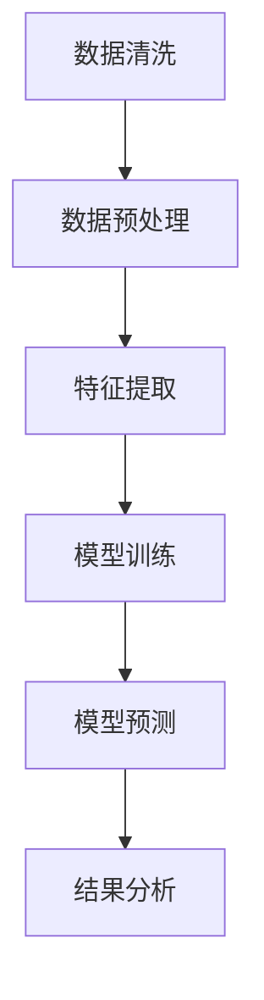

                 


# AI辅助识别全球价值链机会

> 关键词：AI, 全球价值链, 机会识别, 机器学习, 深度学习, 优化算法, 数学模型

> 摘要：本文将深入探讨如何利用人工智能技术辅助识别全球价值链中的机会。通过分析全球价值链的核心概念、AI技术的应用原理以及实际案例，本文将详细阐述AI在优化全球价值链中的作用，并提供具体的算法实现和系统设计方法。

---

## 第一部分：全球价值链与AI的结合背景

### 第1章：全球价值链的定义与现状

#### 1.1 全球价值链的定义
全球价值链（Global Value Chain）是指在全球范围内，企业通过跨国合作和分工，将产品或服务的各个生产环节分散到不同国家或地区，以实现成本最小化和效率最大化的经济活动链条。全球价值链的核心要素包括供应商、生产者、分销商、消费者以及相关的物流、信息流和资金流。

#### 1.2 全球价值链的现状与挑战
当前，全球价值链呈现出以下主要特征：
- **高度分工化**：不同国家和地区专注于特定环节，如制造、组装、研发等。
- **数字化趋势**：随着信息技术的发展，价值链的各个环节越来越依赖数字化工具进行协调和优化。
- **不确定性增加**：全球经济波动、地缘政治风险、疫情等不可抗力因素对全球价值链的稳定性构成挑战。

#### 1.3 AI在识别全球价值链机会中的作用
人工智能技术可以通过数据分析、模式识别和优化算法，帮助企业在复杂的全球市场中识别潜在机会。例如：
- **市场预测**：通过分析历史数据和市场趋势，预测哪些国家或行业可能成为新的增长点。
- **供应链优化**：利用AI技术优化全球供应链网络，降低运营成本并提高效率。
- **竞争优势分析**：通过对比不同国家的生产成本、政策环境等因素，帮助企业找到更具竞争优势的合作伙伴。

---

## 第二部分：AI辅助识别全球价值链的核心概念

### 第2章：AI辅助识别全球价值链的核心原理

#### 2.1 数据分析与全球价值链机会识别
数据分析是AI辅助识别全球价值链机会的基础。通过对全球市场数据的清洗、预处理和建模，可以提取有价值的信息。例如：
- **数据清洗**：去除噪声数据，确保数据质量。
- **数据预处理**：标准化、归一化处理，以便后续算法使用。
- **数据建模**：使用回归分析、聚类分析等方法，识别市场趋势和潜在机会。

#### 2.2 模式识别与机会预测
模式识别是AI技术的核心应用之一。通过分析全球价值链中的数据，可以发现隐藏的模式和规律，从而预测未来的市场机会。例如：
- **模式识别算法**：包括K-means聚类、主成分分析（PCA）等方法。
- **机会预测模型**：基于机器学习的预测模型，可以预测哪些国家或行业在未来几年内会有较高的增长潜力。

#### 2.3 优化与决策支持
优化算法是AI辅助识别全球价值链机会的关键工具。通过优化算法，可以找到最优的供应链布局、生产流程和合作伙伴。例如：
- **线性规划**：用于资源分配和成本最小化问题。
- **遗传算法**：用于复杂的全局优化问题。
- **强化学习**：用于动态环境下的策略优化。

---

## 第三部分：AI算法原理与数学模型

### 第3章：AI算法在价值链机会识别中的应用

#### 3.1 机器学习算法
机器学习算法是AI辅助识别全球价值链机会的核心工具之一。常用的机器学习算法包括：
- **监督学习**：用于分类和回归问题，例如预测某个国家的经济增长率。
- **无监督学习**：用于聚类和降维问题，例如识别市场中的潜在机会。
- **集成学习**：通过组合多个模型的结果，提高预测的准确性。

#### 3.2 深度学习算法
深度学习算法在处理复杂数据和模式识别方面具有显著优势。例如：
- **神经网络**：用于复杂的非线性关系建模。
- **卷积神经网络（CNN）**：用于图像识别和模式识别。
- **循环神经网络（RNN）**：用于时间序列数据分析。

#### 3.3 算法流程图与代码实现
以下是基于机器学习的全球价值链机会识别算法的流程图：



以下是一个简单的Python代码示例：

```python
import pandas as pd
from sklearn.model import LinearRegression

# 数据加载
data = pd.read_csv('global_value_chain.csv')

# 数据清洗
data.dropna()  # 删除缺失值

# 特征提取
X = data[['GDP', ' unemployment rate']]  # 自变量
y = data['growth_rate']  # 因变量

# 模型训练
model = LinearRegression()
model.fit(X, y)

# 模型预测
y_pred = model.predict(X)

# 结果分析
print('预测值:', y_pred)
```

---

## 第四部分：系统分析与架构设计

### 第4章：系统功能设计与架构实现

#### 4.1 系统功能设计
系统功能设计包括以下几个方面：
- **数据采集模块**：从全球市场数据库中获取相关数据。
- **数据分析模块**：对数据进行清洗、预处理和建模。
- **机会识别模块**：基于AI算法识别潜在机会。
- **决策支持模块**：提供优化建议和决策支持。

#### 4.2 系统架构设计
以下是系统的架构图：


#### 4.3 接口设计
系统需要与外部数据库、API接口进行交互，例如：
- **数据库接口**：连接全球市场数据库。
- **API接口**：与第三方数据源（如世界经济论坛）对接。

#### 4.4 交互设计
用户可以通过图形界面输入参数、查看结果和优化建议。例如：
- **输入界面**：用户输入关注的行业和国家。
- **输出界面**：显示预测结果和优化建议。

---

## 第五部分：项目实战

### 第5章：全球价值链机会识别项目实战

#### 5.1 环境安装与数据准备
- **环境安装**：安装Python、Pandas、Scikit-learn等库。
- **数据准备**：从世界经济论坛数据库下载相关数据。

#### 5.2 系统核心实现
以下是基于机器学习的全球价值链机会识别系统的Python代码实现：

```python
import pandas as pd
from sklearn import linear_model

# 数据加载
data = pd.read_csv('global_economy.csv')

# 数据清洗
data = data.dropna()

# 特征提取
X = data[['GDP', 'unemployment_rate']]
y = data['growth_rate']

# 模型训练
model = linear_model.LinearRegression()
model.fit(X, y)

# 模型预测
y_pred = model.predict(X)

# 结果分析
print('预测值:', y_pred)
print('回归系数:', model.coef_)
```

#### 5.3 代码解读与分析
- **数据加载**：使用Pandas读取CSV文件。
- **数据清洗**：删除缺失值。
- **特征提取**：选择GDP和失业率作为自变量。
- **模型训练**：使用线性回归模型进行训练。
- **模型预测**：预测经济增长率。
- **结果分析**：输出预测结果和回归系数。

#### 5.4 实际案例分析
以某个国家为例，分析其经济增长率的预测结果，并提供建议。

#### 5.5 项目小结
总结项目的实施过程、遇到的问题及解决方案。

---

## 第六部分：总结与展望

### 第6章：总结与展望

#### 6.1 最佳实践 tips
- 数据清洗和预处理是关键步骤，直接影响模型的准确性。
- 选择合适的算法和模型，避免过度拟合。
- 结合业务背景，对结果进行合理的解释和应用。

#### 6.2 小结
本文详细介绍了AI辅助识别全球价值链机会的核心概念、算法原理和系统设计，并通过实际案例展示了AI技术的应用价值。

#### 6.3 注意事项
- 数据质量和完整性直接影响模型的准确性。
- 模型的解释性和可解释性需要关注。
- 需要结合具体业务场景，灵活调整算法和模型。

#### 6.4 拓展阅读
- 推荐阅读《机器学习实战》、《深度学习入门》等书籍。
- 关注全球价值链相关的学术论文和行业报告。

---

## 作者：AI天才研究院/AI Genius Institute & 禅与计算机程序设计艺术 /Zen And The Art of Computer Programming

---

本文通过详细分析AI技术在全球价值链机会识别中的应用，结合理论与实践，为读者提供了一种全新的视角来理解全球价值链的优化与重构。希望本文能为相关领域的研究者和从业者提供有价值的参考和启发。

