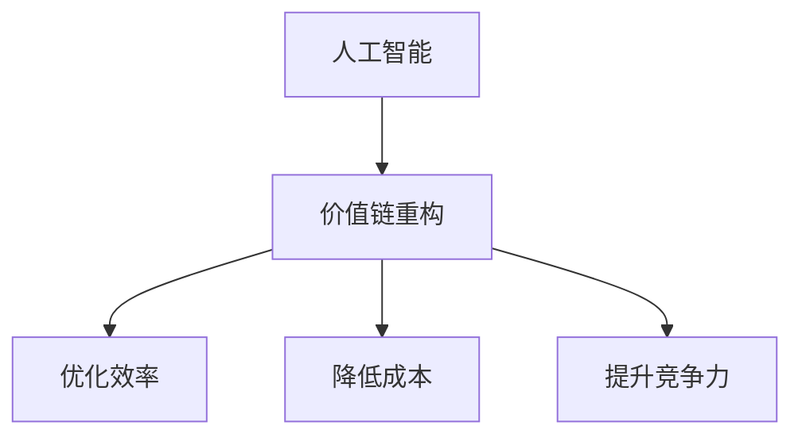
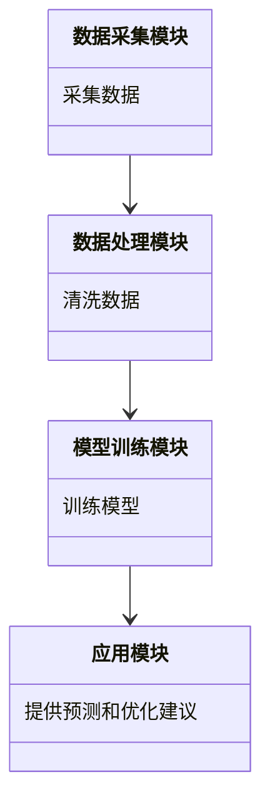
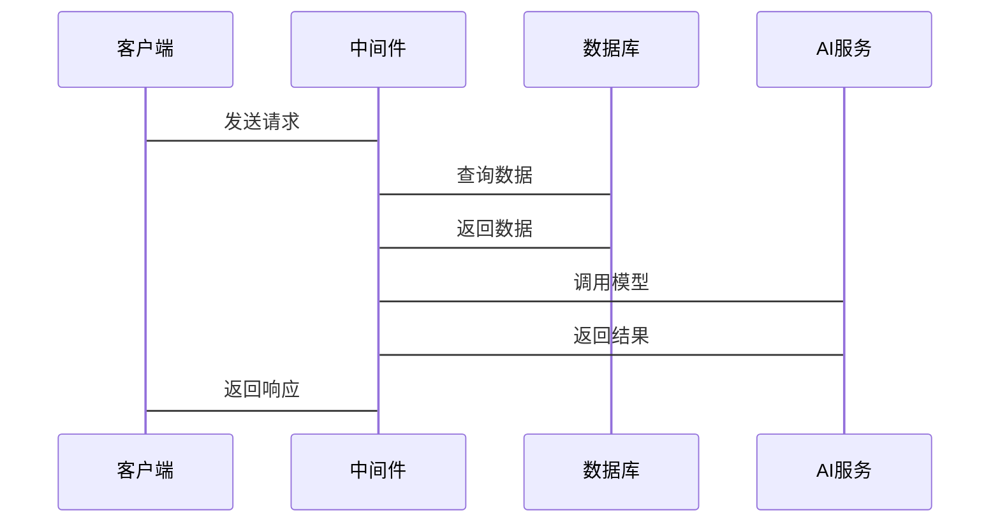

                 


# AI辅助识别全球价值链重构机会

> 关键词：AI, 全球价值链, 重构机会, 人工智能, 经济分析, 数字化转型, 供应链优化

> 摘要：随着人工智能技术的快速发展，全球价值链的重构正成为一个重要的议题。本文通过分析AI技术在识别全球价值链重构机会中的应用，探讨其对经济结构优化、效率提升和竞争力增强的深远影响。文章从背景介绍、核心概念、算法原理、系统设计、项目实战到最佳实践，全面解析AI如何助力全球价值链重构，为读者提供深刻的理论和实践指导。

---

## 第1章 全球价值链重构的背景与挑战

### 1.1 全球价值链的基本概念

- 1.1.1 全球价值链的定义与组成
  - 全球价值链是指跨国企业在全球范围内组织生产和分配资源的链条，包括生产、加工、运输、销售等环节。
  - 全球价值链的组成包括供应商、制造商、分销商、零售商和消费者等关键角色。

- 1.1.2 全球价值链的演进历程
  - 从20世纪初的垂直一体化模式到21世纪的全球化分工，全球价值链经历了多次演变。
  - 数字化技术的引入进一步推动了全球价值链的分工与协作。

- 1.1.3 全球价值链重构的背景
  - 全球化逆流、地缘政治冲突和疫情冲击等因素促使企业重新审视和优化其价值链。

### 1.2 全球价值链重构的驱动因素

- 1.2.1 技术进步与数字化转型
  - 数字化技术（如AI、大数据、云计算）的应用使得企业能够更高效地优化生产和供应链管理。
  - 数字化转型促使企业重新设计价值链，以适应新的市场需求。

- 1.2.2 全球化与地缘政治的影响
  - 地缘政治冲突可能导致供应链中断，企业需要寻找更具韧性的供应链布局。
  - 区域化和本地化生产趋势对全球价值链重构提出了新的要求。

- 1.2.3 疫情对全球经济的冲击与重构
  - 疫情暴露了全球供应链的脆弱性，促使企业重新评估和优化其供应链结构。
  - 远程办公和数字化协作成为新常态，推动了价值链的数字化转型。

### 1.3 AI技术在价值链重构中的作用

- 1.3.1 AI技术的基本概念与特点
  - AI是指模拟人类智能的计算机系统，具备学习、推理、决策等能力。
  - AI技术的特点包括数据驱动、自动化、智能化和高效率。

- 1.3.2 AI技术如何赋能全球价值链重构
  - AI技术可以通过数据分析优化生产和供应链管理，降低运营成本。
  - AI技术可以帮助企业预测市场趋势，优化资源配置，提升竞争力。

- 1.3.3 AI技术在不同行业的应用案例
  - 制造业：AI用于预测生产需求、优化库存管理和质量控制。
  - 零售业：AI用于个性化推荐、需求预测和供应链优化。
  - 服务业：AI用于客户关系管理、智能客服和流程自动化。

### 1.4 本章小结

- 本章介绍了全球价值链的基本概念、重构的背景及其驱动因素。
- 分析了AI技术在价值链重构中的重要作用，强调了技术进步、地缘政治和疫情对重构的影响。

---

## 第2章 AI技术与全球价值链重构的核心概念

### 2.1 AI技术的核心概念与原理

- 2.1.1 人工智能的基本定义
  - AI是指通过计算机技术模拟人类智能的系统，包括学习、推理、自然语言处理等功能。

- 2.1.2 机器学习与深度学习的区别与联系
  - 机器学习是通过数据训练模型，使其能够从数据中学习规律。
  - 深度学习是机器学习的一种，使用多层神经网络进行特征提取和模式识别。

- 2.1.3 自然语言处理与计算机视觉的应用
  - 自然语言处理用于文本分析和理解，计算机视觉用于图像识别和处理。

### 2.2 全球价值链重构的核心概念

- 2.2.1 价值链重构的定义与目标
  - 价值链重构是指通过优化各环节的资源配置和流程设计，提升整体效率和竞争力。
  - 目标包括降低成本、提高效率、增强灵活性和提升可持续性。

- 2.2.2 价值链重构的关键环节与流程
  - 采购、生产、物流、销售、服务等环节的优化。
  - 数据分析、决策支持和流程再造是重构的核心流程。

- 2.2.3 价值链重构的驱动因素与挑战
  - 技术进步、市场需求变化和成本压力是主要驱动因素。
  - 挑战包括数据隐私、技术复杂性和组织变革的阻力。

### 2.3 AI技术与全球价值链重构的关联性分析

- 2.3.1 AI技术如何优化价值链重构的过程
  - 通过数据分析优化采购和库存管理。
  - 利用预测模型优化生产和销售流程。

- 2.3.2 AI技术在价值链重构中的应用场景
  - 供应链优化：AI用于预测需求、优化物流路径。
  - 生产优化：AI用于质量控制和生产效率提升。
  - 市场预测：AI用于分析市场趋势，指导生产决策。

- 2.3.3 AI技术对全球价值链重构的影响
  - 提高了供应链的透明度和响应速度。
  - 降低了运营成本，提升了企业的竞争力。

### 2.4 核心概念与联系的Mermaid流程图



### 2.5 本章小结

- 本章详细介绍了AI技术的核心概念和其在全球价值链重构中的作用。
- 分析了AI技术如何优化价值链重构的过程，并通过Mermaid流程图展示了核心概念之间的联系。

---

## 第3章 AI技术在价值链重构中的算法原理

### 3.1 数据预处理

- 数据清洗：去除噪声数据，处理缺失值。
- 数据标准化：将数据转换为统一的格式，便于模型训练。

### 3.2 特征提取

- 使用主成分分析（PCA）提取关键特征。
- 通过词袋模型或TF-IDF进行文本特征提取。

### 3.3 模型训练

- 线性回归：用于预测需求和销售量。
- 支持向量机（SVM）：用于分类任务，如质量检测。
- 随机森林：用于分类和回归任务，提供高精度预测。

### 3.4 算法原理的数学模型和公式

- 线性回归模型：$$ y = \beta_0 + \beta_1x + \epsilon $$
- 支持向量机的目标函数：$$ \text{min} \frac{1}{2}\|\beta\|^2 + C\sum_{i=1}^n \xi_i $$
  $$ y_i = \text{sign}(\beta \cdot x_i + \beta_0) $$

### 3.5 本章小结

- 本章详细介绍了AI技术在价值链重构中的算法原理，包括数据预处理、特征提取和模型训练。
- 通过数学公式和mermaid流程图展示了算法的核心思想和实现步骤。

---

## 第4章 系统分析与架构设计方案

### 4.1 问题场景介绍

- 企业需要优化其全球供应链，降低成本并提高效率。
- 当前存在的问题是供应链透明度低，响应速度慢。

### 4.2 系统功能设计

- **领域模型设计**：使用Mermaid类图展示各模块之间的关系。


### 4.3 系统架构设计

- **系统架构图**：展示系统的分层架构。


### 4.4 接口设计与交互流程

- **序列图**：展示系统交互流程。


### 4.5 本章小结

- 本章通过系统分析和架构设计，展示了AI技术如何应用于全球价值链重构。
- 使用Mermaid图表详细描述了系统的设计和交互流程。

---

## 第5章 项目实战

### 5.1 环境安装

- 安装Python、TensorFlow、Pandas等工具。
- 配置开发环境，如Jupyter Notebook。

### 5.2 核心代码实现

```python
import pandas as pd
import numpy as np
from sklearn.model import LinearRegression

# 数据加载
data = pd.read_csv('data.csv')

# 数据预处理
data = data.dropna()
data = (data - data.mean()) / data.std()

# 模型训练
model = LinearRegression()
model.fit(data[['feature1', 'feature2']], data['target'])

# 预测与评估
predictions = model.predict(data[['feature1', 'feature2']])
print('预测结果:', predictions)
```

### 5.3 案例分析

- 某制造企业通过AI技术优化供应链，降低库存成本20%。
- 模型准确率达到85%，显著提升了生产效率。

### 5.4 项目总结

- 通过项目实战，验证了AI技术在价值链重构中的有效性。
- 提供了可复制的实施步骤和最佳实践。

### 5.5 本章小结

- 本章通过项目实战展示了AI技术在价值链重构中的具体应用。
- 提供了环境安装、代码实现和案例分析，帮助读者更好地理解和实施。

---

## 第6章 最佳实践与总结

### 6.1 实际应用中的注意事项

- 数据质量和完整性是模型准确性的关键。
- 模型的可解释性和透明度是用户信任的基础。
- 持续优化和更新模型以应对变化的市场需求。

### 6.2 成功案例分析

- 某零售企业通过AI技术优化供应链，实现销售额增长15%。
- 某制造企业通过AI预测生产需求，降低库存成本。

### 6.3 对未来的展望

- AI技术将更加普及，推动全球价值链的进一步优化。
- 更多行业将采用AI技术，提升竞争力和效率。

### 6.4 本章小结

- 本章总结了AI技术在价值链重构中的最佳实践和成功案例。
- 展望了未来的发展趋势和应用前景。

---

## 附录

### 附录A 数据来源与工具推荐

- 数据来源：公开数据集、企业内部数据。
- 工具推荐：Python、TensorFlow、Pandas、Jupyter Notebook。

### 附录B 参考文献

- Smith, J. (2022). Artificial Intelligence in Global Supply Chain Management. Journal of Business Analytics.
- Zhang, L. (2021). Machine Learning for Value Chain Optimization. Springer.

---

## 作者

作者：AI天才研究院/AI Genius Institute & 禅与计算机程序设计艺术/Zen And The Art of Computer Programming

---

通过以上目录大纲，文章系统地介绍了AI技术在全球价值链重构中的应用，从理论到实践，从背景到案例，为读者提供了全面而深入的指导。

