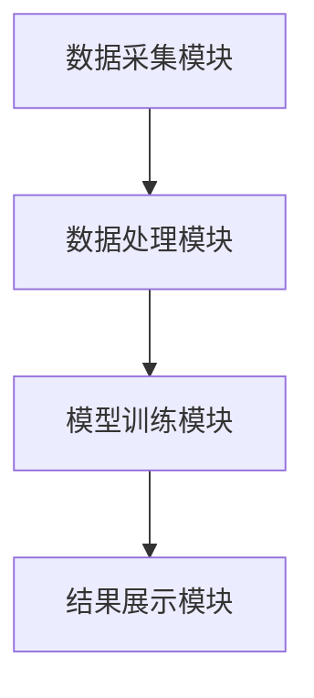
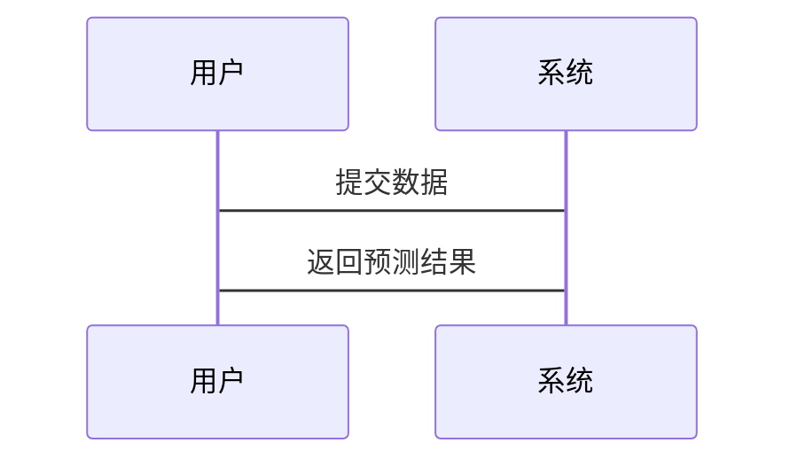

                 


# AI辅助识别市场结构性变化机会

> **关键词**：AI，市场分析，结构性变化，机会识别，数据分析，机器学习，深度学习  
> **摘要**：本文探讨了如何利用人工智能技术识别市场结构性变化的机会。通过分析市场数据、运用机器学习和深度学习算法，结合系统架构设计，提供了一套完整的解决方案，帮助企业在复杂多变的市场环境中抓住潜在机会。

---

## 第1章: AI与市场分析的背景与意义

### 1.1 什么是市场结构性变化
#### 1.1.1 市场结构性变化的定义
市场结构性变化指的是市场中各要素之间的关系、比例和配置方式发生的根本性变化。这种变化可能由技术进步、政策调整、消费者行为变化或经济环境变化等因素引发。

#### 1.1.2 市场结构性变化的特征
- **突发性**：市场结构性变化可能在短时间内迅速发生。
- **系统性**：变化通常涉及市场中的多个要素，具有连锁反应。
- **长期性**：结构性变化对市场的影响往往是长期的。

#### 1.1.3 市场结构性变化的分类
- **技术驱动型**：由技术创新引发的市场结构变化。
- **政策驱动型**：由政策法规变化引发的市场结构变化。
- **需求驱动型**：由消费者需求变化引发的市场结构变化。

### 1.2 AI在市场分析中的作用
#### 1.2.1 AI技术的基本概念
人工智能（AI）是指计算机系统模拟人类智能的技术，包括学习、推理、自我改进等功能。

#### 1.2.2 AI在市场分析中的优势
- **高效性**：AI能够快速处理大量数据，发现人类难以察觉的模式。
- **准确性**：通过机器学习算法，AI能够提高预测的准确性。
- **实时性**：AI可以实时监控市场变化，及时发出预警。

#### 1.2.3 AI如何识别市场结构性变化
AI通过分析市场数据，识别潜在的变化模式，并预测未来的变化趋势。

### 1.3 本章小结
本章介绍了市场结构性变化的定义、特征和分类，并探讨了AI在市场分析中的作用及其优势。

---

## 第2章: AI技术的核心原理

### 2.1 机器学习的基本原理
#### 2.1.1 机器学习的定义
机器学习是一种通过数据训练模型，使其能够从数据中学习并做出预测的技术。

#### 2.1.2 机器学习的分类
- **监督学习**：基于标记数据的训练。
- **无监督学习**：基于无标记数据的训练。
- **强化学习**：通过与环境交互进行学习。

#### 2.1.3 机器学习的核心算法
- **线性回归**：用于预测连续型变量。
- **支持向量机（SVM）**：用于分类和回归。
- **随机森林**：用于分类和回归，基于树的集成方法。

### 2.2 深度学习的基本原理
#### 2.2.1 深度学习的定义
深度学习是一种基于人工神经网络的机器学习方法，通过多层网络结构提取数据特征。

#### 2.2.2 深度学习的网络结构
- **卷积神经网络（CNN）**：常用于图像识别。
- **循环神经网络（RNN）**：常用于时间序列分析。
- **长短期记忆网络（LSTM）**：用于处理长序列数据。

#### 2.2.3 深度学习的核心算法
- **反向传播算法（Backpropagation）**：用于训练神经网络。
- **梯度下降（Gradient Descent）**：优化模型参数。

### 2.3 自然语言处理的基本原理
#### 2.3.1 自然语言处理的定义
自然语言处理（NLP）是研究如何让计算机理解和处理人类语言的技术。

#### 2.3.2 自然语言处理的核心技术
- **分词**：将文本分割成单词或短语。
- **句法分析**：分析句子的语法结构。
- **情感分析**：判断文本的情感倾向。

#### 2.3.3 自然语言处理的应用场景
- **舆情分析**：分析公众对某个话题的情感倾向。
- **信息提取**：从文本中提取关键信息。
- **机器翻译**：将一种语言翻译成另一种语言。

---

## 第3章: AI技术在市场分析中的应用

### 3.1 数据获取与预处理
#### 3.1.1 数据来源
- **内部数据**：企业自身的销售数据、客户数据等。
- **外部数据**：公开的市场数据、社交媒体数据等。

#### 3.1.2 数据清洗
- **去除重复数据**：删除重复的记录。
- **处理缺失值**：填补缺失的值或删除缺失值较多的记录。
- **去除异常值**：识别并处理异常值。

#### 3.1.3 数据转换
- **数据标准化**：将数据转换到同一尺度。
- **数据编码**：将分类变量转换为数值变量。

### 3.2 市场趋势预测
#### 3.2.1 时间序列分析
- **ARIMA模型**：用于时间序列预测。
- **LSTM网络**：用于长期依赖的时间序列预测。

#### 3.2.2 机器学习模型的应用
- **线性回归**：用于预测连续型变量。
- **随机森林**：用于分类和回归。

#### 3.2.3 深度学习模型的应用
- **卷积神经网络（CNN）**：用于图像识别。
- **长短期记忆网络（LSTM）**：用于时间序列分析。

### 3.3 市场风险评估
#### 3.3.1 风险识别
- **异常检测**：识别市场中的异常情况。
- **聚类分析**：将相似的市场行为归为一类。

#### 3.3.2 风险评估模型
- **逻辑回归**：用于分类问题。
- **支持向量机（SVM）**：用于分类和回归。

#### 3.3.3 风险控制
- **风险预警**：及时发出风险预警。
- **风险规避**：采取措施避免风险。

---

## 第4章: AI算法实现市场结构性变化识别

### 4.1 算法选择与优化
#### 4.1.1 算法选择的原则
- **数据类型**：根据数据类型选择合适的算法。
- **问题类型**：根据问题类型选择合适的算法。
- **计算资源**：根据计算资源选择合适的算法。

#### 4.1.2 算法优化的方法
- **超参数调优**：通过调整超参数提高模型性能。
- **特征选择**：选择对模型性能影响较大的特征。
- **模型集成**：通过集成多个模型提高模型性能。

#### 4.1.3 算法评估指标
- **准确率**：分类问题中正确预测的比例。
- **精确率**：分类问题中正确预测的正例比例。
- **召回率**：分类问题中正确预测的正例比例。

### 4.2 算法实现流程
#### 4.2.1 数据输入
- **数据加载**：将数据加载到内存中。
- **数据预处理**：对数据进行清洗和转换。

#### 4.2.2 模型训练
- **数据分割**：将数据分为训练集和测试集。
- **模型训练**：使用训练数据训练模型。

#### 4.2.3 模型预测
- **模型预测**：使用测试数据预测结果。
- **结果分析**：分析预测结果的准确性。

### 4.3 算法实现的代码示例
#### 4.3.1 数据预处理代码
```python
import pandas as pd
from sklearn.preprocessing import StandardScaler

# 加载数据
data = pd.read_csv('market_data.csv')

# 数据清洗
data.dropna()
data = data.drop_duplicates()

# 数据转换
scaler = StandardScaler()
data_scaled = scaler.fit_transform(data)
```

#### 4.3.2 模型训练代码
```python
from sklearn.linear_model import LinearRegression
from sklearn.metrics import mean_squared_error

# 模型训练
model = LinearRegression()
model.fit(X_train, y_train)

# 模型预测
y_pred = model.predict(X_test)

# 计算均方误差
mse = mean_squared_error(y_test, y_pred)
print('均方误差:', mse)
```

#### 4.3.3 模型预测代码
```python
import matplotlib.pyplot as plt

# 可视化预测结果
plt.scatter(y_test, y_pred)
plt.xlabel('真实值')
plt.ylabel('预测值')
plt.show()
```

---

## 第5章: 系统架构设计与实现

### 5.1 系统架构设计
#### 5.1.1 系统模块划分
- **数据采集模块**：负责采集市场数据。
- **数据处理模块**：负责数据清洗和转换。
- **模型训练模块**：负责模型训练和优化。
- **结果展示模块**：负责展示预测结果。

#### 5.1.2 系统功能设计
- **数据可视化**：展示市场数据的变化趋势。
- **模型预测**：预测市场结构性变化。
- **风险预警**：及时发出风险预警。

#### 5.1.3 系统架构图


### 5.2 系统接口设计
#### 5.2.1 数据接口
- **数据输入接口**：接收外部数据。
- **数据输出接口**：输出处理后的数据。

#### 5.2.2 模型接口
- **模型训练接口**：训练模型。
- **模型预测接口**：预测结果。

### 5.3 系统交互设计
#### 5.3.1 交互流程图


---

## 第6章: 项目实战

### 6.1 环境安装
- **Python**：安装Python 3.8及以上版本。
- **库安装**：安装numpy、pandas、scikit-learn、keras等库。

### 6.2 系统核心实现源代码
#### 6.2.1 数据预处理代码
```python
import pandas as pd
from sklearn.preprocessing import StandardScaler

# 加载数据
data = pd.read_csv('market_data.csv')

# 数据清洗
data.dropna()
data = data.drop_duplicates()

# 数据转换
scaler = StandardScaler()
data_scaled = scaler.fit_transform(data)
```

#### 6.2.2 模型训练代码
```python
from sklearn.linear_model import LinearRegression
from sklearn.metrics import mean_squared_error

# 模型训练
model = LinearRegression()
model.fit(X_train, y_train)

# 模型预测
y_pred = model.predict(X_test)

# 计算均方误差
mse = mean_squared_error(y_test, y_pred)
print('均方误差:', mse)
```

### 6.3 实际案例分析
#### 6.3.1 数据来源
- **市场数据**：包括价格、成交量、用户评论等。

#### 6.3.2 数据分析
- **趋势分析**：通过时间序列分析识别市场趋势。
- **情感分析**：通过NLP技术分析用户评论的情感倾向。

#### 6.3.3 案例小结
通过AI技术，企业可以及时发现市场结构性变化，抓住潜在机会，避免风险。

---

## 第7章: 总结与展望

### 7.1 本章总结
本文详细探讨了AI技术在识别市场结构性变化中的应用，从数据获取、模型训练到系统实现，提供了一套完整的解决方案。

### 7.2 未来展望
随着AI技术的不断发展，市场结构性变化识别将更加精准和高效。未来的研究方向包括更复杂的模型和更广泛的应用场景。

### 7.3 最佳实践 tips
- **数据质量**：数据质量是模型性能的关键，确保数据的准确性和完整性。
- **模型选择**：根据问题类型和数据类型选择合适的算法。
- **持续优化**：定期更新模型，适应市场变化。

### 7.4 小结
AI技术在识别市场结构性变化中的应用前景广阔，企业可以通过AI技术提升市场分析能力，抓住潜在机会，避免风险。

---

## 作者信息

作者：AI天才研究院/AI Genius Institute & 禅与计算机程序设计艺术 /Zen And The Art of Computer Programming

