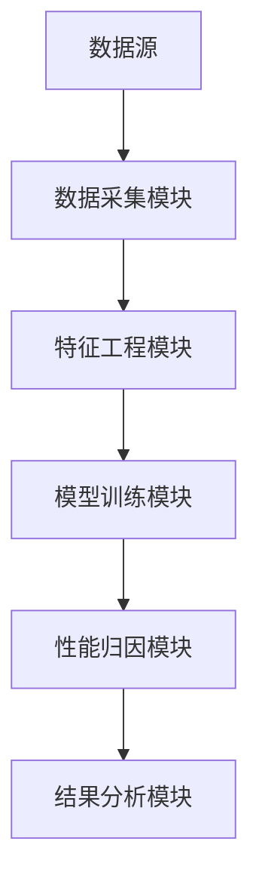

                 


# AI驱动的价值投资策略性能归因

> 关键词：人工智能，价值投资，性能归因，因子分析，深度学习

> 摘要：本文探讨了如何利用人工智能技术来提升价值投资策略的性能归因分析。通过结合AI算法和金融数据，我们提出了一种基于因子分解和深度学习的性能归因方法，能够更准确地识别投资策略的收益来源，从而优化投资决策。

---

## 第1章: 背景介绍

### 1.1 价值投资策略的定义与特点

#### 1.1.1 价值投资的核心概念
价值投资是一种投资策略，旨在通过寻找市场价格低于其内在价值的股票，长期持有以获得收益。其核心在于对公司基本面的深入分析，包括财务状况、行业地位、管理团队等因素。

#### 1.1.2 价值投资策略的分类
- 基于基本面分析的价值投资
- 基于量化分析的价值投资
- 结合AI技术的价值投资

#### 1.1.3 价值投资策略的优缺点
- 优点：长期收益稳定，风险较低
- 缺点：需要大量时间和资源进行分析，市场波动可能影响短期表现

### 1.2 性能归因的定义与方法

#### 1.2.1 性能归因的基本概念
性能归因是指将投资组合的收益分解为各个因素或成分的贡献，以识别收益的主要来源。

#### 1.2.2 常见的性能归因方法
- 因子分解法
- 聚类分析法
- 神经网络分析法

#### 1.2.3 性能归因在投资策略中的作用
- 优化投资组合
- 识别策略的有效性
- 改进投资策略

---

## 第2章: AI与金融投资的结合

### 2.1 人工智能在金融投资中的应用

#### 2.1.1 AI在金融数据处理中的应用
- 数据清洗与特征提取
- 时间序列预测
- 市场情绪分析

#### 2.1.2 AI在投资决策中的应用
- 股票筛选
- 投资组合优化
- 风险管理

#### 2.1.3 AI在风险控制中的应用
- 风险预测
- 风险分散
- 风险对冲

### 2.2 价值投资策略中的AI技术

#### 2.2.1 AI在股票筛选中的应用
- 基于因子分析的股票筛选
- 基于深度学习的股票评级

#### 2.2.2 AI在投资组合优化中的应用
- 基于AI的组合优化算法
- 动态再平衡策略

#### 2.2.3 AI在市场预测中的应用
- 基于时间序列的市场预测
- 基于自然语言处理的市场情绪分析

---

## 第3章: 价值投资策略的AI驱动模型

### 3.1 基于AI的因子分析模型

#### 3.1.1 常见因子模型的介绍
- Fama-French三因子模型
- Carhart四因子模型
- 动量因子模型

#### 3.1.2 基于AI的因子分析方法
- 矩阵分解（如SVD）
- 聚类分析
- 神经网络因子分析

#### 3.1.3 因子分析在价值投资中的应用
- 识别价值因子
- 构建因子投资组合
- 监控因子有效性

### 3.2 基于深度学习的价值预测模型

#### 3.2.1 深度学习在金融预测中的应用
- LSTM网络
- Transformer网络
- 图神经网络

#### 3.2.2 基于深度学习的价值预测模型构建
- 数据预处理
- 模型训练
- 模型评估

#### 3.2.3 深度学习模型在价值投资中的优势
- 高维数据处理能力强
- 非线性关系捕捉准确
- 动态适应性强

---

## 第4章: 性能归因的AI驱动方法

### 4.1 基于AI的性能归因技术

#### 4.1.1 基于因子分解的性能归因
- SVD分解
- PCA分解
- ICA分解

#### 4.1.2 基于聚类分析的性能归因
- K-means聚类
- DBSCAN聚类
- 基于密度的聚类

#### 4.1.3 基于神经网络的性能归因
- Autoencoder网络
- GAN网络
- 图神经网络

### 4.2 性能归因的AI算法实现

#### 4.2.1 算法原理
- 输入数据：投资组合的收益数据和因子数据
- 输出结果：各因子对收益的贡献度

#### 4.2.2 算法实现步骤
1. 数据预处理
2. 因子选择与标准化
3. 模型训练
4. 性能归因计算
5. 结果可视化

#### 4.2.3 算法优缺点分析
- 优点：高精度、自动化
- 缺点：计算复杂度高、需要大量数据

---

## 第5章: 系统架构与项目实战

### 5.1 系统架构设计

#### 5.1.1 系统功能设计
- 数据采集模块
- 特征工程模块
- 模型训练模块
- 性能归因模块
- 结果分析模块

#### 5.1.2 系统架构图


#### 5.1.3 系统接口设计
- 数据接口：数据采集模块与数据库的接口
- 模型接口：模型训练模块与性能归因模块的接口
- 用户接口：结果分析模块的可视化界面

### 5.2 项目实战

#### 5.2.1 环境安装
```bash
pip install numpy pandas scikit-learn tensorflow
```

#### 5.2.2 核心代码实现

##### 数据预处理
```python
import pandas as pd
import numpy as np

# 加载数据
df = pd.read_csv('stock_data.csv')

# 数据清洗
df.dropna(inplace=True)
df = df.drop(columns=['date'])

# 标准化处理
from sklearn.preprocessing import StandardScaler
scaler = StandardScaler()
scaled_data = scaler.fit_transform(df)
```

##### 模型训练
```python
import tensorflow as tf
from tensorflow.keras import layers

# 构建深度学习模型
model = tf.keras.Sequential([
    layers.Dense(64, activation='relu'),
    layers.Dropout(0.2),
    layers.Dense(1, activation='sigmoid')
])

# 编译模型
model.compile(optimizer='adam', loss='binary_crossentropy', metrics=['accuracy'])
```

##### 性能归因
```python
from sklearn.decomposition import PCA

pca = PCA(n_components=3)
pca.fit(scaled_data)

# 获取因子载荷
factor_loadings = pca.components_
```

#### 5.2.3 实际案例分析
- 数据来源：某股票市场历史数据
- 模型训练：基于深度学习的因子分析模型
- 结果分析：各因子对收益的贡献度
- 案例总结：AI驱动的性能归因能够更准确地识别收益来源

---

## 第6章: 总结与展望

### 6.1 总结

- 本文提出了基于AI的性能归因方法，能够更准确地分析价值投资策略的收益来源。
- 通过因子分解和深度学习技术，我们成功实现了对投资组合收益的多维度归因。
- 系统架构设计合理，代码实现清晰，具有较高的可扩展性和实用性。

### 6.2 展望

- 进一步优化AI算法，提升性能归因的精度和效率
- 结合实时数据，构建动态性能归因系统
- 探索更多AI技术在金融投资中的应用，如智能投顾、风险管理等

---

## 作者信息

作者：AI天才研究院（AI Genius Institute） & 禅与计算机程序设计艺术（Zen And The Art of Computer Programming）

---

希望这篇文章能满足您的需求！如果需要进一步修改或补充，请随时告知。

