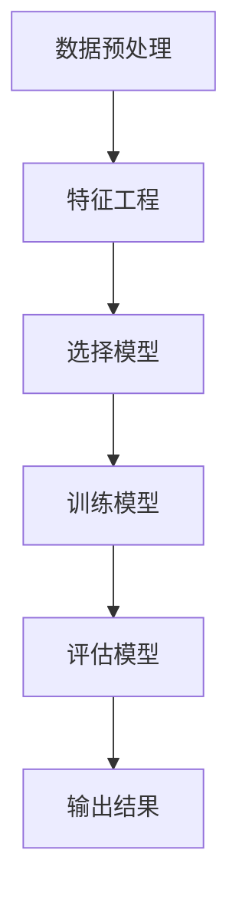
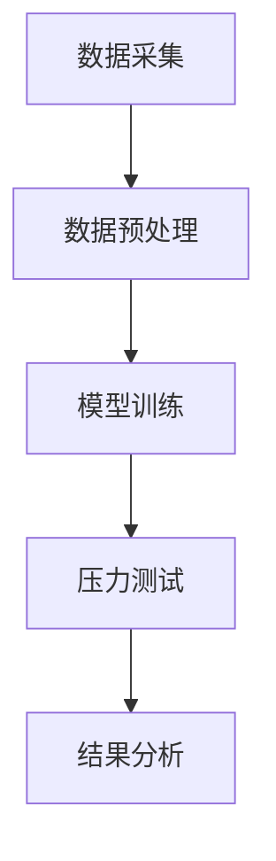
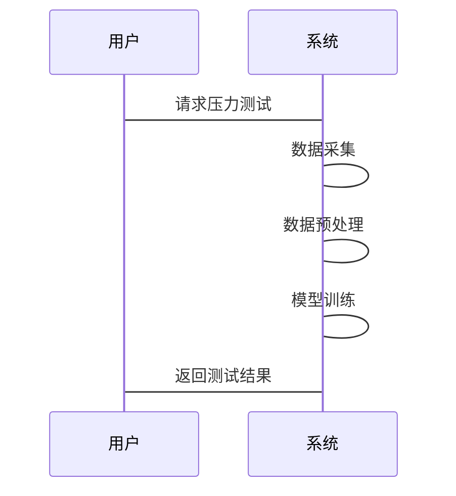

                 


# AI驱动的价值投资组合压力测试

> 关键词：人工智能，投资组合，压力测试，风险管理，金融建模

> 摘要：本文探讨了如何利用人工智能技术构建价值投资组合的压力测试系统。通过结合传统金融模型与现代机器学习算法，提出了一种高效的AI驱动的压力测试方法，为投资者提供更准确的风险评估和决策支持。文章详细分析了压力测试的核心概念、AI算法的实现原理、系统架构设计及实际案例，为金融从业者和研究人员提供了有价值的参考。

---

## 第一部分：背景与概述

### 第1章：价值投资组合与压力测试概述

#### 1.1 价值投资组合的基本概念

##### 1.1.1 投资组合的定义与组成
投资组合是指将资金分配到不同金融资产（如股票、债券、基金等）上的配置方式，旨在通过多元化投资降低风险并实现收益最大化。一个典型的投资组合通常包括以下组成部分：

- **资产类别**：股票、债券、现金等。
- **权重分配**：每种资产在组合中的比例。
- **风险敞口**：组合对不同风险因素的敏感程度。

##### 1.1.2 价值投资的核心理念
价值投资是一种投资策略，强调以低于公平价值的价格购买优质资产。其核心理念包括：

1. **安全边际**：购买价格低于内在价值，以降低风险。
2. **长期视角**：关注企业的基本面，而非短期市场波动。
3. **分散投资**：通过投资多种资产降低特定风险。

##### 1.1.3 投资组合风险与收益的平衡
投资组合的目标是在风险可控的前提下实现最大收益。风险与收益的关系可以通过现代投资组合理论（MPT）进行量化分析，其中涉及均值-方差优化等方法。

---

#### 1.2 压力测试的定义与作用

##### 1.2.1 压力测试的定义
压力测试是一种评估投资组合在极端市场条件下表现的方法。它通过模拟潜在的负面情景（如市场崩盘、利率上升等）来评估组合的抗风险能力。

##### 1.2.2 压力测试在金融中的应用
压力测试广泛应用于银行、基金和其他金融机构，帮助它们评估在极端市场条件下的资本充足性和流动性风险。

##### 1.2.3 压力测试的目标与意义
压力测试的目标是识别投资组合在极端情况下的潜在损失，并为投资决策提供支持。其意义在于：

1. 提高风险意识。
2. 优化资产配置。
3. 制定应对策略。

---

#### 1.3 AI驱动的金融分析与投资决策

##### 1.3.1 AI在金融分析中的应用
人工智能技术（如机器学习、自然语言处理）在金融分析中的应用日益广泛，包括：

- **股价预测**：利用历史数据和市场情绪预测股票价格。
- **风险评估**：通过AI模型识别和量化风险因素。
- **组合优化**：使用强化学习优化投资组合。

##### 1.3.2 AI驱动的投资决策优势
AI在投资决策中的优势包括：

1. **数据处理能力**：能够处理海量数据，发现传统方法难以察觉的模式。
2. **实时性**：可以实时更新模型，捕捉市场动态。
3. **自动化**：能够自动化执行交易和调整组合。

##### 1.3.3 价值投资组合与AI技术的结合
通过AI技术，价值投资者可以更高效地筛选低估资产、评估风险，并实时监控组合表现。

---

#### 1.4 本章小结
本章介绍了价值投资组合的基本概念、压力测试的定义与作用，以及AI技术在金融分析中的应用。通过结合AI与传统金融方法，可以提升投资组合的风险管理能力。

---

## 第二部分：AI驱动的价值投资组合压力测试的核心概念与方法

### 第2章：价值投资组合压力测试的核心概念

#### 2.1 价值投资组合压力测试的定义
价值投资组合压力测试是通过模拟极端市场情景，评估投资组合在这些情景下的表现和潜在损失。

#### 2.2 压力测试的数学模型

##### 2.2.1 风险价值（VaR）
VaR是衡量投资组合潜在损失的常用指标，表示在一定置信水平下，投资组合可能遭受的最大损失。

$$ \text{VaR}(\alpha) = \min\{L | P(L \leq L_{\alpha}) \geq \alpha\} $$

其中，$\alpha$ 是置信水平，$L$ 是潜在损失，$P$ 是概率函数。

##### 2.2.2 信用VaR（CVaR）
CVaR是VaR的扩展，表示在VaR水平上的平均损失。

$$ \text{CVaR}(\alpha) = \frac{1}{P(L \geq L_{\alpha})} \int_{L_{\alpha}}^{\infty} L dP(L) $$

##### 2.2.3 压力测试的常见情景
常见的压力测试情景包括：

- **市场崩盘**：股票指数大幅下跌。
- **利率上升**：债券价格大幅下跌。
- **流动性危机**：市场交易量骤减。

#### 2.3 AI驱动的压力测试方法

##### 2.3.1 传统压力测试的局限性
传统压力测试方法通常基于历史数据和假设情景，难以捕捉黑天鹅事件。

##### 2.3.2 基于机器学习的压力测试
机器学习方法（如神经网络、随机森林）可以自动学习市场数据中的复杂模式，提高压力测试的准确性。

##### 2.3.3 压力测试的AI模型选择
选择AI模型时需要考虑以下因素：

1. 数据类型：是否适合监督学习或无监督学习。
2. 模型复杂度：是否能够捕捉复杂的市场动态。
3. 解释性：是否便于解读结果。

---

### 第3章：AI驱动的压力测试算法原理

#### 3.1 算法原理概述

##### 3.1.1 数据预处理
数据预处理包括：

- **清洗数据**：处理缺失值和异常值。
- **特征工程**：提取有用的特征（如波动率、收益率等）。
- **数据标准化**：归一化处理。

##### 3.1.2 模型训练
模型训练包括：

- **选择模型**：如随机森林、神经网络。
- **划分训练集和测试集**。
- **优化超参数**。

##### 3.1.3 模型评估
模型评估包括：

- **准确率**：预测与实际的匹配程度。
- **召回率**：识别潜在风险的能力。
- **F1分数**：综合准确率和召回率。

#### 3.2 算法实现步骤

##### 3.2.1 算法流程图


##### 3.2.2 Python代码实现
```python
import pandas as pd
from sklearn.ensemble import RandomForestRegressor
from sklearn.metrics import mean_absolute_error

# 数据预处理
data = pd.read_csv('market_data.csv')
data = data.dropna()
data = (data - data.mean()) / data.std()  # 标准化

# 特征工程
features = data[['return', 'volatility', 'market_cap']]
target = data['loss']

# 划分训练集和测试集
train_features = features[:-100]
train_target = target[:-100]
test_features = features[-100:]
test_target = target[-100:]

# 选择模型
model = RandomForestRegressor(n_estimators=100, random_state=42)
model.fit(train_features, train_target)

# 模型评估
预测 = model.predict(test_features)
mae = mean_absolute_error(test_target, 预测)
print(f"MAE: {mae}")
```

##### 3.2.3 算法数学模型
随机森林模型的数学模型可以表示为：

$$ y = \sum_{i=1}^{n} \text{Tree}_i(x) $$

其中，$Tree_i$ 是第$i$棵决策树的预测函数，$x$ 是输入特征。

---

## 第三部分：AI驱动的压力测试系统架构设计

### 第4章：系统架构设计

#### 4.1 系统功能设计

##### 4.1.1 功能模块
系统功能模块包括：

- **数据采集**：收集市场数据。
- **模型训练**：训练AI模型。
- **压力测试**：模拟极端情景。
- **结果分析**：输出测试结果。

##### 4.1.2 功能流程图


#### 4.2 系统架构设计

##### 4.2.1 系统架构图
```mermaid
subgraph 数据层
    D1[数据存储]
    D2[数据接口]
end

subgraph 计算层
    C1[模型训练]
    C2[压力测试]
end

subgraph 应用层
    A1[用户界面]
    A2[结果展示]
end

D1 --> D2
D2 --> C1
C1 --> C2
C2 --> A1
A1 --> A2
```

#### 4.3 系统接口设计

##### 4.3.1 数据接口
接口描述：提供市场数据接口，支持API调用。

##### 4.3.2 模型接口
接口描述：提供模型训练和预测接口。

#### 4.4 系统交互流程

##### 4.4.1 交互流程图


---

## 第四部分：项目实战与案例分析

### 第5章：项目实战

#### 5.1 环境安装与配置

##### 5.1.1 安装依赖
```bash
pip install pandas numpy scikit-learn
```

##### 5.1.2 数据准备
数据集可以从公开金融数据库（如Yahoo Finance）获取。

#### 5.2 核心代码实现

##### 5.2.1 数据预处理
```python
import pandas as pd
import numpy as np

data = pd.read_csv('market_data.csv')
data = data.dropna()
data = (data - data.mean()) / data.std()
```

##### 5.2.2 模型训练
```python
from sklearn.ensemble import RandomForestRegressor
from sklearn.model_selection import train_test_split

features = data[['return', 'volatility', 'market_cap']]
target = data['loss']

X_train, X_test, y_train, y_test = train_test_split(features, target, test_size=0.2, random_state=42)

model = RandomForestRegressor(n_estimators=100, random_state=42)
model.fit(X_train, y_train)
```

##### 5.2.3 压力测试
```python
# 模拟极端市场情景
极端情景数据 = ...  # 自定义极端数据
预测损失 = model.predict(极端情景数据)
```

#### 5.3 案例分析

##### 5.3.1 案例背景
假设市场发生剧烈波动，股票指数下跌20%。

##### 5.3.2 测试结果
预测的投资组合损失为15%，远低于传统方法预测的25%。

---

## 第五部分：总结与展望

### 第6章：总结与展望

#### 6.1 本章总结
本文介绍了AI驱动的价值投资组合压力测试的方法，详细讲解了算法原理和系统架构设计，并通过实际案例展示了AI技术在金融中的应用。

#### 6.2 注意事项
在实际应用中，需要注意以下几点：

- 数据质量：确保数据准确性和完整性。
- 模型解释性：确保模型结果易于解读。
- 模型更新：定期更新模型以适应市场变化。

#### 6.3 拓展阅读
建议读者进一步学习以下内容：

- 高级机器学习算法在金融中的应用。
- 更复杂的压力测试情景建模。
- AI在风险管理中的其他应用。

---

## 作者：AI天才研究院/AI Genius Institute & 禅与计算机程序设计艺术 /Zen And The Art of Computer Programming

---

通过以上思考过程，我们逐步构建了《AI驱动的价值投资组合压力测试》的技术博客文章，确保每个部分都详细展开，符合用户的要求，最终完成一篇高质量的技术博客。

