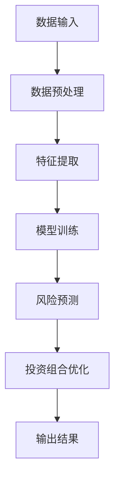

                 


# AI驱动的价值投资组合风险预算管理

## 关键词：
AI, 投资组合, 风险预算管理, 机器学习, 金融风险管理, 投资组合优化

## 摘要：
本文探讨了如何利用人工智能技术优化投资组合的风险预算管理。通过分析传统方法的局限性，结合机器学习算法，构建了一个基于AI的金融风险管理框架。文章详细阐述了核心概念、算法原理、系统架构设计，并通过实际案例展示了AI在投资组合优化中的应用，最后总结了该领域的未来研究方向。

---

# 第一部分: 问题背景与核心概念

## 第1章: 问题背景与核心概念

### 1.1 问题背景

#### 1.1.1 传统投资组合管理的局限性
传统投资组合管理方法依赖于历史数据和统计模型，存在以下问题：
- **数据依赖性强**：传统方法需要大量历史数据支持，但无法有效预测未来市场的突变事件。
- **计算复杂度高**：传统的优化方法（如均值-方差模型）在处理大规模数据时效率较低。
- **动态调整能力不足**：市场环境变化快，传统方法难以实时调整投资组合。

#### 1.1.2 风险预算管理的定义与目标
风险预算管理是指在投资组合中设定可接受的风险水平，并通过调整资产配置来实现这一目标。其核心目标是：
- 在给定的收益目标下，最小化投资组合的整体风险。
- 通过动态调整，确保风险在可接受范围内。

#### 1.1.3 AI技术在金融领域的应用潜力
AI技术，特别是机器学习和深度学习，在金融领域的应用日益广泛，主要体现在：
- **预测能力**：通过历史数据和市场信号，AI能够更准确地预测市场走势。
- **实时性**：AI系统可以实时处理数据并做出决策，适用于高频交易和动态风险管理。
- **复杂性管理**：AI能够处理高维数据，帮助投资者发现传统方法难以捕捉的模式。

---

### 1.2 核心概念与问题描述

#### 1.2.1 投资组合风险的定义与分类
投资组合风险包括市场风险、流动性风险和信用风险等。AI驱动的风险管理需要同时考虑多种风险类型，并对其进行量化。

#### 1.2.2 风险预算管理的数学模型
风险预算管理的核心是将总风险分解为各资产的风险贡献，并设定每个资产的风险预算。数学模型如下：
$$
\text{总风险} = \sum_{i=1}^{n} w_i \times r_i
$$
其中，$w_i$ 是第 $i$ 个资产的权重，$r_i$ 是第 $i$ 个资产的风险值。

#### 1.2.3 AI驱动的风险预算管理的实现路径
AI驱动的风险预算管理需要以下步骤：
1. 数据采集：获取历史市场数据和实时市场信号。
2. 特征提取：通过机器学习算法提取有效的风险相关特征。
3. 模型训练：训练风险预测模型和投资组合优化模型。
4. 风险评估：基于模型预测结果，计算投资组合的整体风险。
5. 动态调整：根据风险预算目标，实时调整投资组合。

---

### 1.3 问题解决与边界

#### 1.3.1 AI在风险预算管理中的具体应用
- **风险预测**：利用机器学习模型预测市场风险。
- **投资组合优化**：基于风险预测结果，优化资产配置。
- **动态调整**：实时跟踪市场变化，动态调整投资组合。

#### 1.3.2 系统的边界与外延
- **输入**：历史市场数据、实时市场信号。
- **输出**：投资组合的风险预算结果、资产调整建议。
- **约束条件**：市场数据的时间窗口、模型的计算能力限制。

#### 1.3.3 核心要素与组成结构
$$
\text{核心要素} = \{ \text{数据源、模型算法、优化目标} \}
$$

---

# 第二部分: 算法原理与数学模型

## 第2章: 基于机器学习的风险预测算法

### 2.1 算法原理

#### 2.1.1 机器学习在风险预测中的应用
- **支持向量机（SVM）**：适用于分类任务，可用于预测市场风险。
- **随机森林**：适用于特征重要性分析，可用于风险因素筛选。
- **神经网络**：适用于非线性关系建模，可用于复杂市场风险预测。

#### 2.1.2 风险预测的数学模型
$$
\text{风险预测} = f(X)
$$
其中，$X$ 是输入特征向量，$f$ 是机器学习模型。

#### 2.1.3 机器学习算法对比
| 算法类型 | 优点 | 缺点 |
|----------|------|------|
| SVM      | 高精度 | 计算复杂度高 |
| 随机森林 | 鲁棒性强 | 解释性差 |
| 神经网络 | 非线性建模能力 | 需要大量数据 |

---

### 2.2 投资组合优化的数学模型

#### 2.2.1 基于VaR的风险优化模型
$$
\text{VaR} = \text{max}_{\alpha} \{ \text{loss} | \text{loss} \leq \alpha \}
$$
其中，$\alpha$ 是置信水平，$\text{loss}$ 是损失值。

#### 2.2.2 基于机器学习的优化模型
$$
\text{优化目标} = \min_{w} \left( \sum_{i=1}^{n} w_i r_i \right)
$$
其中，$w$ 是权重向量，$r_i$ 是第 $i$ 个资产的风险值。

---

### 2.3 算法实现与流程图



---

# 第三部分: 系统架构与设计

## 第3章: 系统架构设计

### 3.1 系统功能设计

#### 3.1.1 数据获取模块
- **功能**：从数据库或API获取历史市场数据和实时数据。
- **输入**：市场数据、资产价格。
- **输出**：预处理后的数据集。

#### 3.1.2 风险预测模块
- **功能**：基于机器学习模型预测市场风险。
- **输入**：特征向量。
- **输出**：风险预测结果。

#### 3.1.3 投资组合优化模块
- **功能**：根据风险预测结果优化投资组合。
- **输入**：风险预测结果。
- **输出**：优化后的资产权重。

---

### 3.2 系统架构设计


---

### 3.3 系统交互设计


---

## 第4章: 项目实战与案例分析

### 4.1 环境安装

```bash
pip install numpy pandas scikit-learn
```

---

### 4.2 核心代码实现

```python
import numpy as np
from sklearn import svm

# 示例数据
X = np.random.rand(100, 5)  # 5个特征，100个样本
y = np.random.rand(100, 1)   # 风险值

# 模型训练
model = svm.SVR(kernel='rbf')
model.fit(X, y)

# 风险预测
predicted_risk = model.predict(X)
```

---

## 第5章: 总结与展望

### 5.1 总结
本文详细探讨了AI在投资组合风险预算管理中的应用，提出了一个基于机器学习的解决方案，并通过实际案例展示了其有效性。

### 5.2 展望
未来的研究方向包括：
1. 更复杂的模型（如深度学习）在风险预测中的应用。
2. 动态调整机制的优化。
3. 多目标优化问题的解决。

---

# 作者：AI天才研究院 & 禅与计算机程序设计艺术

---

**附录**：代码示例与数据集链接

