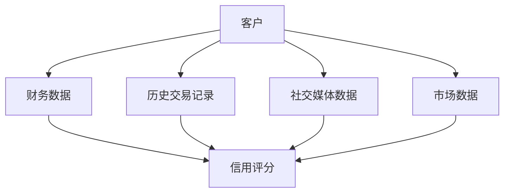
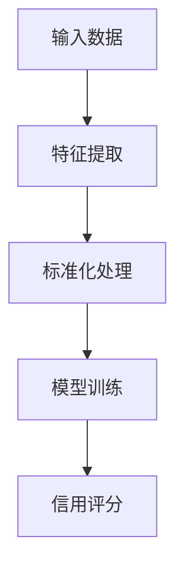
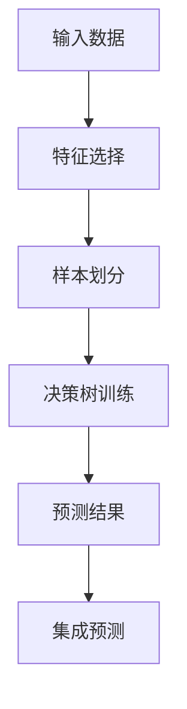
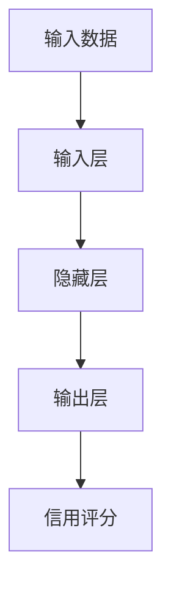
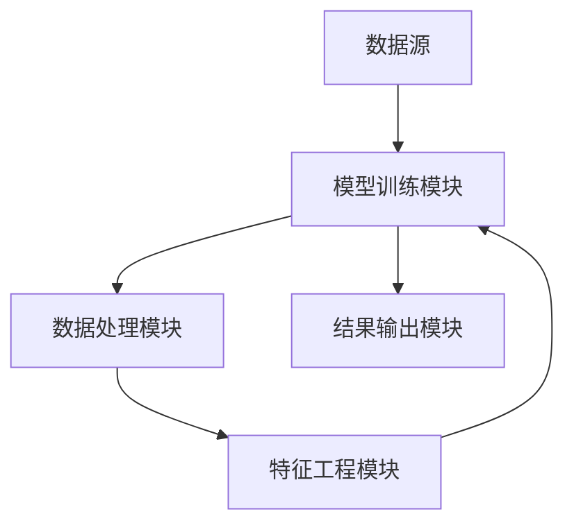

                 

# AI驱动的公司信用风险评估：增强价值投资的安全性

## 关键词：
AI技术，信用风险评估，机器学习，深度学习，金融投资，风险管理

## 摘要：
在金融投资领域，信用风险评估是保障投资者利益的关键环节。随着人工智能技术的迅速发展，AI驱动的信用风险评估正逐步取代传统方法，成为提升投资安全性的有力工具。本文将从AI技术的基本原理出发，探讨其在信用风险评估中的应用，分析各类算法的特点及优劣，提供系统化的解决方案，并通过实际案例展示其在金融投资中的实际价值。通过本文的阅读，读者将全面了解如何利用AI技术优化信用风险评估流程，提升投资决策的科学性和安全性。

---

# 第1章：信用风险评估的背景与挑战

## 1.1 信用风险评估的定义与重要性
### 1.1.1 信用风险的定义
信用风险是指在信用交易中，债务人或交易对手方因自身或外部因素的影响，无法履行其债务偿还义务，导致债权人遭受损失的风险。

### 1.1.2 信用风险评估的重要性
信用风险评估是金融投资中不可或缺的一环，它能够帮助投资者识别潜在风险，优化资产配置，降低投资损失。尤其是在复杂的金融市场环境中，精准的信用风险评估能够显著提升投资决策的科学性。

### 1.1.3 信用风险评估的边界与外延
信用风险评估不仅关注单一企业的信用状况，还包括宏观经济环境、行业风险、市场波动等多方面的因素。其外延涵盖了从个人信用评估到企业信用评估，再到国家信用评估的多层次应用场景。

## 1.2 传统信用风险评估方法的局限性
### 1.2.1 传统信用评分模型的局限性
传统信用评分模型（如FICO评分）主要依赖于历史数据和简单的统计分析，难以捕捉复杂的市场动态和非结构化数据信息。

### 1.2.2 数据不足与模型过拟合问题
传统模型往往受限于数据样本量的不足，导致模型训练不足或过拟合问题，影响评估的准确性和稳定性。

### 1.2.3 人工评估的主观性和效率问题
人工评估过程中的主观判断可能导致结果偏差，且效率低下，难以应对海量数据和快速变化的市场环境。

## 1.3 AI技术在信用风险评估中的应用前景
### 1.3.1 AI技术的核心优势
AI技术能够处理海量数据，提取深层次特征，发现传统方法难以捕捉的隐含规律。

### 1.3.2 AI驱动信用风险评估的潜力
通过深度学习、自然语言处理等技术，AI能够整合结构化数据和非结构化数据，实现更加精准的风险评估。

### 1.3.3 未来发展趋势与挑战
AI技术的应用将推动信用风险评估的智能化和自动化，但同时也面临数据隐私、模型解释性等挑战。

## 1.4 本章小结
本章通过分析信用风险评估的重要性和传统方法的局限性，揭示了AI技术在信用风险评估中的巨大潜力和应用前景。

---

# 第2章：AI驱动信用风险评估的核心概念与联系

## 2.1 核心概念原理
### 2.1.1 机器学习在信用评估中的应用
机器学习通过训练模型，能够自动识别信用风险的关键特征，实现精准的信用评分。

### 2.1.2 数据特征工程的重要性
数据特征工程是AI信用风险评估的核心，通过合理的特征选择和处理，能够显著提升模型性能。

### 2.1.3 模型解释性与可解释性要求
为了满足金融行业的监管要求，AI模型需要具备可解释性，以便理解和验证评估结果。

## 2.2 核心概念对比分析
### 2.2.1 传统信用评估方法与AI方法的对比
| 对比维度       | 传统方法                     | AI方法                     |
|----------------|------------------------------|-----------------------------|
| 数据需求       | 数据量小，依赖结构化数据     | 数据量大，支持多类型数据     |
| 模型复杂度     | 模型简单，可解释性强         | 模型复杂，难以解释           |
| 效率           | 评估效率低，依赖人工干预     | 评估效率高，自动化处理       |
| 准确性         | 准确性受限                   | 准确性较高                   |

### 2.2.2 数据特征的对比分析
传统方法主要依赖财务指标和历史信用记录，而AI方法能够整合更多维度的数据，如社交媒体信息、市场动态等。

### 2.2.3 模型性能的对比分析
AI驱动的模型在准确性、鲁棒性和适应性方面均优于传统方法。

## 2.3 ER实体关系图架构

## 2.4 本章小结
本章通过对比分析和ER图展示了AI驱动信用风险评估的核心概念及其与传统方法的差异。

---

# 第3章：AI驱动信用风险评估的算法原理

## 3.1 机器学习算法概述
### 3.1.1 监督学习与无监督学习
监督学习基于标注数据进行模型训练，适用于信用评分任务；无监督学习能够发现数据中的潜在结构，适用于异常检测。

### 3.1.2 常见算法介绍
- 逻辑回归
- 支持向量机（SVM）
- 随机森林
- 神经网络

### 3.1.3 算法选择与优化
根据具体场景和数据特点，选择合适的算法，并通过交叉验证等方法进行优化。

## 3.2 逻辑回归算法
### 3.2.1 算法原理
逻辑回归通过建立概率模型，将输入特征映射到信用评分的概率空间。

### 3.2.2 算法流程图

### 3.2.3 数学公式
$$ P(y=1|x) = \frac{1}{1 + e^{-\beta x}} $$
其中，$\beta$ 是模型参数，$x$ 是输入特征。

## 3.3 随机森林算法
### 3.3.1 算法原理
随机森林通过构建多个决策树，并集成预测结果，能够有效降低过拟合风险。

### 3.3.2 算法流程图

### 3.3.3 数学公式
$$ y = \sum_{i=1}^n \frac{1}{n} \cdot \text{Tree}_i(y) $$
其中，$n$ 是决策树的数量，$\text{Tree}_i$ 是第$i$棵决策树的预测结果。

## 3.4 神经网络算法
### 3.4.1 算法原理
神经网络通过多层非线性变换，能够捕捉数据中的复杂特征和模式。

### 3.4.2 算法流程图

### 3.4.3 数学公式
$$ y = \sigma(Wx + b) $$
其中，$W$ 是权重矩阵，$b$ 是偏置，$\sigma$ 是激活函数（如ReLU或sigmoid）。

## 3.5 本章小结
本章详细介绍了几种常用的机器学习算法，并通过流程图和数学公式展示了其工作原理。

---

# 第4章：AI驱动信用风险评估的系统架构设计

## 4.1 系统功能设计
### 4.1.1 数据采集模块
负责收集企业财务数据、市场数据、社交媒体数据等多源数据。

### 4.1.2 特征工程模块
对采集到的数据进行清洗、转换和特征提取，生成适合模型训练的特征集。

### 4.1.3 模型训练模块
基于特征工程模块输出的数据，训练并优化信用风险评估模型。

### 4.1.4 结果输出模块
将模型预测结果输出为信用评分或风险等级。

## 4.2 系统架构图

## 4.3 系统交互设计
### 4.3.1 用户与系统的交互
用户输入企业信息，系统输出信用评分。

### 4.3.2 模型与数据的交互
模型通过反馈机制优化训练参数，提升预测精度。

## 4.4 本章小结
本章从系统架构的角度，详细描述了AI驱动信用风险评估系统的各个模块及其交互关系。

---

# 第5章：AI驱动信用风险评估的项目实战

## 5.1 环境安装
### 5.1.1 安装Python环境
使用Anaconda安装Python 3.8及以上版本。

### 5.1.2 安装必要的库
安装scikit-learn、xgboost、keras等机器学习库。

## 5.2 系统核心实现
### 5.2.1 数据采集与处理
编写代码从数据库中提取企业财务数据，清洗并标准化处理。

### 5.2.2 模型训练与优化
使用逻辑回归、随机森林等算法训练模型，并通过交叉验证优化参数。

## 5.3 案例分析
### 5.3.1 案例背景
以某制造企业为例，分析其信用风险。

### 5.3.2 数据分析
展示特征工程后的数据分布和相关性分析。

### 5.3.3 模型预测
输出企业的信用评分和风险等级。

## 5.4 项目总结
### 5.4.1 项目成果
展示了AI技术在信用风险评估中的实际应用价值。

### 5.4.2 项目经验
总结项目实施中的关键点和注意事项。

## 5.5 本章小结
本章通过实际案例展示了AI驱动信用风险评估系统的实现过程和应用效果。

---

# 第6章：AI驱动信用风险评估的最佳实践与总结

## 6.1 最佳实践
### 6.1.1 数据质量管理
确保数据的完整性、准确性和及时性。

### 6.1.2 模型解释性
通过特征重要性分析提升模型的可解释性。

### 6.1.3 模型更新
定期更新模型参数，确保其适应市场变化。

## 6.2 小结与展望
### 6.2.1 本章小结
总结了AI技术在信用风险评估中的应用优势和实践价值。

### 6.2.2 未来展望
展望了AI技术在信用风险评估中的进一步应用和发展方向。

---

# 作者：AI天才研究院/AI Genius Institute & 禅与计算机程序设计艺术 /Zen And The Art of Computer Programming

---

以上是《AI驱动的公司信用风险评估：增强价值投资的安全性》的技术博客文章目录大纲。

