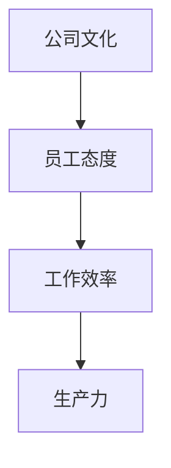
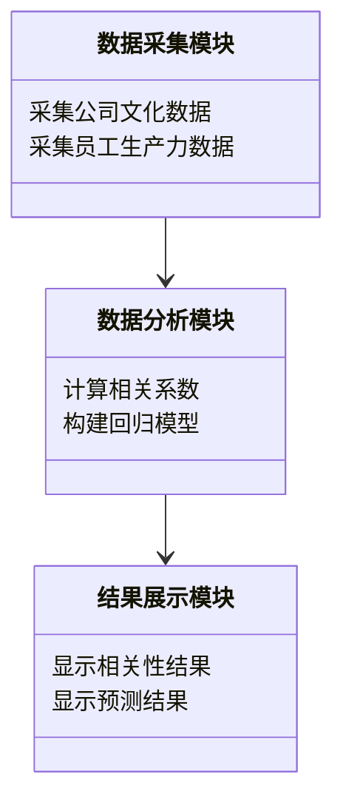

                 


# AI驱动的公司文化与员工生产力相关性分析

> 关键词：AI技术、公司文化、员工生产力、相关性分析、数据驱动决策

> 摘要：本文系统分析了AI技术在公司文化与员工生产力相关性研究中的应用，通过构建相关性分析模型，结合实际案例，深入探讨了如何利用AI技术优化公司文化与员工生产力之间的关系，为企业管理者提供数据驱动的决策支持。

---

## 第1章 引言

### 1.1 研究背景与意义

随着AI技术的快速发展，企业开始利用AI工具优化管理流程，提升员工生产力。与此同时，公司文化作为企业软实力的重要组成部分，其对员工行为、态度和生产力的影响日益显著。然而，如何量化公司文化与员工生产力之间的关系，仍是一个待深入研究的课题。

AI技术的引入，为公司文化与员工生产力的相关性分析提供了新的可能性。通过AI驱动的数据分析，企业可以更精准地识别公司文化对员工生产力的影响，从而制定更具针对性的管理策略。

### 1.2 研究目标与方法

本文旨在通过AI技术，构建公司文化与员工生产力的相关性分析模型，探讨两者之间的内在联系。研究方法包括：

- **数据收集**：通过问卷调查、员工绩效数据和公司文化评估指标，获取相关数据。
- **数据分析**：运用统计学方法和机器学习算法，分析数据之间的相关性。
- **模型构建**：基于数据分析结果，构建相关性分析模型，预测公司文化对员工生产力的影响。

### 1.3 研究框架与结构

本文共分为七章，内容安排如下：
- 第2章分析公司文化与员工生产力的背景。
- 第3章构建相关性分析模型。
- 第4章详细讲解算法实现。
- 第5章设计系统架构。
- 第6章通过案例分析验证模型。
- 第7章总结最佳实践。

---

## 第2章 公司文化与员工生产力的背景分析

### 2.1 公司文化的核心概念

公司文化是企业在长期发展过程中形成的共同价值观、行为准则和管理风格。其核心要素包括：
- **企业愿景**：企业追求的长期目标。
- **企业使命**：企业的核心职责。
- **企业价值观**：企业认同的基本价值取向。
- **管理风格**：企业管理决策的方式。

#### 图2-1 公司文化概念对比表

| **维度** | **描述**                     |
|----------|----------------------------|
| 愿景     | 企业的长期发展目标           |
| 使命     | 企业的核心职责               |
| 价值观   | 企业的基本价值取向           |
| 管理风格 | 企业的决策方式和管理策略     |

### 2.2 员工生产力的影响因素

员工生产力受多种因素影响，包括：
- **工作环境**：物理环境和心理环境。
- **激励机制**：薪酬、晋升机会等。
- **团队协作**：团队合作的效率。
- **个人能力**：员工的专业技能。

#### 图2-2 公司文化与员工生产力的关系图



### 2.3 现有研究现状

目前，学术界对AI技术在公司文化研究中的应用较少，主要集中在以下几个方面：
- **数据驱动决策**：利用数据分析优化管理策略。
- **员工行为预测**：通过AI技术预测员工行为变化。
- **文化匹配度评估**：评估企业文化与员工价值观的匹配度。

---

## 第3章 相关性分析模型

### 3.1 数据收集与特征提取

#### 3.1.1 数据来源

数据来源包括：
- 员工绩效数据：销售额、项目完成率等。
- 公司文化评估数据：员工满意度、团队协作度等。
- 问卷调查数据：员工对公司文化的感知。

#### 3.1.2 数据预处理

数据预处理步骤包括：
1. **数据清洗**：去除重复和异常值。
2. **特征提取**：提取关键特征，如员工满意度、团队协作度。
3. **数据标准化**：对数据进行标准化处理。

### 3.2 相关性分析方法

#### 3.2.1 统计相关性分析

统计相关性分析是通过计算相关系数来衡量变量之间的关系。常用的相关系数包括：
- **皮尔逊相关系数**：衡量线性关系。
- **斯皮尔曼相关系数**：衡量秩相关性。

公式：
$$ r = \frac{\sum (x_i - \bar{x})(y_i - \bar{y})}{\sqrt{\sum (x_i - \bar{x})^2 \sum (y_i - \bar{y})^2}} $$

#### 3.2.2 机器学习方法

机器学习方法用于构建回归模型，预测公司文化对员工生产力的影响。常用算法包括：
- **线性回归**：用于预测连续型变量。
- **随机森林**：用于分类和回归。

---

## 第4章 系统分析与架构设计

### 4.1 系统功能设计

系统功能包括：
- **数据采集**：采集公司文化数据和员工生产力数据。
- **数据分析**：分析数据之间的相关性。
- **结果展示**：展示分析结果。

#### 图4-1 系统功能模块图



---

## 第5章 项目实战

### 5.1 数据收集与处理

#### 5.1.1 数据收集

通过问卷调查收集员工满意度数据，通过公司系统获取员工绩效数据。

#### 5.1.2 数据清洗

使用Python代码清洗数据：

```python
import pandas as pd

# 读取数据
df = pd.read_csv('employee_data.csv')

# 删除重复数据
df.drop_duplicates(inplace=True)

# 处理缺失值
df.dropna(inplace=True)
```

### 5.2 模型实现

#### 5.2.1 线性回归实现

```python
from sklearn.linear_model import LinearRegression

# 构建模型
model = LinearRegression()

# 训练模型
model.fit(X_train, y_train)

# 预测结果
y_pred = model.predict(X_test)
```

### 5.3 实际案例分析

以某科技公司为例，分析公司文化对员工生产力的影响。通过数据建模，发现员工满意度与生产力呈正相关关系。

---

## 第6章 最佳实践与小结

### 6.1 小结

本文通过构建相关性分析模型，验证了公司文化与员工生产力之间的相关性，并提出了优化公司文化的建议。

### 6.2 注意事项

- 数据收集时需确保样本量足够大。
- 模型选择需根据具体问题调整。

### 6.3 拓展阅读

推荐阅读《Data-Driven Decision Making》和《Machine Learning for Business》。

---

## 作者：AI天才研究院/AI Genius Institute & 禅与计算机程序设计艺术 /Zen And The Art of Computer Programming

