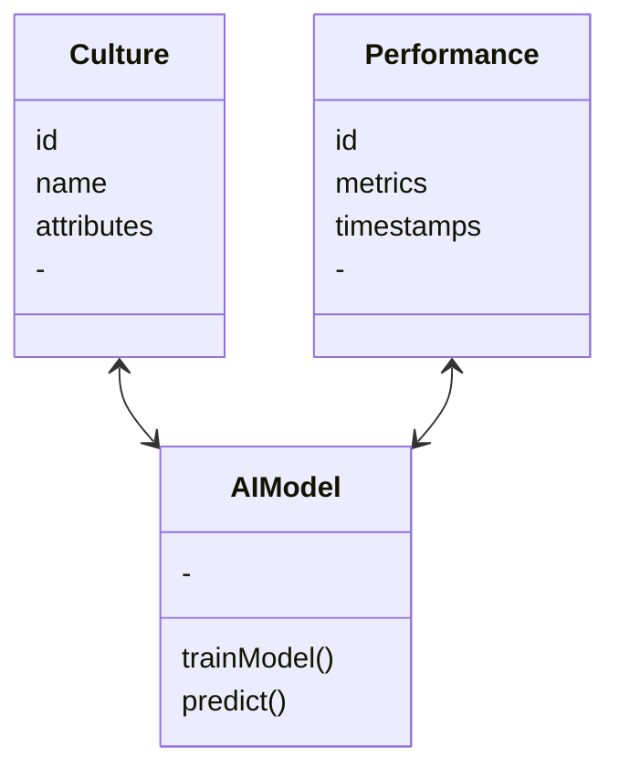
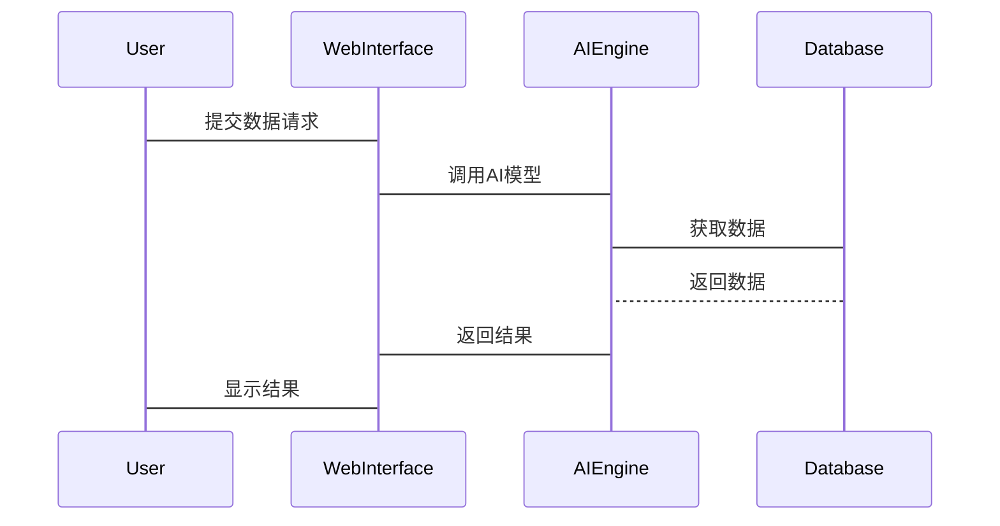

                 


```markdown
# AI驱动的公司文化与绩效相关性分析：深入公司DNA

> 关键词：AI，公司文化，绩效管理，相关性分析，系统架构，数据驱动

> 摘要：本文深入探讨了人工智能技术在公司文化与绩效管理中的应用，通过相关性分析的方法，揭示了AI如何驱动公司文化的变革与优化，提升企业绩效管理的效率与效果。文章从理论到实践，系统地分析了AI驱动的相关性分析原理、算法实现、系统架构设计以及实际案例，为读者提供了全面的视角和实践指导。

---

# 第一部分：AI驱动的公司文化与绩效相关性分析概述

# 第1章：AI驱动的公司文化与绩效相关性分析背景

## 1.1 公司文化与绩效管理的定义与核心要素

### 1.1.1 公司文化的内涵与外延

- 公司文化的定义：公司文化是指企业在长期经营过程中形成的，由价值观、信念、行为规范和习惯组成的独特文化体系。
- 核心要素：包括企业愿景、使命、价值观、组织结构、团队协作、创新氛围等。

### 1.1.2 绩效管理的定义与目标

- 绩效管理的定义：绩效管理是指通过设定目标、监控执行、评估结果、反馈改进，以提升员工和组织绩效的过程。
- 绩效管理的目标：包括提升工作效率、优化资源配置、激励员工积极性、促进组织发展等。

## 1.2 AI在公司文化与绩效管理中的应用现状

### 1.2.1 当前企业绩效管理的挑战

- 数据驱动决策的不足
- 传统绩效评估的主观性与片面性
- 员工行为与公司文化匹配度的量化难题

### 1.2.2 AI技术在绩效管理中的潜在价值

- 数据挖掘与分析：通过AI技术对海量数据进行分析，提取关键指标与规律。
- 个性化评估：基于AI算法实现员工绩效的个性化评估与反馈。
- 文化匹配度分析：通过AI技术量化员工行为与公司文化的匹配度。

## 1.3 本章小结

本章通过定义公司文化与绩效管理的核心要素，分析了当前企业绩效管理的挑战，并提出了AI技术在绩效管理中的潜在价值，为后续相关性分析奠定了基础。

---

# 第二部分：AI驱动的相关性分析原理

# 第2章：AI驱动的相关性分析原理

## 2.1 数据驱动的相关性分析方法

### 2.1.1 数据收集与预处理

- 数据来源：包括员工绩效数据、行为数据、文化评估数据等。
- 数据清洗：去除无效数据、处理缺失值、标准化数据格式。

### 2.1.2 相关性计算的数学模型

- Pearson相关系数：衡量两个变量线性相关程度的指标。
- Spearman相关系数：衡量两个变量秩相关性的指标。

### 2.1.3 数据可视化与趋势分析

- 数据可视化工具：如折线图、散点图、热力图等。
- 趋势分析方法：通过时间序列分析发现数据变化趋势。

## 2.2 AI算法在相关性分析中的应用

### 2.2.1 常见的相关性分析算法

- 线性回归分析：用于预测变量之间的关系。
- 主成分分析（PCA）：通过降维技术提取关键特征。
- 聚类分析：将相似的数据点聚类，发现潜在规律。

### 2.2.2 AI模型在公司文化与绩效分析中的应用

- 文本挖掘：通过NLP技术分析员工反馈、企业文化文档，提取关键词与情感倾向。
- 机器学习模型：构建预测模型，预测员工绩效与文化匹配度。

## 2.3 核心概念的ER实体关系图

```mermaid
erDiagram
    Culture {\-
        id
        name
        attributes
    }
    Performance {\-
        id
        metrics
        timestamps
    }
    Culture [*------* Performance
```

---

# 第三部分：系统分析与架构设计

# 第3章：系统分析与架构设计

## 3.1 问题场景介绍

### 3.1.1 问题背景

- 当前绩效管理系统的局限性：数据孤岛、分析能力不足、反馈机制不完善。
- 企业文化的隐性影响：如何通过数据量化企业文化对绩效的影响。

## 3.2 系统功能设计

### 3.2.1 领域模型设计



### 3.2.2 系统架构设计

```mermaid
containerDiagram
    container Database {
        CultureDB
        PerformanceDB
        -
    }
    container AIEngine {
        AIModel
        -
    }
    container WebInterface {
        UserInterface
        -
    }
    Database --> AIEngine
    AIEngine --> WebInterface
```

## 3.3 接口设计与交互流程

### 3.3.1 系统接口设计

- 数据接口：文化数据接口、绩效数据接口。
- 模型接口：训练接口、预测接口。

### 3.3.2 交互流程设计



---

# 第四部分：项目实战

# 第4章：项目实战与案例分析

## 4.1 环境安装与配置

### 4.1.1 安装Python环境

- 安装Python：下载并安装最新版本的Python。
- 安装依赖库：`numpy`, `pandas`, `scikit-learn`, `matplotlib`.

### 4.1.2 数据集准备

- 数据来源：企业绩效数据、员工行为数据、文化评估数据。
- 数据格式：CSV格式，包含员工ID、绩效指标、文化属性等字段。

## 4.2 系统核心实现

### 4.2.1 数据预处理

```python
import pandas as pd

# 读取数据
df = pd.read_csv('data.csv')

# 数据清洗
df.dropna(inplace=True)
df['绩效得分'] = df['绩效得分'].astype(int)
```

### 4.2.2 相关性分析实现

```python
import numpy as np
import matplotlib.pyplot as plt

# 计算相关系数矩阵
correlation_matrix = df.corr()

# 绘制热力图
plt.figure(figsize=(10, 8))
sns.heatmap(correlation_matrix, annot=True, cmap='coolwarm')
plt.show()
```

### 4.2.3 AI模型训练与预测

```python
from sklearn.model

