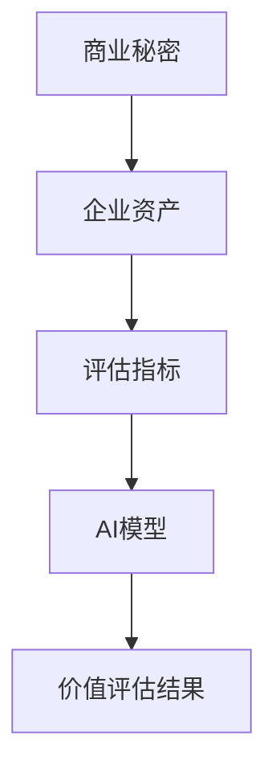
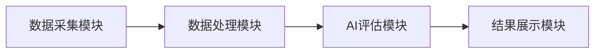

                 


# AI驱动的商业秘密价值评估：挖掘隐藏的公司资产

> 关键词：商业秘密，AI驱动，价值评估，企业资产，数据挖掘，机器学习，知识产权

> 摘要：  
本文深入探讨了AI技术在商业秘密价值评估中的应用，分析了商业秘密的定义、特征及其在现代企业中的重要性。通过结合AI算法和数据分析，提出了基于机器学习的商业秘密价值评估方法，构建了完整的系统架构，并通过实际案例展示了如何利用AI技术挖掘隐藏的企业资产。

---

# 第1章: 商业秘密与AI评估的背景介绍

## 1.1 商业秘密的定义与特征

### 1.1.1 商业秘密的定义
商业秘密是指企业在经营活动中所掌握的、具有经济价值且不为外界所知的信息，包括技术信息、经营信息、客户数据等。这些信息通常通过法律手段进行保护，以确保其不被竞争对手获取。

### 1.1.2 商业秘密的法律保护
商业秘密的法律保护主要通过《反不正当竞争法》等法律法规实现。企业可以通过合同、技术手段和组织管理等多种方式保护商业秘密，防止其被非法泄露或使用。

### 1.1.3 商业秘密的经济价值
商业秘密作为企业的核心资产，通常具有较高的经济价值。例如，独特的技术工艺、客户名单、市场策略等，都可以为企业创造竞争优势，提升市场份额和利润。

## 1.2 AI技术在商业秘密评估中的作用

### 1.2.1 AI技术的基本概念
人工智能（AI）是指通过模拟人类智能的计算机系统，能够实现数据处理、模式识别、决策支持等功能。AI技术的核心包括机器学习、自然语言处理、计算机视觉等。

### 1.2.2 AI在商业秘密识别中的应用
AI技术可以通过分析企业内部文档、交易数据、客户反馈等信息，识别潜在的商业秘密。例如，自然语言处理技术可以提取文本中的敏感信息，机器学习算法可以发现数据中的模式和关联。

### 1.2.3 AI驱动的商业秘密价值评估的优势
与传统的商业秘密评估方法相比，AI技术具有高效性、精准性和可扩展性的优势。AI可以通过大数据分析快速评估商业秘密的价值，同时能够动态跟踪其变化趋势。

## 1.3 商业秘密价值评估的挑战与趋势

### 1.3.1 传统评估方法的局限性
传统评估方法通常依赖人工分析，存在效率低、主观性强、难以量化等问题。此外，传统方法难以应对海量数据和复杂场景的挑战。

### 1.3.2 AI驱动评估的潜力与挑战
AI技术在商业秘密评估中的潜力巨大，但也面临数据隐私、模型准确性、算法解释性等挑战。企业需要在技术创新和风险管理之间找到平衡。

### 1.3.3 行业发展趋势与未来展望
随着大数据和AI技术的不断发展，商业秘密的评估将更加智能化和自动化。未来，企业可以通过AI技术实时监控商业秘密的动态，优化其管理和保护策略。

## 1.4 本章小结
本章介绍了商业秘密的定义、特征及其经济价值，探讨了AI技术在商业秘密评估中的作用和优势，分析了当前面临的挑战和未来的发展趋势。

---

# 第2章: 商业秘密价值评估的核心概念与联系

## 2.1 商业秘密的分类与属性

### 2.1.1 技术型商业秘密
技术型商业秘密主要指与技术相关的知识，如专利、配方、工艺流程等。这些信息通常具有较高的技术门槛，难以被竞争对手快速复制。

### 2.1.2 经营型商业秘密
经营型商业秘密主要指与企业经营相关的知识，如客户名单、市场策略、供应链管理等。这些信息通常与企业的运营模式密切相关。

### 2.1.3 商业秘密的保护级别
商业秘密的保护级别通常分为公开、内部保密和高度机密三个层次。不同级别的秘密需要采取不同的保护措施。

## 2.2 AI评估的核心原理

### 2.2.1 数据驱动的评估方法
AI驱动的商业秘密评估基于大数据分析，通过收集和处理企业的内外部数据，提取与商业秘密相关的特征，从而进行价值评估。

### 2.2.2 机器学习模型的应用
机器学习模型可以对商业秘密的特征进行分类和预测。例如，使用随机森林模型对商业秘密的价值进行分类，或使用回归模型预测其经济价值。

### 2.2.3 自然语言处理在文本分析中的作用
自然语言处理技术可以对文本数据进行语义分析，提取商业秘密相关的关键词和主题，帮助评估其价值和敏感性。

## 2.3 商业秘密与AI评估的关系

### 2.3.1 商业秘密的结构化与非结构化数据
商业秘密可以分为结构化数据（如表格、数据库）和非结构化数据（如文档、邮件）。AI技术可以对两类数据进行分析，提取有价值的信息。

### 2.3.2 AI模型对商业秘密特征的提取
AI模型可以通过特征工程提取商业秘密的关键属性，如技术复杂度、市场竞争力、法律保护力度等，从而为评估提供依据。

### 2.3.3 商业秘密价值的动态评估
AI技术可以实时跟踪商业秘密的变化，如市场需求波动、技术进步等因素，动态调整其评估结果。

## 2.4 核心概念对比表

| **商业秘密类型** | **技术型** | **经营型** |
|-------------------|------------|------------|
| **主要特征**     | 技术工艺  | 客户策略  |
| **保护方式**     | 专利申请  | 合同保密  |
| **价值评估**     | 技术复杂度 | 市场覆盖度 |

## 2.5 实体关系图



---

# 第3章: 基于AI的商业秘密价值评估算法原理

## 3.1 评估模型的数学公式

### 3.1.1 商业秘密价值的计算公式
$$ \text{商业秘密价值} = \alpha \cdot f(\text{技术复杂度}) + \beta \cdot g(\text{市场竞争力}) $$

其中，$\alpha$ 和 $\beta$ 是权重系数，$f$ 和 $g$ 是特征函数。

### 3.1.2 机器学习模型的训练
使用监督学习算法，如随机森林或支持向量机（SVM），对商业秘密的特征进行分类或回归训练。

## 3.2 算法实现的步骤

### 3.2.1 数据预处理
- 清洗数据：去除噪声和重复数据。
- 特征提取：从文本、数据库中提取相关特征。

### 3.2.2 模型训练
- 选择合适的机器学习算法。
- 调整模型参数，优化性能。

### 3.2.3 结果分析
- 评估模型的准确率、召回率等指标。
- 解释模型的输出结果，提供商业秘密的价值评估报告。

## 3.3 代码实现示例

```python
import pandas as pd
from sklearn.ensemble import RandomForestClassifier

# 数据加载与预处理
data = pd.read_csv('商业秘密数据.csv')
X = data.drop('价值标签', axis=1)
y = data['价值标签']

# 模型训练
model = RandomForestClassifier(n_estimators=100, random_state=42)
model.fit(X, y)

# 模型预测
预测结果 = model.predict(X)
```

---

# 第4章: 商业秘密价值评估系统的架构设计

## 4.1 系统功能设计

### 4.1.1 数据采集模块
- 收集企业内外部数据，如文档、日志、市场数据等。

### 4.1.2 数据处理模块
- 清洗数据，提取特征。

### 4.1.3 AI评估模块
- 使用机器学习模型进行商业秘密价值评估。

### 4.1.4 结果展示模块
- 可视化评估结果，生成报告。

## 4.2 系统架构设计



## 4.3 系统接口设计
- 数据接口：与企业数据库对接。
- API接口：提供评估结果的查询服务。

## 4.4 系统交互设计

```mermaid
sequenceDiagram
    actor 用户
    participant 系统
    用户 -> 系统: 提交商业秘密数据
    系统 -> 数据处理模块: 处理数据
    数据处理模块 -> AI评估模块: 进行评估
    AI评估模块 -> 系统: 返回评估结果
    用户 <- 系统: 获取评估报告
```

---

# 第5章: 项目实战与案例分析

## 5.1 项目背景
某企业希望通过AI技术对其技术型商业秘密进行价值评估。

## 5.2 环境安装
- 安装Python、机器学习库（如scikit-learn、xgboost）。
- 数据存储使用MySQL或MongoDB。

## 5.3 核心代码实现

```python
from sklearn.metrics import accuracy_score

# 训练模型
model = xgboost.XGBClassifier()
model.fit(X_train, y_train)

# 验证模型
预测结果 = model.predict(X_test)
准确率 = accuracy_score(y_test, 预测结果)
print(f"模型准确率: {准确率}")
```

## 5.4 案例分析
通过对某企业的技术专利数据进行分析，评估其技术复杂度和市场竞争力，最终得出其商业秘密的经济价值。

## 5.5 项目小结
通过本项目，验证了AI技术在商业秘密价值评估中的可行性，同时也发现了数据质量和模型解释性等方面的挑战。

---

# 第6章: 总结与展望

## 6.1 本章总结
本文系统地介绍了AI技术在商业秘密价值评估中的应用，构建了完整的评估系统架构，并通过实际案例验证了方法的有效性。

## 6.2 未来展望
未来，随着AI技术的不断发展，商业秘密的评估将更加智能化和动态化。企业可以通过AI技术实时监控商业秘密的动态，优化其管理和保护策略。

## 6.3 最佳实践
- 数据是关键：确保数据的准确性和完整性。
- 模型优化：根据实际需求调整模型参数，提升评估精度。
- 保护隐私：在利用AI技术的同时，确保数据的安全性和隐私性。

## 6.4 注意事项
- AI模型的解释性：确保模型输出的可解释性，便于企业理解和决策。
- 数据隐私：遵守相关法律法规，保护商业秘密和用户隐私。

---

# 作者：AI天才研究院/AI Genius Institute & 禅与计算机程序设计艺术 /Zen And The Art of Computer Programming

