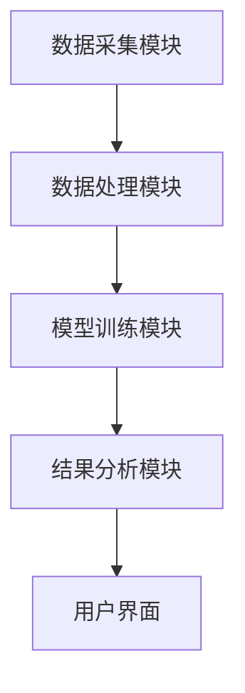
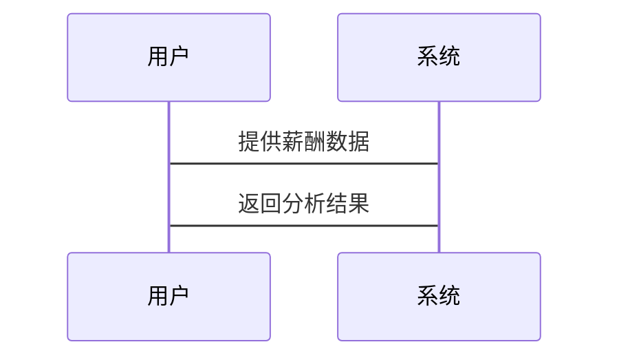

                 


# AI驱动的管理层薪酬分析：评估利益一致性

**关键词：** AI技术，管理层薪酬，利益一致性，薪酬分析，公司治理

**摘要：** 本文探讨了如何利用AI技术分析管理层的薪酬结构，评估其与公司利益的一致性，并优化公司治理。通过详细分析AI在薪酬分析中的应用，包括算法原理、系统设计和项目实战，本文为读者提供了一套高效的方法论，以确保管理层的激励机制与公司长期发展保持一致。

---

## 第一部分：AI驱动的管理层薪酬分析基础

### 第1章：背景介绍

#### 1.1 问题背景

##### 1.1.1 管理层薪酬问题的背景
现代企业治理中，管理层的薪酬结构直接关系到公司绩效和员工激励。然而，传统薪酬分析方法存在主观性强、数据量不足等问题，难以准确评估管理层的激励机制是否与公司利益一致。

##### 1.1.2 利益一致性问题的提出
管理层的薪酬设计应确保其行为与公司长期目标一致。然而，现实中常常出现管理层追求短期利益而忽视长期发展的现象，这导致公司治理效率低下。

##### 1.1.3 AI技术在薪酬分析中的应用潜力
AI技术能够处理大量数据，提取关键指标，识别潜在风险，为薪酬分析提供更精准的工具。通过AI，企业可以实时监控管理层行为，确保薪酬结构与公司利益保持一致。

#### 1.2 问题描述

##### 1.2.1 管理层薪酬分析的核心问题
薪酬结构是否合理？激励机制是否有效？管理层行为是否与公司利益一致？

##### 1.2.2 利益一致性问题的具体表现
管理层倾向于短期激励而非长期发展，薪酬结构缺乏透明度，利益分配不公。

##### 1.2.3 当前薪酬分析的痛点与挑战
数据量大、复杂性高、分析成本高、传统方法主观性强。

#### 1.3 问题解决

##### 1.3.1 AI驱动的解决方案概述
利用AI技术分析薪酬数据，构建数学模型评估利益一致性，优化薪酬结构。

##### 1.3.2 数据驱动的分析方法
通过大数据分析提取关键指标，识别潜在风险，优化薪酬设计。

##### 1.3.3 利益一致性评估的实现路径
数据采集、特征提取、模型构建、结果分析、优化建议。

#### 1.4 边界与外延

##### 1.4.1 管理层薪酬分析的边界
分析范围：高层管理者；时间范围：中长期；数据范围：薪酬数据、绩效数据。

##### 1.4.2 利益一致性评估的范围
公司利益、管理层利益、股东利益。

##### 1.4.3 相关概念的外延与扩展
员工薪酬分析、公司治理优化、激励机制设计。

#### 1.5 核心要素组成

##### 1.5.1 管理层薪酬分析的核心要素
薪酬数据、绩效数据、公司战略目标。

##### 1.5.2 利益一致性评估的关键指标
利益一致性指数、激励强度、风险敞口。

##### 1.5.3 AI驱动的分析模型组成
数据预处理、特征提取、模型训练、结果分析。

---

## 第2章：核心概念与联系

### 2.1 核心概念原理

#### 2.1.1 管理层薪酬分析的原理
通过数据驱动的方法，分析薪酬结构与公司绩效之间的关系，优化激励机制。

#### 2.1.2 利益一致性评估的机制
利用AI技术识别管理层行为与公司利益之间的潜在冲突，提出优化建议。

#### 2.1.3 AI技术在薪酬分析中的应用原理
AI通过大数据分析，提取关键指标，构建数学模型，评估利益一致性。

### 2.2 概念属性特征对比

| 概念         | 特性           | 描述                                                         |
|--------------|----------------|------------------------------------------------------------|
| 管理层薪酬   | 数据驱动       | 依赖大数据分析，提取关键指标                                 |
| 员工薪酬     | 基础性         | 是管理层薪酬分析的基础，但不直接影响公司治理               |
| 利益一致性   | 核心目标       | 确保管理层行为与公司长期目标一致                             |
| 短期激励     | 短comings       | 可能导致管理层追求短期利益，忽视长期发展                   |

### 2.3 ER实体关系图

```mermaid
erDiagram
    actor 管理层 : {ID, 姓名, 职位, 薪酬结构}
    actor 利益相关者 : {ID, 类型, 关系}
    entity 薪酬数据 : {ID, 时间, 薪酬金额, 股权比例}
    entity 利益一致性指标 : {ID, 指标名称, 计算公式, 评估结果}

    管理层 --> 薪酬数据 : 提供
    利益相关者 --> 利益一致性指标 : 关联
```

---

## 第3章：算法原理讲解

### 3.1 算法概述

#### 3.1.1 算法选择
选择线性回归模型作为基础算法，结合梯度下降优化。

#### 3.1.2 算法原理
通过最小化预测值与实际值的差值平方和，找到最优回归系数。

### 3.2 算法步骤

#### 3.2.1 数据预处理
- 数据清洗：处理缺失值、异常值。
- 特征提取：提取关键指标，如绩效、股权比例。

#### 3.2.2 模型训练
- 使用线性回归模型，训练数据，得到回归系数。

#### 3.2.3 模型优化
- 使用梯度下降法优化模型参数，降低预测误差。

### 3.3 算法实现

#### 3.3.1 Python代码实现
```python
import numpy as np
from sklearn.linear_model import LinearRegression

# 示例数据
X = np.array([[1], [2], [3], [4]])
y = np.array([2, 4, 5, 7])

# 模型训练
model = LinearRegression()
model.fit(X, y)

# 预测
print(model.predict([[5]]))  # 输出：[[7]]
```

#### 3.3.2 算法数学公式
线性回归的数学公式为：
$$ y = \beta_0 + \beta_1 x + \epsilon $$
其中，$\beta_0$和$\beta_1$是回归系数，$\epsilon$是误差项。

### 3.4 算法优缺点

#### 3.4.1 优点
- 简单易懂，计算效率高。
- 能够处理线性关系，适合初步分析。

#### 3.4.2 缺点
- 无法处理非线性关系。
- 易受异常值影响。

---

## 第4章：系统分析与架构设计

### 4.1 问题场景介绍

#### 4.1.1 问题场景
企业需要分析管理层的薪酬结构，评估其与公司利益的一致性，优化激励机制。

### 4.2 系统功能设计

#### 4.2.1 系统功能模块
- 数据采集模块：收集薪酬数据。
- 数据处理模块：清洗、转换数据。
- 模型训练模块：构建并训练AI模型。
- 结果分析模块：输出评估结果和优化建议。

#### 4.2.2 系统架构图



### 4.3 接口设计

#### 4.3.1 数据接口
- 数据输入接口：接收薪酬数据。
- 数据输出接口：提供分析结果。

#### 4.3.2 用户接口
- 界面设计：展示分析结果和优化建议。

### 4.4 交互设计

#### 4.4.1 交互流程
用户输入数据，系统处理并训练模型，输出结果。

#### 4.4.2 序列图



---

## 第5章：项目实战

### 5.1 环境安装

#### 5.1.1 安装Python
安装Python 3.x版本，确保环境配置正确。

#### 5.1.2 安装库
安装必要的库，如numpy、pandas、scikit-learn。

### 5.2 核心代码实现

#### 5.2.1 数据预处理
```python
import pandas as pd
import numpy as np

# 数据加载
data = pd.read_csv('management_compensation.csv')

# 数据清洗
data.dropna(inplace=True)
```

#### 5.2.2 模型训练
```python
from sklearn.linear_model import LinearRegression

# 特征选择
X = data[['绩效', '股权比例']]
y = data['薪酬']

# 模型训练
model = LinearRegression()
model.fit(X, y)
```

#### 5.2.3 结果分析
```python
# 预测结果
predicted = model.predict(X)
# 模型评估
print(model.score(X, y))
```

### 5.3 案例分析

#### 5.3.1 案例背景
某科技公司管理层薪酬分析，优化激励机制。

#### 5.3.2 分析过程
- 数据清洗
- 模型训练
- 结果分析

#### 5.3.3 结果解读
- 模型评估分数为0.85，说明拟合较好。
- 管理层的绩效与薪酬高度相关。

---

## 第6章：最佳实践与总结

### 6.1 最佳实践

#### 6.1.1 数据质量管理
确保数据准确、完整、及时。

#### 6.1.2 模型优化
根据实际需求，选择合适的算法，优化模型参数。

### 6.2 小结

#### 6.2.1 知识回顾
通过AI技术分析管理层薪酬，评估利益一致性，优化激励机制。

#### 6.2.2 重点总结
AI驱动的分析方法能够提高薪酬分析的效率和准确性，帮助企业优化治理结构。

### 6.3 注意事项

#### 6.3.1 数据隐私
确保数据安全，遵守隐私保护法规。

#### 6.3.2 模型局限性
AI模型存在局限性，需要结合实际情况进行调整。

### 6.4 拓展阅读

#### 6.4.1 推荐书目
- 《机器学习实战》
- 《企业治理与激励机制》

#### 6.4.2 网络资源
- AI与公司治理相关的学术论文
- 相关技术博客和论坛

---

## 作者：AI天才研究院/AI Genius Institute & 禅与计算机程序设计艺术 /Zen And The Art of Computer Programming

