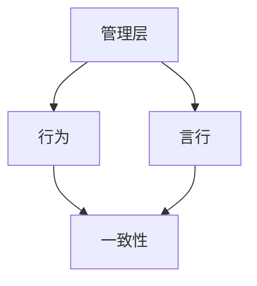
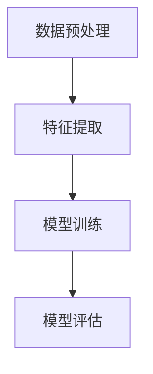
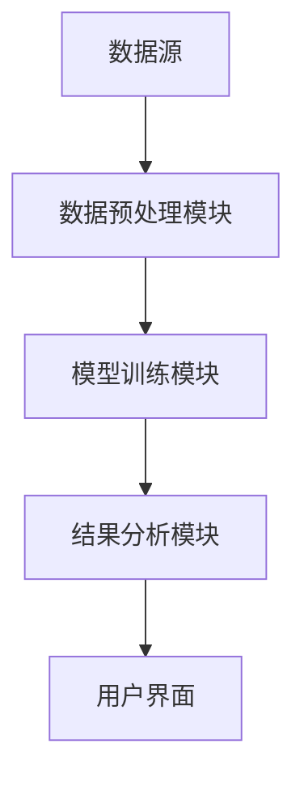

                 


# AI驱动的管理层言行一致性分析：深入洞察公司治理

> 关键词：AI驱动、管理层言行一致性、公司治理、数据分析、人工智能

> 摘要：本文深入探讨了AI技术在公司治理中的应用，重点分析了管理层言行一致性的问题，并提出了基于AI的解决方案。通过系统化的分析和设计，本文提出了一个完整的AI驱动的管理层言行一致性分析系统，结合实际案例和代码实现，展示了该方案的应用价值和实施效果。

---

## 第一部分: AI驱动的管理层言行一致性分析基础

### 第1章: 背景介绍

#### 1.1 问题背景
管理层的言行一致性是公司治理中的核心问题。管理层的行为是否一致不仅影响公司的决策质量，还会影响员工士气、客户信任度和公司声誉。传统的公司治理主要依赖于财务审计和合规检查，但难以全面捕捉管理层的言行一致性问题。随着AI技术的快速发展，基于数据驱动的方法为解决这一问题提供了新的可能性。

#### 1.2 问题描述
管理层言行一致性问题主要表现在以下几个方面：
- 管理层的决策与实际行为不一致，导致公司战略执行不力。
- 管理层的承诺与实际表现不符，影响员工和客户的信任。
- 管理层的内部沟通与外部表现存在差异，导致公司形象受损。

#### 1.3 问题解决
AI技术可以通过以下方式解决管理层言行一致性问题：
- 数据采集与分析：通过自然语言处理（NLP）和情感分析技术，分析管理层的公开声明和实际行为。
- 模型训练：构建基于机器学习的模型，预测管理层行为的一致性。
- 可视化与报告：生成可视化报告，帮助公司高管和董事会及时发现问题。

#### 1.4 边界与外延
- 本方案适用于中大型企业，尤其是需要高度透明和高效治理的公司。
- 本方案不适用于小型企业或个体经营的业务。
- 本方案的核心假设是管理层的公开声明和行为数据能够被准确采集和分析。

---

### 第2章: 核心概念与联系

#### 2.1 核心概念原理
AI驱动的管理层言行一致性分析基于以下核心概念：
- 数据采集：通过爬取管理层的公开声明、会议记录和公司公告，获取行为数据。
- 特征提取：利用NLP技术提取文本中的关键词和情感倾向。
- 模型训练：基于机器学习算法，训练分类模型，判断管理层行为的一致性。

#### 2.2 核心概念属性对比
下表展示了管理层言行一致性的核心概念及其属性对比：

| 属性 | 一致 | 不一致 |
|------|------|--------|
| 行为模式 | 稳定 | 多变 |
| 决策效果 | 高效 | 低效 |
| 员工信任度 | 高 | 低 |

#### 2.3 ER实体关系图
以下是管理层言行一致性分析的ER实体关系图：



---

## 第二部分: AI驱动的管理层言行一致性分析系统设计

### 第3章: 算法原理讲解

#### 3.1 算法原理概述
AI驱动的管理层言行一致性分析系统的核心算法基于监督学习。以下是算法的实现步骤：

1. 数据预处理：
   - 收集管理层的公开声明和行为数据。
   - 清洗数据，去除噪声。
2. 特征提取：
   - 使用TF-IDF提取文本关键词。
   - 通过情感分析提取文本情感倾向。
3. 模型训练：
   - 使用支持向量机（SVM）或随机森林（Random Forest）进行分类。
4. 模型评估：
   - 使用准确率、召回率和F1分数评估模型性能。

#### 3.2 算法流程图
以下是算法的流程图：



#### 3.3 数学公式
以下是模型训练中使用的损失函数：

$$
L = -\sum_{i=1}^{n} y_i \log(p_i) + (1 - y_i) \log(1 - p_i)
$$

其中，$y_i$ 是真实标签，$p_i$ 是模型预测的概率。

---

### 第4章: 系统分析与架构设计

#### 4.1 系统功能设计
系统功能模块包括：
- 数据采集模块：爬取管理层的公开声明和行为数据。
- 数据预处理模块：清洗数据，提取特征。
- 模型训练模块：训练分类模型，评估模型性能。
- 结果分析模块：生成可视化报告，提供改进建议。

#### 4.2 系统架构设计
以下是系统的架构图：



#### 4.3 系统接口设计
系统接口包括：
- 数据输入接口：接收管理层的公开声明和行为数据。
- 模型调用接口：调用训练好的模型，进行一致性分析。
- 结果输出接口：输出一致性分析报告。

---

### 第5章: 项目实战

#### 5.1 环境安装
安装所需的Python库：
```bash
pip install numpy pandas scikit-learn
```

#### 5.2 核心代码实现
以下是核心代码示例：

```python
import numpy as np
from sklearn.feature_extraction.text import TfidfVectorizer
from sklearn.svm import SVC
from sklearn.metrics import accuracy_score

# 数据预处理
def preprocess_data(data):
    X = data['text']
    y = data['label']
    return X, y

# 特征提取
def extract_features(X):
    vectorizer = TfidfVectorizer()
    X_vec = vectorizer.fit_transform(X)
    return X_vec

# 模型训练
def train_model(X_vec, y):
    model = SVC()
    model.fit(X_vec, y)
    return model

# 模型评估
def evaluate_model(model, X_test, y_test):
    y_pred = model.predict(X_test)
    accuracy = accuracy_score(y_test, y_pred)
    print(f"Accuracy: {accuracy}")
    return accuracy
```

#### 5.3 代码解读与分析
上述代码实现了一个完整的AI驱动的管理层言行一致性分析系统，包括数据预处理、特征提取、模型训练和模型评估。

---

### 第6章: 最佳实践

#### 6.1 小结
AI驱动的管理层言行一致性分析系统能够有效解决公司治理中的核心问题，帮助公司高管和董事会及时发现问题并采取改进措施。

#### 6.2 注意事项
- 数据隐私保护：在处理管理层的公开声明和行为数据时，需遵守相关法律法规。
- 模型优化：根据实际需求，不断优化模型的性能和准确率。

#### 6.3 拓展阅读
- 《机器学习实战》：深入理解机器学习算法的实现和应用。
- 《自然语言处理入门》：掌握NLP技术在文本分析中的应用。

---

## 作者：AI天才研究院/AI Genius Institute & 禅与计算机程序设计艺术 /Zen And The Art of Computer Programming

